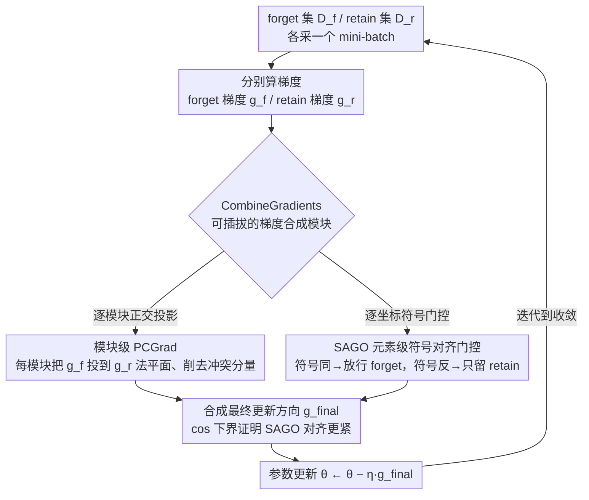

# Modeling LLM Unlearning as an Asymmetric Two-Task Learning Problem

**会议**: ACL 2026  
**arXiv**: [2604.14808](https://arxiv.org/abs/2604.14808)  
**代码**: https://github.com/sustech-nlp/SAGO  
**领域**: LLM 安全 / Machine Unlearning  
**关键词**: LLM Unlearning, 梯度冲突, 多任务学习, PCGrad, 符号对齐

## 一句话总结
把 LLM unlearning 显式建模为「retain 为主、forget 为辅」的非对称两任务问题，提出 SAGO——对 retain/forget 梯度做**元素级符号对齐门控**，在 WMDP 与 RWKU 上把 retention 性能逼近原模型，同时几乎不损失 forget 效果。

## 研究背景与动机

**领域现状**：LLM unlearning 的主流目标是在 forget 集上做 gradient ascent (GA)，并配合在 retain 集上做 gradient descent (GD)——即 GradDiff 范式；后续 NPO / SimNPO 又把无界的 GA 改写成带 sigmoid 的有界形式，缓解 catastrophic collapse。

**现有痛点**：所有 forget-objective + retain-objective 的组合都是把两个 loss 加权相加，本质上把两个任务当作"对等"的多任务学习。结果是 forget 梯度与 retain 梯度之间存在系统性冲突，retention 持续掉点：例如在 WMDP Bio 上 SimNPO+GD 跑完后 MMLU 只剩 26.7（原模型 59.8），即 retention 只恢复了 44.6%。

**核心矛盾**：unlearning 任务本质是**非对称**的——retain 是"主任务"（do-no-harm），forget 只是"辅任务"。但目前所有方法都在做 loss 加权（loss balancing），没有从梯度几何角度区分主次，因此 retain 梯度被 forget 梯度"反向拉走"的情况无人处理。

**本文目标**：把 unlearning 显式建模成非对称两任务学习，把 retain 梯度当作"锚方向"，只允许 forget 信号在不伤害 retain 的维度上注入。

**切入角度**：作者注意到（1）多任务学习里的 PCGrad 把冲突梯度投影到正交补，在 unlearning 里没人系统用过；（2）参数级别上 forget 与 retain 梯度的符号有时一致有时相反——符号一致的维度其实是"任务专属"维度，可以放心做 forget；符号相反的维度则承载通用知识，必须保护 retain 信号。

**核心 idea**：用「元素级符号门控」代替「loss 加权」——在 retain/forget 符号一致的维度让 forget 通过，在符号相反的维度只保留 retain，从而在数学上保证最终更新方向与 retain 梯度严格非负夹角，且每个坐标都不与 retain 反向。

## 方法详解

### 整体框架
SAGO 是个模块化的迭代训练框架（Algorithm 1）：每一步先从 forget 集 $\mathcal{D}_f$ 与 retain 集 $\mathcal{D}_r$ 各采一个 mini-batch，分别计算 forget 梯度 $g_f^t$ 与 retain 梯度 $g_r^t$；再用一个可插拔的 `CombineGradients` 模块把两个梯度合成最终更新方向 $g_{\text{final}}^t$，最后参数 $\theta^t = \theta^{t-1} - \eta\, g_{\text{final}}^t$，如此迭代到收敛。框架本身与 forget objective 解耦，既能套 GA+GD，也能套 NPO+GD、SimNPO+GD。论文给出两种 `CombineGradients` 实现：模块级 PCGrad（已有方法的非对称适配）和 SAGO（本文新方法）；并从余弦相似度角度给两者各推一个「retention 对齐度」下界，证明 SAGO 在结构上对齐得更紧。

### 关键设计

**1. 模块级 PCGrad：当 forget 梯度和 retain 梯度顶牛时，先把冲突分量削掉**

最朴素的 GradDiff 把 forget 和 retain 两个 loss 加权相加，可两路梯度一旦夹角超过 90°，forget 信号就会反向拽走 retain 方向，retention 持续掉点。模块级 PCGrad 的办法是对每个模块 $j$ 单独把 forget 梯度投到 retain 梯度的法平面上去除冲突分量——$\tilde{g}_f^j = g_f^j - \frac{g_f^j \cdot g_r^j}{\|g_r^j\|^2} g_r^j$，再合成 $g_{\text{final}}^j = \alpha g_r^j + \gamma \tilde{g}_f^j$。关键是"逐模块"而非把整网 flatten 成一个长向量再投影：GRU 采用的原始 PCGrad 在 flatten 后操作，一处冲突会牵动全网调整，粒度太粗；module-wise 把投影局部化，实测 retention 更高（Table 2 中 Global PCGrad MMLU 51.0，module-wise 升到 53.0）。

**2. SAGO：元素级符号对齐门控，直接在每个坐标上封死反向**

PCGrad 有个漏网之鼓：它只保证整体夹角 ≥ 90°，可一旦某维度上 $|\tilde{g}_f^i| > |g_r^i|$，那一维的最终更新方向仍会被翻到与 retain 反向。SAGO 把粒度推到元素级，对每个参数维度看 $g_f \odot g_r$ 的符号——符号一致的维度是"任务专属维"，可以放心放 forget 信号通过 $\tilde{g}_f = g_f \odot \mathbb{I}(g_f \odot g_r \ge 0)$；符号相反的维度承载通用知识，只保留 retain 信号 $\tilde{g}_r = g_r \odot \mathbb{I}(g_f \odot g_r < 0)$；最终更新 $g_{\text{final}} = \alpha \tilde{g}_r + \gamma \tilde{g}_f$。

这一刀切下去带来两个天然好处：两路的支撑集不相交，所以严格正交 $\tilde{g}_f^\top \tilde{g}_r = 0$；而且每个坐标都不可能与 $g_r$ 反向。换句话说，PCGrad 是事后"砍掉"冲突分量、仍可能在单维度翻车，SAGO 则在元素粒度上从结构上杜绝翻车——retention 在几何上更稳。

**3. cos 相似度下界：把"retention 优先"从直觉变成可证的几何性质**

光说 SAGO 更稳还不够，作者从余弦相似度角度给两种方法各推了一个"retention 对齐度"下界。PCGrad 靠正交投影得到 $\cos\theta_P = (1 + \|\tilde{g}_f\|^2 / \|g_r\|^2)^{-1/2} \ge 0$；SAGO 靠支撑不相交，其 $\cos\theta_S$ 的分子 $= \sum_{i\in C}(g_r^i)^2 + \sum_{i\in S} g_f^i g_r^i$，而 $S$ 上必有 $g_f^i g_r^i > 0$——比 PCGrad 结构上多出一段恒正的贡献，于是在等权 $\alpha=\gamma=1$ 下，最终方向与 $g_r$ 严格对齐得更紧。这段证明给"元素门控"这个看似工程化的选择补上了理论依据，也和后面 Comb-Retain cos = 0.57 vs 0.52 的实测数字对上了。

### 损失函数 / 训练策略
forget objective $\mathcal{L}_f$ 可任选 GA / NPO / SimNPO，retain objective 固定为标准交叉熵 GD；权重默认 $\alpha=\gamma=1.0$，必要时在 $[0.1, 1.0]$ 内 sweep 以对齐 baseline 的 forget 强度（论文先把 forget metric 对齐再比 retention，避免"用 retention 换 forget"的虚假提升）。WMDP 跑 100 步，RWKU 跑 2 epoch。

## 实验关键数据

### 主实验
在 WMDP（Bio + Cyber，Zephyr-7B-beta）和 RWKU（50 人物批量 unlearning，LLaMA3-8B-Instruct）两个基准上跑三组 base objective × {naive, +PCGrad, +SAGO}：

| 配置 | WMDP Bio Forget↓ | WMDP Bio MMLU↑ | WMDP Cyber MMLU↑ | RWKU Neighbor All↑ |
|------|-----------------|----------------|------------------|--------------------|
| Target Model | 64.4 | 59.8 | 59.8 | 85.1 |
| SimNPO + GD（naive） | 26.1 | 26.7 | 51.4 | 44.9 |
| SimNPO + GD + PCGrad | 28.7 | 56.4 | 57.9 | 53.5 |
| SimNPO + GD + **SAGO** | 28.2 | **57.4** | **58.3** | **56.9** |
| NPO + GD（naive） | 30.5 | 38.2 | 46.8 | 13.1 |
| NPO + GD + **SAGO** | 30.0 | **56.0** | **58.5** | **41.7** |
| GA + GD（naive） | 24.7 | 25.1 | 55.6 | 15.5 |
| GA + GD + **SAGO** | 26.0 | **54.1** | **59.7** | **32.1** |

SAGO 把 SimNPO+GD 的 MMLU 从 26.7 拉到 57.4，恢复了 96.0% 的原模型 retention，同时 forget 几乎不退。RWKU 上 Neighbor retention 比 PCGrad 进一步 +3.4~+13.3 点。

### 消融实验
对比 SAGO 与已有冲突缓解方法（GRU 的 Global PCGrad / BLUR / module-wise PCGrad），以及梯度几何分析：

| 配置（WMDP Bio） | Forget↓ | MMLU↑ | 说明 |
|------------------|---------|-------|------|
| NPO + GD + GRU | 26.2 | 42.1 | flatten 全局 PCGrad，粒度粗 |
| RMU + BLUR | 27.6 | 53.5 | bi-level 优化 |
| GA + GD + Global PCGrad | 24.8 | 51.0 | flatten 全局投影 |
| GA + GD + module-wise PCGrad | 24.5 | 53.0 | 模块粒度，+2.0 MMLU |
| GA + GD + **SAGO** | 26.0 | **54.1** | 元素粒度，再 +1.1 MMLU |

梯度几何（100 步均值，WMDP Cyber）：

| 方法 | Forget-Retain cos | Comb-Forget cos | Comb-Retain cos |
|------|-------------------|------------------|------------------|
| GradDiff | −0.40 | **0.50** | 0.42 |
| PCGrad | −0.52 | 0.29 | 0.52 |
| **SAGO** | **−0.35** | 0.17 | **0.57** |

### 关键发现
- **粒度越细越好**：global PCGrad → module-wise PCGrad → 元素级 SAGO，retention 单调上升，验证"梯度冲突应在最细粒度上局部解决"的假设。
- **SAGO 让 Forget-Retain 内禀冲突也变小**：从 −0.52（PCGrad）降到 −0.35，说明这种符号对齐还隐式 reshape 了参数空间，让两个原始任务自然不那么对立。
- **forget 信号被适度"瘦身"**：SAGO 的 Comb-Forget 只有 0.17（PCGrad 0.29 / GradDiff 0.50），但 forget 指标几乎不掉——说明被砍掉的 forget 分量都是真正与 retention 冲突的"杂质"。
- **Pareto frontier 向外推**：Figures 3/4 显示，在相同 forget 水平下 SAGO 显著推高 retention，在 RWKU 上甚至严格 dominate 所有先前点。

## 亮点与洞察
- **把任务非对称性显式入模**：以往 unlearning 都把它当成对等多任务，本文一句"retention 是主任务"就把整个方法论从 loss balancing 拐到 gradient geometry——非常清晰的视角切换。
- **从「冲突梯度的投影」到「按符号门控」的进化**：PCGrad 砍掉冲突分量但仍可能在单维度反向；SAGO 在元素级别封死反向，几何上严格更优——这种"用 indicator 代替 projection"的技巧可迁移到任何需要"主方向不被侧任务破坏"的两任务场景。
- **轻量且即插即用**：算法只需一次符号比较 + 一次 indicator mask，几乎零额外算力，但可以套到任何 forget objective 上，工程可行性极高。
- **理论与现象一致**：先证明 SAGO 的 cos 对齐严格更紧（$\cos\theta_S > \cos\theta_P$ 在等权下），再用 Comb-Retain cos = 0.57 vs 0.52 的真实测量验证——理论-实验闭环漂亮。

## 局限与展望
- **作者承认**：（1）只在 WMDP / RWKU 两个文本基准上验证，多模态 / code 模型未测；（2）需要同时存储 forget 和 retain 梯度，显存占用约为单目标的 2 倍，极低资源场景未优化。
- **自己发现**：（1）SAGO 等权 $\alpha=\gamma=1$ 才有严格 cos 对齐保证，但实验里还会 sweep 权重——意味着"严格保证"只在玩具设置下成立，实际超参可能破坏该保证；（2）符号比较是元素级硬阈值，遇到梯度噪声（如低秩 LoRA 训练）可能误判，论文没分析对噪声的鲁棒性；（3）retain 集本身就是估计——SAGO 的"绝对相信 retain 方向"在 retain 集有偏时可能反噬。
- **改进思路**：把硬 indicator 换成 soft gating（如 sigmoid of $g_f \cdot g_r$），或者引入 EMA 平滑 retain 梯度估计，可能让方法对噪声更鲁棒；把 SAGO 推到 RLHF / 持续学习等其他"有主任务"的场景值得一试。

## 相关工作与启发
- **vs GRU (ICML'25)**: GRU 也用 PCGrad 但在 flatten 后整向量上做投影；本文证明 module-wise 已经 +2 MMLU，element-wise (SAGO) 再 +1.1 MMLU，强调粒度的重要性。
- **vs BLUR (Reisizadeh et al. 2025)**: BLUR 用 bi-level 优化把 forgetting 当外层（**forget 优先**）；本文反过来 retention 优先，且只改梯度合成不改优化结构，简单得多且 retention 更高（54.1 vs 53.5 on Bio）。
- **vs NPO / SimNPO**: 它们只改 forget objective 让其 bounded；SAGO 与之正交，可以直接叠在它们上面再 +30 MMLU。
- **vs MTL 方法（CAGrad / Nash-MTL）**: 这类方法目标是"任务公平"，反而会保护 forget 任务的 progress——在非对称 unlearning 里恰恰有害，论文 §3.1 明确把它们排除在外。

## 评分
- 新颖性: ⭐⭐⭐⭐ 视角切换（非对称两任务 + retention anchor）干净，element-wise sign gating 是 PCGrad 的自然但有效延伸。
- 实验充分度: ⭐⭐⭐⭐ 3 个 base × 2 个 benchmark × 3 种 conflict-mitigation baseline + 梯度几何 + Pareto 图，覆盖到位。
- 写作质量: ⭐⭐⭐⭐ 动机→方法→理论→实验逻辑链顺，公式与图示对应清晰，唯一可惜是没给计算开销表。
- 价值: ⭐⭐⭐⭐ 即插即用 + 几乎零额外算力 + 显著推高 retention，对 LLM 安全/隐私场景有直接落地价值。

<!-- RELATED:START -->

## 相关论文

- [\[AAAI 2026\] ALTER: Asymmetric LoRA for Token-Entropy-Guided Unlearning of LLMs](../../AAAI2026/llm_safety/alter_asymmetric_lora_for_token-entropy-guided_unlearning_of.md)
- [\[ACL 2026\] Unlearners Can Lie: Evaluating and Improving Honesty in LLM Unlearning](unlearners_can_lie_evaluating_and_improving_honesty_in_llm_unlearning.md)
- [\[ACL 2025\] ZJUKLAB at SemEval-2025 Task 4: Unlearning via Model Merging](../../ACL2025/llm_safety/zjuklab_at_semeval-2025_task_4_unlearning_via_model_merging.md)
- [\[ACL 2026\] Privacy-R1: Privacy-Aware Multi-LLM Agent Collaboration via Reinforcement Learning](privacy-r1_privacy-aware_multi-llm_agent_collaboration_via_reinforcement_learnin.md)
- [\[ICLR 2026\] LLM Unlearning with LLM Beliefs](../../ICLR2026/llm_safety/llm_unlearning_with_llm_beliefs.md)

<!-- RELATED:END -->
