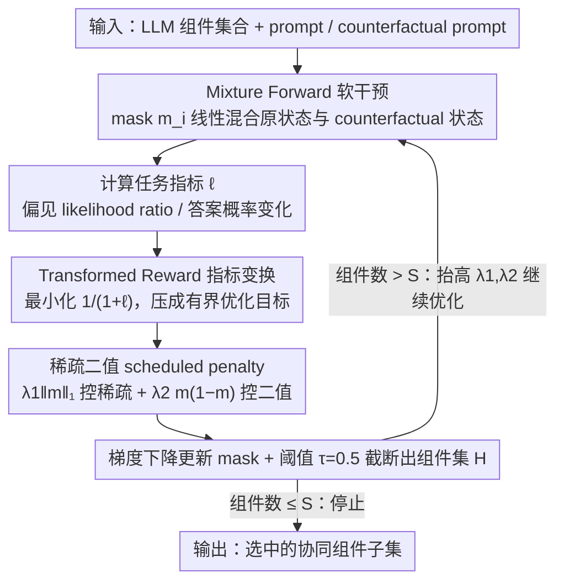

# Multi-component Causal Tracing in Large Language Models

**会议**: ACL 2026  
**arXiv**: [2606.03085](https://arxiv.org/abs/2606.03085)  
**代码**: https://github.com/ZiruiYan/multi-component-causal-tracing  
**领域**: LLM 安全 / 可解释性  
**关键词**: 因果追踪, 激活干预, 多组件交互, 机制可解释性, 偏见定位  

## 一句话总结
这篇论文把 causal tracing 从单组件分析扩展到多组件子集搜索，并提出 PGB-CT 用软干预、指标变换和稀疏二值惩罚高效找到共同影响 LLM 行为的 attention heads 与 MLP neurons。

## 研究背景与动机
**领域现状**：LLM 安全和可解释性研究常需要定位模型内部哪些组件影响特定行为，例如事实知识、性别偏见、truthfulness 或 jailbreak 相关输出。Causal tracing / activation patching 通过干预内部表示，观察目标指标变化，是分析模型内部因果路径的重要工具。

**现有痛点**：许多 causal tracing 工作只分析单个 neuron、单个 attention head 或单层模块。这样做忽略了模型组件之间的非线性交互。例如 induction heads 等机制表明，不同层的多个 heads 可能共同完成某种功能，单独看任一组件都会低估其作用。

**核心矛盾**：要找到最重要的多组件组合，需要在 $N$ 个组件中选择至多 $S$ 个，搜索空间随模型规模指数级增长；但如果退回 top-k 单组件排序，又无法捕捉组件间的协同或互斥效应。

**本文目标**：形式化 multi-component causal tracing 问题，定义灵活干预和指标，并提出一种比 greedy / random / top-k 更高效的优化算法，在保持高指标值的同时降低运行时间。

**切入角度**：作者把离散子集选择松弛成连续 mask optimization，用 soft intervention 让 mask 可微，再通过 reward transformation 和 scheduled penalty 把 mask 推向稀疏、二值解。

**核心 idea**：把“选择组件子集”的组合优化问题转成“学习连续 intervention mask”的梯度优化问题，再用专门的惩罚项逼近真正的稀疏二值组件选择。

## 方法详解
论文先建立统一符号：LLM 由组件集合 $\mathcal{C}=\{c_i\}_{i=1}^{N}$ 构成，组件可以是 attention head、MLP neuron、layer block 等。给定 prompt 和 counterfactual prompt，方法在被选组件上用 counterfactual hidden states 替换原 hidden states，再看目标 metric 如何变化。多组件 causal tracing 的目标，是选出至多 $S$ 个组件，使干预带来的平均 metric $\ell(\mathcal{D},\mathbf{m})$ 最大。

### 整体框架
框架包含三步。第一步定义 intervention：对每个组件 $c_i$ 设置 mask $m_i$，如果 $m_i=1$ 就用 counterfactual state 替换该组件输出，如果 $m_i=0$ 就保持原计算。第二步定义任务指标，例如 gender bias 中 stereotypical 与 anti-stereotypical continuation 的 likelihood ratio，或 knowledge localization 中目标答案概率的变化。第三步优化 mask，在 sparsity constraint 下找到对指标贡献最大的组件集合。

### 关键设计

**1. Mixture Forward 软干预：把离散的"选哪些组件"松弛成可微的连续 mask**

多组件 causal tracing 的根本障碍是组合爆炸——在 $N$ 个组件里选至多 $S$ 个，离散子集搜索随模型规模指数级膨胀，greedy 之类的方法慢到几乎不可用。PGB-CT 的破题点是给每个组件 $c_i$ 配一个连续 mask $m_i\in[0,1]$，把它的输出写成原状态与 counterfactual 状态的线性混合 $\bar{h}_i=(1-m_i)f_i(\bar{g}_i)+m_i h'_i$：$m_i=0$ 保持原计算，$m_i=1$ 完全换成 counterfactual hidden state，中间值则按比例混合两者。这样一来，原本只能枚举的二值选择变成了可以对 $m_i$ 求梯度的连续变量，整个子集搜索退化成一次普通的梯度优化，运行时间不再显式依赖组合空间的大小——这正是它能比 greedy 快两个数量级的来源。

**2. Transformed Reward：把无界的因果指标压成尺度稳定的优化目标**

不同任务的目标指标量纲差别很大——gender bias 看 stereotypical 与 anti-stereotypical continuation 的 likelihood ratio，knowledge localization 看目标答案概率的变化，这些 metric 本身可能无界，直接拿来当 reward 最大化会让梯度和正则强度难以校准，换个 metric 就得重调一遍。PGB-CT 不直接最大化 $\ell(\mathcal{D},\mathbf{m})$，而是最小化

$$\mathcal{L}=\frac{1}{1+\ell(\mathcal{D},\mathbf{m})}+\mathsf{reg}(\mathbf{m}).$$

这个变换把任意范围的指标单调地压进一个有界区间，让同一套正则系数能跨 metric、跨训练阶段稳定工作。这看似是个小技巧，却是让解释性工具真正实用的关键——否则每换一个 causal metric 都要重新校准正则强度。

**3. 稀疏二值 scheduled penalty：逼着连续 mask 收敛到少量干净的 0/1 决策**

软松弛带来一个副作用：优化出来的 mask 容易停在 0.5 附近的中间值，一旦按阈值二值化，性能就掉。PGB-CT 用两项正则联手解决，正则项为 $\lambda_1\|\mathbf{m}\|_1 + \lambda_2\mathbf{m}^{\top}(\mathbf{1}-\mathbf{m})$：第一项 $\ell_1$ 鼓励整体稀疏（只点亮少数组件），第二项 $\mathbf{m}^{\top}(\mathbf{1}-\mathbf{m})$ 专门惩罚 0.5 附近的非二值取值（它在 $m_i\in\{0,1\}$ 时为 0、在 $m_i=0.5$ 时最大）。训练中逐渐抬高 $\lambda_1$ 和 $\lambda_2$，等 mask 达到目标 sparsity 后停止。相比只用 sparsity penalty、最后硬截断的做法，显式惩罚 binary violation 能让最终子集更接近真正离散选择的结果，因此二值化后性能不塌——这也是它在多 metric 设置下比同样用 soft mask 的 DCM 更稳的原因。

### 损失函数 / 训练策略
PGB-CT 使用梯度下降更新 mask：$\mathbf{m}_{t+1}=\mathbf{m}_t-\eta_t\nabla \mathcal{L}_t(\mathcal{D},\mathbf{m}_t)$，并把结果截断到 $[0,1]$。每个 epoch 后用阈值 $\tau=0.5$ 得到组件集合 $\mathcal{H}=\{c_i:m_i>\tau\}$，如果 $|\mathcal{H}|\leq S$ 就停止。论文强调，DCM 也用 soft mask，但它直接用原始 reward 且没有显式二值惩罚，因此在本文设置中表现不稳定。

## 实验关键数据

### 主实验
实验覆盖 GPT2 family、DistilGPT2、Qwen3-1.7B、Llama3.2-1B，并在 WinoGender、WinoBias、Professions、CounterFact 和 VBD 等数据集上选择 attention heads / MLP neurons / MLP blocks。下表摘取 GPT2-medium 的 attention-head 结果。

| 数据集 | 方法 | 10% | 20% | 30% | 40% | 时间 |
|--------|------|-----|-----|-----|-----|------|
| WinoGender | top-k | 0.191 | 0.201 | 0.203 | 0.205 | 2.76 min |
| WinoGender | greedy | 0.208 | 0.224 | 0.232 | 0.237 | 357.28 min |
| WinoGender | PGB-CT | 0.203 | 0.218 | 0.227 | 0.233 | 1.56 min |
| WinoBias | top-k | 0.374 | 0.378 | 0.389 | 0.388 | 8.18 min |
| WinoBias | greedy | 0.391 | 0.406 | 0.415 | 0.420 | 1001.50 min |
| WinoBias | PGB-CT | 0.381 | 0.394 | 0.401 | 0.404 | 5.32 min |

### 消融实验
| 分析项 | 关键数字 | 说明 |
|--------|----------|------|
| GPT2-medium / WinoGender speedup | PGB-CT 1.56 min vs top-k 2.76 min vs greedy 357.28 min | 约 1.76× 快于 top-k，约 229× 快于 greedy |
| GPT2-xl / WinoBias | top-k 40% 为 0.539、62.85 min；PGB-CT 40% 为 0.576、11.32 min | 大模型上 PGB-CT 同时更高效、指标更高 |
| 组件选择相似度 | PGB-CT 与 greedy 的 Jaccard 为 0.64，与 top-k 为 0.44 | PGB-CT 选择更接近 greedy，而不是简单 top-k 排序 |
| LLaMA-13B joint setting | $S=10$ 时选中 Attention Heads 11.11、12.7、15.11、15.25、16.1、18.18、19.25、21.13 和 MLP blocks 5、6 | 能同时分析 attention heads 与 MLP blocks |

### 关键发现
- PGB-CT 的 metric 通常接近 greedy，并显著好于 top-k，说明它确实捕捉到多组件组合效应，而不是只复现单组件重要性排序。
- greedy 在组件数量大时非常慢；PGB-CT 的时间不显式依赖组合搜索空间，因此模型变大时优势更明显。
- MLP neuron 数量远多于 attention heads，直接混合分析会让算法几乎只选 MLP；把每层 MLP neurons 合成 block 后，才能更合理地同时选择 heads 和 MLP blocks。
- 非线性组件交互是真实存在的：论文开头展示了 GPT2-small 上两个 attention heads 或 MLP layers 的联合干预效果并不等于单独干预效果之和。

## 亮点与洞察
- 论文把 causal tracing 从“找一个重要组件”推进到“找一组共同起作用的组件”，这更接近 transformer circuit 的真实形态。
- PGB-CT 的正则设计很干净：$\ell_1$ 控稀疏，$m(1-m)$ 控二值，scheduled penalty 控收敛节奏。这个组合比单纯 hard threshold 更稳。
- 指标变换看似小技巧，但对统一不同 causal metrics 很关键。解释性工具如果每换一个 metric 都要重新调正则，会很难实用。
- 结果也提醒安全干预不能只看 top-k neurons/heads。偏见、事实知识或有害行为可能由组件组合触发，单组件定位可能低估风险。

## 局限与展望
- 方法要求事先指定一个固定目标 metric；如果目标本身多维或动态变化，当前形式还不够灵活。
- PGB-CT 仍需要调学习率、batch size、optimizer、penalty schedule 等超参数，且梯度下降不保证全局最优。
- 由于计算资源和 baseline 低效，实验主要集中在英文数据、GPT 架构和少量相近规模的 Llama/Qwen 模型；跨语言、超大模型和专门领域任务仍需验证。
- 对 attention heads 与 MLP neurons 的 joint analysis 还需要更细的分组策略，否则 MLP 数量优势会主导选择。

## 相关工作与启发
- **vs single-component causal tracing**: Vig et al.、Meng et al. 等工作能定位单 head、单 neuron 或层，但难以处理非线性组合；本文直接优化组件子集。
- **vs activation patching / interchange intervention**: 本文沿用 counterfactual intervention 思路，但把干预 mask 连续化，使多组件搜索可微。
- **vs DCM**: DCM 也做 soft masking，但本文指出其 reward 和 penalty 设计在多 metric 场景下难以稳定；PGB-CT 用 transformed reward 和 binary penalty 改善这一点。
- **启发**: 做模型安全编辑或偏见缓解时，可以先用 PGB-CT 定位一组协同组件，再决定是否 targeted editing、fine-tuning 或 activation steering。

## 评分
- 新颖性: ⭐⭐⭐⭐☆ 多组件 causal tracing 的问题定义和 PGB-CT 算法都较有贡献。
- 实验充分度: ⭐⭐⭐⭐☆ 覆盖 heads、MLP neurons、不同模型和多个任务，但超大模型与跨语言还不足。
- 写作质量: ⭐⭐⭐⭐☆ 公式推导完整，实验结论和算法设计对应明确。
- 价值: ⭐⭐⭐⭐☆ 对机制可解释性、安全定位和模型编辑都有实用价值。

<!-- RELATED:START -->

## 相关论文

- [\[ACL 2026\] CausalDetox: Causal Head Selection and Intervention for Language Model Detoxification](causaldetox_causal_head_selection_and_intervention_for_language_model_detoxifica.md)
- [\[CVPR 2026\] Multi-Paradigm Collaborative Adversarial Attack Against Multi-Modal Large Language Models](../../CVPR2026/llm_safety/multi-paradigm_collaborative_adversarial_attack_against_multi-modal_large_langua.md)
- [\[ACL 2026\] TROJail: Trajectory-Level Optimization for Multi-Turn Large Language Model Jailbreaks with Process Rewards](trojail_trajectory-level_optimization_for_multi-turn_large_language_model_jailbr.md)
- [\[AAAI 2026\] AUVIC: Adversarial Unlearning of Visual Concepts for Multi-modal Large Language Models](../../AAAI2026/llm_safety/auvic_adversarial_unlearning_of_visual_concepts_for_multi-mo.md)
- [\[ACL 2026\] Reasoning Hijacking: The Fragility of Reasoning Alignment in Large Language Models](reasoning_hijacking_the_fragility_of_reasoning_alignment_in_large_language_model.md)

<!-- RELATED:END -->
