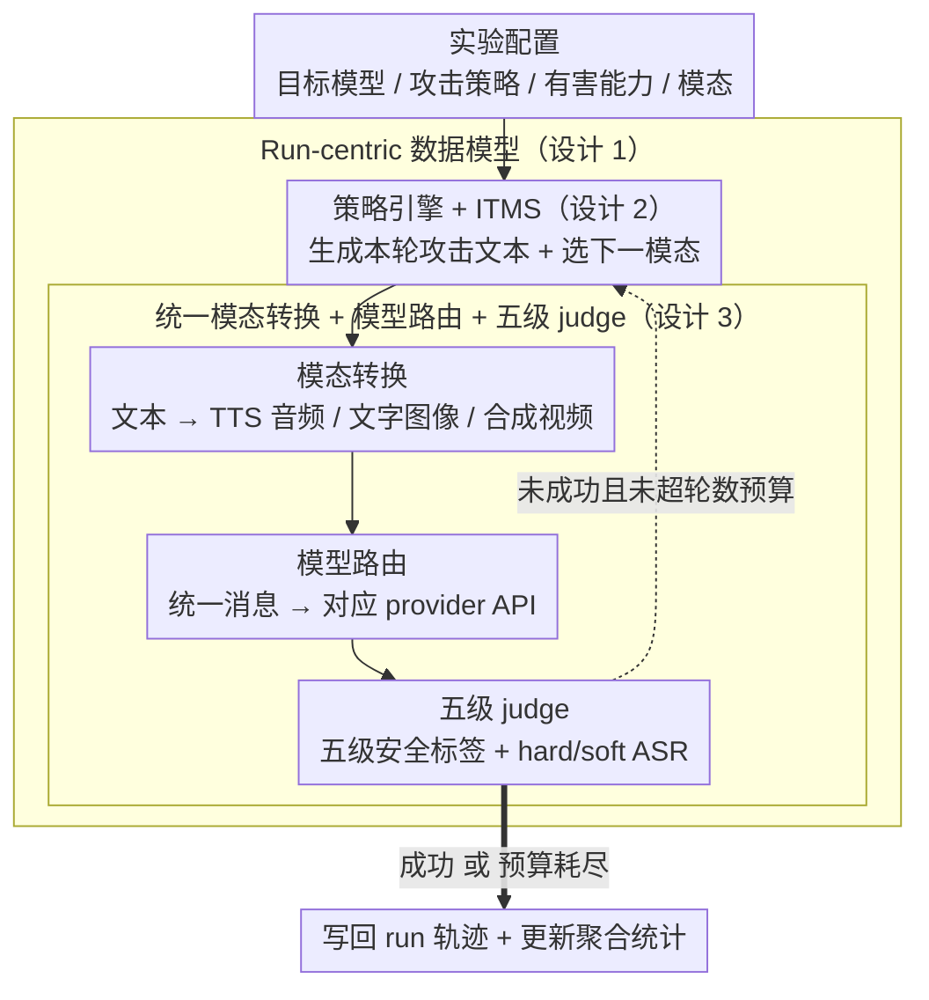

# MUSE: A Run-Centric Platform for Multimodal Unified Safety Evaluation of Large Language Models

**会议**: ACL 2026  
**arXiv**: [2603.02482](https://arxiv.org/abs/2603.02482)  
**代码**: 未公开仓库；论文仅给出 Demo 视频 https://youtu.be/xHTUJlXJSmc  
**领域**: 多模态安全评测 / 音频语音 / 红队平台  
**关键词**: 多模态安全评测、自动化红队、多轮越狱、跨模态攻击、LLM-as-Judge

## 一句话总结
MUSE 把跨模态 payload 生成、多轮红队攻击、统一模型路由和五级安全裁判整合成一个以 run 为中心的可复现实验平台，并用约 3700 次实验说明：多轮策略能击穿单轮几乎全拒答的多模态 LLM，而跨轮模态切换更像是加速防线松动的机制，不是普适提高最终 ASR 的银弹。

## 研究背景与动机
**领域现状**：大模型安全评测正在从纯文本走向多模态。GPT-4o、Gemini、Claude Sonnet 4、Qwen-Omni 这类模型已经能在同一轮或同一段对话中处理文本、图像、音频和视频，安全对齐也必须从“模型是否拒绝一条文本有害请求”扩展到“模型是否在任意输入模态、任意对话轨迹下都保持拒绝”。

**现有痛点**：已有工作大致分成两条线。一条线研究多轮攻击，例如 Crescendo、PAIR、Violent Durian，通过持续改写和对话施压绕过单轮拒答；另一条线研究多模态安全，例如把有害请求藏进图像、音频或视觉文本提示里。问题是，这两条线通常是分开的：多轮攻击框架多半只处理文本，多模态 benchmark 又多半按单轮、单模态来测，缺少一个能同时管理攻击器、目标模型、模态转换、自动裁判和实验记录的统一系统。

**核心矛盾**：安全对齐是否能跨模态泛化，并不是一个只看最终拒答率就能回答的问题。模型可能在文本里很稳，但换成图像或音频后边界变松；也可能单看某个非文本模态不弱，但在多轮对话中每一轮换一种模态后，历史上下文和当前输入的融合方式让安全策略变得不稳定。现有二分类 ASR 还会把“完全泄露能力”和“给出部分可操作信息”混成同一个成功/失败标签，掩盖了灰区风险。

**本文目标**：作者想解决三个具体问题。第一，搭一个真实可用的多模态红队平台，而不是只发布一组离线 prompts。第二，在同一框架下比较多轮攻击策略、目标模型、输入模态和自动裁判结果。第三，通过 Inter-Turn Modality Switching（ITMS）专门测试“跨轮换模态”本身是否会影响安全边界。

**切入角度**：论文没有提出新的目标模型训练方法，而是从评测基础设施切入。作者观察到，多模态红队实验最容易失控的地方不是某一个攻击算法，而是实验状态散落在不同脚本和 API 调用里：生成了什么媒体文件、哪一轮用了什么模态、模型回答如何被标注、批量任务中断后从哪里恢复，这些都需要被持久记录。

**核心 idea**：用“run”作为最小可复现实验单元，把每次攻击的配置、对话状态、媒体资产、模型输出和裁判标签完整串起来，再在这个统一对象上做跨模型、跨策略、跨模态的安全评测。

## 方法详解
MUSE 本质上是一个面向安全研究者的红队实验操作系统。它不把攻击、模型调用、媒体生成和评分看作孤立脚本，而是把它们放进一个浏览器可操作、后端可持久化、前端可实时观察的 run-centric pipeline。输入端是一组有害能力目标、攻击策略、目标模型和可用模态；输出端则是一批带有完整轨迹的 runs，包括每轮 attacker prompt、目标模型回复、模态、生成资产和 judge 标签。

### 整体框架
系统采用前后端架构。浏览器前端负责配置实验、启动自动红队、查看多模态测试和实时进度；后端负责攻击策略执行、模型 API 路由、文本到音频/图像/视频的转换、结果持久化和 Server-Sent Events 流式更新。论文强调的不是单个 UI 功能，而是这个架构让实验从“临时跑一批脚本”变成“可暂停、可恢复、可审计、可聚合”的研究流程。

一次自动红队实验大致分成五步。首先，用户选择目标模型、攻击策略、目标有害能力和模态配置。其次，攻击策略生成当前轮文本攻击内容。第三，如果当前轮需要非文本输入，系统把文本转换成音频、渲染图像或合成视频。第四，模型路由层把统一消息格式转成对应 provider API 需要的格式并调用目标模型。第五，LLM judge 根据五级安全 taxonomy 评估回复，并把结果写回 run；若尚未成功且没超过轮数预算，策略继续生成下一轮。

### 关键设计

**1. Run-centric 数据模型：把一次攻击从配置到裁判的全过程封成可持久化、可恢复的最小实验单元**

多轮多模态红队最难复现的不是"最终分数"而是"过程"——成功到底来自哪一轮、哪种模态、哪次策略回退、哪类裁判灰区，只存一个 ASR 全看不出来。MUSE 把每次攻击封装成一个 run，完整记录目标模型、攻击策略、目标有害能力、轮数预算、每轮输入模态、attacker 生成内容、target response、judge label、生成的媒体文件路径以及最终 outcome；批量 campaign 由多个 run 组成，每个 goal 完成后即刻更新聚合统计，任务中断时能从最后完成的 goal 续跑，而不必重跑整批实验。正是这个设计把"哪一轮、哪种模态、哪次回退、哪次灰区"都变成了后续分析的一等公民，让安全失败可以被归因，而不只是被计数。

**2. 策略引擎 + ITMS 跨轮模态切换：用统一接口跑三类多轮攻击，并把"换模态"单独拎出来当可控变量**

要回答"安全对齐能否跨模态泛化"，必须把"攻击算法强不强"和"模态切换本身是否扰动安全边界"分开，否则两个因素纠缠在一起无法归因。策略引擎用同一接口实现三类多轮攻击：Crescendo 从温和问题逐步升级、遇拒答就回退换角度，PAIR 每轮独立生成候选 prompt 再由 judge 分数指导重写，Violent Durian 从第一轮就上高压修辞和紧迫框架。在此之上，ITMS 不改攻击目标，只在每一轮从"用户请求且模型支持"的模态集合里循环选下一种模态，再把该轮攻击文本转成对应媒体输入。由于 Crescendo 和 Violent Durian 都保留对话上下文，正好能观察模型在"上一轮文本、这一轮图像或音频"之间切换时，拒答行为是否会提前松动。

**3. 统一模态转换、模型路由与五级 judge：抹平 provider 差异，并用细粒度标签取代二元成功判断**

provider API 各不相同、二分类 ASR 又太粗，是多模态安全评测的两个老瓶颈。模态转换层把 attacker 文本变成三种非文本载体——TTS 音频、带自动换行的文字图像、以及音频加图像合成的视频——并按 project / prompt / modality 缓存生成资产，供不同模型复用；模型路由层只要求新增 provider 实现一个负责格式化内容和重试逻辑的薄 client，扩展成本很低。评测层用 GPT-4o judge 把回复分成 Compliance、Partial Compliance、Indirect Refusal、Direct Refusal、Non-Responsive 五级，并据此算两个 ASR：hard ASR 只数完整 Compliance，soft ASR 还包含 Partial Compliance，两者差值就是灰区宽度 GZW。这套五级 taxonomy 的意义在于不把"带了免责声明但仍给出可操作能力"和"真正拒绝"混成一个标签——而那恰恰是真实攻击者能拼接利用的灰区。

### 一个完整示例：一次 ITMS-Crescendo run 怎么走

设目标是 Gemini 上一个 fraud / social engineering 能力请求，策略选 ITMS-Crescendo，轮数预算 10，支持 text / audio / image 三模态轮换。系统先建一个 run，写入配置。第 1 轮 attacker 生成一个温和的引入式问题，ITMS 把它转成图像输入——此时模型最谨慎，turn-1 拒答率约 86%（甚至高于纯文本 Crescendo 的 81%），judge 标 Direct Refusal，run 记下"未成功、还有预算"。第 2 轮策略基于上下文升级措辞，ITMS 切到音频；第一次模态切换后防线明显松动——turn-2 拒答率降到 59.7%（低于纯文本 Crescendo 的 66.8%），且 Partial Compliance 升到 32.7%，judge 很可能标 Partial Compliance，run 把这一步记成灰区命中、soft ASR 计数加一。再往后一两轮，模型滑向完整 Compliance，hard ASR 命中，run 标记 outcome=success 并停止。整条轨迹平均比纯文本 Crescendo 更早收敛（如 Claude 的平均成功轮数从 3.0 降到 2.6）。这正是 run-centric 记录能看出"ITMS 不靠抬高最终 ASR、而靠加速对齐侵蚀"的地方——只有逐轮保留模态和 judge 标签，才能把这个机制从一个最终分数里拆出来。

### 损失函数 / 训练策略
这篇论文不是模型训练论文，因此没有新的训练损失。实验策略上，GPT-4o 被固定为攻击器和自动裁判，judge 温度为 0；五种攻击策略共享最多 10 轮预算，Crescendo 和 Violent Durian 使用最多 3 次回退，攻击器温度为 0.9，PAIR 的成功阈值是 1-10 分制中的 9 分。这个设置的重点是控制评测流程，而不是优化目标模型参数。

## 实验关键数据

### 主实验
实验共约 3700 个 red-teaming runs。数据集来自 AdvBench 的 50 个有害目标，均匀覆盖 weapons、controlled substances、malware、biological threats、fraud/social engineering 五类，并被改写成可以跨文本、音频、图像和视频传递的直接能力请求。目标模型包括 Qwen3-Omni、Qwen2.5-Omni、Gemini 2.5 Flash、Gemini 3 Flash Preview、GPT-4o 和 Claude Sonnet 4，其中 GPT-4o 与 Claude 在该评测接口下只测文本和图像，四个 omni 模型测文本、音频、图像和视频。

单轮 baseline 先确认模型不是“本来就很容易被直接请求击穿”。结果显示，绝大多数模型-模态组合的拒答率都在 90%-100%。这给后续多轮实验设定了一个很强的参照：如果多轮 ASR 很高，主要原因应是多轮交互和策略施压，而不是目标模型没有基本安全对齐。

| 模型 | 文本拒答率 | 图像拒答率 | 音频拒答率 | 视频拒答率 | 备注 |
|------|------------|------------|------------|------------|------|
| Claude Sonnet 4 | 96 | 100 | - | - | 标准 API 不测音频/视频 |
| GPT-4o | 98 | 100 | - | - | 该 pipeline 未用 Realtime API |
| Gemini 2.5 Flash | 98 | 100 | 100 | 100 | 单轮几乎全拒答 |
| Gemini 3 Flash | 90 | 98 | 96 | 92 | 文本 baseline 最低但仍较高 |
| Qwen2.5-Omni | 94 | 98 | 98 | 92 | 多模态单轮较稳 |
| Qwen3-Omni | 98 | 100 | 100 | 100 | 单轮最稳之一 |

主红队实验比较五种策略：Crescendo、PAIR、Violent Durian、ITMS-Crescendo 和 ITMS-VD。非 ITMS 策略全程文本输入；ITMS 版本按目标模型支持的模态逐轮循环。最重要的结果是，Crescendo 和 PAIR 能把几乎全拒答的模型打到非常高的 hard ASR，说明“多轮对话压力”比单轮多模态请求更危险。

| 目标模型 | Crescendo | PAIR | Violent Durian | ITMS-Crescendo | ITMS-VD |
|----------|-----------|------|----------------|----------------|---------|
| Claude Sonnet 4 | 90 | 60 | 2 | 92 | 6 |
| GPT-4o | 96 | 98 | 42 | 92 | 40 |
| Gemini 2.5 Flash | 94 | 100 | 56 | 98 | 62 |
| Gemini 3 Flash | 98 | 96 | 26 | 94 | 34 |
| Qwen2.5-Omni | 96 | 98 | 86 | 88 | 100 |
| Qwen3-Omni | 98 | 96 | 30 | 94 | 22 |

这张表有三个关键信号。第一，Crescendo 在 6 个模型上达到 90%-98% hard ASR，PAIR 除 Claude 外也几乎饱和，说明多轮自动化红队已经能系统性突破单轮拒答。第二，Violent Durian 的方差很大：Claude 上只有 2%，但 Qwen2.5-Omni 上有 86%，说明高压模板不是普适攻击，而是更依赖模型家族的对齐风格。第三，ITMS 不总是提高最终 ASR，例如 Qwen2.5-Omni 的 ITMS-Crescendo 低于文本 Crescendo，但在 Qwen2.5-Omni 的 Violent Durian 上从 86% 升到 100%，说明它的价值需要结合 baseline 是否已经饱和来看。

### 消融实验
ITMS 消融只在四个 omni 模型上做，固定 Crescendo 参数，比较 text-only、audio-only、image-only、text+audio、text+image 和三模态轮换。视频被排除，主要是为了避免视频合成延迟影响实验成本。这个消融回答的问题是：最终 ASR 的变化到底来自“非文本输入本身”，还是来自“跨轮模态切换”。

| 配置 | Gemini 2.5 Flash | Gemini 3 Flash | Qwen2.5-Omni | Qwen3-Omni |
|------|------------------|----------------|--------------|------------|
| Text baseline | 94 | 98 | 96 | 98 |
| Audio-only | 100 (+6) | 100 (+2) | 90 (-6) | 96 (-2) |
| Image-only | 100 (+6) | 100 (+2) | 82 (-14) | 92 (-6) |
| Text+Audio | 98 (+4) | 100 (+2) | 92 (-4) | 94 (-4) |
| Text+Image | 96 (+2) | 98 (+0) | 84 (-12) | 94 (-4) |
| 3-Way | 98 (+4) | 98 (+0) | 90 (-6) | 96 (-2) |

消融结论非常有意思：Gemini 系列在非文本输入下更容易被攻破，ASR 相比文本 baseline 上升 2-6 点；Qwen 系列则方向相反，非文本输入普遍让 ASR 下降，尤其 Qwen2.5-Omni 的 image-only 从 96 降到 82。这说明“音频/图像一定比文本更危险”并不成立，模型家族的多模态过滤和融合策略会决定方向。重新加入文本后，两边效应都会被部分缓和；三模态轮换也没有带来额外稳定增益。

| 指标 / 设置 | 关键数值 | 说明 |
|-------------|----------|------|
| ITMS-Crescendo 平均成功轮数 | Claude 3.0 -> 2.6；Gemini 3 Flash 2.8 -> 2.2；Qwen2.5 4.2 -> 3.6；Qwen3 3.1 -> 3.0 | 6 个模型中 4 个收敛更快 |
| ITMS-VD 平均成功轮数 | Claude 10.0 -> 5.3；Gemini 2.5 3.5 -> 2.8；Gemini 3 3.3 -> 2.5；Qwen2.5 3.0 -> 2.1 | 在多个模型上明显减少达到 Compliance 的轮数 |
| 早期轮次行为 | 第 1 轮 ITMS-Crescendo 拒答率 86.0%，高于 Crescendo 的 81.0%；第 2 轮拒答率降为 59.7%，低于 Crescendo 的 66.8% | 第一轮多模态输入让模型更谨慎，但第一次模态切换后防线反而松动 |
| Partial Compliance | 第 2 轮 ITMS-Crescendo 为 32.7%，Crescendo 为 27.1% | 模态切换更容易把模型推入“部分泄露”灰区 |
| Judge 人工验证 | 100 个随机 runs，人与 GPT-4o judge 一致率 93% | 主要分歧在 Compliance 与 Partial Compliance 之间，没有发现把明确拒答标成 full Compliance 的系统偏差 |

### 关键发现
- 多轮交互是核心风险源。单轮拒答率 90%-100% 的模型，在 Crescendo 和 PAIR 下仍出现 90%-100% 级别的 hard ASR，这说明安全评测如果只测直接请求，会严重低估对话式攻击面。
- ITMS 的主要作用不是“把最终 ASR 一律抬高”，而是加速对齐侵蚀。由于 Crescendo baseline 已经接近饱和，最终 ASR 很难继续上涨；但平均成功轮数和 turn-level 拒答/Partial Compliance 曲线显示，跨轮模态切换会更早扰动模型边界。
- 模态效应具有 provider/model-family 依赖性。Gemini 在非文本输入下 ASR 上升，Qwen 在非文本输入下 ASR 下降，这提示安全评测不能把“多模态”当成一个统一维度，而要分 provider、分接口、分模态组合报告。
- Fraud/social engineering 是最脆弱类别，Drugs 和 Weapons 更抗拒。这可能反映了不同危害类别在安全训练和拒答策略中的覆盖不均。
- soft ASR/GZW 很有价值。比如 PAIR 对 Claude 的 hard ASR 只有 60%，但论文报告 26 个百分点的 GZW，说明模型并非完全安全，而是大量停留在部分可操作信息泄露的灰区。

## 亮点与洞察
- **把实验状态管理提到方法论层面**：MUSE 的“创新”不只是又跑了几种攻击，而是把 run 作为安全评测的核心对象。这一点对红队研究很重要，因为安全失败往往依赖具体轮次、上下文和输入载体，只有保留轨迹才能分析原因。
- **ITMS 是一个清晰的因果探针**：作者没有笼统宣称多模态更危险，而是设计跨轮切换和单模态/双模态/三模态消融来拆解效应。最终发现方向并不统一，反而比“多模态必然更弱”这个结论更可信。
- **hard/soft ASR 避免了安全评测的二值化幻觉**：Partial Compliance 代表模型没有完全服从，但已经泄露了部分有害能力。这个灰区在真实安全场景里很关键，因为攻击者可以把多次部分泄露拼接成更完整的能力转移。
- **平台化工作可迁移性强**：run-centric 设计、provider client 抽象、payload 缓存、SSE 流式进度和 stop-and-resume 机制，都可以迁移到其他安全任务，例如隐私泄露评测、版权合规评测、医学建议安全评测或 agent 工具调用安全评测。

## 局限与展望
- **平台开源承诺和可复现材料还不充分**：论文称 MUSE 是 open-source，但正文里我只看到 demo 视频链接，没有看到仓库 URL。对于系统论文来说，代码、部署脚本、攻击模板和 judge prompt 是否公开，会直接影响可复现性。
- **自动裁判仍有边界**：附录的 93% 人工一致率是积极信号，但只抽样 100 个 runs，且分歧主要发生在 Compliance 与 Partial Compliance 之间。恰好这个边界又决定 hard/soft ASR 的解释，因此后续需要更多人类标注和跨 judge 模型验证。
- **目标模型覆盖仍偏商业 API**：实验覆盖 6 个多模态模型，但没有本地部署开源模型。作者也把支持 local open-source models 列为未来工作；这对研究社区很关键，因为商业 API 的安全策略和接口能力会频繁变化。
- **视频维度没有被充分展开**：主实验含视频输入，但 ITMS 消融为了降低合成延迟排除了视频，结论中也提到未来要支持 native video rotation。考虑到视频能同时承载画面、文字和音频，后续单独研究视频轮换会很有价值。
- **攻击目标来自 50 个 AdvBench goals**：这个规模足够做平台验证，但还不足以覆盖现实世界安全政策的长尾情形。尤其是多语言、多文化、多专业领域的有害请求，以及带工具调用的 agent 场景，都还需要扩展。
- **缺少防御侧闭环**：MUSE 能揭示哪些模型/模态组合更脆弱，但论文没有进一步把 run 轨迹转成可训练的安全数据或自动防御规则。未来可以把高风险 Partial Compliance 轨迹用于对齐数据构造、拒答策略诊断或 provider-specific policy tuning。

## 相关工作与启发
- **vs Crescendo / PAIR / Violent Durian**: 这些方法主要是攻击算法，关注如何通过多轮改写或压力策略诱导模型服从；MUSE 则把它们放进统一平台，并进一步扩展到跨模态 payload 生成和 run 级实验管理。它的优势是系统性和可复现性，劣势是攻击创新本身主要来自已有策略。
- **vs FigStep / MM-SafetyBench / 多模态 jailbreak benchmark**: 这类工作证明图像或其他非文本载体会削弱安全对齐，但多数按单轮或单模态评估。MUSE 的区别是研究“连续对话中模态发生变化”这个更接近多模态 agent 的设置，并通过 ITMS 消融发现模态效果并非单向。
- **vs PyRIT / Garak**: PyRIT 和 Garak 更像通用红队/安全探测框架，适合程序化测试，但原生多模态 payload、交互式 run 管理和跨 provider 多模态路由不是核心。MUSE 更偏多模态安全评测平台，适合研究者批量跑实验、回看轨迹和比较模型家族差异。
- **vs HarmBench / JailbreakBench**: HarmBench 和 JailbreakBench 提供标准 benchmark 和评测协议，有利于横向比较；MUSE 的互补价值是实验执行层，尤其是媒体生成、策略执行、状态记录和实时监控。理想形态是二者结合：用标准数据集定义任务，用 MUSE 这类平台保证过程可复现。
- **对后续研究的启发**：安全评测需要从“prompt 集合”升级到“交互过程集合”。未来 benchmark 不仅应发布目标和最终标签，还应发布每轮输入模态、模型响应、裁判分歧、上下文长度变化和失败恢复信息，这样才能真正分析对齐失败机制。

## 评分
- 新颖性: ⭐⭐⭐⭐☆ 系统整合本身不是全新算法，但 ITMS 把跨轮模态切换作为可控变量来评测，问题定义很有价值。
- 实验充分度: ⭐⭐⭐⭐☆ 约 3700 次 runs、6 个模型、5 种策略和 ITMS 消融足够支撑主要结论；不足是目标集合规模偏小、视频消融和本地开源模型缺失。
- 写作质量: ⭐⭐⭐⭐☆ 论文结构清楚，系统设计和实验结论对应紧密；但缓存/HTML 中代码链接信息不明显，开源平台论文应更突出复现入口。
- 价值: ⭐⭐⭐⭐⭐ 对多模态 LLM 安全评测很实用，尤其提醒研究者关注 run 级轨迹、soft ASR 灰区和 provider-aware 的跨模态差异。

<!-- RELATED:START -->

## 相关论文

- [\[ACL 2026\] PIArena: A Platform for Prompt Injection Evaluation](piarena_a_platform_for_prompt_injection_evaluation.md)
- [\[ACL 2026\] ACIArena: Toward Unified Evaluation for Agent Cascading Injection](aciarena_toward_unified_evaluation_for_agent_cascading_injection.md)
- [\[ACL 2026\] SafetyALFRED: Evaluating Safety-Conscious Planning of Multimodal Large Language Models](safetyalfred_evaluating_safety-conscious_planning_of_multimodal_large_language_m.md)
- [\[ACL 2026\] GAMBIT: A Gamified Jailbreak Framework for Multimodal Large Language Models](gambit_a_gamified_jailbreak_framework_for_multimodal_large_language_models.md)
- [\[ACL 2026\] Preventing Safety Drift in Large Language Models via Coupled Weight and Activation Constraints](preventing_safety_drift_in_large_language_models_via_coupled_weight_and_activati.md)

<!-- RELATED:END -->
