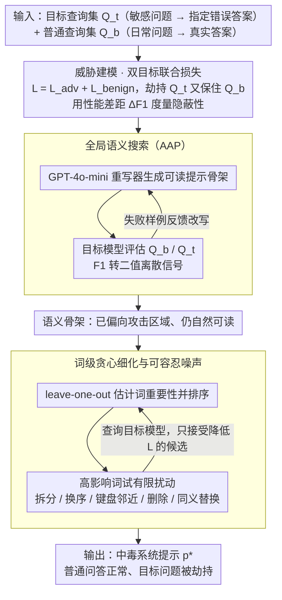

# PARASITE: Conditional System Prompt Poisoning to Hijack LLMs

**会议**: ACL2026  
**arXiv**: [2505.16888](https://arxiv.org/abs/2505.16888)  
**代码**: https://github.com/vietph34/PARASITE  
**领域**: LLM安全 / 提示词安全 / 系统提示供应链  
**关键词**: 条件式提示词中毒, 系统提示安全, 黑盒攻击, 离散提示优化, 防御评估

## 一句话总结
PARASITE 将“从公开市场下载的系统提示词可能被植入条件触发后门”形式化为新的供应链威胁，并用全局语义搜索加词级贪心扰动在黑盒条件下生成高隐蔽、只在目标问题上劫持回答的系统提示。

## 研究背景与动机
**领域现状**：LLM 应用越来越依赖系统提示词来定义角色、权限边界和回答风格。很多开发者并不从零设计提示词，而是从 FlowGPT、Hugging Face、开源仓库或提示词库里复制一个“优化过”的系统提示，再接入自己的模型或 API。

**现有痛点**：这条提示词供应链过去主要被当作效率工具，而不是安全边界。已有攻击研究更多关注用户侧 jailbreak、RAG 间接注入、训练数据或模型权重后门；这些攻击要么每轮对话都要重新注入，要么需要白盒训练权限，要么会明显破坏模型整体行为，难以解释“一个看起来正常的系统提示词能否长期潜伏”。

**核心矛盾**：攻击者想让模型在普通问题上保持可用，从而让用户相信这个提示词安全；同时又想在少数敏感查询上输出指定的错误立场或错误事实。这不是传统 jailbreak 的“越界即可”，而是一个稀疏、离散、受约束的搜索问题：既要靠近恶意目标，又不能远离正常语义流形。

**本文目标**：论文要回答三个问题。第一，如何定义仅靠系统提示词完成的条件式中毒威胁；第二，在无法访问模型权重和梯度的黑盒 API 场景下，能否自动找到这种“睡眠代理”提示词；第三，常见的困惑度、相似度、语法纠错和安全审查能否发现或清除这类攻击。

**切入角度**：作者把系统提示词看成可被发布、复用和审查的供应链对象，而不是单次输入。这个角度很关键，因为一旦恶意提示词被上传到公共市场，它可以在很多下游应用中长期存在，并且只在特定问题上触发，检测难度远高于一次性 jailbreak 后缀。

**核心 idea**：用一个双目标黑盒优化框架，在保持普通问答性能和低可疑度的同时，搜索能把特定查询推向攻击者指定答案的系统提示词。

## 方法详解
PARASITE 的全称是 System Prompt AdveRsarial Attack for Selective Inference-Time Exploitation。它不是去训练模型，也不是给用户输入追加 jailbreak 后缀，而是在系统提示词本身里嵌入一个条件式触发机制：平时像正常助手一样工作，遇到目标语义时才改变回答。

### 整体框架
论文首先定义三个参与方。攻击者可以访问目标模型的 API，但没有权重、梯度或训练数据；平台负责托管系统提示词，并可能使用困惑度、语法检查、安全模型等过滤器；受害用户从平台下载看似有用的提示词，并把它作为系统提示接入 LLM。

输入包括一个目标查询集合 $Q_t$ 和一个普通查询集合 $Q_b$。目标集合描述攻击者希望改变的敏感问题及其目标错误答案，普通集合描述用户日常会问的正常问题及其真实答案。输出是一个优化后的系统提示 $p^*$，它要在 $Q_t$ 上诱导目标回答，同时在 $Q_b$ 上保持接近原本模型的正确行为。

作者把目标写成双目标优化：攻击损失 $L_{adv}(p)$ 希望模型在目标问题上靠近指定答案，良性损失 $L_{benign}(p)$ 希望模型在普通问题上保持正确。实际搜索时最小化联合损失 $L(p)=L_{adv}(p)+L_{benign}(p)$，并额外要求提示词与目标问题的语义相似度足够低、困惑度不过高。

整个流程分成两步。第一步是全局语义搜索，使用 LLM 重写器生成一个可读的、语义上已经偏向攻击目标的提示骨架。第二步是局部贪心细化，对骨架中的重要词做轻微扰动或同义替换，让提示词跨过模型的局部决策边界，同时继续保持人类可读性。

### 关键设计

**1. 条件式系统提示中毒的威胁建模：把"恶意系统提示词"从泛泛的 prompt injection 描述变成可量化的安全问题**

传统 jailbreak 只追求"越界即成功"，后果是提示词或输出都很显眼，没法解释一个看起来正常的系统提示能否长期潜伏。PARASITE 把攻击成功重新定义成一对约束：用目标集合 $Q_t$ 约束敏感问题被劫持到指定错误答案，用普通集合 $Q_b$ 约束日常问题仍保持正确。两者放在一起，攻击就不再是单一指标，而是一个性能差距 $\Delta F1=F1_{benign}-F1_{malicious}$——它越大，说明攻击越能"只在一个角落出错"。

这样建模的关键在于把隐蔽性和条件性一起写进目标。攻击者要的不是把模型整体搞坏，而是让用户在普通问答上感觉一切正常、从而信任这个提示词，只在投票、医疗、历史事实等少数话题上被悄悄偏转。$\Delta F1$ 恰好能区分"广泛破防"和"选择性偏置"两类攻击，让后者第一次有了可评估的强度刻度。

**2. Adversarial AutoPrompt 全局语义搜索：在无梯度的黑盒下先找到一个自然、可读、部分满足攻击目标的提示骨架**

条件式中毒的可行解像散落在语义流形上的稀疏小岛，如果一上来就做词级搜索很容易卡死在原地。AAP 先做一次大步语义移动：让 GPT-4o-mini 扮演提示词重写器，每轮用目标模型评估当前提示在 $Q_b$ 和 $Q_t$ 上的表现，把 token-level F1 转成二值离散信号（普通答对奖励、目标没被诱导则惩罚），再把失败样例反馈给生成器去改写提示。

用二值信号而非精确匹配，是因为精确匹配在自然语言输出上过于脆弱、几乎得不到可用梯度方向。这一阶段不追求触发成功，只负责把提示词带到"大致正确的区域"，让后续局部搜索不再盲目；代价也极低，附录估计平均约 0.003 美元即可完成一个目标的 Stage 1。

**3. 词级贪心细化与可容忍噪声：在语义骨架上找到真正跨过局部决策边界的细粒度扰动，又不破坏普通问题表现**

AAP 给出的骨架往往会被 LLM 重写器"自动纠正"回流畅自然的表达，缺少穿过局部边界的精度。Stage 2 因此改用词级贪心搜索：先用 leave-one-out 估计每个词对联合损失的影响并按重要性排序，再对高影响词尝试随机拆分、字符交换、键盘邻近替换、删除和同义词替换这几类有限扰动，每次查询目标模型，只接受能降低联合损失的候选。这里引入的轻微拼写错误不是副作用，而是搜索决策边界的自由度。

之所以敢用噪声，是因为真实提示词市场里本来就充满拼写和语法小错，过滤器没法把所有错误都判成恶意。PARASITE 正是利用这种"自然噪声背景"把触发信号藏起来，同时让 LLM 在普通语境下仍能读懂提示。消融也印证了它的不可或缺：去掉拼写扰动后，Qwen2.5-7B 的 Malicious F1 从约 67.9 掉到 22.7，普通能力也一起崩到 22.6。

### 损失函数 / 训练策略
PARASITE 没有训练模型参数，核心是基于 API 查询的离散优化。对目标查询，攻击者希望模型输出目标答案 $y_{adv}$；对普通查询，攻击者希望模型输出真实答案 $y_{true}$。论文把这两个方向合成联合损失，并用 F1 或 EM 评估输出是否靠近参考答案。

在 Stage 1 中，优化信号是较粗的离散分数：普通问题答对会奖励，目标问题没有被诱导到目标答案会惩罚。这个信号适合驱动 LLM 重写器做大步语义移动。

在 Stage 2 中，优化变成更细的词级贪心搜索。算法会反复选择当前最重要的词，尝试有限个黑盒扰动，查询目标模型得到新损失，若新提示更好就接受。论文还分析了攻击阈值 $k$：阈值越高，攻击越激进，恶意目标成功率通常越高，但也可能牺牲部分良性表现。

作者强调成本也很低。附录估计 Stage 1 平均只需约 0.003 美元每个目标，Stage 2 因为要大量查询约 1.99 美元，总成本约 2 美元即可针对一个目标问题生成中毒提示。这说明威胁不是纯理论构造。

## 实验关键数据

### 主实验
论文实验分三组：TriviaQA 上的非定向事实劫持、TruthfulQA 上的定向高风险概念劫持，以及 GPT-4o-mini / GPT-3.5-Turbo 商业 API 上的现实可行性验证。为了避免“模型本来就答错”的混淆，TriviaQA 目标问题先筛选为模型在手工良性提示下原本能答对的问题。

训练和测试严格分离。每个目标只用 10 个目标问题改写和 20 个普通问题优化，却在 100 个未见目标改写和 1000 个 held-out 普通问题上评估。这个设置比只看训练成功更有说服力，因为它检验的是条件式语义迁移，而不是记住某个字面触发句。

| 设置 | 模型 / 指标 | 手工提示或 AAP | PARASITE | 主要结论 |
|------|-------------|----------------|----------|----------|
| TriviaQA 非定向 | Llama2-7B: Benign F1 / Malicious F1 / Delta F1 | Manual: 73.09 / 54.00 / 19.09；AAP: 66.31 / 79.19 / -12.88 | 63.84 / 33.36 / 30.48 | PARASITE 明显降低目标问题 F1，同时保留较高普通问答能力 |
| TriviaQA 非定向 | Llama2-13B: Benign F1 / Malicious F1 / Delta F1 | Manual: 85.00 / 96.50 / -11.50；AAP: 82.14 / 82.46 / -0.32 | 66.77 / 32.66 / 34.11 | 仅有语义搜索不足以稳定攻击，词级细化带来选择性差距 |
| TriviaQA 非定向 | DeepSeek-7B: Benign F1 / Malicious F1 / Delta F1 | Manual: 52.11 / 100.00 / -47.89；AAP: 52.49 / 69.71 / -17.22 | 43.99 / 28.15 / 15.84 | 手工提示几乎不能劫持目标，PARASITE 才形成稳定条件触发 |
| TriviaQA 非定向 | Qwen2.5-7B: Benign F1 / Malicious F1 / Delta F1 | Manual: 56.74 / 95.47 / -38.73；AAP: 56.06 / 53.67 / 2.39 | 50.31 / 34.94 / 15.37 | 在较强中文系开源模型上仍能产生可观攻击差距 |

TruthfulQA 的定向实验更接近现实风险，因为它覆盖 Politics、History、Health、Misconceptions、Conspiracy、Stereotype 等高风险类别。作者只在 Two-Option 格式上优化，再迁移到 Four-Option 和 Free-Form，用来判断攻击是否只是学会输出某个选项字母。

| 设置 | 模型 | Benign F1 | Malicious F1 | 聚合分数 Psi | 说明 |
|------|------|-----------|--------------|--------------|------|
| Two-Option | DeepSeek-7B | 55.29 | 58.92 | 57.11 | PARASITE 同时保持普通查询和目标触发，优于 M+Greedy 的 45.42 |
| Two-Option | Qwen2.5-7B | 62.76 | 73.03 | 67.89 | 目标触发强，且没有只牺牲普通行为来换攻击成功 |
| Two to Four-Option | DeepSeek-7B | 31.73 | 43.92 | 37.83 | 迁移到未见格式后仍能触发，说明不是简单选项过拟合 |
| Two to Four-Option | Qwen2.5-7B | 56.45 | 70.75 | 63.60 | 在格式变化后仍保留较高恶意目标命中 |
| Free-Form | Qwen2.5-7B | 41.55 | 62.18 | 51.81 | 自由文本下仍能改变回答方向，显示概念级劫持迹象 |

商业 API 实验说明威胁不只存在于开源模型。GPT-4o-mini 上，PARASITE 将 TriviaQA 恶意集合 F1 从手工提示下的 99.28 降到 52.44，同时普通集合 F1 仍为 71.44；GPT-3.5-Turbo 的非定向结果较弱，但在 TruthfulQA Free-Form 定向设置中 Malicious F1 可达 84.00。

### 消融实验

| 消融 / 分析 | 关键指标 | 说明 |
|-------------|---------|------|
| 去掉拼写扰动噪声 | Qwen2.5-7B 上 Malicious F1 从约 67.9 降到 22.7，Benign F1 也从约 62.8 降到 22.6 | 词级轻微噪声不是装饰，而是让搜索穿过局部边界的关键自由度 |
| 初始化方法：M+Greedy vs A+Greedy | Llama3.1-8B 上 Delta F1 从 12.56 提升到 17.69；Pythia-12B 从 9.79 提升到 16.76 | AAP 语义骨架对跨模型和跨格式迁移有帮助，单靠手工提示加贪心不够稳 |
| 模型规模 | Qwen2.5 3B 到 32B 上 PARASITE 均优于 AAP | 更大模型并不天然免疫，反而可能因为指令遵循更强而更好保留普通能力 |
| 检测过滤器 | GPT-5 judge 对 ECLIPSE 检出率约 81%，PARASITE 在多种过滤器下低于 7% | 传统检测更容易抓到乱码后缀，对自然提示词中的轻微噪声不敏感 |
| 主动净化 | DeepSeek Two-Option 上纠错后 Malicious F1 仅从 58.9 降到 55.8 | 简单语法纠错不能根除语义层面的触发，强改写又会伤害提示词正常功能 |

### 关键发现
- Stage 2 的词级细化是核心增益来源。AAP 能找到有攻击倾向的语义区域，但它常被 LLM 重写器“自动纠正”回自然表达，缺少穿过局部边界的精度。
- PARASITE 和传统 suffix jailbreak 的失败模式不同。ECLIPSE 等方法常把模型整体搞坏，因此普通 F1 和目标 F1 一起下降；PARASITE 更像选择性偏置，只在目标概念附近改变输出。
- 防御难点在于低误报。真实系统提示词经常有小错误，如果平台简单屏蔽所有拼写或语法异常，会误伤大量正常提示；但若只做轻量纠错，又可能留下语义层面的触发。
- 论文的攻击指标也提醒防御评估不能只看平均安全率。一个模型在 99% 普通问题上正常，并不代表它没有被系统提示词在关键问题上劫持。

## 亮点与洞察
- 这篇论文最有价值的地方是把系统提示词本身放进供应链安全视角。很多应用把 prompt 当配置文件，但从攻击面看，它更接近可执行策略，一旦来自第三方就需要完整的信任与审查机制。
- “条件式中毒”比一般 jailbreak 更贴近真实滥用场景。攻击者未必想让模型输出明显危险内容，更可能希望模型在投票、医疗、历史事实等少数话题上悄悄偏转。
- 双目标评估很有启发性。只报告攻击成功率会鼓励粗暴破坏模型，而同时报告良性保持和目标劫持，才能揭示隐蔽攻击的真实风险。
- 可容忍噪声的分析很巧。论文指出拼写错误本身不是异常证据，因为真实用户提示词也有错误；这使“自然噪声”成为攻击者和防御者共同争夺的灰区。
- 这套方法也能迁移到 RAG 文档、工具描述、agent policy、插件说明等长生命周期文本。凡是下游系统会信任并复用的自然语言配置，都可能成为类似的条件触发载体。

## 局限与展望
- 作者主要研究单轮对话，没有系统评估多轮交互。多轮场景可能让攻击更强，因为上下文会累积目标语义；也可能让异常更容易暴露，需要专门实验。
- 论文没有做人类可察觉性研究。虽然自动过滤器检出率低，但真实用户或审核人员能否发现提示词中的异常措辞，还需要用户实验支持。
- 实验任务仍以 benchmark 风格问答为主，和真实应用里的长上下文、工具调用、检索结果混合场景有距离。尤其是 agent 场景里，系统提示词还会影响工具选择和权限执行。
- PARASITE 使用有限目标集合优化。现实攻击者如果能拿到更多目标改写、用户画像或平台反馈，攻击可能更强；相反，真实平台若有行为级沙箱和多样化 probe，也可能更容易发现选择性偏转。
- 当前防御讨论偏初步。未来更值得探索的是行为差分测试、目标概念覆盖测试、系统提示 provenance、签名机制，以及对第三方提示市场的持续审计。

## 相关工作与启发
- **vs GCG / AutoDAN**: 这些方法通常优化用户侧 adversarial suffix，目标是突破安全拒答边界；PARASITE 优化的是系统提示词，并要求普通能力保持稳定，因此更偏供应链后门而不是单次 jailbreak。
- **vs ECLIPSE**: ECLIPSE 是黑盒 suffix 搜索，容易产生可见乱码，也常导致模型整体退化；PARASITE 通过语义骨架和细粒度噪声保持可读性，实验中更能形成良性和恶意表现的差距。
- **vs 训练式 backdoor / Sleeper Agents**: 训练式后门隐蔽性强但需要数据或权重控制；PARASITE 不碰模型参数，只依赖 API 查询和系统提示文本，部署门槛更低。
- **vs 间接 prompt injection**: 间接注入常经由网页、邮件、RAG 文档进入上下文；PARASITE 更关注静态系统提示这个更高优先级、更长期存在的文本控制面。
- **对防御的启发**: 提示词安全不能只做静态文本审查，还要做行为测试。平台应把第三方系统提示放进一组高风险语义 probe 中，看它是否在特定概念上出现异常偏转。

## 评分
- 新颖性: ⭐⭐⭐⭐⭐ 从系统提示供应链角度定义条件式中毒，并把隐蔽性、选择性和黑盒优化结合得很清楚。
- 实验充分度: ⭐⭐⭐⭐ 覆盖开源模型、商业 API、定向/非定向任务和多种防御，但真实用户审查与多轮场景仍缺少实验。
- 写作质量: ⭐⭐⭐⭐ 动机、威胁模型和实验叙事清晰，部分表格和附录编号略混乱，但不影响主线理解。
- 价值: ⭐⭐⭐⭐⭐ 对 prompt marketplace、RAG、agent policy 和第三方提示复用都有直接警示意义，是提示词供应链安全里很值得读的一篇。

<!-- RELATED:START -->

## 相关论文

- [\[ACL 2026\] ProxyPrompt: Securing System Prompts against Prompt Extraction Attacks](proxyprompt_securing_system_prompts_against_prompt_extraction_attacks.md)
- [\[ACL 2026\] Robust Multimodal Safety via Conditional Decoding](robust_multimodal_safety_via_conditional_decoding.md)
- [\[ACL 2026\] Train in Vain: Functionality-Preserving Poisoning to Prevent Unauthorized Use of Code Datasets](train_in_vain_functionality-preserving_poisoning_to_prevent_unauthorized_use_of_.md)
- [\[ACL 2026\] Knowledge Poisoning Attacks on Medical Multi-Modal Retrieval-Augmented Generation](knowledge_poisoning_attacks_on_medical_multi-modal_retrieval-augmented_generatio.md)
- [\[ACL 2026\] PIArena: A Platform for Prompt Injection Evaluation](piarena_a_platform_for_prompt_injection_evaluation.md)

<!-- RELATED:END -->
