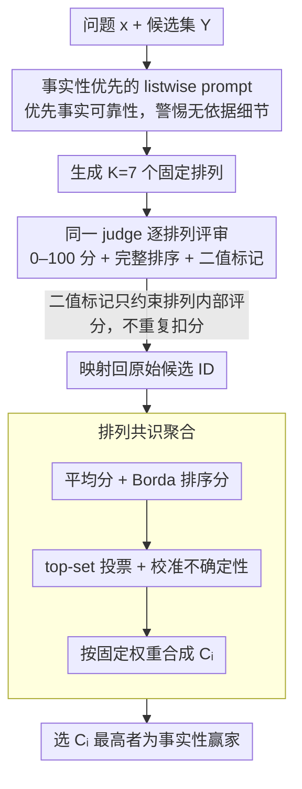

# Permutation-Consensus Listwise Judging for Robust Factuality Evaluation

**会议**: ACL 2026  
**arXiv**: [2603.20562](https://arxiv.org/abs/2603.20562)  
**代码**: 无  
**领域**: LLM评测  
**关键词**: LLM-as-a-Judge、事实性评估、位置偏差、排序鲁棒性、共识聚合

## 一句话总结
PCFJudge 将候选答案顺序视为 listwise 事实性评估中的干扰变量，通过对同一候选集运行 7 种排列并聚合分数、排序、top-set 投票和校准不确定性，在 RewardBench 2 Factuality 上相对单次直接评审提升最高 7 个百分点。

## 研究背景与动机

**领域现状**：LLM-as-a-Judge 已经成为开放式生成评估、best-of-N 选择、奖励模型替代和后训练反馈中的常用组件。很多系统会把多个候选回答交给一个强模型，让它根据偏好、正确性或事实性选出最好的答案。

**现有痛点**：这类评审器并不稳定。已有研究发现，同一个 judge 会受到候选位置、rubric 写法、打分尺度、输出格式等因素影响；在 listwise 场景下，候选答案的展示顺序尤其危险，因为几个答案可能都写得很流畅，但只有其中一两个在事实细节上更可靠。

**核心矛盾**：事实性评估理论上应该对候选顺序不敏感，但实际 LLM judge 往往会把顺序、表述风格和先入为主的注意力偏差混进判断里。这样一来，评估系统看似在选事实可靠的答案，实际可能只是选中了在某个展示顺序下更显眼的答案。

**本文目标**：作者希望在不训练新 judge、不接入检索器、不额外做外部事实验证的前提下，提升 listwise 事实性评审的鲁棒性。具体问题是：如果候选顺序只是 nuisance variation，那么能否像统计估计那样对它做边缘化，从多个排列中提取稳定偏好？

**切入角度**：论文把一次 judge 调用看成一个带噪测量。单次 canonical order 的输出可能偏，但如果同一候选在多种排列下仍然获得高分、高排名和 top 票数，它更可能是真的事实性更好。

**核心 idea**：用同一个 factuality-first listwise prompt 对候选集做多次排列评审，再把每次评审映射回原始候选 ID，并用一个轻量共识分数选出顺序鲁棒的赢家。

## 方法详解

### 整体框架
PCFJudge 的输入是一个用户问题 $x$ 和一组候选回答 $Y=\{y_1,\dots,y_n\}$，输出是事实性最可靠的候选答案。它不改变 judge backbone，也不训练额外模型，而是在推理阶段改变评估协议。

流程可以分成四步。

第一步，构造事实性优先的 listwise prompt。prompt 要求 judge 不按泛泛的 helpfulness 或流畅度排序，而是优先考虑事实可靠性，特别警惕严重事实错误和没有依据的具体细节。

第二步，对同一候选集生成 $K$ 个排列。最终 RewardBench 2 实验中使用 $K=7$，并且用固定排列以保证可复现。

第三步，每个排列都调用同一个 judge。每次调用会为每个候选给出 0 到 100 的分数、完整排序、简短理由，以及若干二值标记，例如是否有重大事实错误、是否有幻觉式具体化、是否体现了恰当的校准不确定性。

第四步，把每次运行的候选结果映射回原始候选 ID，计算跨排列的共识特征，并按固定权重得到最终分数 $C_i$。最终赢家是 $C_i$ 最高的候选；若最高分在容忍阈值内接近，则保留并列。

这个框架的关键不是让模型获得更多知识，而是让同一个 judge 在不同展示顺序下重复表态。只在某个位置上显得更好的答案会被平均掉，而跨顺序稳定更好的答案会被放大。

### 关键设计

**1. 事实性优先的 listwise 评审 prompt：把 judge 的注意力从通用偏好拉回事实可靠性**

RewardBench 2 Factuality 的难点在于多个候选表面都写得可信、流畅，真正的风险藏在 unsupported specificity——那些没有依据却言之凿凿的具体细节里。如果用泛泛的 helpfulness prompt，judge 很容易偏爱写得更长、更自信、格式更漂亮的回答，把流畅当成事实性。PCFJudge 因此把 prompt 明确改写成"事实优先"：每次评审都要求 judge 给出 0–100 数值分、完整排序和简短理由，并同时标记三类二值信号——是否有重大事实错误、是否有幻觉式具体化、是否体现了校准不确定性。

这三类标记的权重并不对称。重大错误和无依据细节是强负面信号，直接压低评分；而校准不确定性只在它代表"合理谨慎"而非"逃避回答"时，才算一个弱正面信号。显式让 judge 去识别这些细节，就是在每一次排列内部先把"把自信当正确"的系统性偏好纠回来。

**2. 排列共识聚合：把候选顺序当作可边缘化的噪声变量，让最终选择只依赖跨排列稳定性**

事实性评估理论上应该对候选展示顺序不敏感，但实际 judge 会把位置、风格和先入为主的注意力偏差混进判断里。PCFJudge 把一次 judge 调用看成一次带噪测量：对同一候选集生成 $K=7$ 个固定排列，每个排列都跑同一个 factuality-first prompt，再把结果映射回原始候选 ID。对候选 $i$ 聚合四个落在 0–100 同尺度上的统计量——平均分 $\bar{s}_i=\frac{1}{K}\sum_r s_i^{(r)}$、Borda 风格排序分 $B_i=\frac{100}{K(n-1)}\sum_r(n-rank_i^{(r)})$、top-set 投票 $v_i=\frac{1}{K}\sum_r \frac{\mathbf{1}[i\in T^{(r)}]}{|T^{(r)}|}$，以及校准不确定性比例 $u_i$，再按固定权重合成最终分数：

$$C_i=0.50\bar{s}_i+0.25B_i+0.20(100v_i)+0.05(100u_i)$$

四项各司其职：平均分保留 judge 的细粒度判断，Borda 分利用完整排序信息，top-set 投票强调"谁经常被选为第一"，小权重的不确定性则给谨慎但事实可靠的回答一点补偿。只在某个位置上显得更好的答案会被平均掉，跨顺序稳定占优的答案被放大——这正是"把顺序噪声边缘化"的直接体现。

**3. 不过度叠加外部惩罚与仲裁层：用同一信号只用一次，保持方法轻量、可解释**

一个自然的诱惑是：既然已经标出了重大错误和幻觉式具体化，何不在最终聚合里再额外扣一次分？作者在开发中发现这会把同一信号重复使用，反而过度惩罚那些谨慎但不完整的回答。因此这些标记只用于约束每个排列内部的评分，不在跨排列聚合里再作为独立惩罚项出现。

更重要的是，开发消融显示更复杂的 robust overlay、panel arbitration、evidence-backed override 未必比朴素共识更好——early 50 例实验里 panel arbitration 只把 79% 提到 81%，evidence-backed override 甚至从 78% 回退到 77%。这组失败结果支撑了一个克制的设计判断：listwise 事实性评审里主要的可修复误差不是"缺一个更会仲裁的 judge"，而是候选顺序这个具体噪声源没被处理，所以方法刻意停在共识层、不再堆叠 meta-judge。

### 损失函数 / 训练策略
本文没有训练损失函数，属于纯推理时方法。唯一的“训练策略”可以理解为评估协议选择：对同一候选集使用固定 $K=7$ 个排列，复用同一个 factuality-first prompt 和同一个 judge backbone，再用固定权重聚合。

作者还给出一个简单理论解释。若每次随机排列下 judge 把真实最佳候选排第一的概率为 $q>1/2$，且不同排列的 top-choice 事件近似独立，那么对 $K$ 次 top-choice 做多数投票时，错误概率可由 Hoeffding 不等式界定为 $\Pr(\sum_r Z_r\le K/2)\le \exp(-2K(q-1/2)^2)$。PCFJudge 比多数投票更丰富，但这个命题说明：只要每个排列都含有弱稳定信号，多排列共识就能压低顺序噪声。

### Pairwise 迁移版本 APOCJudge
JudgeBench 是 pairwise 任务，不适合直接套用 listwise PCFJudge。作者因此设计了 APOCJudge 作为迁移版本：先评估 A/B 和 B/A 两种候选顺序，把顺序一致性作为信号；再引入 keyed judge，要求它先内部解出原问题，再对照两个回答。只有当顺序交换和 keyed judge 支持同一赢家时，方法才接受 override。

这个设计比主方法更保守。论文也强调它只是测试思想边界，不是声称 pairwise 场景能获得同等幅度收益。

## 实验关键数据

### 主实验
主实验使用 RewardBench 2 的 Factuality 子集。每个样本包含 4 个候选回答，正好对应 listwise 事实性选择。由于 API 预算限制，作者没有跑完整 split，而是在每个 backbone 上使用固定 300 例切片，对比单次 canonical order 的 direct judge 与 $K=7$ 的 PCFJudge。

| 模型 | 样本数 | Direct | PCFJudge | 提升 | 改进/回退 |
|------|------:|------:|------:|------:|------:|
| GPT-5.4 | 300 | 84.17 | **89.33** | +5.17 | 30 / 14 |
| Claude Sonnet 4.6 | 300 | 78.00 | **85.00** | +7.00 | 39 / 15 |
| 加权平均 | 600 | 81.09 | **87.17** | +6.08 | 69 / 29 |

这个结果有两点值得注意。第一，提升同时出现在 GPT 和 Claude 两个强 judge backbone 上，说明收益不是某个模型家族的偶然现象。第二，paired improvement/regression 明显不对称：GPT-5.4 是 30 次改进对 14 次回退，Claude 是 39 次改进对 15 次回退，合并后 69 对 29，论文报告合并 sign test 的 $p<10^{-4}$。

Claude 的绝对提升更大，符合“单次 judge 越不稳定，排列共识越有用”的直觉。但 GPT-5.4 直接基线已经很强，仍有 +5.17 点提升，说明顺序噪声并不是弱模型专属问题。

### 消融实验
作者在固定 100 例 GPT-5.4 RewardBench 2 Factuality 开发切片上比较了若干设计。核心结论是：收益主要来自 permutation consensus 本身，而不是更重的仲裁层。

| 配置 | 100例开发切片表现 | 说明 |
|------|------|------|
| Direct judge | 基线 | 单次 canonical order，最容易受候选顺序影响 |
| Robust overlay | 比 direct 明显更好 | 增加了更复杂的外部逻辑，能恢复一部分错误 |
| 简单 permutation-consensus ranker | 最好 | 直接信任多排列共识，比继续堆叠 overlay 更有效 |
| Synthetic anchor ladders | 最差，曾降到约 66% | 人造锚点没有提供稳定独立信号，反而扰乱判断 |
| Panel arbitration / evidence-backed override | 收益小或回退 | 更多 judge 阶段不等于更多可靠信号 |

论文还提到早期 50 例开发实验中，panel arbitration 只从 79% 提到 81%，evidence-backed override 甚至从 78% 回退到 77%。这组失败实验很有价值：它说明事实性评审里的主要可修复误差不是“缺一个更会仲裁的 judge”，而是候选顺序这个具体噪声源没有被处理。

### JudgeBench 迁移实验
JudgeBench 是客观 pairwise 评估，来源包括 MMLU-Pro、数学、代码等难题。作者在 public gpt 和 claude splits 上各取固定 100 对响应，按源任务桶做 macro-average，因此百分数不必是 1/N 的整数倍。

| 模型 | 样本数 | Direct | APOCJudge | 提升 |
|------|------:|------:|------:|------:|
| Claude Sonnet 4.6 | 100 | 79.09 | **82.33** | +3.24 |
| GPT-5.4 | 100 | 76.21 | **78.91** | +2.70 |

迁移结果为正但小于 RewardBench 2。这个差距反而强化了论文论点：PCFJudge 最适合“多个候选同时竞争、事实性差异微妙、顺序敏感性强”的 listwise 选择；在 pairwise objective correctness 中，许多错误来自解题能力或内部知识，而不只是展示顺序。

### 关键发现
- 候选顺序确实是 listwise factuality evaluation 的重要噪声源，单次直接评审会把一部分 order artifact 当作事实性差异。
- 多排列共识在两个强 proprietary backbones 上都稳定提升，说明它不是弱 judge 的补丁，而是对评估协议本身的改进。
- 主要收益来自简单的排列边缘化，而不是更重的 meta-judge、panel 或证据覆盖逻辑。
- PCFJudge 最常修复的案例是 unsupported specificity：直接 judge 容易偏爱写得更具体、更自信的回答，共识聚合更倾向于选择跨排列都稳定占优的谨慎回答。
- 当候选之间本来就是近似同质或都缺乏事实支撑时，多排列提供的新信号有限，因此收益集中在“原 judge 顺序不稳定且候选事实风险不同”的样本上。

## 亮点与洞察
- **把候选顺序当作可边缘化噪声**是本文最清晰的贡献。很多 LLM judge 论文会试图换更强模型或加 verifier，但本文提醒我们：评估协议里的随机展示因素本身就能制造大量错误，先把这个变量平均掉就能显著提升鲁棒性。
- **分数、排序、top-set 和不确定性四类信号的组合很实用**。单用平均分可能保留尺度漂移，单用 top vote 又太粗；Borda rank 和 top-set vote 补充了相对排序信息，小权重 uncertainty 则让“谨慎但正确”的回答不被过度惩罚。
- **消融中的失败路径很有启发**。论文没有把方法包装成越来越复杂的 judge pipeline，而是承认 anchor、panel、override 不一定增加独立信息；这对实际构建评估系统很重要，因为更多调用往往意味着更高成本和更多不可控偏差。
- **方法与 best-of-N 生产场景贴合**。现实系统经常一次生成多个候选再让 judge 选一个，如果评审器对候选顺序敏感，最终产品输出也会随随机排列漂移。PCFJudge 正好作用于这个决策点。

## 局限与展望
- 主实验是固定 300 例切片，而不是完整 RewardBench 2 Factuality，全量数据和多随机切片能更好估计方差。
- 方法需要 $K=7$ 次 judge 调用，API 成本和延迟约为 direct judging 的 7 倍，在大规模自动评估或在线 reranking 中需要权衡。
- PCFJudge 只处理 presentation-order instability，不能解决 benchmark 标注噪声、隐藏污染、judge 缺乏外部知识或事实验证能力不足的问题。
- 目前聚合权重是开发得到的启发式设置，虽然简单有效，但不同任务、候选数量和 judge backbone 可能需要重新调参。
- 小权重奖励 calibrated uncertainty 有双刃剑效应：它可以鼓励谨慎，但若部署不当，也可能让 judge 过度偏爱保守、短促或信息量不足的回答。

## 相关工作与启发
- **vs G-Eval / PandaLM / MT-Bench**: 这些工作证明 LLM 可以作为通用评审器或 pairwise selector，PCFJudge 关注的是在固定强评审器上如何减少推理时顺序偏差。
- **vs RewardBench / RewardBench 2**: RewardBench 系列提供了评估 reward model 和 judge 的困难数据，本文把 RewardBench 2 Factuality 作为最匹配的 listwise factuality 场景，并显示评估协议本身会显著影响成绩。
- **vs JudgeBench**: JudgeBench 更偏客观 pairwise correctness，本文的 APOCJudge 只有较小迁移收益，说明顺序鲁棒性是有适用边界的，不应被理解为通用 verifier。
- **vs position bias 研究**: 既有工作主要诊断 pairwise/listwise position bias，PCFJudge 往前走了一步，把诊断转化为一个无需训练的测试时修复方案。
- **vs PoLL / 多 judge 集成**: PoLL 通过跨模型 jury 降低单模型偏差，PCFJudge 通过跨候选排列降低展示顺序偏差。二者可以互补，但处理的是不同噪声源。

## 评分
- 新颖性: ⭐⭐⭐⭐ 把排列边缘化用于 listwise 事实性 judge 很直接但抓住了关键痛点，贡献胜在问题定义和实用协议。
- 实验充分度: ⭐⭐⭐⭐ RewardBench 2 上有双 backbone、paired sign test、迁移实验和开发消融，但主实验仍是固定切片而非全量 benchmark。
- 写作质量: ⭐⭐⭐⭐ 论文逻辑清楚，方法公式和边界条件解释到位，也坦诚记录了失败 ablation；不足是部分模型版本和实验切片设置依赖 API 预算，外部复现空间有限。
- 价值: ⭐⭐⭐⭐⭐ 对任何使用 LLM judge 做 best-of-N、reranking 或事实性筛选的系统都有直接启发，成本可预期，工程落地门槛低。

<!-- RELATED:START -->

## 相关论文

- [\[ACL 2025\] Chinese SimpleQA: A Chinese Factuality Evaluation for Large Language Models](../../ACL2025/llm_safety/chinese_simpleqa_a_chinese_factuality_evaluation_for_large_language_models.md)
- [\[ACL 2026\] FAITH: Factuality Alignment through Integrating Trustworthiness and Honestness](faith_factuality_alignment_through_integrating_trustworthiness_and_honestness.md)
- [\[ACL 2026\] PIArena: A Platform for Prompt Injection Evaluation](piarena_a_platform_for_prompt_injection_evaluation.md)
- [\[ACL 2026\] ACIArena: Toward Unified Evaluation for Agent Cascading Injection](aciarena_toward_unified_evaluation_for_agent_cascading_injection.md)
- [\[ACL 2026\] Subject-level Inference for Realistic Text Anonymization Evaluation](subject-level_inference_for_realistic_text_anonymization_evaluation.md)

<!-- RELATED:END -->
