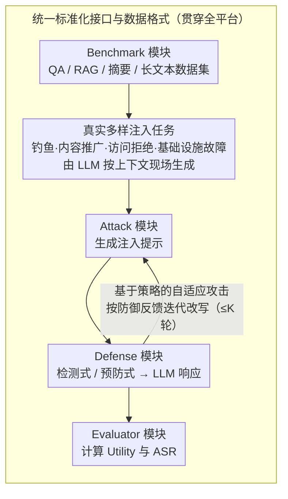

# PIArena: A Platform for Prompt Injection Evaluation

**会议**: ACL 2026  
**arXiv**: [2604.08499](https://arxiv.org/abs/2604.08499)  
**代码**: [https://github.com/sleeepeer/PIArena](https://github.com/sleeepeer/PIArena)  
**领域**: LLM评测  
**关键词**: 提示注入攻击, 防御评估平台, 自适应攻击, LLM安全, 基准统一

## 一句话总结
本文提出 PIArena，一个统一且可扩展的提示注入（Prompt Injection）评估平台，集成了多种 SOTA 攻击和防御方法，支持即插即用评估，并设计了基于策略的自适应攻击方法，系统性地揭示了现有防御在泛化性、自适应攻击和任务对齐场景下的关键局限。

## 研究背景与动机

**领域现状**：提示注入攻击被 OWASP 列为 LLM 应用的第一大安全风险。攻击者在上下文中注入恶意指令（如网页、文档），操纵后端 LLM 执行攻击者期望的任务而非用户的目标任务。现有研究已提出多种攻击（启发式/优化式）和防御（检测式/预防式）方法。

**现有痛点**：(1) 缺少统一平台——不同攻击、防御和基准各自有不同的实现和配置，难以公平比较；(2) 评估不够全面——许多防御只在特定基准和攻击下评估，后来被证明在其他设置下效果有限；(3) 攻击过于静态——所有现有基准使用固定模板攻击，不反映真实场景中攻击者会根据防御反馈迭代优化的情况。

**核心矛盾**：缺乏统一评估生态导致防御方法的真实鲁棒性被高估——在"有利"的评估条件下报告的高性能无法推广到更多样化的任务和自适应攻击场景。

**本文目标**：(1) 构建统一平台实现攻击/防御/基准的即插即用评估；(2) 设计自适应攻击方法测试防御的真正鲁棒性；(3) 全面揭示现有防御的局限。

**切入角度**：将评估从"单个实验"升级为"平台生态"，提供标准化数据格式、统一接口和可扩展架构，降低研究者集成和比较的门槛。

**核心 idea**：统一平台 + 自适应攻击 + 多样化真实注入任务 = 对防御鲁棒性的全面压力测试。

## 方法详解

### 整体框架
PIArena 由四个模块组成：(1) Benchmark 模块提供多样化数据集（QA、RAG、摘要、长文本等）；(2) Attack 模块集成多种攻击方法并生成注入提示；(3) Defense 模块集成检测式和预防式防御；(4) Evaluator 模块计算 Utility（任务性能）和 ASR（攻击成功率）。所有模块通过统一 API 交互，支持独立和组合评估。

### 关键设计

**1. 统一标准化接口与数据格式：让攻击、防御和基准能即插即用地组合**

现有提示注入研究最大的工程障碍是各家基准格式不统一、接口各异，导致同一个防御换个基准就要重写一遍、不同方法之间也无法公平比较。PIArena 先把数据样本结构固定下来——target_inst、context、injected_task、target_task_answer、injected_task_answer、category——再约定攻击接口"输入样本、输出注入提示"，防御接口则统一输出 LLM 响应：检测式防御先判断上下文是否恶意，再决定拦截或放行；预防式防御直接生成安全响应。

接口收口之后，评估器就能对所有防御算同一套指标（Utility 与 ASR），新方法因此可以"一次实现、多处评估"。这一层看似只是工程，却是后面"自适应攻击"和"多样注入任务"能在同一坐标系里横向压力测试的前提。

**2. 基于策略的自适应攻击：在黑盒下根据防御反馈迭代改写注入提示，逼出防御的真实弱点**

所有现有基准都用固定模板攻击，于是防御在"有利"条件下报出的高鲁棒性可能被严重高估——真实攻击者会看防御反应再调整。PIArena 的自适应攻击分两阶段：阶段 1 候选生成，用 10 种重写策略（伪装成 "Author's Note"、"System Update" 等）把基础注入提示改写成多个候选；阶段 2 反馈引导优化，按防御反应分三种场景迭代——被检测就增加隐蔽性、被忽略就增加命令性、其它情况做通用优化，最多 $K$ 轮。

关键在于它用"策略语义改写"而非梯度优化来实现冷启动："System Update" 这类伪装本身就是一个语义上合理的温启动点，比随机扰动高效得多，又天然保证候选多样性。效果很直接：在 SQuAD 上对 PISanitizer，静态 Combined 攻击 ASR 只有 0.01，换成 Strategy 攻击立刻飙到 0.85。

**3. 真实多样的注入任务设计：把攻击目标从玩具式的"Print Hacked!"换成贴近现实的滥用场景**

现有基准常用脱离上下文的简单注入任务，但真实攻击者会精心设计与上下文融合的内容，二者的防御难度完全不同。PIArena 设计了四类贴近现实的注入任务：钓鱼注入（塞入恶意链接）、内容推广（嵌入广告或产品推荐）、访问拒绝（伪装成 API 额度耗尽或账号过期）、基础设施故障（伪装成内存溢出、数据库超时等系统错误）。

每个注入任务都由 LLM 根据目标上下文现场生成，以保证语境相关。正是这种贴合上下文的设计，才暴露出论文最尖锐的发现：当注入任务与目标任务同类型（比如都是 QA）时，攻击退化为"虚假信息"问题，区分合法指令与恶意注入在原理上就是模糊的，现有防御几乎无从下手。

### 损失函数 / 训练策略
PIArena 本身不涉及训练。自适应攻击使用 LLM 作为重写引擎，无梯度优化，纯黑盒操作。

## 实验关键数据

### 主实验（SQuAD v2，GPT-4o 后端）

| 防御方法 | 类型 | 无攻击Utility | Combined ASR | Strategy ASR |
|---------|------|-------------|-------------|-------------|
| No Defense | - | 1.0 | 0.97 | 1.00 |
| PISanitizer | 预防 | 0.99 | 0.01 | 0.85 |
| SecAlign++ | 预防 | 0.84 | 0.01 | 0.09 |
| DataFilter | 预防 | 0.99 | 0.24 | 0.93 |
| PromptArmor | 预防 | 1.0 | 0.60 | 1.00 |
| PIGuard | 检测 | 1.0 | 0.0 | 0.71 |
| Attn.Tracker | 检测 | 0.61 | 0.0 | 0.0 |

### 消融实验（不同攻击类型对比）

| 攻击类型 | 特点 | ASR (No Defense) | ASR (PISanitizer) |
|---------|------|-----------------|------------------|
| Direct | 直接注入指令 | 0.86 | 0.04 |
| Combined | 混合多种攻击 | 0.97 | 0.01 |
| Strategy | 自适应策略攻击 | 1.00 | 0.85 |

### 关键发现
- **泛化性差**：PISanitizer 在 SQuAD 上表现优秀（ASR 0.01），但在 Strategy 攻击下 ASR 飙升至 0.85，说明对自适应攻击极度脆弱
- **闭源模型也不安全**：GPT-5、Claude-Sonnet-4.5、Gemini-3-Pro 在提示注入下仍表现出高 ASR
- **任务对齐场景是根本挑战**：当注入任务与目标任务类型相同时（如都是QA），攻击退化为"虚假信息"问题，现有防御几乎无法处理
- Attn.Tracker 检测防御虽然对所有攻击 ASR=0，但其 Utility 严重受损（仅 0.61），存在大量误报

## 亮点与洞察
- **"平台思维"而非"方法思维"**是本文最大的贡献：不是提出一个新防御，而是构建生态让所有防御可以被公平、全面地评估。这种基础设施建设对领域发展至关重要
- 自适应攻击的"策略语义改写"方法巧妙地解决了黑盒优化的冷启动问题——将注入提示改写为看似合理的上下文（如"编辑说明""系统更新"），远比随机扰动高效
- "任务对齐场景不可防御"这一发现具有深远意义——当注入任务与目标任务同类型时，区分合法指令和恶意注入在原理上就是模糊的

## 局限与展望
- 自适应攻击仍需 LLM 作为改写引擎，在规模化评估中有成本考量
- 当前基准主要覆盖文本任务，多模态场景（图像中嵌入注入提示）未涉及
- 任务对齐场景下的防御被指出为根本困难，但未提出解决思路
- 评估主要基于 GPT-4o 后端，不同后端 LLM 的防御效果差异需要更多探索

## 相关工作与启发
- **vs BIPIA (Yi et al. 2025)**: BIPIA 提供基准数据集并评估防御，但使用静态攻击且无统一接口；PIArena 支持自适应攻击和即插即用工具箱
- **vs AgentDojo (Debenedetti et al. 2024)**: AgentDojo 针对 Agent 场景，配置复杂且不支持防御评估；PIArena 覆盖通用 LLM 任务，接口简洁

## 评分
- 新颖性: ⭐⭐⭐⭐ 平台本身的贡献模式有创新，自适应攻击设计巧妙
- 实验充分度: ⭐⭐⭐⭐⭐ 7种防御×多种攻击×多个基准×闭源模型评估，非常全面
- 写作质量: ⭐⭐⭐⭐ 结构清晰，威胁模型定义严谨，但表格过多导致正文略密集

<!-- RELATED:START -->

## 相关论文

- [\[ACL 2026\] Robustness via Referencing: Defending against Prompt Injection Attacks by Referencing the Executed Instruction](robustness_via_referencing_defending_against_prompt_injection_attacks_by_referen.md)
- [\[ACL 2026\] ACIArena: Toward Unified Evaluation for Agent Cascading Injection](aciarena_toward_unified_evaluation_for_agent_cascading_injection.md)
- [\[ACL 2026\] MUSE: A Run-Centric Platform for Multimodal Unified Safety Evaluation of Large Language Models](muse_a_run-centric_platform_for_multimodal_unified_safety_evaluation_of_large_la.md)
- [\[ACL 2026\] Know Thy Enemy: Securing LLMs Against Prompt Injection via Diverse Data Synthesis and Instruction-Level Chain-of-Thought Learning](know_thy_enemy_securing_llms_against_prompt_injection_via_diverse_data_synthesis.md)
- [\[ACL 2025\] Can Indirect Prompt Injection Attacks Be Detected and Removed?](../../ACL2025/llm_safety/indirect_prompt_injection_detection.md)

<!-- RELATED:END -->
