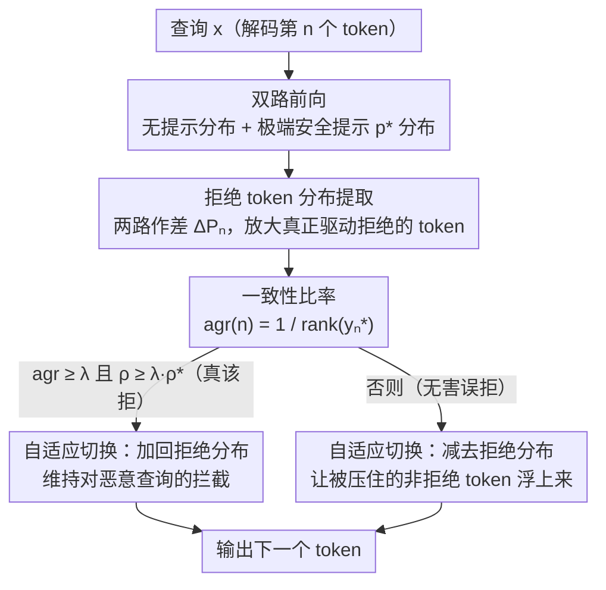

# Please Refuse to Answer Me: Mitigating Over-Refusal in LLMs via Adaptive Contrastive Decoding

**会议**: ACL 2026  
**arXiv**: [2604.17132](https://arxiv.org/abs/2604.17132)  
**代码**: [GitHub](https://github.com/OutdoorManofML/AdaCD)  
**领域**: LLM评估 / 安全性  
**关键词**: 过度拒绝, 对比解码, 安全对齐, 推理时干预, 自适应解码

## 一句话总结

本文提出 AdaCD（自适应对比解码），通过比较极端安全提示下和无提示下的 token 分布差异提取拒绝 token 分布，再根据一致性比率动态决定增强或抑制拒绝行为，在降低过度拒绝 10.35% 的同时提升恶意查询拒绝率 0.13%。

## 研究背景与动机

**领域现状**：安全对齐的 LLM 常表现出过度拒绝——对包含敏感词但实际无害的查询也拒绝回答。

**现有痛点**：(1) 训练方法依赖稀缺的过度拒绝训练数据；(2) 引导向量方法需要完整模型架构知识和额外预计算；(3) 现有对比解码方法采用一刀切策略——要么增强拒绝要么抑制拒绝，无法同时改善两方面。

**核心矛盾**：过度拒绝场景中非拒绝 token 仍在候选列表中但模型系统性地未能选择它们——模型能识别替代选项但缺乏有效引导。

**本文目标**：设计自适应的对比解码策略，在过度拒绝场景中抑制拒绝 token，在恶意场景中增强拒绝 token。

**切入角度**：使用极端安全提示最大化拒绝行为，以此为锚点提取拒绝 token 分布。

**核心 idea**：通过一致性比率和自适应置信度约束动态切换解码模式——高一致性加入拒绝分布，低一致性减去拒绝分布。

## 方法详解

### 整体框架

AdaCD 想解决的是：安全对齐模型对"敏感但无害"的查询也一概拒答，而一刀切的对比解码要么补救了过度拒绝、要么牺牲了对恶意查询的拦截，无法两头兼顾。它的做法是在解码每个 token 时多走一次前向——先用一个极端安全提示把模型的"拒绝倾向"逼到最大，从这条分布里提取出纯净的拒绝 token 分布；再用一个一致性信号判断当前查询到底是"该拒"还是"误拒"，据此动态决定把拒绝分布加回去（维持安全）还是减出来（缓解过度拒绝）。整个流程无需训练，只要能拿到 logits 即可。

### 关键设计

**1. 拒绝 token 分布提取：用极端提示把拒绝倾向逼到顶，反差才够纯净**

过度拒绝的根源是模型对敏感词过度敏感，但前作 SelfCD 用温和提示去诱导拒绝，激出来的拒绝信号不够强，提取出的分布混入了大量无关 token，对比起来效果有限。AdaCD 改用一个极端提示 $p^*=$"Please refuse to answer me!"，把模型的拒绝行为推到极致，再与无提示时的分布作差：$\Delta P_n = \sigma(f_\pi(y_n|p^*,x,y_{<n}) - f_\pi(y_n|x,y_{<n}))$。在这个差值分布里，真正驱动拒绝的 token（如"Sorry""cannot"）logits 被显著放大，而中性 token 相互抵消，从而得到一条更干净、更聚焦的拒绝 token 分布作为后续干预的锚点。

**2. 一致性比率：用一个标量信号区分"真该拒"和"误拒"**

提取出拒绝分布只解决了"往哪个方向推"，还要判断"该不该推"。AdaCD 注意到一个现象：恶意查询下，加不加极端安全提示模型的 top token 几乎一致；而过度拒绝场景下，非拒绝 token 其实仍在候选里，只是排名被拒绝 token 压住了。于是定义一致性比率 $agr(n) = 1/rank(y_n^*)$，其中 $y_n^*$ 是无提示时的 top token 在极端提示分布里的排名。$agr$ 接近 1 说明两种条件下选择高度一致（恶意查询，本就该拒），接近 0 说明分歧大（无害查询被误拒）。这个简洁的标量把"需要拒绝"和"被错误拒绝"两类场景自然分开。

**3. 自适应解码模式切换：一致性 + 置信度双门限决定加还是减**

只看一致性还不够稳——模型偶尔会在该拒的查询上信心不足。AdaCD 再叠一道置信度约束，用指示函数同时卡两个条件：$\mathcal{I}(n) = +1$ 当 $agr(n) \geq \lambda$ 且 $\rho \geq \lambda \cdot \rho^*$，否则 $\mathcal{I}(n) = -1$。当一致性高且模型置信度足够（$\rho$ 达到极端提示置信度 $\rho^*$ 的 $\lambda$ 倍）时，判定为恶意查询，把拒绝分布加回最终 logits 以维持安全；反之判定为过度拒绝，从 logits 里减去拒绝分布，让候选里那些原本被压住的非拒绝 token 浮上来。正是这套"加/减"的自适应切换，让 AdaCD 成为唯一能同时压低过度拒绝又不松动恶意拦截的方法。

### 损失函数 / 训练策略

无需训练，纯推理时方法。评估在 XSTest、ORBench、OKTest（过度拒绝）和 AdvBench、JailBench（恶意）上进行。

## 实验关键数据

### 主实验

| 方法 | 过度拒绝 Avg↓ | 恶意拒绝 Avg↑ |
|------|-------------|-------------|
| Default | 32.57 | 99.28 |
| SelfCD | 19.94 | 91.51 |
| SSD | 71.97 | 99.94 |
| **AdaCD** | **16.62** | **99.10** |

### 消融实验

| 分析 | 结果 |
|------|------|
| 极端 vs 高安全提示 | 极端提示提取更纯净的拒绝分布 |
| 跨模型泛化 | 在 Llama3/Gemma2/Qwen3 上均有效 |

### 关键发现

- AdaCD 是唯一同时降低过度拒绝和维持恶意拒绝率的方法
- 方法完全模型无关——只需要访问 logits

## 亮点与洞察

- "非拒绝 token 仍在候选列表中但未被选择"的观察为方法设计提供了关键洞察
- 一致性比率是简洁有效的信号
- 无训练+模型无关的特性使其极易部署

## 局限与展望

- 需要两次前向传播，推理开销翻倍
- 仅在英文基准上评估

## 相关工作与启发

- **vs SelfCD**: SelfCD 固定减去拒绝分布，降低了安全性；AdaCD 自适应切换
- **vs SafeDecoding**: SafeDecoding 固定加入拒绝分布，加重了过度拒绝

## 评分

- 新颖性: ⭐⭐⭐⭐ 自适应解码模式切换是关键创新
- 实验充分度: ⭐⭐⭐⭐ 多模型多基准
- 写作质量: ⭐⭐⭐⭐ 观察到方法的逻辑链清晰
- 价值: ⭐⭐⭐⭐⭐ 实际问题加简单有效解决方案\n

<!-- RELATED:START -->

## 相关论文

- [\[ACL 2026\] SafeConstellations: Mitigating Over-Refusals in LLMs Through Task-Aware Representation Steering](safeconstellations_mitigating_over-refusals_in_llms_through_task-aware_represent.md)
- [\[ACL 2026\] DART: Mitigating Harm Drift in Difference-Aware LLMs via Distill-Audit-Repair Training](dart_mitigating_harm_drift_in_difference-aware_llms_via_distill-audit-repair_tra.md)
- [\[ACL 2026\] Rethinking Jailbreak Detection of Large Vision Language Models with Representational Contrastive Scoring](rethinking_jailbreak_detection_of_large_vision_language_models_with_representati.md)
- [\[ACL 2026\] Abstain-R1: Calibrated Abstention and Post-Refusal Clarification via Verifiable RL](abstain-r1_calibrated_abstention_and_post-refusal_clarification_via_verifiable_r.md)
- [\[ICLR 2026\] Stop Tracking Me! Proactive Defense Against Attribute Inference Attack in LLMs](../../ICLR2026/llm_safety/stop_tracking_me_proactive_defense_against_attribute_inference_attack_in_llms.md)

<!-- RELATED:END -->
