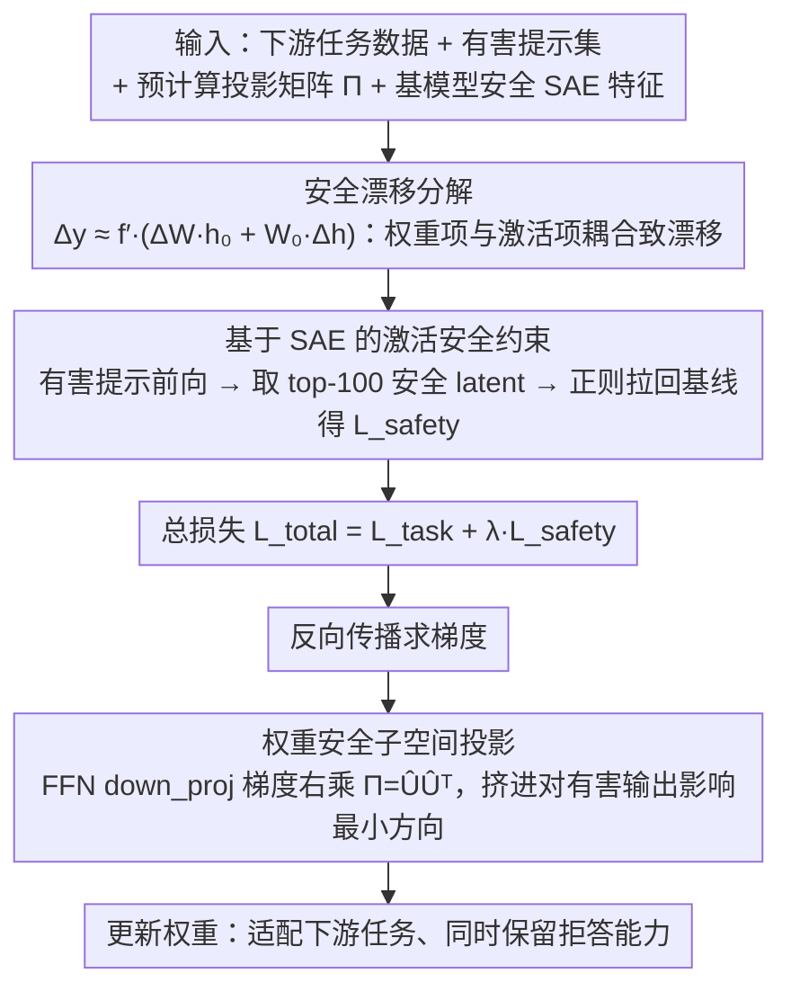

# Preventing Safety Drift in Large Language Models via Coupled Weight and Activation Constraints

**会议**: ACL 2026  
**arXiv**: [2604.12384](https://arxiv.org/abs/2604.12384)  
**代码**: 无公开代码  
**领域**: 模型压缩 / LLM安全  
**关键词**: 安全漂移, 有害微调, 稀疏自编码器, 权重子空间, 激活约束

## 一句话总结

本文提出 CWAC，在微调时同时约束权重更新方向和安全关键激活特征，从理论和实验上说明单独约束权重或激活都不足以防止 LLM 安全漂移。

## 研究背景与动机

**领域现状**：安全对齐模型在下游微调中很脆弱，即使微调数据看起来是情感分类、新闻分类、数学推理这类良性任务，也可能破坏原本的拒答能力。已有防御包括冻结安全层、加入安全样本、限制权重漂移、激活 steering 或 post-finetuning 修复等。

**现有痛点**：许多方法只盯住一个层面：要么限制参数更新，让模型不要远离原始权重；要么约束激活，让有害输入上的内部表示保持安全。论文指出这两类单点约束都有漏洞，模型可以通过未被约束的另一侧产生旁路。

**核心矛盾**：安全行为来自权重和激活的耦合结果。权重没怎么变，不代表激活不会被微调后的任务分布牵走；激活在参考样本上没怎么变，也不代表权重不会在未见有害输入上产生危险输出。

**本文目标**：构建一种微调期防御机制，在保持下游任务准确率的同时，尽量保留原模型对有害提示的拒答能力，并在多模型、多任务和含有害样本混入的场景下保持稳健。

**切入角度**：作者先用一阶近似把层输出漂移拆成权重漂移项和激活漂移项，再据此设计“权重安全子空间 + 激活安全约束”的双重保护。

**核心 idea**：将权重梯度投影到不影响有害提示拒答输出的安全子空间，同时用 SAE 锁定拒答相关的稀疏激活特征，让微调只能在不破坏安全表征的区域内适配任务。

## 方法详解

### 整体框架

CWAC 的输入包括下游任务数据、一个有害提示集合、预先计算好的各层权重投影矩阵，以及基模型在有害提示上的安全关键 SAE 特征。微调时，模型一边最小化任务损失，一边对有害提示重新前向并提取安全特征，将当前安全特征拉回基模型特征；同时，对特定 FFN 输出投影层的梯度做右乘投影，使权重更新落在安全子空间内。

### 关键设计

**1. 安全漂移分解：把"为什么单约束会漏防"从经验现象变成可分析的两项误差**

很多防御只盯权重或只盯激活，论文要先说清楚这为什么不够。它对某层输出 $y=f(Wh)$ 做一阶近似，把微调后的输出漂移拆成两项：$\Delta y\approx f'(W_0h_0)\odot(W_0\Delta h+\Delta W h_0)$。其中 $\Delta W h_0$ 是权重变化造成的漂移，$W_0\Delta h$ 是激活变化造成的漂移。这个分解直接暴露了单点约束的漏洞——只压住 $\Delta W$，激活仍能被微调后的任务分布牵走；只压住参考样本上的 $\Delta h$，权重照样能在未见的有害输入上产生危险输出。两项耦合才共同决定安全行为，所以必须同时管住，这也成了 CWAC 双重约束的理论依据。

**2. 基于 SAE 的激活安全约束：只锁住拒答相关的稀疏维度，不动整条激活**

要在微调中保住激活侧的安全表征，但直接约束整条激活向量会把下游任务学习也一并锁死。CWAC 改用稀疏自编码器来精准定位：先训练一个 TopK Sparse Autoencoder，把残差流激活分解成稀疏可解释特征（SAE 语料约 1 亿 token，30% 来自 OpenWebText2，70% 来自基模型正确拒答的有害提示）。微调前先记录基模型在有害提示上的安全关键特征 $z^{baseline}$，微调时加入正则把当前特征拉回基线：

$$L_{safety}=\frac{1}{B}\sum_b\|z_b^{current}-z_b^{baseline}\|^2$$

关键在于这一项只约束 top safety-critical latents（默认 top 100），而非整条激活——把"保安全"压缩到少数拒答相关维度上，让任务学习仍能在其余维度自由适配，从而把安全保持和任务适配尽量解耦。

**3. 权重安全子空间投影：把梯度更新挤进对有害提示输出影响最小的方向**

激活约束管住了参考样本，权重侧也得堵上，否则权重能在未见输入上单独造成漂移。CWAC 对每个 FFN output projection 层收集基模型处理有害提示时的输入矩阵 $X_l$，目标是让更新满足 $\Delta W_lX_l\approx0$，即权重的改变不要落在会改动有害提示安全输出的方向上。直接对 $X_l$ 操作代价太高，于是改算协方差 $C_l=X_lX_l^T$，做 SVD 后保留小特征值对应的方向构成 $\hat U_l$，定义投影矩阵 $\Pi_l=\hat U_l\hat U_l^T$，微调时把梯度更新右乘投影：$\Delta W_l\leftarrow\Delta W_l\Pi_l$。小特征值方向恰是对有害提示安全输出影响最小的子空间，把更新限制在这里既保留了下游任务的学习空间，又最大限度避免破坏拒答行为。选 FFN down_proj 做投影也有讲究——它是 FFN 写回 residual stream 的瓶颈，比干预 gate/up projection 更直接，也比全层投影更省。

### 损失函数 / 训练策略

总目标为 $L_{total}=L_{task}+\lambda L_{safety}$，并在梯度更新前对 FFN down_proj 的梯度做安全子空间投影。默认实验使用全参数微调，AdamW，3 个 epoch，batch size 为 1，最大序列长度 512，学习率 $2\times10^{-5}$，每个良性任务采样 5,000 条数据。激活约束保留 top 100 安全关键 latent，$\lambda=0.5$。离线成本包括 SAE 训练约 6.5 小时、Llama-2-7B 上 SVD 预计算约 18 分钟；微调每 epoch 约 44-46 分钟，相比标准 SFT 的 42 分钟增加不到 10% 开销。

## 实验关键数据

### 主实验

**SST-2 / AGNEWS / GSM8K 平均性能：FA 越高越好，HS 越低越安全**

| 模型 | 方法 | 平均 FA↑ | 平均 HS↓ |
|------|------|----------|----------|
| Llama-2-7B | SFT | 85.04 | 52.45 |
| Llama-2-7B | ASFT | 78.12 | 18.88 |
| Llama-2-7B | CWAC | 85.12 | 10.81 |
| Llama-3-8B | SFT | 87.16 | 66.03 |
| Llama-3-8B | ASFT | 73.75 | 17.64 |
| Llama-3-8B | CWAC | 87.78 | 9.77 |
| Mistral-7B | SFT | 85.75 | 64.45 |
| Mistral-7B | ASFT | 74.28 | 33.70 |
| Mistral-7B | CWAC | 85.61 | 24.22 |
| Gemma-2-9B | SFT | 90.74 | 42.23 |
| Gemma-2-9B | ASFT | 86.43 | 29.49 |
| Gemma-2-9B | CWAC | 91.59 | 10.05 |

**PubMedQA 与 AlpacaEval 泛化实验**

| 模型 | 方法 | FA↑ | HS↓ | AE↑ |
|------|------|-----|-----|-----|
| Llama-2-7B | SFT | 93.81 | 46.75 | 34.51 |
| Llama-2-7B | CWAC | 94.52 | 7.24 | 34.37 |
| Llama-3-8B | SFT | 95.24 | 53.10 | 38.07 |
| Llama-3-8B | CWAC | 95.52 | 8.65 | 36.75 |
| Mistral-7B | SFT | 64.53 | 60.72 | 28.63 |
| Mistral-7B | CWAC | 90.72 | 15.39 | 30.64 |
| Gemma-2-9B | SFT | 93.45 | 48.97 | 42.53 |
| Gemma-2-9B | CWAC | 95.20 | 12.55 | 43.57 |

### 消融实验

**SST-2 中不同有害样本混入比例下的鲁棒性，Llama-2-7B**

| 方法 | p=0.05 HS↓ | p=0.1 HS↓ | p=0.2 HS↓ | p=0.5 HS↓ | 平均 HS↓ | 平均 FA↑ |
|------|------------|-----------|-----------|-----------|----------|----------|
| SFT | 72.70 | 78.92 | 74.90 | 82.02 | 73.17 | 94.07 |
| ASFT | 38.50 | 39.90 | 43.60 | 45.82 | 38.22 | 93.22 |
| CWAC | 10.50 | 20.03 | 22.57 | 30.78 | 18.73 | 94.35 |

**权重约束与激活约束的组件消融，平均结果**

| 模型 | 方法 | 平均 FA↑ | 平均 HS↓ |
|------|------|----------|----------|
| Llama-2-7B | Weight-only | 80.11 | 17.82 |
| Llama-2-7B | Activation-only | 82.91 | 19.57 |
| Llama-2-7B | CWAC | 84.39 | 12.75 |
| Llama-3-8B | Weight-only | 81.04 | 17.11 |
| Llama-3-8B | Activation-only | 80.45 | 19.02 |
| Llama-3-8B | CWAC | 85.89 | 10.89 |
| Gemma-2-9B | Weight-only | 82.79 | 17.01 |
| Gemma-2-9B | Activation-only | 82.51 | 19.97 |
| Gemma-2-9B | CWAC | 87.67 | 10.07 |

### 关键发现
- CWAC 在四个 7B-9B 模型上几乎都能保持或提升下游 FA，同时显著降低 HS；最明显的是 Llama-3-8B，平均 HS 从 SFT 的 66.03 降到 9.77。
- 对比 ASFT、SafeInstr、SPPFT 等防御，CWAC 的优势不是单纯更安全，而是在安全和任务性能之间更均衡。
- 当有害样本比例升到 0.5 时，CWAC 的 HS 为 30.78，仍低于 ASFT 的 45.82，并保持 94.06 左右的 FA。
- 组件消融显示 weight-only 与 activation-only 都有效，但全量 CWAC 才能稳定达到最低 HS，支持论文“耦合约束必要”的核心论点。

## 亮点与洞察
- 论文最有价值的部分是安全漂移分解：它解释了为什么“权重保持”和“激活保持”各自都会漏防，也让 CWAC 不只是工程组合。
- SAE 约束只锁定安全关键 latent，而不是整条激活向量，这个选择很关键；否则安全正则很可能把下游任务学习也锁死。
- 选择 FFN down_proj 做投影也很合理，因为它是 FFN 写回 residual stream 的瓶颈，比干预 gate/up projection 更直接，也比全层投影更省。
- CWAC 的形式很适合与 PEFT 结合：虽然论文默认做全参微调，但“投影更新 + 激活正则”的思想可以迁移到 LoRA 子空间或 adapter 更新上。

## 局限与展望
- 方法需要白盒访问权重、梯度和中间激活，因此无法直接用于闭源 API 模型。
- 激活约束依赖 SAE 质量，若 SAE 重构差或安全特征不可解释，top latent 选择会影响保护效果。
- 实验主要覆盖 7B-9B instruction-tuned 模型，尚未验证更大模型、MoE 模型或不同对齐流程下的稳定性。
- 当前安全评估以显式有害提示和拒答能力为主，对间接越狱、隐蔽违规、代理工具链中的安全漂移覆盖不足。

## 相关工作与启发
- **vs ASFT**: ASFT 通过安全方向锚定限制微调漂移，本文进一步加入激活级 SAE 正则，能覆盖权重约束无法处理的激活旁路。
- **vs SPPFT / 安全层冻结**: 冻结安全层简单但可能损失任务适配，CWAC 允许更新，只是把更新投影到对安全提示影响小的方向。
- **vs activation steering**: 许多 steering 方法在推理时修改激活，CWAC 则在训练时用激活正则保持拒答特征，更适合需要微调部署的场景。
- **启发**: 如果把隐私、诚实性、版权合规等能力也映射成可解释 SAE 特征，类似的“权重子空间 + 激活锁定”框架可以扩展到更多对齐属性。

## 评分
- 新颖性: ⭐⭐⭐⭐ 理论分解与双层约束结合扎实，虽借鉴 SAE 和子空间投影，但组合目标明确。
- 实验充分度: ⭐⭐⭐⭐⭐ 四个模型、多种下游任务、泛化任务、有害比例、学习率和组件消融都较完整。
- 写作质量: ⭐⭐⭐⭐ 方法链条清晰，公式推导服务于设计，但部分实验细节和表格解释偏密集。
- 价值: ⭐⭐⭐⭐ 对开源模型安全微调有直接价值，尤其适合需要保留拒答能力的企业或研究部署。

<!-- RELATED:START -->

## 相关论文

- [\[ACL 2026\] Compiling Activation Steering into Weights via Null-Space Constraints for Stealthy Backdoors](compiling_activation_steering_into_weights_via_null-space_constraints_for_stealt.md)
- [\[ICML 2025\] Learning Safety Constraints for Large Language Models](../../ICML2025/llm_safety/learning_safety_constraints_for_large_language_models.md)
- [\[ACL 2026\] MUSE: A Run-Centric Platform for Multimodal Unified Safety Evaluation of Large Language Models](muse_a_run-centric_platform_for_multimodal_unified_safety_evaluation_of_large_la.md)
- [\[ACL 2026\] AutoRAN: Automated Hijacking of Safety Reasoning in Large Reasoning Models](autoran_automated_hijacking_of_safety_reasoning_in_large_reasoning_models.md)
- [\[ACL 2026\] Seeing No Evil: Blinding Large Vision-Language Models to Safety Instructions via Adversarial Attention Hijacking](seeing_no_evil_blinding_large_vision-language_models_to_safety_instructions_via_.md)

<!-- RELATED:END -->
