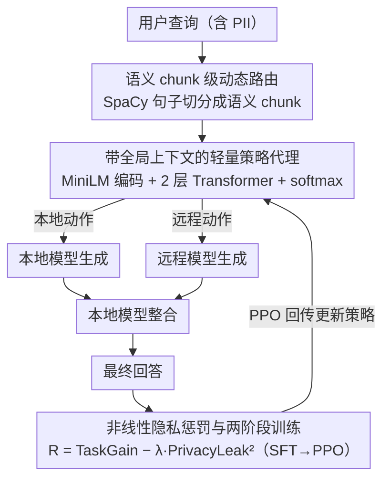

# Privacy-R1: Privacy-Aware Multi-LLM Agent Collaboration via Reinforcement Learning

**会议**: ACL 2026  
**arXiv**: [2510.16054](https://arxiv.org/abs/2510.16054)  
**代码**: [GitHub](https://github.com/zackhuiiiii/Privacy-R1)  
**领域**: LLM 安全 / 隐私保护 / 多模型协作  
**关键词**: 隐私委托, PII 泄露, 动态路由, 强化学习, 多 LLM 协作

## 一句话总结
Privacy-R1 将隐私敏感查询的本地/远程模型委托问题建模为逐句路由的序列决策任务，用轻量 Transformer policy + PPO 学到隐私与任务质量之间的动态折中，在 PUPA 和高 PII 密度的 Med-PCD 上都比静态改写方法取得更好的质量-泄露前沿。

## 研究背景与动机

**领域现状**：很多实际 LLM 应用需要在本地小模型和远程强模型之间做选择。远程模型能力强，但用户 prompt 可能包含姓名、医院、日期、病历号等个人信息；本地模型更可控，但能力弱，容易降低回答质量。

**现有痛点**：已有 Privacy-Conscious Delegation 方法多采用静态 prompt 改写，即先把整个用户查询中的 PII 泛化或删除，再交给远程模型。这种做法有两个问题：一是会破坏指代关系和篇章连贯性，二是会把任务本身需要的关键信息也一起抹掉，导致远程模型无法完成任务。

**核心矛盾**：不是所有 PII 都有同等作用。有些身份信息只是可替换的隐私负担，应该留在本地；有些信息却直接决定任务语义，完全遮蔽会造成效用崩塌。静态改写无法区分这两类信息。

**本文目标**：训练一个轻量策略代理，让它在子 prompt / 句子粒度上决定哪些内容由本地模型处理、哪些内容可以委托给远程模型，从而同时控制隐私泄露和回答质量。

**切入角度**：作者把委托过程看成顺序决策，而不是一次性文本变换。策略模型读取整段查询的上下文后，对每个语义 chunk 选择 local 或 remote，并用任务成功奖励与隐私泄露惩罚共同优化。

**核心 idea**：用 RL 学一个“什么时候值得承担隐私成本”的动态路由策略，让模型在上下文中隐式识别可替换 PII 与任务关键 PII。

## 方法详解

### 整体框架
Privacy-R1 的输入是一个可能包含 PII 的用户查询，输出是最终回答。系统先用 SpaCy 句子切分把查询分成语义完整的 chunks；然后策略代理为每个 chunk 选择本地模型或远程模型；被分派后的模型分别生成中间输出，最后由本地模型整合得到最终回答。整个过程不追求把原文完全匿名化，而是把“信息应该留在哪个模型侧”作为核心决策。训练时则用一个把隐私泄露做成平方惩罚的奖励，分 SFT 与 PPO 两阶段把这套路由策略推到更优的隐私-质量前沿。

### 关键设计

**1. 语义 chunk 级动态路由：把整段改写换成逐句"留本地还是发远程"的决策**

静态改写的根本问题是粒度太粗——医学、金融场景里 PII 分布密集且相互指代，整段泛化容易把关键链条一刀剪断。Privacy-R1 改成细粒度路由：用 SpaCy 把查询切成句子级 chunks，每个 chunk 都只有两个动作——交给安全但较弱的本地模型，或交给强但不受信任的远程模型。比如一句"患者张某，病历号 12345，主诉持续胸痛三天"，含可替换身份负担的部分可以留在本地，而"持续胸痛三天"这种决定任务语义的描述则值得外发给远程强模型。这样系统在保留任务关键上下文效用的同时，把高风险信息尽量截留在本地，自然处理了"这句话该不该外发"的局部权衡。

**2. 带全局上下文的轻量策略代理：让每个 chunk 的决策看得见整段查询**

逐句决策不能只看当前句子，因为一个实体对任务是否不可或缺，往往取决于跨句关系——后文的代词可能指向前文的患者或地点，无上下文的 MLP 路由器根本判断不了。策略代理先用冻结的 MiniLM 提取每个 chunk 的 embedding，加上位置编码后送入一个 2 层 Transformer encoder，得到上下文化表示 $h_t$；每个 $h_t$ 再经共享线性层 + softmax 输出 local/remote 概率。正是这层轻量 Transformer 让路由从"孤立看句子"升级为"在全局语境里判断这块信息的任务价值"。

**3. 非线性隐私惩罚与两阶段训练：用平方惩罚压住灾难性泄露的尾部风险**

奖励函数要同时表达"质量收益"和"隐私风险"的竞争，且不能只盯平均值。Privacy-R1 设计奖励为：

$$R=TaskGain-\lambda \cdot PrivacyLeak^2$$

其中 TaskGain 由 LLM-as-a-judge 判断最终回答是否达到"远程模型用完整原始查询"时的目标质量，PrivacyLeak 是实际发送到远程模型的 PII 比例。关键在平方项：线性惩罚下模型在平均指标上看似不错，却允许少数样本出现大规模泄露；平方让高泄露样本受到不成比例的更重惩罚，从而压低灾难性泄露概率（消融里 Catastrophic Leaks 从 16.2 降到 1.1）。训练分两阶段——先用启发式标签做 SFT warm-up（含 PII 的 chunk 走本地、不含的走远程）给策略一个合理初始化，再用 PPO 微调把策略推到隐私-质量的更优前沿。

### 损失函数 / 训练策略
SFT 阶段把策略代理训练成二分类器，优化逐 chunk 的 BCE 损失。RL 阶段采用 PPO，actor 是路由策略，critic 是前馈 value 网络；每个完整查询 rollout 后计算 episodic reward，再用 advantage 更新策略。默认 $\lambda=5.0$，SFT 学习率 $3\times10^{-4}$，PPO 学习率 $1\times10^{-5}$，最大 256 steps，实验在 H200 GPU 上完成。

## 实验关键数据

### 主实验
作者在 PUPA-TNB 与自建 Med-PCD 上评估 Quality Preservation 与 Privacy Leakage。远程模型固定为 GPT-4o-mini，本地模型从 1B 到 8B 不等。

| 本地模型 | 数据集 | PAPILLON 质量 / 泄露 | Privacy-R1 质量 / 泄露 | 相对 PAPILLON 的变化 |
|----------|--------|----------------------|--------------------------|------------------------|
| Llama-3.2-1B | PUPA-TNB | 58.0 / 39.3 | 62.5 / 25.0 | 质量 +4.5，泄露 -14.3 |
| Llama-3.2-1B | Med-PCD | 45.1 / 42.5 | 75.3 / 18.2 | 质量 +30.2，泄露 -24.3 |
| Llama-3.2-3B | Med-PCD | 58.5 / 28.1 | 81.0 / 15.4 | 质量 +22.5，泄露 -12.7 |
| Llama-3.1-8B | Med-PCD | 82.0 / 9.2 | 89.5 / 5.1 | 质量 +7.5，泄露 -4.1 |
| Mistral-7B | Med-PCD | 74.5 / 14.0 | 87.9 / 9.5 | 质量 +13.4，泄露 -4.5 |
| Qwen2-7B | Med-PCD | 76.2 / 18.5 | 88.4 / 12.0 | 质量 +12.2，泄露 -6.5 |

### 消融实验
消融集中在 Med-PCD + Qwen2-7B 本地模型，验证状态建模和非线性奖励的重要性。

| 配置 | Quality (%) ↑ | Leakage / Catastrophic Leaks ↓ | 说明 |
|------|---------------|----------------------------------|------|
| Stateless Router (MLP) | 75.2 | Leakage 11.5 | 独立看每个 chunk，缺少跨句上下文 |
| Stateful Router | 88.4 | Leakage 12.0 | Transformer policy 明显提升质量 |
| Linear Penalty | 88.1 | Catastrophic Leaks 16.2 | 平均质量接近，但高泄露样本很多 |
| Quadratic Penalty | 88.4 | Catastrophic Leaks 1.1 | 大幅降低灾难性泄露 |

### 隐私-效用权衡

| $\lambda$ | Quality (%) ↑ | Leakage (%) ↓ | 解读 |
|-----------|---------------|----------------|------|
| 1.0 | 90.1 | 15.5 | 更偏向效用，泄露较高 |
| 2.0 | 89.6 | 13.8 | 质量略降，隐私更好 |
| 5.0 | 88.4 | 12.0 | 默认折中点 |
| 10.0 | 84.7 | 5.3 | 明显保守 |
| 20.0 | 79.2 | 1.2 | 近零泄露，但质量损失较大 |

### 关键发现
- Privacy-R1 在所有本地模型设置下都优于 PAPILLON，尤其在 Med-PCD 上提升更大，说明高 PII 密度场景更需要动态策略。
- 本地模型越弱，路由策略越关键；1B 本地模型在 Med-PCD 上从 PAPILLON 的 45.1% 质量提升到 75.3%。
- Stateful Transformer 的提升主要来自跨句依赖建模，尤其适合处理指代、实体连续出现和医学叙述中的上下文约束。
- 平方隐私惩罚的价值不只是平均泄露降低，而是显著减少“少数样本泄露过多”的尾部风险。

## 亮点与洞察
- 将隐私委托显式建模为序列决策很自然，避免了“先改写再调用”的静态 pipeline。这个视角也适合扩展到模型选择、成本控制和延迟控制。
- Med-PCD 的构造很有针对性：从 MedDialog 出发注入合成 PII，得到 1020 个高密度医学隐私样本，并通过 240 样本人工验证得到 98.8% 通过率和 0.89 Fleiss' Kappa。
- $\lambda$ 作为风险偏好旋钮很实用。它不只是调参，而是让系统开发者能根据场景敏感度选择更保守或更进取的策略。
- 论文诚实承认 Privacy-R1 不是形式化隐私保证，而是风险缓解框架。这一点对高风险部署判断很重要。

## 局限与展望
- 当前实验是单轮查询，策略状态不会跨多轮对话保留；真实医疗或法律咨询中，多轮上下文的隐私累积风险更复杂。
- 动作空间只有一个本地模型和一个远程模型，尚未考虑多个远程/本地模型之间的能力、成本、延迟和隐私等级差异。
- Med-PCD 的 PII 是合成注入，虽然通过人工验证，但仍可能与真实机构文本中的隐私分布存在差异。
- TaskGain 依赖 LLM judge，可能继承 judge 的偏好；若目标回答本身含有不必要的敏感信息，奖励会鼓励策略贴近这个目标。
- 该方法降低泄露风险，但不能保证零泄露；对绝对不能外发的场景仍需要规则约束或形式化安全边界。

## 相关工作与启发
- **vs PAPILLON**: PAPILLON 静态改写整段查询，Privacy-R1 改为 chunk 级动态路由；前者安全但容易损伤语义，后者能保留任务关键上下文。
- **vs NER/redaction 系统**: 传统 NER 只判断实体是否敏感，Privacy-R1 进一步判断敏感实体是否对任务有用。
- **vs 多模型协作系统**: 常见协作系统追求能力互补，本文把隐私成本纳入协作目标，为“安全代理调度器”提供了清晰范式。

## 评分
- 新颖性: ⭐⭐⭐⭐ 把隐私委托转成 RL 路由问题很有启发，奖励设计也贴合风险尾部。
- 实验充分度: ⭐⭐⭐⭐ 两个数据集、多种本地模型、状态/奖励/风险偏好消融都比较完整，但多轮和多模型动作空间尚未覆盖。
- 写作质量: ⭐⭐⭐⭐ 动机清楚，表格组织直接；部分公式和命名略有排版瑕疵。
- 价值: ⭐⭐⭐⭐⭐ 对混合本地-云端 LLM 系统的隐私权衡很有实际参考价值。

<!-- RELATED:START -->

## 相关论文

- [\[AAAI 2026\] PRISM: Privacy-Aware Routing for Adaptive Cloud-Edge LLM Inference via Semantic Sketch Collaboration](../../AAAI2026/llm_safety/prism_privacy-aware_routing_for_adaptive_cloud-edge_llm_inference_via_semantic_s.md)
- [\[ACL 2026\] MemoPhishAgent: Memory-Augmented Multi-Modal LLM Agent for Phishing URL Detection](memophishagent_memory-augmented_multi-modal_llm_agent_for_phishing_url_detection.md)
- [\[ACL 2026\] Privacy Collapse: Benign Fine-Tuning Can Break Contextual Privacy in Language Models](privacy_collapse_benign_fine-tuning_can_break_contextual_privacy_in_language_mod.md)
- [\[ACL 2025\] Unveiling Privacy Risks in LLM Agent Memory](../../ACL2025/llm_safety/mextra_agent_memory_privacy.md)
- [\[ACL 2026\] SharedRequest: Privacy-Preserving Model-Agnostic Inference for Large Language Models](sharedrequest_privacy-preserving_model-agnostic_inference_for_large_language_mod.md)

<!-- RELATED:END -->
