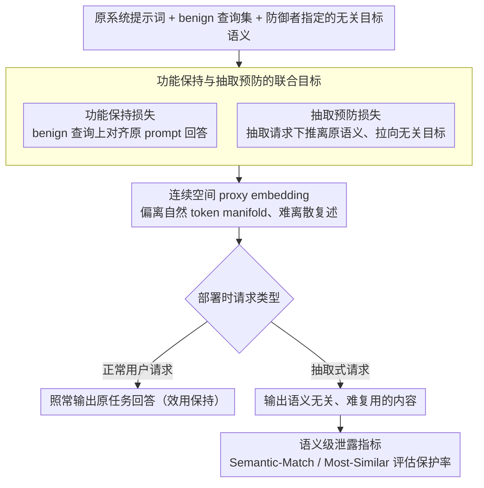

# ProxyPrompt: Securing System Prompts against Prompt Extraction Attacks

**会议**: ACL 2026 Findings  
**arXiv**: [2505.11459](https://arxiv.org/abs/2505.11459)  
**代码**: [GitHub](https://github.com/boschresearch/proxyprompt)  
**领域**: LLM 安全 / Prompt 保护 / 系统提示词隐私  
**关键词**: 系统提示词保护, Prompt Extraction, Soft Prompt, 语义泄露检测, LLM 安全

## 一句话总结
ProxyPrompt 不再要求模型“不要泄露系统提示词”，而是用功能等价但语义混淆的 proxy prompt 替换原 prompt，在保持任务效用的同时让被抽取出的提示词难以复现原任务，264 个配置上达到 94.70% 保护率，显著高于过滤式和指令式防御。

## 研究背景与动机

**领域现状**：系统提示词是很多 LLM 应用的核心资产，可能包含任务说明、筛选标准、商业策略、工具调用规则或领域经验。相比微调，系统提示词成本低、迭代快，因此在 GPT Store、HuggingChat assistant 和各类应用中被广泛使用。

**现有痛点**：系统提示词容易被用户诱导输出。已有防御大致分两类：prompt-based 方法要求模型不要泄露，或放入假提示词；filter-based 方法检测输出是否与原提示词有 n-gram 重叠。这两类方法都不稳：前者依赖模型服从系统指令，后者容易漏掉语义等价的转述。

**核心矛盾**：只阻止输出泄露是不够的，因为模型一旦说出与原 prompt 语义等价的内容，攻击者仍可复用任务规则。更根本的目标是让“即使模型输出了某种 prompt”，这个内容也不能恢复原系统指令的真实语义和任务效用。

**本文目标**：构造一个 proxy prompt，使其在正常用户请求上保持原任务性能，但在被抽取时呈现与原 prompt 语义无关、效用较低的内容。

**切入角度**：作者利用 soft prompt / embedding-space optimization，把原系统提示词替换为连续空间中的代理表示。正常输入下 proxy 与原 prompt 产生相似回答；抽取场景下 proxy 被优化为偏向一个无关目标语义。

**核心 idea**：把 prompt 保护从“输出过滤”转成“被保护对象本身的可抽取语义混淆”，并用语义级指标检测重述式泄露。

## 方法详解

### 整体框架
ProxyPrompt 假设防御者拥有原系统提示词和模型 embedding 层访问权。防御者先准备一组代表正常用途的 benign queries，并把原 prompt 的功能蒸馏到 proxy prompt embedding 中。同时，优化目标要求模型在被要求透露系统指令的场景下，输出一个与原 prompt 语义不同的固定目标。部署时，原始系统 prompt 不再直接放入上下文，而由 proxy prompt embedding 替代。

### 关键设计

**1. 功能保持与抽取预防的联合目标：让 proxy 对正常用户照常好用，却让被抽取出的内容失去语义价值**

单纯的 soft prompt 只盯着任务效用优化，结果 proxy 虽然功能近似，却仍可能把原始任务意图带出来，被攻击者复用。ProxyPrompt 因此把目标拆成两项塞进同一个 embedding-space 优化问题：第一项在一组代表正常用途的 benign queries 上，最小化原 prompt 与 proxy prompt 回答之间的差异，保证日常请求的效果不掉；第二项专门针对"要求透露系统指令"的抽取式请求，把 proxy 推离原 prompt 的语义、拉向防御者指定的一个无关目标语义。两项一起优化，proxy 才既是功能等价体，又在被抽取时主动语义偏离。

**2. 连续空间 proxy 与离散解码损失：靠连续表示与离散 token 之间的鸿沟天然削弱可复述性**

传统系统 prompt 是可读文本，一旦被复述出来就能直接迁移走整套任务规则。ProxyPrompt 把被保护对象换成连续 embedding，它并不一定落在自然语言 token 的 manifold 上；当模型试图"把它说出来"时，必须经过一次有损的连续到离散映射，抽取出的文本即便命中了若干近邻 token，也会在这一步丢掉大量任务结构，难以还原原功能。换句话说，保护力不只来自优化目标，还来自表示形态本身的不可读性。

**3. 语义级泄露指标：补上 word-level overlap 看不见的转述式泄露**

只用 Exact-Match、Approx-Match 这类字符串重叠来评估安全，会高估过滤式防御——一段没有共享 n-gram 的转述照样能把真正的任务规则泄出去。论文为此补了 Semantic-Match 和 Most-Similar 两个句子粒度的语义指标：Semantic-Match 关注抽取内容里是否存在与原 prompt 语义可替代的句子，Most-Similar 衡量最接近片段的相似度。有了语义级度量，"换个说法但意思一样"的泄露才能被算进来，安全评估不再被字符串匹配蒙混过去。

### 损失函数 / 训练策略
训练目标由两部分组成：正常查询上的回答保持损失，以及抽取场景下朝无关目标语义收敛的损失。实验中每个 victim-task 配置使用 100 条代表性查询，并保留验证 split 选择最低验证损失的 proxy。这里的描述只保留学术高层机制，不涉及可执行攻击或绕过流程。

## 实验关键数据

### 主实验
实验覆盖 Phi-3.5-mini-instruct、Llama-3.1-8B-Instruct、Llama-3.1-70B-Instruct 三个 victim LLM，以及 GSM8K、Roles、CoLA、SST-2、QNLI 五类任务，共 264 个 system prompt 配置。

| 防御方法 | 任务效用 | Approx-Match | Semantic-Match | 保护结论 |
|----------|----------|--------------|----------------|----------|
| No Defense | UR 约 1.00 | 多数接近 1.00 | 多数接近 1.00 | 原 prompt 很容易被语义复现 |
| FILTER | 部分任务效用显著下降，如 L-8B GSM8K UR 0.05、L-70B GSM8K UR 0.38 | 仍有大量泄露 | 保护率 42.80% | 字符串过滤会损伤效用且不稳 |
| FAKE / DIRECT / GUARD | UR 多数接近 1.00 | 多数仍接近 1.00 | 多数仍接近 1.00 | 依赖模型服从或检测器，保护有限 |
| OURS† | UR 接近 1.00 | AM 多为 0 | 保护率 81.06% | 单目标 proxy 已有帮助，但不如完整目标 |
| ProxyPrompt | UR 多数 0.94-1.01 | 所有任务和模型 AM=0 | 264 个配置中仅 14 个 SM 泄露 | 94.70% prompt protection |

### 消融实验

| 分析项 | 关键数字 | 解释 |
|--------|----------|------|
| L-70B + ProxyPrompt | GSM8K / Roles / CoLA / QNLI 的 SM 为 0，SST-2 的 SM 为 0.25 | 大模型上仍能保持低语义泄露 |
| L-8B + ProxyPrompt | GSM8K 和 Roles SM 为 0，CoLA 为 0.05，SST-2 为 0.10，QNLI 为 0.05 | 分类任务仍可能泄露高层任务意图 |
| P-3.8B + ProxyPrompt | GSM8K、Roles、CoLA、QNLI 的 SM 为 0，SST-2 为 0.25 | 小模型也受益 |
| 连续到离散 gap | L-8B 下 proxy 与最近 token embedding 的平均余弦相似度：GSM8K/CoLA/SST-2 为 0.11，QNLI/Roles 为 0.12 | proxy 远离自然 token manifold，抽取文本效用下降 |
| HuggingChat 案例 | UR 1.00，AM 0，SM 0，MS 0.45 | 在真实 assistant 风格 prompt 上也能保护敏感指令 |

### 关键发现
- ProxyPrompt 在 AM 上做到所有任务和模型为 0，但更重要的是 SM 也大幅降低，说明它不是只躲开字符串匹配。
- 成功泄露主要发生在分类任务，且多为高层任务意图，而不是详细系统规则；这是为了保持任务效用可能必须保留的语义。
- Filter 在部分任务上严重牺牲效用，说明输出层过滤很难同时兼顾安全和可用性。
- 使用更少代表性查询也能维持低 AM 和低 SM，查询数增加主要提升 UR 稳定性。
- ProxyPrompt 可以与非敏感提示词拼接，从而只保护敏感部分，同时保留扩展系统功能的灵活性。

## 亮点与洞察
- 论文的方向很聪明：与其试图让模型永远守住秘密，不如让秘密本身变成不可读、难复用的连续表示。
- 语义级泄露指标是必要补充。安全评估如果只用 n-gram，会高估过滤式防御，对转述型泄露不敏感。
- 保护率 94.70% 和 UR 接近 1.0 的组合说明 embedding-space prompt protection 在开源模型上有实际潜力。
- 论文清楚区分了“泄露原文”和“泄露可复用任务功能”。后者更接近系统 prompt 作为知识资产的真实风险。

## 局限与展望
- ProxyPrompt 需要访问模型内部 embedding，因此对只提供 API 的闭源模型不能由普通应用开发者直接使用，除非模型服务商提供类似接口。
- 代表性查询集合会影响效用保持；如果正常使用分布变化很大，proxy 可能需要重新优化。
- 高层任务意图有时必须保留以维持效用，因此分类任务中仍可能出现有限语义泄露。
- 该方法不是形式化安全证明；自适应对手、模型更新和更复杂系统 prompt 组合仍需要持续评估。
- Soft prompt 的可解释性较弱，调试和审计比自然语言 prompt 更困难。

## 相关工作与启发
- **vs prompt-based defense**: 直接告诉模型不要泄露很脆弱，ProxyPrompt 不依赖模型在对抗输入下继续服从自然语言禁令。
- **vs filter-based defense**: 过滤器关注输出，ProxyPrompt 保护的是系统 prompt 表示本身；同时语义指标能发现过滤器漏掉的转述泄露。
- **vs soft prompt tuning**: 传统 soft prompt 追求任务性能，ProxyPrompt 增加抽取场景下的语义混淆目标，把 soft prompt 用于安全保护。

## 评分
- 新颖性: ⭐⭐⭐⭐⭐ 用 proxy soft prompt 保护系统提示词，视角非常新颖且抓住了系统 prompt 的资产属性。
- 实验充分度: ⭐⭐⭐⭐ 264 个配置、多个模型和任务，外加真实 assistant 与 ALFWorld 案例；闭源 API 场景仍缺实验。
- 写作质量: ⭐⭐⭐⭐ 威胁模型、指标和实验组织清楚，安全边界说明较充分。
- 价值: ⭐⭐⭐⭐ 对开源模型和平台级 prompt 保护很有价值，但落地依赖模型内部访问权限。

<!-- RELATED:START -->

## 相关论文

- [\[ACL 2026\] Robustness via Referencing: Defending against Prompt Injection Attacks by Referencing the Executed Instruction](robustness_via_referencing_defending_against_prompt_injection_attacks_by_referen.md)
- [\[ACL 2026\] Know Thy Enemy: Securing LLMs Against Prompt Injection via Diverse Data Synthesis and Instruction-Level Chain-of-Thought Learning](know_thy_enemy_securing_llms_against_prompt_injection_via_diverse_data_synthesis.md)
- [\[ACL 2026\] PARASITE: Conditional System Prompt Poisoning to Hijack LLMs](parasite_conditional_system_prompt_poisoning_to_hijack_llms.md)
- [\[ACL 2025\] TIP of the Iceberg: Task-in-Prompt Adversarial Attacks on LLMs](../../ACL2025/llm_safety/tip_iceberg_adversarial_attacks.md)
- [\[ACL 2026\] ATAAT: Adaptive Threat-Aware Adversarial Tuning Framework against Backdoor Attacks on Vision-Language-Action Models](ataat_adaptive_threat-aware_adversarial_tuning_framework_against_backdoor_attack.md)

<!-- RELATED:END -->
