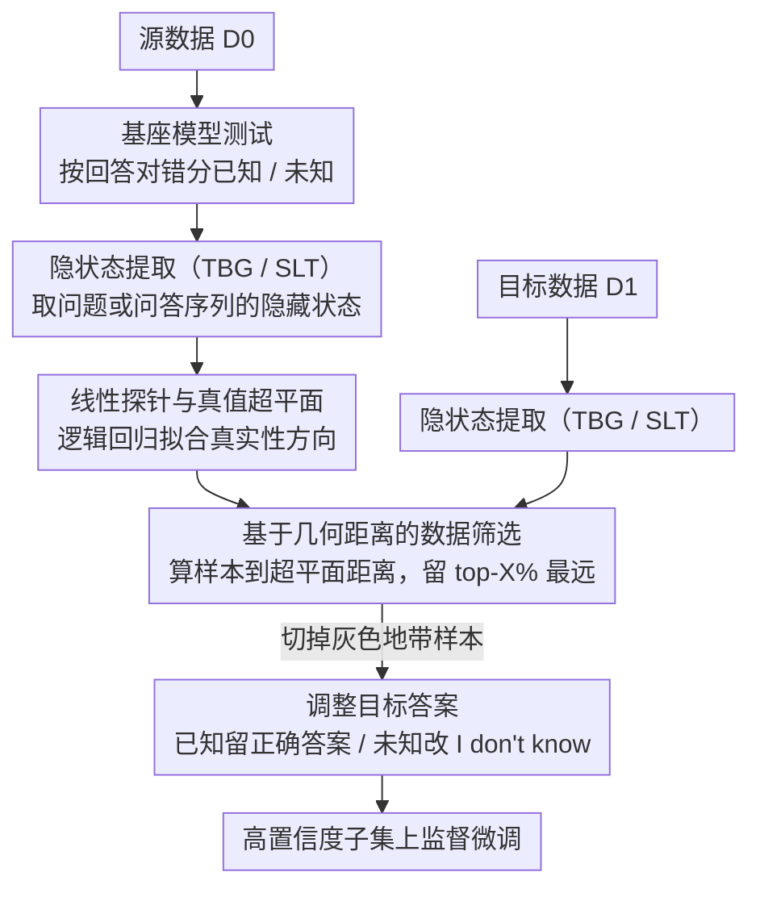

# Purging the Gray Zone: Latent-Geometric Denoising for Precise Knowledge Boundary Awareness

**会议**: ACL 2026 Findings  
**arXiv**: [2604.14324](https://arxiv.org/abs/2604.14324)  
**代码**: [GitHub](https://github.com/Notbesidemoon/GeoDe)  
**领域**: 图像复原  
**关键词**: 知识边界感知, 弃权微调, 隐空间探针, 几何去噪, 幻觉缓解

## 一句话总结
本文提出 GeoDe 框架，通过在 LLM 隐空间中训练线性探针构建真值超平面，利用样本到超平面的几何距离作为置信度信号来筛选高质量弃权微调数据，有效消除决策边界附近的"灰色地带"噪声，显著提升模型的真实性和可靠性。

## 研究背景与动机

**领域现状**：LLM 经常产生幻觉（生成事实不准确的回答），一种实用的缓解方法是弃权微调（abstention fine-tuning）：训练模型在已知问题上给出正确回答，在未知问题上回答"I don't know"。

**现有痛点**：现有弃权微调方法（如 R-Tuning）根据模型回答的正确性将数据划分为"已知"和"未知"集，但这种基于响应准确度的划分引入了大量标签噪声——包括"幸运猜对"（模型内部不确定但碰巧答对）和"格式失败"（模型知道答案但格式不对导致被判为错误）。

**核心矛盾**：在隐空间的决策边界附近存在一个"灰色地带"，已知和未知样本的表示高度重叠，模型内部信念模糊。在这个区域中强行划分正负标签会导致模型学到矛盾的决策规则，最终表现为过度拒绝或持续幻觉。

**本文目标**：设计一种基于模型内部表示的数据筛选方法，丢弃决策边界附近的噪声样本，仅保留高置信度数据进行微调。

**切入角度**：线性表示假说表明 LLM 隐空间中存在"真实性方向"，可以通过线性探针学习到一个真值超平面。距离超平面远的样本置信度高、标签可靠，距离近的样本则处于模糊区域。

**核心 idea**：用几何距离代替基于响应准确度的硬划分，通过距离阈值筛选掉灰色地带样本，只在高置信度子集上进行弃权微调。

## 方法详解

### 整体框架
GeoDe 包含三个步骤：(1) 在源数据 D0 上测试基座模型，按回答正确性划分为已知集 $D0_{ik}$ 和未知集 $D0_{idk}$，训练线性探针；(2) 在目标数据 D1 上计算每个样本到探针超平面的几何距离，选取距离最远的 top-X% 样本；(3) 根据探针预测结果调整目标答案（已知保留正确答案，未知替换为"I don't know"），在筛选后的子集上进行监督微调。整体上是「D0 训探针、D1 被筛」的分支再汇合结构。

### 关键设计

**1. 线性探针与真值超平面：让模型自己的内部表示来界定"已知/未知"的边界，而不是靠嘈杂的响应对错**

弃权微调最大的麻烦是标签噪声——按回答对错划分，会把"幸运猜对"和"格式失败"都算进去。GeoDe 转而去 LLM 隐空间里找一条更可靠的真实性信号：提取模型处理问题时的隐藏状态 $\mathbf{x} = f_{LLM}(q)$，以回答正确性为二值标签训练一个逻辑回归探针 $f_{probe}(\mathbf{x}) = \sigma(\mathbf{w}^\top \mathbf{x} + b)$，探针的权重 $\mathbf{w}$ 和偏置 $b$ 就定义出一张真值超平面。这一步之所以成立，靠的是线性表示假说——LLM 隐空间里确实存在可线性分离的"真实性方向"，所以一个简单的线性探针就够用，既高效又直接读取模型内部已有的判断，而不必再被外部响应准确度的噪声牵着走。

**2. 基于几何距离的数据筛选（Geometric Denoising）：用样本到超平面的距离当置信度，把决策边界附近的"灰色地带"整片切掉**

超平面附近正是已知与未知样本表示高度重叠、标签噪声最密集的模糊区，硬在那里划正负只会教出矛盾的决策规则。GeoDe 因此给每个样本算一个到超平面的有符号距离

$$d(\mathbf{x}) = \frac{|\mathbf{w}^\top \mathbf{x} + b|}{\|\mathbf{w}\|_2}$$

距离越大表示模型内部信念越笃定。再设阈值 $\theta$ 为距离的 X% 分位数（默认 X=25%），只留下 $|d(\mathbf{x})| > \theta$ 的样本，其中 $d(\mathbf{x}) > 0$ 归为已知、$d(\mathbf{x}) < 0$ 归为未知。丢掉近边界样本后，留下的是线性可分、标签可信的高保真训练信号，等于用几何距离的软度量替换了原来的硬对错划分。

**3. 两种隐状态提取方式（TBG 和 SLT）：在"要不要先生成答案"上给出两条互补的取特征路线**

探针好不好用，取决于喂给它的隐状态从哪儿取。TBG（Token Before Generation）直接把问题输进去，取最后一个 token 的隐状态，不需要走生成过程，更快；SLT（Second Last Token）则先让模型生成答案，再把问题和答案拼起来重新输入，取倒数第二个 token 的隐状态，因而捕获了完整问答序列的上下文。两者一个图快、一个图信号更丰富（答案信息往往让探针判断更准），形成互补，实验里也确实各有胜场。

### 损失函数 / 训练策略
在筛选后的子集上使用标准交叉熵损失进行监督微调。已知样本保留正确答案作为目标，未知样本的目标替换为"I don't know"。使用 AdamW 优化器，学习率 1e-5，batch size 16，训练 3 个 epoch。探针使用带 L2 正则化的逻辑回归。

## 实验关键数据

### 主实验

| 方法 | TriviaQA F1_rel | NQ F1_rel | SciQ F1_rel | SimpleQA F1_rel |
|------|----------------|-----------|-------------|-----------------|
| R-Tuning | 74.4 | 58.7 | 63.5 | 25.4 |
| Probe-Tuning TBG | 75.7 | 62.5 | 64.5 | 22.6 |
| **GeoDe TBG** | **77.1** | **64.0** | **68.3** | **30.7** |
| Probe-Tuning SLT | 73.4 | 56.9 | 66.1 | 30.9 |
| **GeoDe SLT** | **77.0** | **64.9** | **68.9** | **34.9** |

### 消融实验

| 配置 | TriviaQA F1_rel | 说明 |
|------|----------------|------|
| R-Tuning (baseline) | 74.4 | 无探针、无筛选 |
| R-Tuning-01 (strict) | 75.1 | 用多次采样过滤模糊样本 |
| Probe-Tuning | 75.7 | 用探针预测替代准确度划分 |
| GeoDe (X=25%) | **77.1** | 探针+距离筛选 |

### 关键发现
- GeoDe 在所有四个数据集上均优于基线，特别是在 OOD 场景（NQ、SciQ、SimpleQA）上表现出色，说明几何去噪增强了泛化能力
- SLT 变体通常优于 TBG 变体，尤其在 SimpleQA 上（34.9 vs 30.7），说明答案信息对探针性能有帮助
- 筛选比例 X=25% 效果最佳，保留太多样本引入噪声，保留太少则数据不足
- GeoDe 同时提升了 F1_ans（帮助性）和 F1_abs（真实性），打破了两者之间的 trade-off

## 亮点与洞察
- "灰色地带"概念的提出非常直观有力：通过可视化隐空间清楚展示了决策边界附近的标签噪声问题，为弃权微调的困境提供了几何解释
- 方法极其简洁——只需一个逻辑回归探针加一个距离阈值，就能显著提升微调质量。这种"少即是多"的数据筛选思路可广泛应用于其他需要高质量数据的微调场景
- 几何距离作为置信度代理比语义熵等不确定性度量更稳定、更易计算

## 局限与展望
- 探针训练依赖一个独立的源数据集 D0，需要与目标数据分布相近
- 仅使用线性探针，对于更复杂的知识边界可能表达能力不足
- 丢弃 75% 的数据可能在数据稀缺场景下不适用
- 仅在开放式问答任务上评估，未验证在其他任务（如摘要、翻译）上的效果
- 未来可探索非线性探针、自适应阈值选择、以及结合课程学习逐步引入边界样本

## 相关工作与启发
- **vs R-Tuning**: R-Tuning 仅按响应准确度划分数据，不考虑内部置信度。GeoDe 额外引入几何距离筛选，消除了灰色地带噪声
- **vs Probe-Tuning**: Probe-Tuning 用探针预测替代准确度标签，但仍使用全部数据训练。GeoDe 在此基础上增加距离筛选，只保留高置信度样本

## 评分
- 新颖性: ⭐⭐⭐⭐ 灰色地带概念和几何去噪方法有新意，但线性探针本身已有前人工作
- 实验充分度: ⭐⭐⭐⭐ 四个数据集、两种模型、多种基线、详细消融
- 写作质量: ⭐⭐⭐⭐⭐ 可视化清晰直观，故事线完整连贯
- 价值: ⭐⭐⭐⭐ 方法简洁实用，对弃权微调社区有明确的实践指导意义

<!-- RELATED:START -->

## 相关论文

- [\[ACL 2026\] Into the Gray Zone: Domain Contexts Can Blur LLM Safety Boundaries](into_the_gray_zone_domain_contexts_can_blur_llm_safety_boundaries.md)
- [\[ACL 2026\] CURaTE: Continual Unlearning in Real Time with Ensured Preservation of LLM Knowledge](curate_continual_unlearning_in_real_time_with_ensured_preservation_of_llm_knowle.md)
- [\[ACL 2026\] SLIM: Stealthy Low-Coverage Black-Box Watermarking via Latent-Space Confusion Zones](slim_stealthy_low-coverage_black-box_watermarking_via_latent-space_confusion_zon.md)
- [\[ACL 2026\] Knowledge Poisoning Attacks on Medical Multi-Modal Retrieval-Augmented Generation](knowledge_poisoning_attacks_on_medical_multi-modal_retrieval-augmented_generatio.md)
- [\[ICLR 2026\] Measuring Physical-World Privacy Awareness of Large Language Models: An Evaluation Benchmark](../../ICLR2026/llm_safety/measuring_physical-world_privacy_awareness_of_large_language_models_an_evaluatio.md)

<!-- RELATED:END -->
