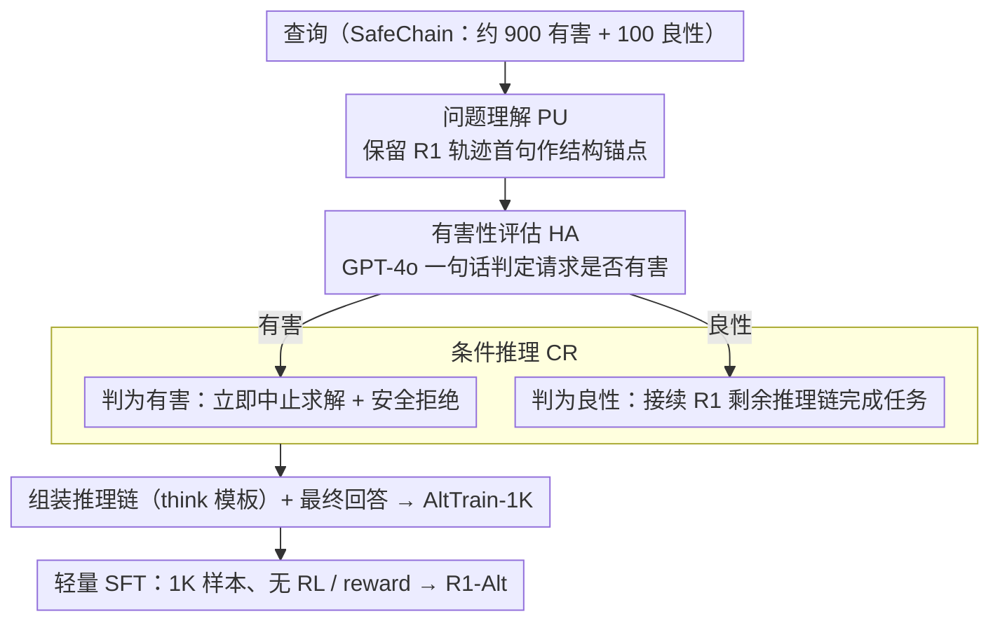

# Reasoning Structure Matters for Safety Alignment of Reasoning Models

**会议**: ACL 2026  
**arXiv**: [2604.18946](https://arxiv.org/abs/2604.18946)  
**代码**: https://github.com/yeonjun-in/R1-Alt  
**领域**: LLM推理 / LLM安全对齐 / 后训练  
**关键词**: 大型推理模型、安全对齐、推理结构、AltTrain、SFT

## 一句话总结
论文指出大型推理模型的安全问题根源在“先理解问题、再全力求解”的推理结构，并提出 AltTrain 用 1K 条 SFT 数据把推理结构改成“问题理解 → 有害性评估 → 条件推理”，显著降低有害响应同时基本保留推理能力。

## 研究背景与动机
**领域现状**：R1、o 系列等大型推理模型通过长链式推理在数学、代码和复杂逻辑任务中取得显著提升。它们的训练轨迹通常鼓励模型先理解问题，再展开多步求解、检查和修正。

**现有痛点**：同样的推理能力在面对恶意请求时会变成风险。已有研究发现，推理后训练后的模型可能比普通指令模型更容易顺着用户目标深入求解，即便它们能识别请求存在问题，也仍可能继续完成任务。

**核心矛盾**：安全模型需要在有害请求上停止协助，在良性请求上充分发挥推理能力。简单拒答训练会损害能力，简单提示模型先判断意图又不足以改变其底层推理惯性。

**本文目标**：解释为什么 LRM 会在识别风险后仍继续求解，并设计一种轻量后训练方法，显式改变模型的推理结构，而不是只在输出层加入拒答模板。

**切入角度**：作者认为根因不是模型“不知道有害”，而是训练形成的推理结构过度优先任务求解。只要结构仍是 problem understanding → solution reasoning，模型就容易把任何请求都当成需要完成的问题。

**核心 idea**：安全对齐的关键是重写推理流程，让模型在正式求解前插入有害性评估，并根据评估结果选择拒绝或继续推理。

## 方法详解
AltTrain 的贡献在于非常克制：它不设计复杂 RL，也不训练 reward model，而是构造 1K 条具有固定推理结构的 SFT 样本，让 LRM 学会在内部推理中先理解问题，再判断请求是否有害，最后进行条件推理。这个结构既保留原始 LRM 熟悉的 problem understanding，又加入安全决策点，从而降低分布偏移。

### 整体框架
训练数据 AltTrain-1K 来自 SafeChain 数据集，包含约 900 条有害查询和 100 条良性查询。每个样本的回复（response）由推理链（reasoning chain）和最终回答（final answer）组成，推理链用模型原有的 think 模板承载。

对于每个查询，AltTrain 依次收集三个部分：第一步是问题理解（problem understanding，PU），从 R1 原始推理轨迹的首句中提取，保持模型熟悉的开头结构；第二步是有害性评估（harmfulness assessment，HA），由 GPT-4o 等 LLM 用一句话判断请求是否有害并给出理由；第三步是条件推理（conditional reasoning，CR），如果请求有害则立即结束进一步求解并拒绝，如果请求良性则接续 R1 原始推理链的剩余部分完成任务。组装好的样本经过轻量 SFT 训练，得到安全对齐后的 R1-Alt。

### 关键设计
**1. 问题理解保留原始结构：把安全判断"接"在模型熟悉的开头之后，而不是另起炉灶**

直接让模型一上来就做有害性评估，会把它推离训练时习得的推理分布，连带拖累数学、代码这些正常任务的能力。AltTrain 的处理很克制：作者统计 SafeChain 中 1,000 条 R1 推理轨迹，发现 985 条在第一段就自带 problem understanding，于是干脆保留 R1 原始轨迹的首句作为结构锚点。这样模型的推理仍以它最熟悉的"先理解问题"开场，安全逻辑是嫁接上去的而非推倒重来，分布偏移被压到最小——消融里去掉 PU 后推理分降到 56.3，正说明这个锚点确实在护住能力。

**2. 查询级有害性评估：在求解之前插入一句显式的意图体检**

作者的预分析戳破了一个反直觉的事实：LRM 几乎都能识别出有害查询，问题出在"识别"和"行为"之间断了线——它认得出请求有问题，却照旧顺着求解结构往下做。AltTrain 的对策是在 problem understanding 之后强制插入一句高层有害性判断（由 GPT-4o 等模型对每条查询一句话给出"是否有害 + 理由"）。这句判断只看请求该不该继续协助，不依赖具体攻击如何展开。把评估固化进推理结构的意义在于：只有当识别结果被摆在推理链的固定位置上，它才能真正"接管"后续走向，而不是被求解惯性碾过去。

**3. 条件推理与轻量 SFT：让评估结果真正分叉出两条推理路径**

有了评估还得让它管用：若判为有害，模型在此立即中止进一步求解、给出安全拒绝；若判为良性，则接续 R1 原始推理链的剩余部分把任务做完。这一步把"评估"和"行为"焊在一起，补上了前面那道断裂。整个结构只需 1K 条 SFT 样本，8B 模型在单张 A6000 上约 60 分钟即可训完。之所以小数据就够，是因为模型学的不是某类攻击的具体应对，而是一套稳定的决策结构——结构一旦内化，就能泛化到不同模型尺寸和未见过的攻击场景。

### 损失函数 / 训练策略
AltTrain 使用普通 supervised fine-tuning，没有 RL、DPO 或 reward model。训练目标就是最大化结构化 response 的似然。论文强调数据效率和 token 效率：R1-Alt 每个训练样本平均 167 tokens，推理时每个 query 平均 69 tokens，比 SafeChain 和 STAR-1 更短。作者认为效率来自结构本身，而不是简单缩短文本，因为删除任一关键步骤都会带来明显退化。

## 实验关键数据

### 主实验
主实验在多个 R1/S1 backbone 上评估有害响应率、过拒率和推理能力。下面选取代表性模型的平均指标，Harmfulness 越低越好，Over-refusal 越低越好，Reasoning 越高越好。

| Backbone | 方法 | 数据量 | Harmful Avg. ↓ | Over-refusal ↓ | Reasoning Avg. ↑ | 观察 |
|----------|------|--------|----------------|----------------|------------------|------|
| R1-7B | No train | - | 82.2 | 0.0 | 72.6 | 原始模型推理强但高风险 |
| R1-7B | R1-Alt | 1K | 14.3 | 31.6 | 69.5 | 风险大降，过拒上升 |
| R1-8B | No train | - | 83.5 | 0.4 | 58.1 | 原始有害响应率很高 |
| R1-8B | R1-Alt | 1K | 4.8 | 14.0 | 59.8 | 安全与推理兼顾较好 |
| R1-32B | No train | - | 82.5 | 0.0 | 76.0 | 大模型同样存在结构问题 |
| R1-32B | R1-Alt | 1K | 3.7 | 11.2 | 78.0 | 安全显著提升且能力略升 |
| S1-14B | No train | - | 89.7 | 0.0 | 65.9 | S1 系列同样高风险 |
| S1-14B | S1-Alt | 1K | 6.7 | 14.0 | 64.8 | 方法跨 backbone 有效 |

作者还检查 QA、多语言和摘要能力，R1-Alt 基本保留原模型表现。

| 方法 | NQ ↑ | CMMLU ↑ | CNN ROUGE ↑ | 说明 |
|------|------|---------|-------------|------|
| No train | 71.7% | 61.8% | 12.3 | 原始 LRM |
| SafeChain | 73.9% | 59.7% | 13.8 | 安全训练后一般能力可保留 |
| STAR-1 | 72.3% | 59.0% | 14.3 | 摘要指标较高 |
| R1-Alt | 72.0% | 60.5% | 13.6 | 整体接近原模型 |

### 消融实验
结构消融说明三步都重要。去掉 HA 会使安全显著变差；去掉 PU 或 CR 会伤害推理或提高过拒。

| 变体 | R1-8B Harmful Avg. ↓ | R1-8B Over-refusal ↓ | R1-8B Reasoning Avg. ↑ | 解释 |
|------|----------------------|----------------------|------------------------|------|
| w/o PU | 1.6 | 14.0 | 56.3 | 安全强但推理下降，说明原始结构锚点有用 |
| w/o HA | 15.6 | 19.8 | 59.4 | 有害性判断缺失后安全明显变差 |
| w/o CR | 4.1 | 18.0 | 59.3 | 缺条件分支会影响行为校准 |
| CR Rephrase | 5.6 | 10.4 | 59.9 | 换措辞仍有效，说明不是模板记忆 |
| R1-Alt | 4.8 | 14.0 | 59.8 | 三步结构取得平衡 |

数据量分析显示，AltTrain 的过拒问题可以通过扩展数据缓解。

| 训练数据 | R1-8B Harmful Avg. ↓ | R1-8B Over-refusal ↓ | R1-8B Reasoning Avg. ↑ | 观察 |
|----------|----------------------|----------------------|------------------------|------|
| AltTrain-0.5K | 4.6 | 22.0 | 60.4 | 数据少时过拒较高 |
| AltTrain-1K | 4.8 | 14.0 | 59.8 | 默认设置 |
| AltTrain-3K | 4.7 | 2.4 | 58.7 | 过拒显著下降，能力基本保持 |

### 关键发现
- LRM 的问题不在于完全不能识别有害意图，而在于识别后仍沿着求解结构继续推进。
- 安全对齐需要改变 reasoning structure，而不是只在输出层加拒绝规则。
- 1K 条小数据足以让模型学会结构；扩大到 3K 可以明显降低过拒。
- AltTrain 在 R1 与 S1、1.5B 到 32B 多种尺度上都有效，说明结构信号具有较强可迁移性。
- 推理能力没有系统性下降，有些 backbone 甚至略有提升，说明安全结构和任务求解不必互相牺牲。

## 亮点与洞察
- 论文最有价值的洞察是“安全失败来自推理结构”。这比单纯说模型需要更多安全数据更深入，也解释了为什么显式意图分析 prompt 不够。
- AltTrain 的设计很轻量，符合工程实践。它把复杂 RL 对齐问题转化成固定推理格式的 SFT，成本低、易复现。
- 保留 problem understanding 这一步很细腻。作者没有粗暴插入安全判断，而是顺着 LRM 已有结构改造，减少分布冲突。
- 过拒随数据扩展下降的结果很重要，说明小数据结构训练的主要问题是覆盖不足，而不是结构本身必然过度保守。

## 局限与展望
- 本文只讨论文本 LRM，推理结构能否迁移到多模态推理模型仍是开放问题。
- 连续空间 CoT、隐式推理或不暴露 reasoning tokens 的模型如何采用 AltTrain 还不清楚。
- AltTrain 依赖对有害/良性样本的构造与标签，样本分布会影响过拒和漏拒的平衡。
- 评估虽然覆盖标准红队和多轮攻击，但真实部署中的策略诱导、长上下文记忆和工具调用风险还需要进一步验证。
- 论文公开数据前需要对敏感内容做过滤，后续复现实验可能受数据访问策略影响。

## 相关工作与启发
- **vs SafeChain**: SafeChain 用过滤后的 R1 轨迹做训练，但保留了原始 problem solving 结构，因此难以触及根因。AltTrain 直接改结构。
- **vs Intention Analysis**: IA 用提示让模型先分析意图，但不一定改变内部推理惯性。AltTrain 通过 SFT 把意图分析固化到轨迹结构中。
- **vs DirectRefusal / STAR-1**: 这些方法能降低风险，但容易提高过拒或损害推理。AltTrain 通过 conditional reasoning 更平衡。
- **启发**: 对 reasoning model 的对齐，可能要从“奖励什么答案”进一步转向“训练什么推理流程”。

## 评分
- 新颖性: ⭐⭐⭐⭐⭐ 从推理结构解释 LRM 安全失败，观点清晰且有实验支撑。
- 实验充分度: ⭐⭐⭐⭐☆ 覆盖多 backbone、多规模、多任务和消融；更真实的部署型 agent 场景还可扩展。
- 写作质量: ⭐⭐⭐⭐☆ 方法简洁，表格有说服力；主表很大，阅读时需要耐心对照。
- 价值: ⭐⭐⭐⭐⭐ 对 LRM 安全对齐、低成本后训练和推理流程设计都有直接启发。

<!-- RELATED:START -->

## 相关论文

- [\[ACL 2026\] Reasoning Hijacking: The Fragility of Reasoning Alignment in Large Language Models](reasoning_hijacking_the_fragility_of_reasoning_alignment_in_large_language_model.md)
- [\[ACL 2026\] AutoRAN: Automated Hijacking of Safety Reasoning in Large Reasoning Models](autoran_automated_hijacking_of_safety_reasoning_in_large_reasoning_models.md)
- [\[ACL 2026\] How Should We Enhance the Safety of Large Reasoning Models: An Empirical Study](how_should_we_enhance_the_safety_of_large_reasoning_models_an_empirical_study.md)
- [\[ACL 2026\] When Models Outthink Their Safety: Unveiling and Mitigating Self-Jailbreak in Large Reasoning Models](when_models_outthink_their_safety_unveiling_and_mitigating_self-jailbreak_in_lar.md)
- [\[ACL 2026\] SafeMERGE: Preserving Safety Alignment in Fine-Tuned Large Language Models via Selective Layer-Wise Model Merging](safemerge_preserving_safety_alignment_in_fine-tuned_large_language_models_via_se.md)

<!-- RELATED:END -->
