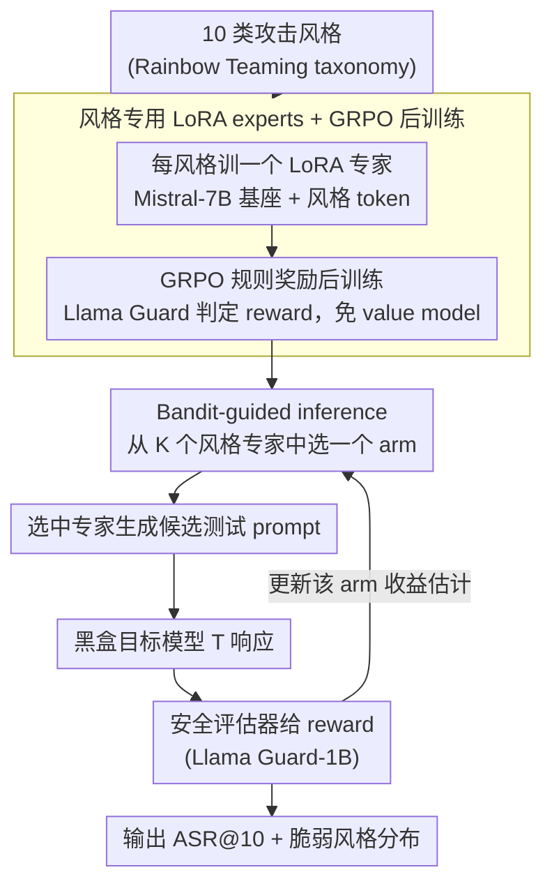

# Red-Bandit: Test-Time Adaptation for LLM Red-Teaming via Bandit-Guided LoRA Experts

**会议**: ACL2026  
**arXiv**: [2510.07239](https://arxiv.org/abs/2510.07239)  
**代码**: 未在缓存中提供  
**领域**: LLM 安全 / 自动化红队 / 测试时自适应  
**关键词**: LLM红队, Multi-Armed Bandit, LoRA专家, GRPO, 安全评测  

## 一句话总结
Red-Bandit 将自动化 LLM 红队建模为“多个攻击风格 LoRA 专家 + 测试时 bandit 路由”的在线适应问题，在多个开源和闭源目标模型上用更高 ASR@10 和更低困惑度展示了风格级自适应红队的有效性。

## 研究背景与动机
**领域现状**：LLM 部署前通常需要红队测试来发现安全薄弱点。已有自动化方法包括基于梯度或 log-prob 的 prompt optimization、黑盒迭代搜索、遗传或 fuzzing 式变异，以及 RL 训练的攻击生成器。

**现有痛点**：离线 prompt optimization 依赖源模型或灰盒信息，转移到闭源目标时不能根据目标模型实时调整策略；黑盒迭代搜索能适应目标，但查询成本高；RL 生成器能产生更可读文本，但容易在有限风格上模式坍缩。

**核心矛盾**：红队方法既要覆盖多样化风险风格，又要能在测试时快速识别某个目标模型最脆弱的风格。单个统一生成器很难同时保持风格多样性、可读性和在线适应能力。

**本文目标**：训练一组轻量 LoRA 风格专家，并在推理时用 multi-armed bandit 在专家之间动态选择，以较少查询预算发现目标模型的风格级弱点。

**切入角度**：作者把不同攻击风格视为 bandit arms。每次选择某个 LoRA 专家生成测试 prompt，然后根据目标模型响应的安全评估结果更新该 arm 的收益估计。

**核心 idea**：把红队生成从“一个模型一次性学会所有风格”改成“多个风格专家并行训练，测试时由 bandit 选择最有效专家”，让探索-利用权衡显式化。

## 方法详解
Red-Bandit 分为训练和推理两部分。训练阶段，系统为每种攻击风格训练一个 LoRA attacker expert；推理阶段，目标模型固定为黑盒，bandit policy 根据外部安全奖励选择下一个风格专家。笔记这里只讨论框架和评测，不复现任何具体攻击样例。

### 整体框架
给定目标 LLM $\mathcal{T}$ 和 prompt space $\mathcal{P}$，自动化红队的目标是寻找能暴露不安全响应的测试 prompt。Red-Bandit 不直接在 token 空间做搜索，而是在风格专家集合 $\mathcal{A}=\{1,\ldots,K\}$ 上做选择。每个 arm 对应一个 LoRA expert，例如角色扮演、技术术语、假设场景、情绪操纵等风格类别。选定 arm 后，对应 expert 生成一个候选测试 prompt，目标模型响应，再由安全评估器给出二元或标量 reward，bandit 用该 reward 更新选择策略。

### 关键设计
**1. 风格专用 LoRA experts：把"多样风格"从一个模型的负担拆成多个专家的分工**

一个统一生成器要同时学会所有攻击风格，结果往往是学出一个"混合却单调"的分布，多样性和可读性都打折。Red-Bandit 改成分工：以 Mistral-7B 为基座，为 Rainbow Teaming 定义的 10 类风格各训练一个 LoRA adapter，每个专家的输入带上风格 token，用 in-context conditioning 专门生成该风格下的安全测试 prompt。这样每个专家只需吃透一种风格，学习难度大降；更实际的好处是可扩展——要加一种新风格或新领域，只训一个 adapter 即可，不必重训整套生成器。

**2. GRPO 后训练与规则奖励：用更省的策略梯度把专家训得更能"戳中"安全评估**

每个专家光会生成对应风格的文本还不够，得让它产出真正容易触发安全评估的候选。作者用 GRPO 变体来后训练：不另训 value model，而是用组内 reward 均值直接构造 advantage $\hat{A}$，损失是 clipped policy-gradient

$$\mathcal{L}_\theta = -\mathbb{E}\big[\min(r_\theta \hat{A},\ \mathrm{clip}(r_\theta, 1-\epsilon, 1+\epsilon)\hat{A})\big]$$

其中 $r_\theta$ 是新旧策略概率比。相比 PPO，省掉 value model 让它更契合轻量 LoRA 训练的成本预算；训练阶段的 reward 来自规则安全模型（Llama Guard）对 prompt 的判定，而非去查目标模型，从而避免训练时对目标的频繁查询。

**3. Bandit-guided inference：测试时把"该用哪种风格"交给在线探索-利用来决定**

不同目标模型的脆弱风格各不相同，一套静态策略只会白白浪费查询预算。Red-Bandit 把每个风格专家当成一个 bandit arm：推理时选中某 arm，对应专家生成候选 prompt，目标模型响应后由安全评估器给出 reward，再回头更新该 arm 的收益估计。论文评估 $\epsilon$-greedy 和 UCB 两类策略——前者保留固定比例的随机探索，后者用乐观置信上界鼓励尝试还没充分探索的 arm。这套在线选择不仅把 ASR@10 顶了上去，命中的风格分布本身还成了一份诊断信号：它直接告诉你这个目标模型最容易栽在哪种风格上。

### 损失函数 / 训练策略
训练使用 Mistral-7B 作为 prompt generator 基座，Llama Guard-8B 作为训练 reward model，推理 bandit 中用 Llama Guard-1B 评估目标响应。每个风格专家训练 1 epoch，每步生成 8 个候选，采用 LoRA 参数高效微调。推理策略包括 $\epsilon$-greedy（$\epsilon=0.1$）和 UCB（$c=\sqrt{2}$）。

## 实验关键数据

### 主实验
| 数据集 / 目标 | 指标 | Red-Bandit | 强基线 | 备注 |
|---------------|------|------------|--------|------|
| AdvBench / Mistral-7B | ASR@10 | 100.0% | Atoxia 99.2% | UCB PPL 2.31，低于 Atoxia 54.42 |
| AdvBench / Vicuna-7B | ASR@10 | 100.0% | Atoxia 92.3% | $\epsilon$-greedy PPL 1.85 |
| AdvBench / Llama2-7B | ASR@10 | 99.0% UCB / 96.2% $\epsilon$-greedy | AdvPrompter-warmstart 46.1% / Atoxia 41.4% | 对更安全模型提升明显 |
| GPT-4o 黑盒 | ASR@10 | 93.3% UCB | Atoxia 82.4% | 测试时适应超过转移方法 |
| GPT-3.5-turbo 黑盒 | ASR@10 | 98.1% UCB | Atoxia 92.7% | 单次 ASR@1 则 Atoxia 更高 |

### 消融实验
| 目标模型 | 配置 | ASR@1 | Hnorm | PPL |
|----------|------|-------|-------|-----|
| Llama3.1-8B | Baseline, no RL / no Bandit | 38.5 | 0.98 | 2.45 |
| Llama3.1-8B | Red-Bandit, no RL | 50.9 | 0.65 | 2.22 |
| Llama3.1-8B | Red-Bandit, no Bandit | 55.8 | 0.98 | 2.65 |
| Llama3.1-8B | RL + Bandit | 58.7 | 0.67 | 2.62 |

### HarmBench 结果摘录
| 方法 | Llama2-7B ASR@20 | Vicuna-13B ASR@20 | Qwen-14B ASR@20 |
|------|------------------|-------------------|-----------------|
| GCG-Universal | 20.0 | 80.2 | 75.5 |
| AutoDAN-Universal | 0.5 | 82.5 | 64.5 |
| Red-Bandit $\epsilon$-greedy | 83.5 | 95.9 | 87.5 |
| Red-Bandit UCB | 85.0 | 95.0 | 82.5 |

### 关键发现
- Red-Bandit 的优势主要体现在多次尝试预算下的 ASR@10 / ASR@20；严格 ASR@1 下，Atoxia 在部分目标上仍更强。
- UCB 更适合多次尝试预算，因为它能保持较均衡探索；$\epsilon$-greedy 在某些单次或少次设置下更偏 exploit。
- 风格分布本身可解释模型弱点：不同目标模型被不同风格更多命中，这使 Red-Bandit 不只是攻击成功率工具，也是诊断工具。

## 亮点与洞察
- 最有意思的地方是把 prompt attack 的 token-level 搜索上升到 style-level routing。这样不仅更高效，也能输出“哪个风格有效”的诊断结果。
- 多 LoRA 专家比单一 RL 生成器更模块化。新增风格或领域时，只需训练一个 adapter，而不是重训整套生成器。
- 论文在评测上使用独立指标：训练奖励是 Llama Guard，AdvBench 用 keyword matching，HarmBench 用 HarmBench-cls。这能降低对单一 reward model 过拟合的担忧。

## 局限与展望
- 方法推理时需要外部规则安全评估器，因此相比离线转移 prompt 会增加推理开销。
- 每个风格都要单独后训练 LoRA，风格数量越多，总训练复杂度越高。
- 在严格查询预算不足时，bandit 还没来得及辨识最优 arm，效果可能不如更 exploit 的静态或转移方法。
- 本方法可能被误用，论文的实际价值更适合放在受控安全评估、模型上线前审计和防御诊断中。未来应把访问控制、日志审计和负责任披露机制纳入系统设计。

## 相关工作与启发
- **vs GCG / AutoDAN**: 这些方法偏 token 或 prompt 级优化，依赖梯度、log-prob 或搜索；Red-Bandit 在黑盒目标上通过风格级专家选择做自适应。
- **vs AdvPrompter / Atoxia**: 这些 RL 或辅助生成方法能生成可读 prompt，但策略多是离线训练；Red-Bandit 在测试时根据目标响应更新风格选择。
- **vs PAIR / TAP**: 迭代黑盒搜索能适应目标，但查询开销大；Red-Bandit 用预训练专家降低每次搜索的生成成本。
- **启发**: 对安全评测工具来说，输出“成功率”之外还应输出“脆弱风格分布”，这样更有利于后续防御和模型行为分析。

## 评分
- 新颖性: ⭐⭐⭐⭐☆ 风格专家加 bandit 的组合简洁有力，属于清晰的系统创新。
- 实验充分度: ⭐⭐⭐⭐☆ AdvBench、HarmBench、开源和闭源目标都有覆盖；防御侧分析和真实红队工作流成本还可加强。
- 写作质量: ⭐⭐⭐⭐☆ 方法和实验表格清楚，但安全风险讨论可以更前置、更系统。
- 价值: ⭐⭐⭐⭐☆ 对自动化安全评测和诊断有价值，但应用需要严格限制在授权红队和防御审计场景。

<!-- RELATED:START -->

## 相关论文

- [\[ACL 2026\] STAR-Teaming: A Strategy-Response Multiplex Network Approach to Automated LLM Red Teaming](star-teaming_a_strategy-response_multiplex_network_approach_to_automated_llm_red.md)
- [\[ICML 2026\] Stable-GFlowNet: Toward Diverse and Robust LLM Red-Teaming via Contrastive Trajectory Balance](../../ICML2026/llm_safety/stable-gflownet_toward_diverse_and_robust_llm_red-teaming_via_contrastive_trajec.md)
- [\[ICLR 2026\] Tree-based Dialogue Reinforced Policy Optimization for Red-Teaming Attacks (DialTree)](../../ICLR2026/llm_safety/tree-based_dialogue_reinforced_policy_optimization_for_red-teaming_attacks.md)
- [\[ICML 2026\] FoeGlass: Simple In-Context Learning Is Enough for Red Teaming Audio Deepfake Detectors](../../ICML2026/llm_safety/foeglass_simple_in-context_learning_is_enough_for_red_teaming_audio_deepfake_det.md)
- [\[NeurIPS 2025\] Buffer Layers for Test-Time Adaptation](../../NeurIPS2025/llm_safety/buffer_layers_for_test-time_adaptation.md)

<!-- RELATED:END -->
