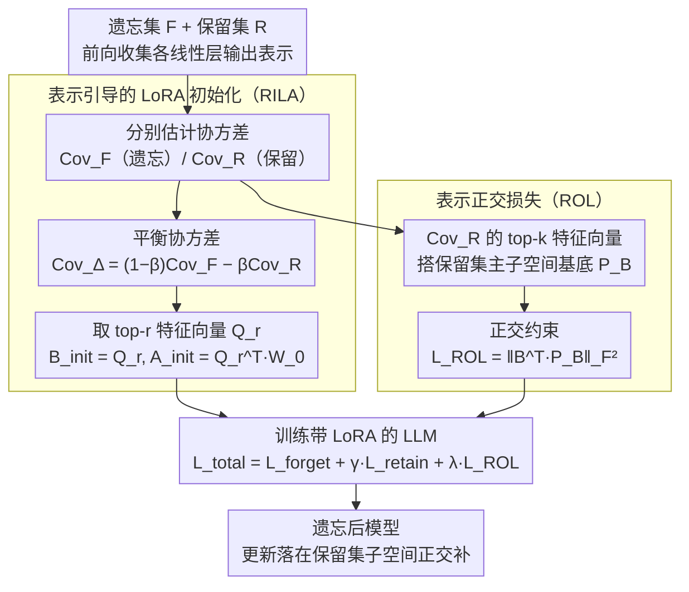

# Representation-Guided Parameter-Efficient LLM Unlearning

**会议**: ACL 2026  
**arXiv**: [2604.17396](https://arxiv.org/abs/2604.17396)  
**代码**: [https://github.com/sustech-nlp/ReGLU](https://github.com/sustech-nlp/ReGLU)  
**领域**: 模型压缩  
**关键词**: LLM遗忘, 表示空间几何, LoRA初始化, 正交正则化, 参数高效

## 一句话总结

提出 ReGLU 框架，将 LLM 遗忘从"参数重要性"范式转向"表示空间几何"范式——通过表示引导的 LoRA 初始化（RILA）将遗忘更新对齐到遗忘/保留集最具区分性的子空间，配合表示正交损失（ROL）约束更新不干扰保留集知识。

## 研究背景与动机

**领域现状**：LoRA-based LLM 遗忘方法已展现出与全量微调相当甚至更好的性能，但仍面临"遗忘-保留权衡"困难——减少遗忘集性能往往以保留集性能下降为代价。

**现有痛点**：FILA、VILA 等方法依赖 Fisher 信息等参数重要性指标来识别"仅与遗忘集相关"的参数。但由于叠加现象（superposition），LLM 参数具有多义性——单个参数同时参与多个概念的表示。因此基于参数重要性的方法无法可靠地分离遗忘和保留相关的参数。

**核心矛盾**：参数级别的重要性度量因多义性而不可靠，但遗忘和保留的知识确实在模型中有不同的表示——需要找到一种更可靠的信号来引导选择性遗忘。

**本文目标**：利用表示子空间的几何特性（而非参数重要性）来实现精确的遗忘-保留分离。

**切入角度**：虽然参数层面存在叠加导致的多义性，但表示子空间可以被更有效地解耦。通过约束遗忘更新在"与遗忘集表示对齐、与保留集表示正交"的子空间中进行，可以更精确地隔离遗忘知识。

**核心 idea**：（1）RILA——构建平衡协方差矩阵 $\text{Cov}_\Delta = (1-\beta)\text{Cov}_F - \beta\text{Cov}_R$，取其 top-r 特征向量初始化 LoRA，使初始更新最大化遗忘集方差同时最小化保留集方差；（2）ROL——约束 LoRA 的上投影矩阵 B 与保留集表示的主子空间正交。

## 方法详解

### 整体框架

ReGLU 包含两个互补组件：RILA 确定 LoRA 的初始化方向（指向哪个子空间遗忘），ROL 在训练过程中持续约束更新不偏向保留集子空间。两者都先把遗忘集与保留集的样本前向喂进模型、收集各线性层输出表示并估计协方差，再分头工作——RILA 用协方差挑出初始化方向，ROL 用协方差搭出需要回避的子空间，最后汇入带 LoRA 的训练。总损失 $\mathcal{L}_{\text{total}} = \mathcal{L}_{\text{forget}} + \gamma \mathcal{L}_{\text{retain}} + \lambda \mathcal{L}_{\text{ROL}}$。

### 关键设计

**1. 表示引导的 LoRA 初始化（RILA）：让 LoRA 的出发方向就站在遗忘和保留最分得开的地方**

旧方法（FILA、VILA）用 Fisher 信息这类参数级重要性来挑 LoRA 的初始化方向，但叠加现象让单个参数同时编码多个概念，重要性度量根本分不清哪些参数"只管遗忘"。RILA 索性绕开参数，直接看表示：对每个线性层，把遗忘集和保留集的样本喂进去、收集该层输出表示，分别算出协方差矩阵 $\text{Cov}_F$ 和 $\text{Cov}_R$。接着构造一个平衡协方差 $\text{Cov}_\Delta = (1-\beta)\text{Cov}_F - \beta\text{Cov}_R$，它的特征向量天然对应"遗忘集方差大、保留集方差小"的方向——也就是承载遗忘知识却不碰保留知识的子空间。取其 top-r 特征向量拼成 $Q_r$，再令 $B_{\text{init}} = Q_r$、$A_{\text{init}} = Q_r^\top W_0$。论文证明这样初始化时目标函数恰好取到最大值，等于让遗忘更新从一开始就瞄准了最具区分性的方向，而不是靠训练慢慢摸索。

**2. 表示正交损失（ROL）：训练全程把更新"困"在不碰保留集的子空间里**

光把起点放对还不够——梯度更新会在训练中慢慢漂移，初始化的几何优势可能被磨没。ROL 给出一道持续生效的约束：先用保留集表示协方差矩阵的 top-k 特征向量搭出基底 $P_B \in \mathbb{R}^{d_{\text{out}} \times k}$，它刻画了保留集知识的主要方向；然后在总损失里加一项 $\mathcal{L}_{\text{ROL}} = \|B^\top P_B\|_F^2$，逼 LoRA 上投影矩阵 $B$ 的列向量与这些主方向正交。这样一来 $\Delta h = B(Ax)$ 始终落在保留集子空间的正交补里，遗忘更新无论怎么走都不会污染保留知识。RILA 管"从哪里出发"，ROL 管"别偏到哪里去"，两者一前一后把遗忘约束在了同一个安全子空间内。

**3. 与现有遗忘损失的兼容性：ReGLU 只换初始化和正则，不绑定具体遗忘目标**

ReGLU 提供的是几何层面的初始化与约束，并不规定遗忘信号本身怎么算，因此 $\mathcal{L}_{\text{forget}}$ 可以自由替换成梯度上升（GA）、NPO、SimNPO、IHL 等任意现成遗忘损失。这一正交性让 ReGLU 像个可即插即用的增强件——哪种遗忘损失更适合当前任务就用哪种，ReGLU 都能在其上叠加表示几何的优势，而不是另起炉灶发明新的遗忘目标。

### 损失函数 / 训练策略

$\mathcal{L}_{\text{total}} = \mathcal{L}_{\text{forget}} + \gamma \mathcal{L}_{\text{retain}} + \lambda \mathcal{L}_{\text{ROL}}$。在 TOFU 和 WMDP 基准上评估，模型包括 Llama-2-7B、Phi-1.5B、Zephyr-7B-beta。

## 实验关键数据

### 主实验

| 模型/方法 | TOFU Forget 1% | Forget 5% | Forget 10% | 平均 |
|----------|---------------|-----------|------------|------|
| Phi-1.5B IHL | -1.3 | -11.5 | -12.4 | -8.4 |
| Phi-1.5B IHL+FILA | -2.5 | -9.3 | -10.3 | -7.4 |
| Phi-1.5B IHL+ReGLU | **-0.1** | **-5.4** | **-7.7** | **-4.4** |

### 消融实验

| 配置 | 效果 | 说明 |
|------|------|------|
| 仅 RILA（无 ROL） | 改善但不充分 | 初始化正确但训练中漂移 |
| 仅 ROL（随机初始化） | 改善但有限 | 约束有效但起点不好 |
| RILA + ROL | 最优 | 初始化+持续约束的协同 |

### 关键发现

- ReGLU 在所有遗忘损失函数下都一致超越 FILA 和 VILA
- IHL + ReGLU 在 Phi-1.5B 上将平均指标从 -7.4 (FILA) 提升至 -4.4
- 几何诊断确认 ReGLU 成功解耦了遗忘和保留的表示
- 在 WMDP 基准上也展现一致优势，证明跨任务泛化性

## 亮点与洞察

- **从"参数重要性"到"表示几何"的范式转换是核心贡献**：叠加现象使得参数级信号不可靠，而表示子空间的几何结构提供了更稳定的分离信号。这一洞察可能推动整个 LLM 遗忘领域的方法论转变
- **平衡协方差矩阵的构造优美**：$\text{Cov}_\Delta = (1-\beta)\text{Cov}_F - \beta\text{Cov}_R$ 的特征向量自然对应于"遗忘集方差大但保留集方差小"的方向，概念直观且有理论支撑
- **RILA 和 ROL 的互补设计**：一个管"从哪里出发"，一个管"不要偏到哪里去"

## 局限与展望

- 需要收集遗忘集和保留集的表示来计算协方差，有前期计算成本
- 超参数 $\beta$（平衡系数）和 $k$（ROL 基底维数）需要调优
- 仅在相对小规模模型（1.5B-7B）上验证
- 协方差估计的质量依赖样本数量，极小遗忘集（1%）可能有噪声

## 相关工作与启发

- **vs FILA/VILA（参数重要性方法）**: 基于 Fisher 信息的参数选择受叠加现象限制，ReGLU 利用表示几何避开了这一问题
- **vs ETW（token级方法）**: ETW 关注"惩罚哪些token"，ReGLU 关注"在哪个子空间更新"，两者正交可组合

## 评分

- 新颖性: ⭐⭐⭐⭐⭐ 从参数重要性到表示几何的范式转换有实质性创新，理论支撑充分
- 实验充分度: ⭐⭐⭐⭐ 两个基准+三个模型+多种遗忘目标，较充分
- 写作质量: ⭐⭐⭐⭐ 动机论证清晰，理论推导严谨

<!-- RELATED:START -->

## 相关论文

- [\[CVPR 2026\] FairLLaVA: Fairness-Aware Parameter-Efficient Fine-Tuning for Large Vision-Language Models](../../CVPR2026/llm_safety/fairllava_fairness-aware_parameter-efficient_fine-tuning_for_large_vision-langua.md)
- [\[ICLR 2026\] LLM Unlearning with LLM Beliefs](../../ICLR2026/llm_safety/llm_unlearning_with_llm_beliefs.md)
- [\[ACL 2026\] SWAN: Semantic Watermarking with Abstract Meaning Representation](swan_semantic_watermarking_with_abstract_meaning_representation.md)
- [\[ACL 2026\] Modeling LLM Unlearning as an Asymmetric Two-Task Learning Problem](modeling_llm_unlearning_as_an_asymmetric_two-task_learning_problem.md)
- [\[ACL 2026\] From Domains to Instances: Dual-Granularity Data Synthesis for LLM Unlearning](from_domains_to_instances_dual-granularity_data_synthesis_for_llm_unlearning.md)

<!-- RELATED:END -->
