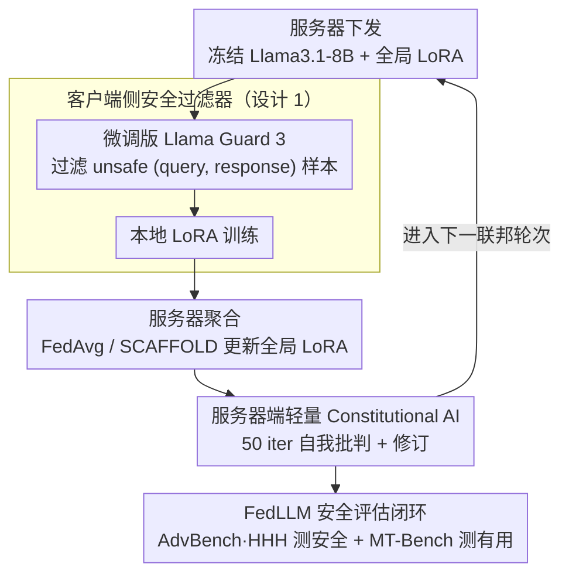

# Responsible Federated LLMs via Safety Filtering and Constitutional AI

**会议**: ACL2026  
**arXiv**: [2502.16691](https://arxiv.org/abs/2502.16691)  
**代码**: 无  
**领域**: LLM安全 / 联邦学习  
**关键词**: Federated LLM, 安全过滤, Constitutional AI, LoRA, 责任式AI

## 一句话总结
这篇论文把安全过滤器和 Constitutional AI 接入 FedLLM 流程，证明有害客户端数据会显著损害全局模型安全，而在客户端过滤数据、在服务器端低成本 CAI 微调可以把 AdvBench 安全分数从约 72% 拉回到 96% 以上。

## 研究背景与动机
**领域现状**：FedLLM 希望用联邦学习在用户侧数据上微调大语言模型，同时避免把原始隐私数据上传到服务器。典型流程是服务器下发冻结的预训练 LLM 和全局 LoRA 权重，客户端只训练本地 LoRA，再把本地 LoRA 上传聚合。

**现有痛点**：过去 FedLLM 工作主要关注隐私、通信和参数高效训练，很少处理 responsible AI 问题。真实客户端对话并不总是干净的，可能包含仇恨、骚扰、偏见或由红队提示诱导出的有害回答；一旦这些样本进入本地训练，本地 LoRA 会学习不安全行为，聚合后又会把风险扩散到所有客户端。

**核心矛盾**：联邦学习保护了数据不出端，但也让服务器难以直接清洗客户端数据；同时，在每个客户端、每轮都做复杂安全对齐又会产生难以接受的计算成本。因此 FedLLM 需要一种既不破坏隐私边界、又足够便宜的安全机制。

**本文目标**：作者要回答三个问题：有害响应会多大程度破坏 FedLLM 的安全性；已有 RAI 技术能否以联邦友好的方式接入；在计算成本受限时，是否仍能获得明显安全收益。

**切入角度**：论文没有重新发明安全对齐算法，而是选择两个成熟组件：客户端侧安全过滤器负责训练前清洗数据，服务器侧 CAI 负责训练后修正全局模型行为。这个拆分正好对应 FedLLM 的两个风险点：本地数据污染和全局模型扩散。

**核心 idea**：用“客户端过滤数据 + 服务器端轻量 CAI”的双层安全护栏，把 FedLLM 中的有害训练样本阻断在本地，并在聚合后的全局模型上补一次安全自我修正。

## 方法详解

### 整体框架
本文以 OpenFedLLM 式的 LoRA 联邦微调为基础。服务器首先下发冻结的 Llama3.1-8B-Instruct 和当前全局 LoRA 权重；客户端用本地数据训练 LoRA，上传本地 LoRA；服务器用 FedAvg 或 SCAFFOLD 聚合，更新全局 LoRA。作者在这个循环中加入两道 RAI 处理：训练前，每个客户端用服务器提供的 Llama Guard 3 安全过滤器筛掉不安全的 `(query, response)` 样本；聚合后，服务器只对全局模型做少量 Constitutional AI 训练，让模型学习批判和修正有害回答。

这个设计的关键是安全操作不需要服务器读取客户端原始数据。过滤器可以作为模型下发到客户端本地运行，CAI 则只作用于服务器已经持有的全局模型权重。换言之，它把“数据侧风险”和“模型侧风险”分别放在各自可操作的位置处理。

### 关键设计
**1. 客户端侧安全过滤器：在数据离不开本地的约束下，把坏样本挡在训练之前**

FedLLM 的服务器看不到客户端原始数据，传统那套"集中清洗数据"的做法在这里行不通，于是数据清洗只能放到客户端本地做。作者把 Llama Guard 3 当作 `(query, response)` 安全分类器下发到客户端，在本地 LoRA 训练前先把判定为 unsafe 的样本删掉，从源头降低有害响应混进联邦聚合的概率。但直接拿原始 LG3 不行——它在该任务上几乎把所有样本都判成安全，recall 只有 0.5%，等于形同虚设；因此作者先在 S-LG20K 上微调，把它适配到 SQuARe 风格数据。选过滤器而非别的方案也正合联邦场景：它只需本地推理、不需要客户端额外训练，开销天然友好。

**2. 服务器端轻量 Constitutional AI：在聚合后的全局模型上补一次低成本的安全自我修正**

过滤器只能拦住进入训练的坏数据，对已经渗进模型行为层的不安全倾向无能为力，这就需要在聚合之后再对全局模型做一次纠偏。作者用 Constitutional AI：让模型依据"不要生成有害回答"等宪法式原则先自我批判、再自我修订，最后用修订后的数据继续训练。关键在于成本控制——完整 CAI 每轮要跑一整个 epoch，论文实测 4 张 A100 上约 80 分钟，塞进每一轮联邦循环显然不现实；作者把它砍到只在全局模型上跑 50 iterations，每轮约 3.2 分钟，计算时间直降 96%，却仍保住了主要的安全收益。CAI 只作用于服务器已经持有的全局权重，因此完全不触碰隐私边界。

**3. FedLLM 安全评估闭环：同时盯住安全和有用，别让模型只学会"拒答"**

如果只测安全过滤本身，根本看不出过滤后的全局模型是否还能好好回答问题；只测单个联邦算法，也说不清这套方案是不是依赖某个特定聚合器。为此作者搭了一个双维度评估闭环：安全性用 AdvBench 和 HHH，有用性用 MT-Bench，联邦算法同时跑 FedAvg 和 SCAFFOLD。训练集 SQuARe20K 被刻意构造成 6K red + 14K acceptable 的混合、每个客户端约 30% 有害内容，用来逼真模拟被污染的联邦数据分布。正是这套闭环让"安全分回升、有用性不塌、且不挑聚合器"的结论站得住。

### 损失函数 / 训练策略
基础 LLM 是 Llama3.1-8B-Instruct，微调方式是 LoRA。实验设置为 20 个客户端、50 个联邦轮次、每轮采样 5 个客户端、每客户端每轮 25 iterations，batch size 为 16。SQuARe20K 平均划分成 20 份，每份 1K 样本。LG3 在 S-LG20K 上训练 5 epochs；CAI 使用 S-CAI20K，对全局模型执行约 50 iterations 的轻量训练。论文没有提出新损失函数，主要贡献是把安全过滤和 CAI 的训练位置、频率与成本约束适配到 FedLLM。

## 实验关键数据

### 主实验
| 联邦算法 | 方法 | AdvBench 安全分 | HHH 安全分 | MT-Bench 有用性 |
|----------|------|----------------|------------|-----------------|
| FedAvg | Llama3.1-8B-Instruct | 99.6 | 60.0 | 6.8 |
| FedAvg | FL | 72.5 | 49.3 | 2.7 |
| FedAvg | FL + Safety filter | 81.2 | 51.8 | 2.4 |
| FedAvg | FL + CAI | 96.2 | 57.3 | 5.8 |
| FedAvg | FL + Safety filter + CAI | 96.3 | 63.7 | 6.1 |
| SCAFFOLD | FL | 72.7 | 49.5 | 2.9 |
| SCAFFOLD | FL + Safety filter | 78.8 | 54.6 | 2.7 |
| SCAFFOLD | FL + CAI | 96.5 | 62.6 | 5.9 |
| SCAFFOLD | FL + Safety filter + CAI | 97.1 | 63.9 | 5.8 |

### 消融实验
| 配置 | 关键指标 | 说明 |
|------|---------|------|
| 原始 LG3 | Acc. 70.1 / Precision 90.6 / Recall 0.5 / Hmean 1.0 | 几乎不抓 unsafe 样本，不能直接作为客户端过滤器 |
| Finetuned LG3 | Acc. 75.5 / Precision 56.7 / Recall 73.7 / Hmean 64.1 | 微调后召回显著提高，更适合作为训练前过滤器 |
| 完整 CAI | 每轮约 80 分钟 | 4 张 A100 上训练 1 epoch，成本不适合每轮联邦循环 |
| 轻量 CAI | 每轮约 3.2 分钟 | 只训练 50 iterations，训练时间减少 96% |

### 关键发现
- 有害本地数据对 FedLLM 的破坏很大：FedAvg 的 AdvBench 从 99.6 降到 72.5，HHH 从 60.0 降到 49.3，MT-Bench 从 6.8 降到 2.7。
- Safety filter 单独使用能提升安全，但可能略伤有用性；CAI 单独使用提升更明显，FedAvg 下 AdvBench 从 72.5 到 96.2，MT-Bench 从 2.7 到 5.8。
- 两者组合在 HHH 上有互补收益：FedAvg 的 HHH 从 CAI 单独的 57.3 进一步到 63.7，说明数据侧清洗和模型侧对齐处理的是不同风险。

## 亮点与洞察
- 论文最重要的价值不是新算法，而是指出 FedLLM 的安全传播风险：一个客户端的有害数据可以通过聚合变成所有客户端共享的全局风险，这比单机微调更值得警惕。
- Safety filter 和 CAI 的分工很清楚：前者阻止坏样本进入训练，后者修正已经形成的模型行为。这个双层结构可以迁移到医疗、金融等隐私敏感场景中的联邦对齐。
- 轻量 CAI 的实验很实用。虽然它没有和标准 CAI 做完整对比，但“96% 成本下降且安全分数接近恢复”说明在联邦循环里，少量全局安全修正可能比频繁客户端对齐更划算。

## 局限与展望
- 作者明确承认没有实验标准 CAI 设置，即每个客户端、每轮、完整 epoch 的 CAI，因此无法判断轻量 CAI 与完整 CAI 的安全上限差距。
- 安全过滤器的 recall 仍不是满分，Finetuned LG3 的 Hmean 只有 64.1%，意味着仍会漏掉一部分有害训练样本。
- 实验只模拟 30% harmful content、20 客户端的设置，真实 FedLLM 中客户端异质性、攻击者比例和恶意数据分布可能更复杂。
- 后续可以研究更强的本地安全分类器、按风险动态触发 CAI 的策略，以及在隐私攻击、后门攻击和安全对齐之间的联合评估。

## 相关工作与启发
- **vs OpenFedLLM**: OpenFedLLM 提供 FedLLM 训练与评测框架，本文在其上加入 RAI 组件，关注的是有害训练数据导致的安全退化。
- **vs Llama Guard 3**: LG3 原本是通用安全分类器，本文发现直接迁移到 FedLLM 数据过滤效果很差，需要用 S-LG20K 微调才能获得可用召回。
- **vs Constitutional AI**: 传统 CAI 通常在集中式训练中完整执行，本文把它改成只作用于全局模型的低迭代版本，以适配联邦场景的计算约束。
- **启发**: 对联邦大模型而言，“隐私保护”不等于“安全可信”；未来 FedLLM 论文应把本地数据污染、全局扩散和安全对齐成本作为默认评估维度。

## 评分
- 新颖性: ⭐⭐⭐⭐☆ 把成熟 RAI 技术放进 FedLLM 的位置设计很直接，但问题定义和风险实证有新意。
- 实验充分度: ⭐⭐⭐⭐☆ 覆盖 FedAvg/SCAFFOLD、安全/有用性和成本分析，但缺少标准 CAI、更多攻击比例和真实客户端异质性实验。
- 写作质量: ⭐⭐⭐⭐☆ 结构清楚，主表能直接支撑结论，方法部分偏短但够明白。
- 价值: ⭐⭐⭐⭐☆ 对 FedLLM 安全研究有很强提醒意义，尤其适合后续做联邦对齐、安全过滤和客户端风险建模的基线。

<!-- RELATED:START -->

## 相关论文

- [\[ACL 2026\] SHAPE: Unifying Safety, Helpfulness and Pedagogy for Educational LLMs](shape_unifying_safety_helpfulness_and_pedagogy_for_educational_llms.md)
- [\[AAAI 2026\] FedP²EFT: Federated Learning to Personalize PEFT for Multilingual LLMs](../../AAAI2026/llm_safety/fedp2eft_federated_learning_to_personalize_peft_for_multilingual_llms.md)
- [\[ACL 2026\] Robust Multimodal Safety via Conditional Decoding](robust_multimodal_safety_via_conditional_decoding.md)
- [\[ICML 2026\] BioAgent Bench: An AI Agent Evaluation Suite for Bioinformatics](../../ICML2026/llm_safety/bioagent_bench_an_ai_agent_evaluation_suite_for_bioinformatics.md)
- [\[ACL 2026\] XOXO: Stealthy Cross-Origin Context Poisoning Attacks against AI Coding Assistants](xoxo_stealthy_cross-origin_context_poisoning_attacks_against_ai_coding_assistant.md)

<!-- RELATED:END -->
