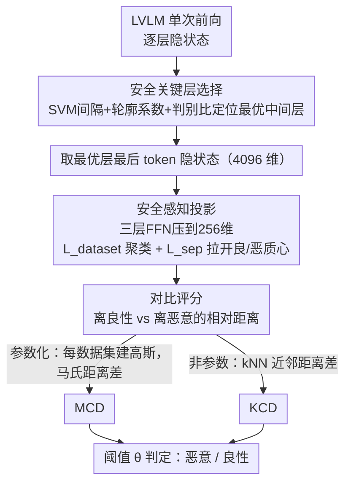

# Rethinking Jailbreak Detection of Large Vision Language Models with Representational Contrastive Scoring

**会议**: ACL 2026  
**arXiv**: [2512.12069](https://arxiv.org/abs/2512.12069)  
**代码**: [sarendis56/Jailbreak_Detection_RCS](https://github.com/sarendis56/Jailbreak_Detection_RCS)  
**领域**: AI安全 / 多模态VLM  
**关键词**: 越狱检测, 表征对比评分, 大型视觉语言模型, OOD检测, 安全对齐

## 一句话总结

提出表征对比评分（RCS）框架，通过分析 LVLM 内部中间层表征的几何结构，用轻量投影和对比评分区分恶意意图与良性分布偏移，在跨攻击类型泛化的严格评估协议下实现 SOTA 越狱检测性能。

## 研究背景与动机

**领域现状**：大型视觉语言模型面临越来越多的多模态越狱攻击——对抗图像、跨模态提示注入、文本越狱迁移等。防御方法需要同时满足对未知攻击的泛化能力和实时部署的计算效率。

**现有痛点**：现有防御策略存在根本性矛盾。安全对齐和输入过滤器针对已知攻击模式设计，对新型攻击泛化能力差；基于一致性检查、梯度计算或多次推理的方法计算开销大，不适合高吞吐场景。轻量的异常检测方法（如 JailDAM）将越狱检测视为 OOD 问题，但其单类设计只建模良性分布，无法区分"恶意意图"和"良性分布偏移"，导致严重的过度拒绝问题。

**核心矛盾**：单类 OOD 检测将所有偏离良性分布的输入都视为恶意，但现实中大量未见过的合法输入也会偏离训练分布。JailDAM 在引入未见良性数据（如医学 VQA）后精确率从 94.9% 暴跌至 56.9%。

**本文目标**：设计一种既高效又能区分恶意意图与单纯分布偏移的检测方法。

**切入角度**：表征工程研究表明 LLM 的中间层表征编码了关于输入安全性的丰富语义信息，恶意和良性输入在特定层存在可分的几何签名。这些信号比 CLIP 等通用嵌入更具判别力。

**核心 idea**：检查 LVLM 内部中间层表征的几何结构，学习轻量投影最大化良性/恶意输入的分离度，用对比评分（到良性 vs 恶意样本的相对距离）进行判别。

## 方法详解

### 整体框架

RCS 想解决的是：怎么用 LVLM 自己的一次前向传播，又快又准地把恶意越狱输入和"只是没见过的良性输入"分开。它的流水线是先在模型内部找到安全信号最强的那一层，把这层的隐状态投影到一个放大安全信号的低维空间，再用"离良性样本多近、离恶意样本多远"的相对距离打分。这套框架可以实例化成两种检测器：参数化的 MCD（马氏距离对比检测）建模每个数据集的高斯分布，非参数化的 KCD（K 近邻对比检测）直接比近邻距离。

### 关键设计

**1. 安全关键层选择：用几何指标原则性地定位安全信号最强的中间层**

如果随便挑一层来做检测，效果会很不稳定，因为不同深度的表征承载的信息完全不同——早期层只捕获低级特征，最后一层又过度特化于预训练的下一个 token 预测目标，真正编码"这句话是不是恶意"这种高级语义抽象的是中间层。RCS 不靠手感选层，而是用 SGXSTest 这个语义近似的良性/恶意配对数据集，给每一层算三个互补指标：SVM 最大间隔分离度、衡量聚类凝聚度的轮廓系数、以及类间距除以类内方差的判别比。三者综合得分最高的层就是最优层，实验里这个"甜点区"非常一致地落在 LLaVA 的 14–16 层、Qwen 的 20–22 层。

**2. 安全感知投影：把高维隐状态压到低维并放大安全相关信号**

直接拿原始 4096 维隐状态做检测会踩维度灾难的坑——协方差估计和 kNN 搜索都不稳定，而且这么高的维度里塞满了和安全无关的任务维度，把真正的安全信号淹没了。RCS 取最优层上最后一个 token 的隐状态（它聚合了解码前的全部上下文），用一个三层前馈网络投影到 256 维空间。投影的训练目标融合两个损失：数据集聚类损失 $\mathcal{L}_{dataset}$ 让同一数据集内聚、不同数据集分离，安全分离损失 $\mathcal{L}_{sep}$ 直接最大化良性质心和恶意质心之间的距离。压维之后噪声被剔除、安全信号被拉开，这也是它比直接 PCA 降维效果更好的原因。

**3. 对比评分：用到良性和恶意两个分布的相对距离来判定，而不是只看离良性多远**

这是 RCS 和 JailDAM 这类单类 OOD 方法的本质区别。单类方法只建模良性分布，把所有偏离良性的输入都当成恶意，结果一旦引入没见过的合法输入（如医学 VQA），精确率从 94.9% 暴跌到 56.9%——它根本分不清"恶意意图"和"良性分布偏移"。RCS 同时参考良性和恶意两侧：MCD 把每个数据集建模为独立高斯，用 Ledoit-Wolf 收缩估计保证协方差数值稳定，评分取离最近良性分布和最近恶意分布的马氏距离之差

$$s_{\text{MCD}} = \min_{d \in \text{benign}} D_M - \min_{d \in \text{malicious}} D_M$$

KCD 则不做任何分布假设，归一化特征后直接比到第 $k$ 近良性邻居和第 $k$ 近恶意邻居的距离差 $s_{\text{KCD}} = \|z - z_{(k)}^{\text{benign}}\| - \|z - z_{(k)}^{\text{malicious}}\|$。这种相对评分恰好近似了最优贝叶斯决策所需的对数似然比，所以即便涌入大量未见良性数据也不会崩，两种实例化都能保持鲁棒。

### 损失函数 / 训练策略

投影网络训练目标 $\mathcal{L} = \alpha \mathcal{L}_{dataset} + \beta \mathcal{L}_{sep}$。阈值 $\theta$ 在训练集验证划分上校准，最大化平衡准确率和 F1 分数的加权组合。整个检测在解码前完成，避免生成有害内容。

## 实验关键数据

### 主实验

| 方法 | 模型 | Accuracy (%) | AUROC (%) | AUPRC (%) | FPR (%) |
|--------|------|------|----------|------|------|
| MCD (本文) | LLaVA L16 | 91.0±2.3 | 98.6±0.1 | 98.8±0.1 | 15.2±5.2 |
| KCD (本文) | LLaVA L16 | 92.0±2.1 | 97.7±0.9 | 97.2±1.2 | 10.1±6.1 |
| HiddenDetect | LLaVA | 81.6 | 90.1 | 90.0 | 16.8 |
| JailDAM | CLIP | 71.7 | 78.9 | 82.6 | 27.1 |
| GradSafe | LLaVA | 66.5 | 75.4 | 79.4 | 64.9 |

### 消融实验

| 配置 | 说明 | 关键结果 |
|------|---------|------|
| JailDAM 简化评估 | 单一良性数据集 | AUROC 91.3%, Precision 94.9% |
| JailDAM 鲁棒评估 | + 未见良性数据 | AUROC 70.6%, Precision 56.9% |
| 无投影 (原始特征) | 直接用高维隐状态 | 性能显著下降 |
| PCA 降维 | 替代学习投影 | 不如安全感知投影 |

### 关键发现

- LVLM 内部表征包含极其丰富的安全信号：简单的马氏距离 OOD 检测直接用 LLaVA 中间层特征即可达到 99.4% AUROC，远超 JailDAM 的 95.3%
- 中间层一致优于早期和最终层，且这个"甜点区"可以用噪声较大的非配对数据可靠识别
- 对比评分是关键：单类检测在引入未见良性数据后崩溃，对比框架保持鲁棒
- 两种实例化（MCD 和 KCD）都有效，说明框架的有效性不依赖特定分布假设

## 亮点与洞察

- **表征工程视角的安全检测**：不依赖外部模型或多次推理，仅用目标 LVLM 自身的一次前向传播的中间层特征，计算开销极低。这个思路可迁移到任何 LLM 的安全防护场景
- **原则性层选择方法**：用三个互补几何指标联合评估层的判别力，避免了手动选层的不确定性，且结论在不同模型间一致（中间层最佳）
- **对比评分 vs 单类检测**：JailDAM 精确率暴跌的实验是一个极其有力的 motivation，清楚说明了为什么需要同时建模良性和恶意分布

## 局限与展望

- 需要少量恶意样本参与训练投影网络，虽然不需要与测试攻击类型相同，但零恶意样本场景下不适用
- 评估限于三个 LVLM 和有限的攻击类型，更广泛的模型和攻击覆盖有待验证
- 投影维度（256）和 kNN 的 k 值（50）是手动设定的，自动选择可能进一步提升性能
- 可探索：将 RCS 与安全对齐结合形成双保险、动态层选择（推理时自适应选层）

## 相关工作与启发

- **vs JailDAM**：JailDAM 用 CLIP 嵌入做单类 OOD 检测，但 CLIP 不编码目标模型的安全特有信号，且单类设计导致过度拒绝；RCS 用目标模型自身中间层+对比评分，根本性解决这两个问题
- **vs GradSafe/HiddenDetect**：GradSafe 需要梯度计算、HiddenDetect 需要多层特征聚合，计算开销更大；RCS 仅需单层最后 token 特征+轻量投影，更加高效

## 评分

- 新颖性: ⭐⭐⭐⭐ 将表征工程和 OOD 检测巧妙结合用于多模态越狱检测，思路清晰且有效
- 实验充分度: ⭐⭐⭐⭐⭐ 跨模型、跨攻击类型的严格评估，消融和 motivation 实验设计精妙
- 写作质量: ⭐⭐⭐⭐⭐ 论证逻辑严密，从 motivation 实验到方法设计到验证一气呵成
- 价值: ⭐⭐⭐⭐ 为 LVLM 安全部署提供了实用且高效的检测方案

<!-- RELATED:START -->

## 相关论文

- [\[ACL 2026\] GAMBIT: A Gamified Jailbreak Framework for Multimodal Large Language Models](gambit_a_gamified_jailbreak_framework_for_multimodal_large_language_models.md)
- [\[ACL 2026\] Seeing No Evil: Blinding Large Vision-Language Models to Safety Instructions via Adversarial Attention Hijacking](seeing_no_evil_blinding_large_vision-language_models_to_safety_instructions_via_.md)
- [\[ICML 2025\] Unlocking the Capabilities of Large Vision-Language Models for Generalizable and Explainable Deepfake Detection](../../ICML2025/llm_safety/unlocking_the_capabilities_of_large_vision-language_models_for_generalizable_and.md)
- [\[ACL 2026\] When Models Outthink Their Safety: Unveiling and Mitigating Self-Jailbreak in Large Reasoning Models](when_models_outthink_their_safety_unveiling_and_mitigating_self-jailbreak_in_lar.md)
- [\[CVPR 2026\] Towards Robust Multimodal Large Language Models Against Jailbreak Attacks](../../CVPR2026/llm_safety/towards_robust_multimodal_large_language_models_against_jailbreak_attacks.md)

<!-- RELATED:END -->
