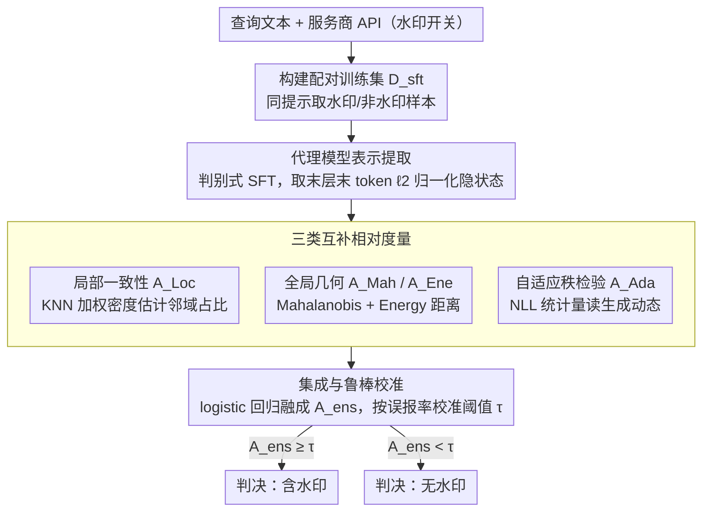

# Rethinking LLM Watermark Detection in Black-Box Settings: A Non-Intrusive Third-Party Framework

**会议**: ACL 2026 Findings  
**arXiv**: [2603.14968](https://arxiv.org/abs/2603.14968)  
**代码**: 无  
**领域**: AI安全 / 水印检测  
**关键词**: LLM水印, 黑盒检测, 第三方审计, 假设检验, 代理模型

## 一句话总结
提出 TTP-Detect，首个将水印检测与注入解耦的黑盒第三方水印验证框架，通过代理模型放大水印信号并结合局部一致性、全局几何和自适应秩检验三类互补度量，在不访问密钥或内部模型状态的情况下实现跨水印方案的高精度检测。

## 研究背景与动机

**领域现状**：LLM 水印通过在生成过程中嵌入统计信号实现内容溯源，是对抗 AI 生成虚假信息的重要机制。现有方案（KGW、AAR 等）均依赖密钥来检测水印。

**现有痛点**：水印注入和检测紧耦合——检测必须使用与注入相同的密钥。法院或平台审核员无法独立验证水印，必须依赖服务提供商的不透明声明。若向第三方披露密钥则会危及安全性（对手可模仿或去除水印）。

**核心矛盾**：现有私钥方案无法同时支持独立验证和保持密钥保密性，使得真正的第三方审计不可能实现。即使近期的公开可验证方案也仍然将检测逻辑与特定注入机制绑定。

**本文目标**：设计一个与密钥无关的黑盒检测框架，使可信第三方（TTP）仅从输出文本即可判断是否含水印。

**切入角度**：将绝对阈值检测重构为相对假设检验问题——判断查询文本更符合水印分布还是非水印分布。

**核心 idea**：通过代理模型放大水印相关差异，结合局部一致性、全局几何和自适应秩检验三类互补度量来捕捉不同水印方案的统计特征。

## 方法详解

### 整体框架
TTP-Detect 要解决的核心矛盾是：水印的检测一直和注入绑死在同一把密钥上，第三方（法院、平台审核员）拿不到密钥就没法独立验证内容是否含水印。它把整件事重构成一个三方协作的相对假设检验：用户提交一段查询文本，服务提供商暴露一个支持水印开关的 API，可信第三方审计员（TTP）通过这个 API 拿到同提示下的水印/非水印参考样本，再用一个代理模型把文本映射到放大水印差异的表示空间，最后用三类互补度量集成出"这段文本更像水印分布还是非水印分布"的判决——全程不碰密钥，也不看模型内部状态。

### 关键设计

**1. 代理模型表示提取：把文本映射到能放大水印差异的表示空间**

直接从原始文本上读水印信号太微弱，因为水印只是生成时嵌入的一点统计偏置，肉眼和简单统计量都抓不住。TTP-Detect 先用服务商 API 构建训练集 $\mathcal{D}_{sft}$——同一个提示下分别要一份开水印和一份关水印的文本配对，然后对一个代理模型做判别式指令微调，让它学着预测"这段是不是水印文本"。微调后取代理模型最后一层、最后一个 token 的 $\ell_2$ 归一化隐状态作为表示，这样的表示空间里水印文本和非水印文本天然就被拉开了，后续的几何度量才有发挥空间。

**2. 三类互补相对度量：从局部、全局、动态三个统计尺度同时找水印迹象**

不同水印方案（KGW、SynthID、Unbiased…）留下的痕迹分布在不同统计尺度上，靠单一统计量没法普适，所以 TTP-Detect 把三种视角组合起来互补覆盖。局部一致性检验 $A_{Loc}$ 用 KNN 加权密度估计查询文本邻域里水印样本的占比，看的是"近邻像谁"；全局几何检验从分布形状切入，用 Mahalanobis 距离 $A_{Mah}$ 捕捉协方差结构、用 Energy 距离 $A_{Ene}$ 处理非高斯分布；自适应秩检验 $A_{Ada}$ 则从代理模型的 NLL 统计量（全局交叉熵和局部波动性）里读生成动态留下的水印痕迹，并自适应地推断水印效应的方向。三者分别盯邻域、盯分布、盯似然，凑成一个完整的检测视角。

**3. 集成与鲁棒校准：把多个度量融成一个能扛对抗扰动的统一判决分数**

有了多维度量还需要一个可靠的融合和判定方式，尤其要经得起对手的扰动攻击和监管级别的证据标准。TTP-Detect 用一个 logistic 回归把所有度量压成单分数

$$A_{ens} = \sigma(\mathbf{w}^\top \mathbf{A} + b)$$

其中权重在一个特意混入对抗扰动样本的增强验证集上训练，让集成器学会在被攻击时也别误判。最终阈值 $\tau$ 则按目标误报率在大规模良性文本集上校准，这样输出的判决才有"误报率受控"这种可以拿去做法律/监管依据的保证。

### 损失函数 / 训练策略
代理模型通过条件负对数似然进行 SFT。集成权重通过 logistic 回归在增强验证集上学习。检测阈值通过控制误报率校准。

## 实验关键数据

### 主实验

| 水印方案 | TPR↑ | TNR↑ | F1↑ | AUC↑ |
|----------|------|------|-----|------|
| KGW (Llama-3.1-8B, C4) | 0.980 | 0.980 | 0.980 | 0.998 |
| Unigram (Llama-3.1-8B, C4) | 1.000 | 0.990 | 0.995 | 0.999 |
| SWEET (Llama-3.1-8B, C4) | 0.985 | 0.965 | 0.975 | 0.997 |
| SynthID (Llama-3.1-8B, C4) | 0.865 | 0.930 | 0.894 | 0.938 |
| Unbiased (Llama-3.1-8B, C4) | 0.870 | 0.845 | 0.859 | 0.911 |
| UPV (基线) | 0.985 | 0.980 | 0.983 | 0.991 |

### 消融实验

| 配置 | F1↑ | 说明 |
|------|-----|------|
| Full TTP-Detect | 0.980 | 完整模型 |
| w/o Local Consistency | - | 去掉局部一致性检验 |
| w/o Global Geometry | - | 去掉全局几何检验 |
| w/o Adaptive Rank | - | 去掉自适应秩检验 |

### 关键发现
- TTP-Detect 在 logits-based 水印（KGW、Unigram）上几乎完美检测（F1>0.97），在 distribution-preserving 方案（SynthID、Unbiased）上仍保持 0.85+ F1
- 跨模型（Llama-3.1-8B、OPT-6.7B）和跨数据集（C4、OpenGen）泛化性良好
- SymMark（合成方案）达到完美检测（TPR/TNR/F1/AUC 均为 1.0）
- 三类度量互补性强，去掉任一类都会导致特定水印方案上性能下降

## 亮点与洞察
- 将水印检测从"绝对阈值"重构为"相对假设检验"是关键创新，使得在不知道密钥的情况下检测成为可能。这种思路可推广到其他需要黑盒检测的场景
- 三类互补度量的设计非常系统化：局部看邻域、全局看分布、动态看似然，形成完整的检测视角
- 自适应秩检验中自动推断水印效应方向的设计很实用，避免了对特定水印机制的先验假设

## 局限与展望
- 需要通过 API 获取参考样本（水印/非水印对），依赖于服务商提供水印开关
- 代理模型的判别能力受限于 SFT 训练数据质量和规模
- 在 distribution-preserving 方案上检测性能相对较弱（F1~0.85），这类方案设计初衷就是减小可检测性
- 未来可探索零样本或少样本参考下的检测

## 相关工作与启发
- **vs KGW 原始检测器**: 需要密钥和知道具体方案，本文完全无需
- **vs UPV**: 仍然依赖注入端共享参数，本文完全解耦注入与检测
- **vs PVMark**: 用零知识证明包装检测器，但仍需方案特定电路，本文方案无关

## 评分
- 新颖性: ⭐⭐⭐⭐⭐ 首次实现真正的方案无关黑盒第三方水印检测
- 实验充分度: ⭐⭐⭐⭐ 覆盖多种水印方案和模型，但缺少对抗攻击的详细消融
- 写作质量: ⭐⭐⭐⭐ 框架描述清晰，数学表述严谨
- 价值: ⭐⭐⭐⭐⭐ 解决了 AI 治理中的关键信任问题，有直接的监管应用价值

<!-- RELATED:START -->

## 相关论文

- [\[AAAI 2026\] PSM: Prompt Sensitivity Minimization via LLM-Guided Black-Box Optimization](../../AAAI2026/llm_safety/psm_prompt_sensitivity_minimization_via_llm-guided_black-box_optimization.md)
- [\[AAAI 2026\] GraphTextack: A Realistic Black-Box Node Injection Attack on LLM-Enhanced GNNs](../../AAAI2026/llm_safety/graphtextack_a_realistic_black-box_node_injection_attack_on_llm-enhanced_gnns.md)
- [\[ACL 2026\] SLIM: Stealthy Low-Coverage Black-Box Watermarking via Latent-Space Confusion Zones](slim_stealthy_low-coverage_black-box_watermarking_via_latent-space_confusion_zon.md)
- [\[ACL 2026\] Rethinking Jailbreak Detection of Large Vision Language Models with Representational Contrastive Scoring](rethinking_jailbreak_detection_of_large_vision_language_models_with_representati.md)
- [\[ICML 2025\] An Attack to Break Permutation-Based Private Third-Party Inference Schemes for LLMs](../../ICML2025/llm_safety/an_attack_to_break_permutation-based_private_third-party_inference_schemes_for_l.md)

<!-- RELATED:END -->
