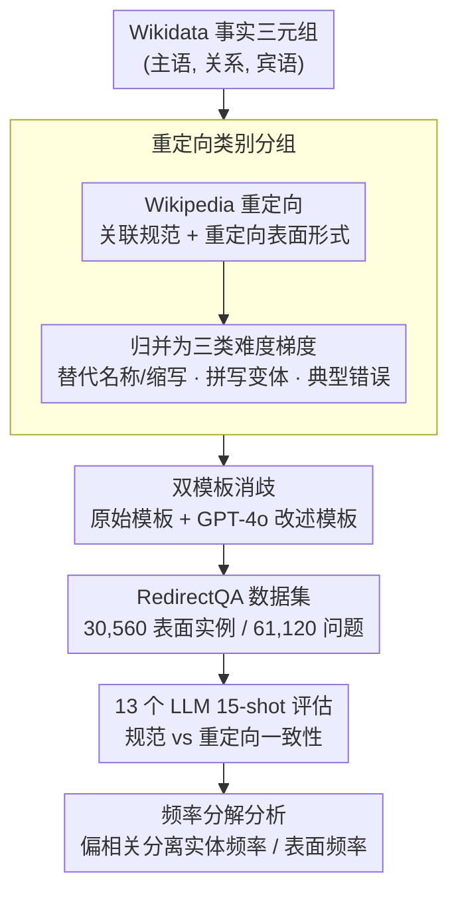

# Revisiting Non-Verbatim Memorization in Large Language Models: The Role of Entity Surface Forms

**会议**: ACL 2026  
**arXiv**: [2604.21882](https://arxiv.org/abs/2604.21882)  
**代码**: [https://huggingface.co/datasets/naist-nlp/RedirectQA](https://huggingface.co/datasets/naist-nlp/RedirectQA) (数据集)  
**领域**: LLM/NLP  
**关键词**: 非逐字记忆, 实体表面形式, 事实问答, 频率分析, RedirectQA

## 一句话总结
本文通过构建 RedirectQA 数据集（利用 Wikipedia 重定向信息将同一实体关联到多种表面形式），系统研究了 LLM 的非逐字记忆如何受实体命名变体的影响，发现事实记忆既非纯粹依赖特定表面形式也非完全表面无关，且实体级频率在表面频率之外仍有独立贡献。

## 研究背景与动机

**领域现状**：大语言模型在参数中存储了大量事实知识，可以在无外部检索的情况下回答知识密集型问题。基于实体的问答 (entity-based QA) 是分析非逐字记忆的常见框架，已有研究表明低频/低知名度实体的事实更不容易被记忆。

**现有痛点**：典型评估中，每个实体只使用一个规范的表面形式（如 Wikipedia 标题）来查询模型。这使得我们难以区分模型是否"记住了关于实体的事实"还是仅仅"通过特定名称可以访问该事实"。例如，模型对"Pelé"回答正确，但对"Edson Arantes do Nascimento"可能回答错误——底层事实相同，只是名称不同。

**核心矛盾**：初步诊断发现 Pythia-12B 上 23.7% 的规范-重定向问题对产生了不一致的预测。这意味着现有的单一表面形式评估严重低估了事实访问的不可靠性，基于规范名称的评估可能遗漏大量表面条件化的失败案例。

**本文目标**：（1）构建一个控制事实三元组不变、仅变化实体表面形式的 QA 数据集；（2）系统评估表面形式变化对事实 QA 的影响；（3）分析实体级和表面级频率各自对记忆准确率的贡献。

**切入角度**：利用 Wikipedia 的重定向页面作为实体表面形式的自然资源。重定向页面带有类别标注（别名、缩写、拼写变体、常见错误等），可以进行受控分析。

**核心 idea**：固定事实三元组和标准答案，仅变化主语实体的表面形式，通过 Wikipedia 重定向结构构建大规模受控 QA 数据集 RedirectQA，量化表面形式对事实访问的影响。

## 方法详解

### 整体框架
RedirectQA 的构建分三步：（1）从 Wikidata 收集事实三元组 (subject, relation, object)；（2）利用 Wikipedia 重定向信息为每个主语实体关联规范表面形式和重定向表面形式，并按类别分组；（3）使用关系特定模板将表面实例渲染为问题。数据集建好后，在多个 LLM 上跑一致性评估，并对准确率做实体频率与表面频率的偏相关分解。最终数据集包含 30,560 个表面实例、14,672 个事实三元组、61,120 个问题实现。

### 关键设计

**1. 重定向类别分组：把"名称变体"切成可量化的难度梯度**

如果只是笼统地说"换个名字模型就答错了"，无法区分到底是大小写这种小扰动还是别名这种大改写在作怪。本文从 Wikipedia 重定向页面手动筛选出 33 个高频重定向类别，再归并成三种语义跨度递增的类型：替代名称与缩写（出生名→艺名、首字母缩写）、拼写变体（带/不带变音符号、大小写差异）、典型错误（常见拼写错误）。三类恰好对应从"几乎不改变词形"到"完全换一个词"的连续谱，于是"正字法微扰动 vs 词汇大改写谁更伤事实访问"就变成了可以分桶统计的实证问题，而不是一句模糊的断言。

**2. 双模板消歧：把"措辞噪声"从"表面形式效应"里剥离出来**

已有工作反复证明 LLM 的预测对问题怎么问很敏感，那么观察到的表面形式效应有没有可能只是某一个模板碰巧的伪影？为排除这种混淆，本文给每个关系类型准备两套问题模板——一套原始模板，一套用 GPT-4o 生成、语义保持的改述模板，每个表面实例都渲染成两个问题实现，最终结果取两者平均。这样一来，残留下来的一致性差异才能干净地归因到实体名称本身的变化，而不是问法的偶然波动。

**3. 频率分解分析：用偏相关把实体频率和表面频率的贡献拆开**

低频实体更难记忆是旧结论，但"频率"到底指实体本身出现得多，还是某个特定名字出现得多，过去是混在一起的。本文用 DBpedia Spotlight 在预训练语料上做大规模实体链接，为每个实体同时算出两个量：实体频率（该实体所有关联 mention 的总数）与表面频率（某个特定表面形式被用作该实体 mention 的次数）。随后用偏相关把二者分离——$\rho(\text{Ent}, \text{Acc} \mid \text{Surf})$ 在控制表面频率后看实体频率还剩多少贡献，$\rho(\text{Surf}, \text{Acc} \mid \text{Ent})$ 则反过来。如果只有后者显著，说明记忆是"强表面特定"的、每个名字各记各的；而实验里前者始终显著正相关、后者接近零，正好支持"事实访问存在跨表面形式耦合"这一更精细的结论。

### 损失函数 / 训练策略
本文是分析性工作，不涉及模型训练。评估统一使用 15-shot 提示，答案通过别名感知的字符串匹配判定正确性。

## 实验关键数据

### 主实验
在 13 个 LLM 上评估预测一致性（规范 vs 重定向表面形式）。

| 重定向类型 | 一致性趋势 | 说明 |
|-----------|-----------|------|
| 拼写变体 | 最高 | 模型对小正字法变化（大小写、标点、变音符号）相对鲁棒 |
| 替代名称/缩写 | 最低 | 大词汇变化（别名、首字母缩写）显著破坏事实访问 |
| 典型错误 | 中等 | 对拼写错误部分鲁棒但不完美 |

### 频率分析（偏相关）

| 模型族 | $\rho(\text{Ent}, \text{Acc} | \text{Surf})$ 规范 | $\rho(\text{Surf}, \text{Acc} | \text{Ent})$ 规范 |
|--------|------|------|
| Pythia 12B | 0.148* | -0.009 |
| OLMo 2 32B | 0.113* | -0.032 |
| OpenSciRef 1.7B | 0.125* | 0.000 |

### 关键发现
- 跨所有模型类别，表面形式变化导致不可忽视的正确性翻转，即使是强指令调优和商业模型也无法实现完美一致性
- 在规范表面形式子集中，实体频率的偏相关始终显著正相关且强于表面频率，表明事实访问存在跨表面形式的耦合，而非各表面形式独立记忆
- 反向模式值得注意：模型有时在规范名称下失败但在替代名称下成功，说明人类导向的规范性与 LLM 最可靠访问事实的表面形式不一定一致
- 首字母缩写（如 NYT → The New York Times）是最具挑战性的变体类型

## 亮点与洞察
- **实验设计非常巧妙**：利用 Wikipedia 重定向作为免费的、自然的、带类别标注的表面形式资源，构建了一个严格控制的实验——事实三元组固定，仅表面形式变化。这种"最小变化"实验设计思路可迁移到其他鲁棒性评估任务
- **频率分解**是本文最深刻的贡献：将粗粒度的"实体频率→准确率"分析细化为表面级，发现实体频率在控制表面频率后仍有独立贡献，揭示了 LLM 内部存在跨表面形式的知识耦合机制，而非独立存储每种名称的事实
- 结论"既非纯粹表面特定也非完全表面无关"提供了比二元化更准确的理解框架，避免了简单化的断言

## 局限与展望
- 数据集仅覆盖英语实体和 16 种关系类型，跨语言和更多关系类型的行为未知
- 使用 DBpedia Spotlight 进行实体链接可能引入偏差（零频率案例被过滤），且链接质量对长尾实体可能较差
- 因果关系未建立——频率相关性不能直接推断因果，可能存在混淆变量（如实体知名度同时影响频率和训练数据质量）
- 未探索如何利用这些发现改进模型（如表面形式增强训练、多名称数据增强）
- 评估仅使用 15-shot 提示格式，不同提示策略（如零样本、思维链）可能影响表面形式敏感性
- 重定向类别的选择基于人工筛选，可能遗漏某些重要的表面形式变体类型

## 相关工作与启发
- **vs PopQA/SimpleQA**: 这些数据集每个实体仅用一个规范名称，RedirectQA 通过表面形式多样化揭示了它们遗漏的不一致性
- **vs Kandpal et al.**: 前者研究实体频率与记忆的关系，本文将频率分解为实体级和表面级，发现两者有独立贡献，提供了更细粒度的理解
- **启发**：RAG 系统在查询时应考虑实体表面形式的多样性（用多种名称查询以提高召回）；知识编辑方法需验证跨表面形式的一致性（编辑一个名称后其他名称是否同步更新）

## 评分
- 新颖性: ⭐⭐⭐⭐ 表面形式维度的系统研究是新的，但核心思路（名称变体影响QA）较直觉
- 实验充分度: ⭐⭐⭐⭐⭐ 13个模型、多类别分析、偏相关分解、双模板验证，非常扎实
- 写作质量: ⭐⭐⭐⭐⭐ 结构清晰，每个设计决策都有充分的理由说明
- 价值: ⭐⭐⭐⭐ 对理解LLM知识存储机制有启发意义

<!-- RELATED:START -->

## 相关论文

- [\[ACL 2026\] From Passive Metric to Active Signal: The Evolving Role of Uncertainty Quantification in Large Language Models](from_passive_metric_to_active_signal_the_evolving_role_of_uncertainty_quantifica.md)
- [\[ACL 2026\] Exploring Cross-Client Memorization of Training Data in Large Language Models for Federated Learning](exploring_cross-client_memorization_of_training_data_in_large_language_models_fo.md)
- [\[ACL 2025\] Private Memorization Editing: Turning Memorization into a Defense to Strengthen Data Privacy in Large Language Models](../../ACL2025/llm_safety/private_memorization_editing_turning_memorization_into_a_defense_to_strengthen_d.md)
- [\[ACL 2026\] Topic-Based Watermarks for Large Language Models](topic-based_watermarks_for_large_language_models.md)
- [\[ACL 2026\] Calibration vs Decision Making: Revisiting the Reliability Paradox in Unlearned Language Models](calibration_vs_decision_making_revisiting_the_reliability_paradox_in_unlearned_l.md)

<!-- RELATED:END -->
