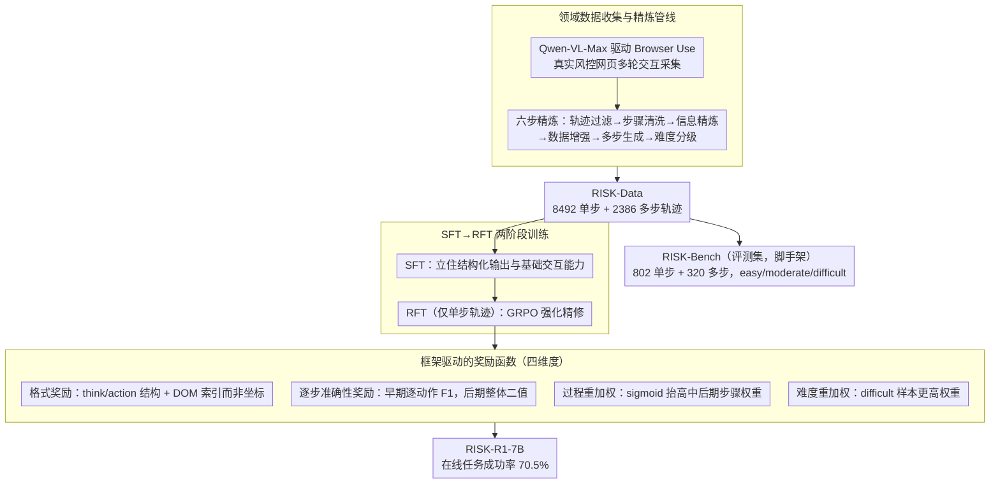

# RISK: A Framework for GUI Agents in E-commerce Risk Management

**会议**: ACL 2026  
**arXiv**: [2509.21982](https://arxiv.org/abs/2509.21982)  
**代码**: [GitHub](https://github.com/RenqiChen/RISK-GUI)  
**领域**: GUI智能体  
**关键词**: GUI智能体, 电商风控, 强化微调, 网页交互, 多步推理

## 一句话总结

提出 RISK 框架，包含领域数据集（RISK-Data, 8492单步+2386多步轨迹）、基准（RISK-Bench）和基于GRPO的强化微调方法（RISK-R1），针对电商风控场景的GUI智能体，7B模型以仅7.2%的参数量超越SOTA基线，在线任务成功率达70.5%。

## 研究背景与动机

**领域现状**：电商风控需要从多个外部网站聚合异构信息（交易详情、用户档案、网站验证等），这些信息常嵌入在动态加载的子页面、交互元素或复杂DOM结构中，需要多步有状态的网页交互。

**现有痛点**：传统爬虫无法处理有状态的事件驱动交互；现有GUI Agent大多局限于单步操作，缺乏多步推理和动态内容处理能力；缺少电商风控领域的专用数据集和基准；且GUI模型训练时使用坐标定位，但部署时框架使用DOM索引+工具调用，存在训练-部署差距。

**核心矛盾**：通用GUI Agent在电商风控场景中表现不佳，因为它们缺乏领域知识、多步推理能力和处理复杂网页的经验。

**本文目标**：构建完整的电商风控GUI Agent框架——从数据收集到模型训练到实际部署。

**切入角度**：使用Browser Use框架收集高质量领域数据，结合GRPO强化微调实现从训练到部署的无缝过渡。

**核心idea**：通过四维度奖励设计（格式奖励 + 逐步准确性奖励 + 过程重加权 + 难度重加权）弥合GUI Agent训练与真实部署之间的差距。

## 方法详解

### 整体框架

RISK由三个组件构成：（1）RISK-Data——通过Qwen-VL-Max驱动Browser Use框架收集数据，经轨迹过滤、步骤清洗、信息精炼、数据增强、多步生成和难度分级6步精炼，得到8492单步+2386多步轨迹；（2）RISK-Bench——802单步+320多步轨迹，分easy/moderate/difficult三级；（3）RISK-R1——基于GRPO的强化微调框架，先SFT建立基础能力，再RFT精化。整体数据流为：采集与精炼出 RISK-Data，一路切出评测集 RISK-Bench，一路喂给 SFT→RFT 训练，而 RFT 由四维度的框架驱动奖励来优化。

### 关键设计

**1. 领域数据收集与精炼管线：把真实风控网页交互沉淀成高质量轨迹**

通用 GUI 数据集里没有电商风控特有的信息搜集与网站验证任务，UI-TARS 这种通用 SFT 模型一拿到领域任务几乎全军覆没就说明了这一点。RISK 用 Qwen-VL-Max 驱动 Browser Use 框架在真实网页上做多轮交互采集原始数据，再过一条六步精炼流水线——轨迹过滤 → 步骤清洗 → 信息精炼 → 数据增强 → 多步生成 → 难度分级——最终得到 8492 条单步 + 2386 条多步轨迹（RISK-Data），并据此切出 802 单步 + 320 多步、分 easy/moderate/difficult 三级的评测集 RISK-Bench。难度分级这一步尤其关键，它既支撑了后面奖励里的难度重加权，也让基准能分层暴露模型在硬样本上的短板。

**2. SFT→RFT 两阶段训练：先把格式和基本能力打牢，再用强化学习精修**

直接对基座模型上 RFT 并不稳定——模型连 think/action 的输出格式都没立住，强化信号无从谈起。RISK 因此先用全部 RISK-Data 做 SFT，建立基本的交互能力和结构化输出格式，再进入 RFT 阶段精化。值得注意的是 RFT 只用单步轨迹（多步轨迹过长，塞不进 GPU 显存），多步能力主要靠 SFT 与单步 RFT 迁移过去；与此同时逐步准确性奖励也在这一阶段从细粒度（逐动作 F1）逐渐过渡到粗粒度（整体二值）。仅 SFT 的消融（单步 83.2 / 多步 74.7）相比完整模型（88.3 / 82.8）明显落后，印证了 RFT 阶段的增益。

**3. 框架驱动的奖励函数：让 RFT 优化的目标和真实部署的接口对齐**

GUI-R1 这类方法在训练时奖励的是"点对了屏幕坐标"，可真正部署的 Browser Use 框架根本不用坐标，而是用 DOM 索引 + 工具调用来操作页面——训练奖励的能力和部署需要的能力不是一回事，这正是多步任务上 GUI-R1 成功率为 0 的根因。RISK-R1 把奖励拆成四个维度直接对齐部署接口：（a）**格式奖励**检查输出是否含 think / action / evaluation_previous_goal / memory / next_goal 等结构，且 action 必须是 DOM 索引 + 工具的形式而非坐标；（b）**逐步准确性奖励**在训练早期对工具列表里每个动作单独按 F1 > 0.5 计奖、后期切换为整条轨迹的整体二值奖励，用细到粗的过渡缓解早期单一二值信号探索引导不足的问题；（c）**过程重加权**用 sigmoid 给轨迹中后期的步骤更高权重，因为越靠后的步骤越依赖前序状态、也越容易出错；（d）**难度重加权**在优化目标里给 difficult 级样本更高权重，避免模型把分数刷在简单样本上。消融显示过程重加权和逐步奖励对多步任务的提升最显著（去掉后多步成功率从 82.8 掉到 79.1 / 78.3）。

## 实验关键数据

### 主实验

| 模型 | 单步Overall | 多步成功率 | OS-Genesis Web |
|------|-----------|----------|---------------|
| GPT-4o | 81.5 | 74.0 | 55.3 |
| Qwen2.5-VL-72B | 80.6 | 67.8 | 50.0 |
| RISK-R1-7B (ours) | **88.3** | **82.8** | **57.1** |
| GUI-R1-7B | 74.3 | 0.0 | 49.1 |
| UI-TARS-72B | 13.0 | 0.0 | 5.8 |

### 消融实验

| 配置 | 单步 | 多步 | 说明 |
|------|------|------|------|
| RISK-R1 完整 | 88.3 | 82.8 | 全部组件 |
| - 过程重加权 | 86.5 | 79.1 | 后期步骤权重均等 |
| - 逐步奖励 | 85.8 | 78.3 | 全程二值奖励 |
| - 难度重加权 | 87.1 | 80.5 | 样本权重均等 |
| 仅SFT | 83.2 | 74.7 | 无RFT |

### 关键发现
- 7B的RISK-R1超越72B的通用模型和GPT-4o，以仅7.2%的参数量达到SOTA
- 通用GUI SFT模型（UI-TARS）在领域任务上几乎完全失败，说明领域数据的必要性
- GUI-R1（坐标定位RFT）在多步任务上成功率为0，证实训练-部署差距的严重性
- 在线评估任务成功率70.5%，验证了方法的实际部署价值
- 过程重加权和逐步奖励对多步任务提升最为显著

## 亮点与洞察
- **完整的从数据到部署的框架**：RISK覆盖了数据收集、基准构建、模型训练和实际部署的完整链条
- **小模型超越大模型**：7B超越72B和GPT-4o，证明领域专注+正确训练策略的价值
- **训练-部署一致性**：奖励函数基于DOM索引+工具调用而非坐标，确保模型训练与框架部署的无缝衔接
- **有在线评估**：不仅有离线基准，还有真实环境在线评估，增加说服力

## 局限与展望
- **RFT仅用单步数据**：多步轨迹过长无法fit GPU，多步能力主要靠SFT和单步RFT迁移
- **领域局限**：仅覆盖电商风控，需验证框架在其他领域的适用性
- **依赖特定框架**：与Browser Use框架紧密耦合
- 未来方向：支持多步RFT训练、扩展到更多领域、集成更复杂的风控决策

## 相关工作与启发
- **vs GUI-R1**：使用坐标定位的通用GUI RFT，在DOM索引场景下完全失效；RISK-R1的框架驱动奖励解决了这一问题
- **vs UI-TARS**：通用GUI SFT模型，在领域任务上表现极差，凸显领域数据的重要性
- **vs Browser Use**：RISK利用其作为数据收集工具和部署框架，实现了训练-部署闭环

## 评分
- 新颖性: ⭐⭐⭐⭐ 框架驱动的奖励设计和训练-部署一致性思路有创新
- 实验充分度: ⭐⭐⭐⭐⭐ 离线+在线评估、多基线对比、详尽消融实验
- 写作质量: ⭐⭐⭐⭐ 框架描述清晰，但部分细节需参考附录
- 价值: ⭐⭐⭐⭐ 为领域特定GUI Agent提供了可复制的完整解决方案

<!-- RELATED:START -->

## 相关论文

- [\[ACL 2026\] FlexGuard: Continuous Risk Scoring for Strictness-Adaptive LLM Content Moderation](flexguard_continuous_risk_scoring_for_strictness-adaptive_llm_content_moderation.md)
- [\[ICML 2026\] Anchored Decoding: Provably Reducing Copyright Risk for Any Language Model](../../ICML2026/llm_safety/anchored_decoding_provably_reducing_copyright_risk_for_any_language_model.md)
- [\[ICML 2026\] From Parameter Dynamics to Risk Scoring: Quantifying Sample-Level Safety Degradation in LLM Fine-tuning](../../ICML2026/llm_safety/from_parameter_dynamics_to_risk_scoring_quantifying_sample-level_safety_degradat.md)
- [\[AAAI 2026\] An LLM-Based Simulation Framework for Embodied Conversational Agents in Psychological Counseling](../../AAAI2026/llm_safety/an_llm-based_simulation_framework_for_embodied_conversationa.md)
- [\[ACL 2026\] AgentMark: Utility-Preserving Behavioral Watermarking for Agents](agentmark_utility-preserving_behavioral_watermarking_for_agents.md)

<!-- RELATED:END -->
