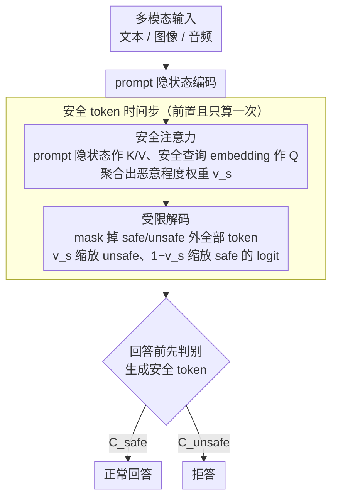

# Robust Multimodal Safety via Conditional Decoding

**会议**: ACL2026  
**arXiv**: [2604.00310](https://arxiv.org/abs/2604.00310)  
**代码**: 未在论文中提供公开代码  
**领域**: 多模态安全 / 语音语言模型 / 安全对齐  
**关键词**: 多模态越狱防御, 条件解码, 安全注意力, Qwen2.5-Omni, CASA

## 一句话总结
本文提出 CASA 条件解码框架，让多模态模型在生成回答前先预测安全 token，并用安全注意力放大恶意信号，在文本、视觉和音频越狱基准上把平均攻击成功率降低 97% 以上，同时基本保持良性输入的多模态能力。

## 研究背景与动机
**领域现状**：多模态大语言模型已经能同时处理文本、图像和音频，但安全对齐往往主要来自文本侧的拒答训练。当模型接入视觉或语音编码器后，跨模态交互可能绕开原有安全边界，使文本中较稳固的对齐行为在多模态输入下退化。

**现有痛点**：主流做法是 supervised safety fine-tuning，即用恶意问题配拒答、良性问题配正常回答来微调模型。但这个目标把安全和效用放在同一个生成目标里竞争：拒答能力增强可能导致过度拒答，良性任务能力下降；同时不同模态又需要额外安全数据和超参搜索。

**核心矛盾**：模型内部其实可能已经区分了安全与不安全输入，但普通解码不会显式调用这种内部判断。恶意提示只要在长上下文、图像或音频中隐藏关键意图，就可能诱导模型绕开安全拒答。因此问题不是单纯“模型不知道危险”，而是“模型没有在生成前稳定地先做安全判别”。

**本文目标**：作者希望设计一种不依赖外部分类器、不增加独立安全头、不针对每种模态单独训练的机制，让模型先判断输入是否安全，再根据判断结果条件化后续生成，从而兼顾鲁棒防御和良性效用。

**切入角度**：作者对 Qwen2.5-Omni 的最后层表示做 PCA，发现良性与恶意查询在内部表示上有可分性。于是他们把安全判断改成生成流程的第一个 token，并设计安全注意力模块直接影响安全 token 的 logit。

**核心 idea**：把“拒答还是回答”从隐式生成偏好变成显式二分类 token，让后续回答条件化在安全 token 上；再用从模型内部表示计算的安全注意力强化恶意信号，使模型在多模态越狱前先被安全门控拦住。

## 方法详解
CASA 的设计非常简洁：它不在模型外面套一个检测器，也不训练额外的分类头，而是让原模型在每次响应开头先生成一个安全标签。这个标签不是给用户看的最终内容，而是控制后续生成轨迹的条件变量。方法的另一个关键是安全注意力模块，它只在预测安全 token 的时间步工作，用 prompt 表示和安全查询 embedding 计算一个恶意程度权重，进而缩放 safe/unsafe token 的 logit。

### 整体框架
训练阶段，CASA 将普通良性回答改写为 `{C_safe, response}`，将恶意问题的拒答改写为 `{C_unsafe, refusal}`。这样模型不再直接在“输出正常回答”与“输出拒答”之间纠缠，而是先预测输入状态，再在该状态下生成合适文本。

推理阶段，模型在安全 token 时间步只能从 safe 和 unsafe 两个标签中选择。安全注意力模块根据 prompt hidden states 计算权重，如果输入像恶意查询，就提高 unsafe token 的 logit；如果输入像良性查询，就提高 safe token 的 logit。安全 token 生成后，后续响应自然被这个 token 条件化。

实验基座是 Qwen2.5-Omni 3B 和 7B。训练数据包含约 6.2k 恶意问题和 10k Alpaca 良性问题；评估覆盖文本越狱、视觉越狱和音频拼写攻击，并用 Claude 3.7 作为 LLM judge，同时用 13 名人工标注者验证安全与效用评价。

### 关键设计
**1. Classify Before You Generate：把安全判断从隐式偏好变成回答前的显式 token**

SSFT 的毛病在于安全和效用被塞进同一个生成目标里竞争——一边要学拒答、一边要学正常回答，拒答能力一强就容易过度拒答、良性任务退化。CASA 的做法是把"这是安全还是恶意输入"提前成响应的第一个 token：训练时把普通良性回答改写成 `{C_safe, y_resp}`、把恶意问题的拒答改写成 `{C_unsafe, y_ref}`，于是整条响应的概率可以分解为先预测安全变量 $P(y_0 = C \mid x)$、再在该变量条件下生成后续 token 的乘积。安全和效用就此从"同时优化的纠缠目标"变成"先判别、再按类别生成"的串行决策，后续文本天然被这个安全 token 条件化。

**2. Safety Attention 模块：在判别那一刻把藏在多模态输入里的恶意信号放大**

越狱输入常把恶意意图埋在长上下文、图像细节或音频拼写里，普通拒答训练可能只学到表层模板、抓不住这些被稀释的线索。安全注意力模块专门在预测安全 token 的时间步介入：它以 prompt 的 hidden states 作 key/value、以冻结预训练模型得到的安全查询 embedding 作 query，聚合注意力算出一个恶意程度权重 $v_s$，再用 $v_s$ 缩放 unsafe token 的 logit、用 $1 - v_s$ 缩放 safe token 的 logit。这里用 stop-gradient 切断了注意力对 prompt 表示的回传，让模块专注学习"区分恶意与良性"而不会把梯度乱传污染原表示。训练中 $v_s$ 对恶意查询趋近 1、对良性查询趋近 0，说明它确实学到了可解释的风险门控信号。

**3. 安全 token 的受限解码：保证判别步骤一定发生、且只发生一次**

如果推理时允许模型自由生成，它完全可能跳过安全标签、直接输出别的前缀，把前面的设计架空。CASA 在安全 token 这一个时间步把词表里除 safe / unsafe 之外的 token 全部 mask 掉，并用学到的缩放因子替换这两个 token 的 logit，强制模型必须先在二者间做出选择；安全 token 一旦确定，后续正常生成就不再重复计算安全注意力。这样既保证了"安全判断必然先于回答"，又把额外开销压到只多一次前置计算。

### 损失函数 / 训练策略
CASA 延续 SSFT 的良性/恶意配对训练，但在目标序列前端加入安全 token，训练目标中 $\beta$ 控制恶意拒答与良性回答两路的权重。安全注意力的梯度来自 logit 缩放项，一部分更新注意力参数、一部分更新原 MLLM。整体用 PEFT/LoRA 微调 Qwen2.5-Omni 3B 与 7B，全程不引入外部检测器，也不为每种模态单独做安全微调。

## 实验关键数据

### 主实验
表格展示了多模态越狱攻击成功率 ASR，数值越低越好。CASA 在文本、视觉和音频攻击上都能显著降低 ASR。

| 模型 | Safety Prompt | 3B JB-Prompt | 3B JBV-28k | 3B MM-SB | 3B AIAH | 7B JB-Prompt | 7B JBV-28k | 7B MM-SB | 7B AIAH |
|------|---------------|--------------|------------|----------|---------|--------------|------------|----------|---------|
| Pretrained | 否 | 42.3 | 36.8 | 37.7 | 81.3 | 33.5 | 37.9 | 38.1 | 64.2 |
| SSFT | 否 | 18.4 | 7.9 | 14.9 | 71.0 | 0.0 | 7.5 | 8.8 | 25.0 |
| Circuit Breaker | 否 | 0.9 | 3.9 | 5.1 | 2.3 | 0.3 | 5.7 | 5.4 | 24.4 |
| CASA | 否 | 0.0 | 4.6 | 9.2 | 2.3 | 0.0 | 0.7 | 9.0 | 1.1 |
| CASA | 是 | 0.0 | 1.4 | 1.2 | 0.0 | 0.9 | 0.0 | 0.2 | 0.6 |

### 消融实验

| 配置 | JBV-28k ASR | MM-SB ASR | AIAH ASR | 说明 |
|------|-------------|-----------|----------|------|
| CASA + Safety Attention + Safety Prompt | 1.4 | 1.2 | 0.0 | 完整配置，视觉和音频都接近完全防御 |
| CASA + Safety Attention，无 Safety Prompt | 4.6 | 9.1 | 2.3 | 仍明显优于无注意力版本 |
| CASA 无 Safety Attention + Safety Prompt | 8.2 | 18.3 | 60.2 | 音频拼写攻击尤其脆弱 |
| CASA 无 Safety Attention，无 Safety Prompt | 13.2 | 26.8 | 61.9 | 说明安全 token 本身不足以覆盖所有多模态攻击 |

### 关键发现
- 在 prefill 攻击中，Pretrained 的 ASR 随 prefill 长度从 65.3 上升到 84.7，SSFT 和 Circuit Breaker 的表现波动较大，而 CASA 在 2、4、9、12 token prefill 下均为 0.0 ASR。
- MME 效用评估中，CASA 不仅没有降低多模态能力，还在 3B 上达到 Perception 1621.23、Cognition 530.71，在 7B 上达到 Perception 1651.98、Cognition 652.85，均高于 Pretrained、SSFT 和 Circuit Breaker。
- 人工安全评价与 Claude judge 的一致性较高：安全任务 Cohen's κ 为 0.79，人类内部 Krippendorff's α 为 0.60；效用任务 Human-LLMaJ 一致性为 0.68。
- 安全注意力值在训练中对恶意查询趋近 1、对良性查询趋近 0，说明模块确实学到了可解释的风险门控信号。

## 亮点与洞察
- CASA 的核心洞察很干净：多模态安全失败不一定是模型“完全不知道危险”，而是生成过程没有把安全判断前置。显式安全 token 是一个低成本但行为上很强的干预。
- 方法避免了外部安全分类器的部署复杂度，也避免了每种模态都单独训练防御器。对工业多模态系统来说，这种内生式门控比串联多个外部 guard 更容易维护。
- 安全注意力只在安全 token 时间步计算一次，抓住了“拒答行为往往集中在生成开头”的现象，既高效又符合安全对齐的机制分析。
- 效用结果很有意思：CASA 在 MME 上优于 SSFT 和 CB，说明把安全与效用解耦后，模型不必通过牺牲正常回答能力来获得防御能力。

## 局限与展望
- 论文评估了多种文本、视觉和音频越狱，但作者承认仍可能存在更复杂的攻击形式，尤其是组合式、多轮式或上下文诱导式攻击。
- Safety Attention 对整个 prompt 做 cross-attention，长上下文下可能成为计算瓶颈；虽然只计算一次，但超长视频、长音频或多文档输入仍需进一步优化。
- 本文的安全范围主要是显式恶意查询，对“表面安全、上下文组合后产生危害”的间接风险覆盖不足。
- CASA 依赖模型内部表示已经包含可分的安全信号；对更弱模型、非指令模型或表示可分性较差的领域，效果可能下降。

## 相关工作与启发
- **vs SSFT**: SSFT 通过同一个生成目标学习拒答和正常回答，容易出现安全-效用冲突；CASA 把安全判断作为第一个条件变量，降低了两个目标的竞争。
- **vs Circuit Breaker**: Circuit Breaker 是强防御基线，但在部分效用和音频攻击上不稳定；CASA 的优势是安全 token 与注意力门控直接进入解码过程。
- **vs 外部安全分类器**: 外部分类器需要额外部署、可能错过模型内部跨模态线索；CASA 直接使用 MLLM hidden states，更贴近模型实际生成路径。
- **启发**: 很多对齐问题可以从“回答前的显式状态变量”入手，比如事实性 token、权限 token、隐私 token。关键是让后续生成条件化在可控状态上，而不是事后过滤输出。

## 评分
- 新颖性: ⭐⭐⭐⭐☆ 条件安全 token 的想法简洁有效，安全注意力把机制做实，但整体仍建立在 SSFT 和 token-level gate 之上。
- 实验充分度: ⭐⭐⭐⭐⭐ 覆盖文本、视觉、音频、多种攻击、效用和人工评价，证据链很完整。
- 写作质量: ⭐⭐⭐⭐☆ 方法解释清楚，表格信息充分；部分公式排版略密，但不影响理解。
- 价值: ⭐⭐⭐⭐⭐ 对多模态模型安全部署很有现实意义，尤其适合不想引入外部分类器的系统。

<!-- RELATED:START -->

## 相关论文

- [\[ACL 2026\] SafetyALFRED: Evaluating Safety-Conscious Planning of Multimodal Large Language Models](safetyalfred_evaluating_safety-conscious_planning_of_multimodal_large_language_m.md)
- [\[ACL 2026\] PARASITE: Conditional System Prompt Poisoning to Hijack LLMs](parasite_conditional_system_prompt_poisoning_to_hijack_llms.md)
- [\[ACL 2026\] MUSE: A Run-Centric Platform for Multimodal Unified Safety Evaluation of Large Language Models](muse_a_run-centric_platform_for_multimodal_unified_safety_evaluation_of_large_la.md)
- [\[ACL 2026\] When Helpers Become Hazards: A Benchmark for Analyzing Multimodal LLM-Powered Safety in Daily Life](when_helpers_become_hazards_a_benchmark_for_analyzing_multimodal_llm-powered_saf.md)
- [\[ACL 2026\] LeakDojo: Decoding the Leakage Threats of RAG Systems](leakdojo_decoding_the_leakage_threats_of_rag_systems.md)

<!-- RELATED:END -->
