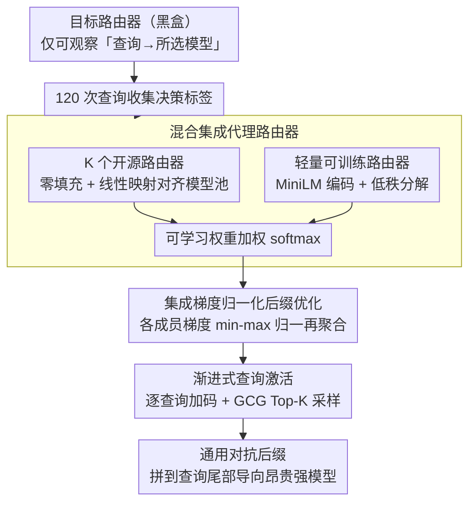

# Route to Rome Attack: Directing LLM Routers to Expensive Models via Adversarial Suffixes

**会议**: ACL 2026  
**arXiv**: [2604.15022](https://arxiv.org/abs/2604.15022)  
**代码**: [GitHub](https://github.com/thcxiker/R2A-Attack)  
**领域**: LLM/NLP  
**关键词**: LLM路由攻击, 对抗后缀, 黑盒攻击, 代理路由器, 推理成本

## 一句话总结

本文提出 R2A（Route to Rome Attack），通过在黑盒设置下构建混合集成代理路由器并优化通用对抗后缀，将 LLM 路由器的路由决策从廉价弱模型导向昂贵强模型——在 7 个开源路由器和 2 个商用路由器（GPT-5-Auto、OpenRouter）上平均攻击成功率提升 49%，推理成本增加 2.7-2.9 倍。

## 研究背景与动机

**领域现状**：为平衡性能和成本，成本感知 LLM 路由将简单查询导向廉价弱模型、复杂查询导向昂贵强模型。这种路由策略已被商用系统采用（OpenRouter、GPT-5-Auto）。路由器通过优化 $\mathcal{R}(q) = \arg\min_{M_i} [\ell(q, M_i) + \lambda \cdot C(q, M_i)]$ 在质量损失和成本之间取舍。

**现有痛点**：(1) 路由策略引入了新的安全面——攻击者可能操纵路由器持续选择昂贵模型以增加运营商成本；(2) 现有路由攻击方法 Rerouting 依赖白盒访问（需要梯度和架构信息），不适用于商用黑盒场景；(3) LifeCycle 使用启发式 prompt 模板（从高胜率查询中提取），未经严格优化因此在不同路由器上效果不稳定。

**核心矛盾**：攻击者只能观察路由器的最终路由决策（选了哪个模型），无法获取内部 logits、参数或梯度——在这种严格黑盒设置下，如何用有限查询预算（120 次）学习一个通用对抗后缀来一致性地误导不同架构的路由器？

**本文目标**：(1) 在仅能观察路由决策的黑盒设置下，找到通用对抗后缀使路由器偏向选择昂贵模型；(2) 后缀需要跨数据集泛化（含分布外数据）。

**切入角度**：借鉴计算机视觉中的黑盒对抗攻击思路——训练代理模型模拟目标模型行为，在代理上优化对抗样本然后迁移。关键挑战是路由器架构多样（embedding-based、LLM-based 等），单一架构的代理可能与目标路由器不匹配。

**核心 idea**：用混合集成代理路由器（多个开源路由器 + 轻量可训练路由器）来覆盖多种路由机制，通过梯度归一化后的集成后缀优化，找到对未知目标路由器有效的通用对抗后缀。

## 方法详解

### 整体框架

R2A 要解决的是一个严格黑盒下的攻击问题：攻击者只能看到路由器最终选了哪个模型，拿不到 logits、参数和梯度，还得在仅 120 次查询的预算内学出一个通用对抗后缀，让任意查询附上它之后都被导向昂贵的强模型。整体思路借鉴了视觉里的黑盒迁移攻击——先训一个代理来模仿目标，再在代理上优化对抗样本然后迁移过去。具体分两阶段：第一阶段用 120 次查询从目标路由器收集「查询→所选模型」的标签，训练一个混合集成代理路由器去逼近目标的路由行为；第二阶段在这个可微的代理上，用改进的 GCG 搜索一段能把路由概率推向强模型的后缀。最终产物就是一段固定后缀，拼到原始查询尾部即可。

### 关键设计

**1. 混合集成代理路由器：用极少查询同时覆盖「碰巧撞上」和「从未见过」两类目标架构**

黑盒迁移的成败取决于代理像不像目标，但路由器架构五花八门（有 embedding-based、有 LLM-based），单一架构的代理很容易和真实目标对不上。R2A 的代理因此由两部分拼成：一是 $K$ 个预训练开源路由器 $\{\mathcal{R}_o^{(1)}, \dots, \mathcal{R}_o^{(K)}\}$，它们覆盖了多种主流路由机制，通过零填充和线性映射 $\mathbf{W}_o$ 把各自的输出对齐到目标的模型池——如果目标恰好类似某个开源实现，集成就能「快速匹配」锁定它；二是一个轻量可训练路由器 $\mathcal{R}_l$，用 all-MiniLM-L6-v2 编码查询后经一个 LoRA 风格的低秩分解 $\mathbf{z}_l = E(q) \mathbf{W}_l^1 \mathbf{W}_l^2$（$r \ll d=384$）映射到目标 logits，专门「补偿」那些和所有开源路由器都不像的目标。两路输出按可学习权重加权汇总：

$$\hat{y} = \text{softmax}\Big(\alpha_0 \mathbf{z}_l + \sum_{i=1}^K \alpha_i \mathbf{z}_o^{(k)}\Big)$$

低秩分解把可训练参数压到很小，这正是能在 120 次查询里训出可用代理的关键，而消融也证实去掉轻量路由器后 RouterDC 上的 ASR 从 0.83 直接掉到 0.30。

**2. 集成梯度归一化后缀优化：让架构差异巨大的成员路由器在优化里公平发声**

代理是个多编码器集成，直接在上面跑 GCG 会出问题：优化目标是 $\min_s \mathcal{L}_A = -\mathbb{E}_q \sum_{M \in \mathcal{M}_{strong}} p(\hat{y}=M\,|\,q \oplus s)$，但集成里各路由器对后缀 token 的梯度 $\delta_i^{(k)} = \partial \mathbf{z}^{(k)} / \partial s_i$ 量级可能相差几个数量级（embedding-based 和 LLM-based 的尺度天然不同），直接求和会让梯度最大的那个路由器独占优化方向。解决办法是先对每个路由器的梯度做 min-max 归一化，再加权聚合：

$$\tilde{\delta}_i^{(k)} = \frac{\delta_i^{(k)} - \delta_{min}^{(k)}}{\delta_{max}^{(k)} - \delta_{min}^{(k)}}, \qquad \tilde{g}_i = \sum_{k=0}^K \alpha_k \cdot \tilde{\delta}_i^{(k)} \cdot \frac{\partial \mathcal{L}_A}{\partial \mathbf{z}_{total}}$$

归一化之后每个成员路由器都能对后缀的选择施加同等量级的影响，找到的后缀才是对整个集成都有效、进而对未知目标也能迁移的。这一步看似只是工程细节，但消融显示去掉它会让 MF 路由器的 ASR 从 0.95 暴跌到 0.49。

**3. 渐进式查询激活：用 curriculum 式的逐步加码换取后缀的跨查询通用性**

要的是一段对所有查询都管用的「通用」后缀，但若一上来就对全部查询同时优化，很容易陷进局部最优。R2A 改成渐进式：后缀先只在第一个查询上优化，等它在当前所有已激活查询上都攻击成功后，才把下一个查询纳入优化集合，让后缀需要覆盖的查询分布逐步扩张。每次迭代在每个后缀位置选 Top-K 候选 token、采样 $B$ 个变体、取损失最低者更新。这种由易到难的扩张让后缀先在简单查询上锁定一个有效模式，再以它为起点泛化到更难的查询，比一次性硬塞所有查询更稳。

### 损失函数 / 训练策略

代理训练用交叉熵对齐目标路由器的决策 $\mathcal{L}_S = \frac{1}{Q}\sum_{i=1}^Q l(\hat{y}(q_i), \mathcal{R}_t(q_i))$，查询预算 $Q=120$；后缀优化阶段最大化路由到强模型的概率。为防数据泄漏，当目标路由器本身出现在集成池中时会先把它移除再训练。

## 实验关键数据

### 主实验

**攻击成功率 ASR（分布内+分布外，6 个数据集平均）**

| 目标路由器 | Clean | LifeCycle(W) | Rerouting | CoT | **R2A** | Δ vs Clean |
|-----------|-------|-------------|-----------|-----|---------|-----------|
| RouteLLM-Bert | 0.40 | 0.69 | 0.77 | 0.52 | **0.89** | +0.49 |
| GraphRouter | 0.64 | 0.69 | 0.63 | 0.65 | **0.87** | +0.23 |
| RouteLLM-MF | 0.56 | 0.77 | 0.88 | 0.54 | **0.95** | +0.39 |
| OpenRouter* | 0.27 | 0.44 | 0.44 | 0.42 | **0.74** | +0.47 |

### 消融实验

**R2A 核心组件消融（分布内数据集平均）**

| 配置 | RouterDC | CausalLLM | RouteLLM-MF | SW |
|------|---------|-----------|-------------|-----|
| R2A 完整 | 0.83 | 0.83 | 0.95 | 0.81 |
| w/o 轻量路由器 | 0.30 | 0.75 | 0.70 | 0.61 |
| w/o 梯度归一化 | 0.33 | 0.78 | 0.49 | 0.63 |

### 关键发现

- R2A 在 OpenRouter 商用路由器上 ASR 从 0.27 提升到 0.74（+0.47），在分布外数据上仍然有效
- 推理成本方面，MMLU 上每百万 token 成本增加约 2.7 倍，RouterArena 上增加 2.9 倍
- 攻击 GPT-5-Auto：通过 fingerprinting 分析，攻击后回答的 Thinking-likeness 显著升高，LLM 评判显示攻击后回答在全面性、多样性等维度胜率达 64-72%
- 查询预算分析：120 次查询即可达到接近饱和的性能，展现出高样本效率
- 白空格防御下 ASR 仅轻微下降（如 RouteLLM-Bert MT-Bench: 0.95→0.93），显示对简单防御的鲁棒性

## 亮点与洞察

- 混合集成代理路由器的设计思路很实用——开源路由器提供"先验知识"，轻量路由器提供"自适应补偿"，两者互补。这种思路可以推广到其他黑盒攻击场景
- 梯度归一化是一个看似简单但关键的细节——消融显示没有它 MF 路由器的 ASR 从 0.95 暴跌到 0.49
- 攻击成本极低（$0.98 的查询费用），但造成的成本增加高达 2.9 倍——凸显了路由系统作为安全边界的重要性

## 局限与展望

- 每个目标路由器需要训练单独的对抗后缀，未实现跨路由器通用后缀
- 仅关注将路由导向昂贵模型，未探索其他攻击目标（如指定特定模型、绕过安全过滤）
- 假设攻击者知道候选模型池和每次查询选中的模型——部分部署可能不公开这些信息
- 对 GPT-5-Auto 只能间接评估（无法观察路由决策），结果依赖 fingerprinting 的准确性

## 相关工作与启发

- **vs Rerouting (Shafran et al.)**: 需要白盒访问（梯度/架构），R2A 仅需 120 次黑盒查询
- **vs LifeCycle**: 使用启发式 prompt 模板，在不同路由器上效果不稳定（如 GraphRouter 上仅 0.69 vs R2A 的 0.87）
- **vs CoT baseline**: "Let's think step by step" 偶尔有效但不稳定，在某些路由器上甚至不如 clean（如 RouteLLM-MF: 0.54 vs clean 0.56）

## 评分

- 新颖性: ⭐⭐⭐⭐ 首次在严格黑盒设置下实现 LLM 路由攻击，混合集成代理和梯度归一化是实用创新
- 实验充分度: ⭐⭐⭐⭐⭐ 7+2 路由器 × 6 数据集 + GPT-5 案例 + 成本分析 + 防御评估 + 消融 + 预算敏感性
- 写作质量: ⭐⭐⭐⭐ 问题定义清晰，威胁模型规范
- 价值: ⭐⭐⭐⭐⭐ 揭示了 LLM 路由系统的关键安全漏洞，对商用部署有直接警示意义

<!-- RELATED:START -->

## 相关论文

- [\[CVPR 2026\] Multi-Paradigm Collaborative Adversarial Attack Against Multi-Modal Large Language Models](../../CVPR2026/llm_safety/multi-paradigm_collaborative_adversarial_attack_against_multi-modal_large_langua.md)
- [\[ACL 2026\] Evaluating Answer Leakage Robustness of LLM Tutors against Adversarial Student Attacks](evaluating_answer_leakage_robustness_of_llm_tutors_against_adversarial_student_a.md)
- [\[CVPR 2026\] V-Attack: Targeting Disentangled Value Features for Controllable Adversarial Attacks on LVLMs](../../CVPR2026/llm_safety/v-attack_targeting_disentangled_value_features_for_controllable_adversarial_atta.md)
- [\[AAAI 2026\] GraphTextack: A Realistic Black-Box Node Injection Attack on LLM-Enhanced GNNs](../../AAAI2026/llm_safety/graphtextack_a_realistic_black-box_node_injection_attack_on_llm-enhanced_gnns.md)
- [\[NeurIPS 2025\] Adversarial Paraphrasing: A Universal Attack for Humanizing AI-Generated Text](../../NeurIPS2025/llm_safety/adversarial_paraphrasing_a_universal_attack_for_humanizing_ai-generated_text.md)

<!-- RELATED:END -->
