# SafeConstellations: Mitigating Over-Refusals in LLMs Through Task-Aware Representation Steering

**会议**: ACL2026  
**arXiv**: [2508.11290](https://arxiv.org/abs/2508.11290)  
**代码**: https://github.com/Sakonii/SafeConstellations/  
**领域**: 可解释性 / LLM 安全 / 表示干预  
**关键词**: 过度拒答、任务感知 steering、表示轨迹、安全对齐、推理时干预

## 一句话总结
SafeConstellations 发现 LLM 的中后层表示会按任务形成稳定的“星座轨迹”，并在高置信 benign 任务上把表示从拒答轨迹轻量推向非拒答轨迹，从而显著降低过度拒答且基本不损害通用能力。

## 研究背景与动机
**领域现状**：LLM 安全对齐通常通过拒答策略阻止有害请求，但实际应用里许多任务只是对敏感文本做分类、翻译、转写或检索问答，并不要求模型生成有害内容。安全系统若只看到敏感词或危险上下文，容易把 benign task 当成 harmful intent。

**现有痛点**：已有过度拒答研究多把问题定义为“毒性输入被错误拒绝”，但没有充分区分用户真正要求模型执行的任务。比如同一段敏感文本，在“翻译”“情感分析”“复述”“攻击性生成”这些任务下应有不同安全边界，任务无关的拒答修正会同时影响正常安全拒绝和有用回答。

**核心矛盾**：安全对齐需要模型对危险意图保持拒绝能力，而实用性又要求模型能完成 benign 的分析型任务。若用全局 steering 方向修正拒答，干预范围太粗；若完全不干预，又会在低资源翻译、加密文本解析、敏感语句分析等场景里保留大量误拒。

**本文目标**：作者希望回答三个问题：任务本身是否会在隐藏表示空间形成可分结构；拒答与非拒答是否能在同一任务轨迹内被区分；能否只在特定 benign 任务上做推理时干预，减少过度拒答，同时保留对真正有害请求的拒绝。

**切入角度**：论文从表示几何出发，假设每类任务在 transformer 层间会形成一条相对稳定的轨迹，作者称之为 constellation pattern。相比只看输出文本，隐藏状态轨迹能更早暴露模型是在“执行任务”还是“滑向拒答”。

**核心 idea**：用任务条件化的表示中心和层级轨迹替代全局拒答向量，只在模型内部轨迹接近该任务的过度拒答区域时做小幅 steering。

## 方法详解

### 整体框架
SafeConstellations 是一个不重新训练基础模型的推理时干预方法。离线阶段，作者用任务标注数据运行冻结 LLM，收集每个样本在各层最后输入 token 的隐藏向量，并用 LLM-as-a-judge 把响应分成目标行为和拒答行为；然后为每个任务、每个层建立目标中心、拒答中心和二者之间的 steering 方向。

在线阶段，给定新 prompt 后，方法先计算该 prompt 的层间表示轨迹，判断它最像哪一个已知任务，并估计任务置信度。只有当任务属于开发者定义的 benign task 集合且置信度足够高时，系统才选择少数最需要修正的层，把隐藏状态沿该任务的非拒答方向移动；否则完全保留原模型行为。

```mermaid
%%{init: {'flowchart': {'rankSpacing': 24, 'nodeSpacing': 28, 'padding': 6, 'wrappingWidth': 400, 'subGraphTitleMargin': {'top': 8, 'bottom': 16}}}}%%
flowchart TD
    subgraph OFF["任务星座嵌入库（离线构建）"]
        direction TB
        A["任务标注数据<br/>过冻结 LLM"] --> B["逐层收集末输入 token 隐藏向量"]
        B --> C["LLM-as-judge 分目标 / 拒答响应"]
        C --> D["每任务每层求目标中心 / 拒答中心<br/>二者之差得 steering 向量"]
    end
    D --> E["在线：新 prompt 算层间表示轨迹"]
    E --> F{"任务感知门控<br/>置信度 ≥ 0.85 且任务属 benign?"}
    F -->|否| G["原样返回基础模型响应"]
    F -->|是| H["动态层选择与自适应强度<br/>挑偏拒答的层、按 alignment 调强度"]
    H --> I["沿任务 steering 向量推一小步<br/>输出正常结果"]
```

### 关键设计

**1. 任务星座嵌入库：为每个任务分别刻画「正常完成」和「过度拒答」两条轨迹，作为后续识别与干预的几何参照**

过度拒答的麻烦在于它并不指向一个统一的方向——同一段敏感文本，翻译任务和情感分析任务该有的合理输出形态相差很远，若用一个全局拒答向量去修，必然把不同任务的安全边界糅成一团粗糙的东西。这里改成按任务分开建模：对每个任务，把它的目标响应样本和拒答样本分别在每一层求中心，得到 $c_{t,tar}^{(l)}$ 和 $c_{t,ref}^{(l)}$，再用二者之差形成该任务专属的层级 steering 向量 $v_t^{(l)}$。哪些层值得用来干预，则由中心间距离和簇内方差共同决定——两个中心分得越开、各自簇内越紧的层，越能干净地把「执行任务」和「滑向拒答」区分开。这样翻译、情感分析、cryptanalysis、RAG-QA 各有各的轨迹参照，互不污染。

**2. 任务感知门控：先判断这是哪类任务、有多大把握，再决定要不要动模型**

安全干预最怕「修过头」，把本该保留的正常拒绝也一并放宽。门控就是为此设的闸门：系统用当前 prompt 的隐藏轨迹与各任务中心算出任务得分，取得分最高者作为预测任务；只有当置信度不低于 $0.85$、且该任务落在开发者预先认可的 benign task 集合内时，才放行进入 steering，否则原样返回基础模型响应。论文把 benign task 限定为情感分析、翻译、cryptanalysis 和 RAG-QA，而复述因为意图更模糊、容易被滥用，被刻意排除在外。这样方法的目标就被框死成「纠正任务识别失败导致的误拒」，而不是整体放松安全边界。

**3. 动态层选择与自适应强度：只在当前样本确实偏向拒答的少数层上推一小步**

固定挑某几层来干预容易伤到输出质量——有的样本根本没在那几层偏向拒答，硬推反而把正常语言能力或安全行为也带歪了。这里改成逐样本动态决定：对每一层计算当前隐藏状态到目标中心与拒答中心的相对距离，挑出 steering potential 最高的若干层；再用一个 layer alignment 度量看这层已经多接近目标轨迹，据此调节干预力度——越接近目标轨迹就推得越轻。最终更新就是把隐藏状态沿归一化后的任务 steering 向量 $v_t^{(l)}$ 移动一小步。把干预集中在「这一样本在这一层确实在往拒答跑」的地方，才能在压低误拒的同时尽量不波及正常的语言与安全表现，消融里去掉动态层选择（改用固定中后层）相对降低就从 72.92% 退到 64.58%。

### 一个完整示例

设输入是一句低资源语言的翻译请求，原文里含敏感词，基础模型本会误判为有害意图而拒答。SafeConstellations 先算出它的层间轨迹，门控判定最像「翻译」任务、置信度高于 0.85，且翻译在 benign 集合内，于是放行。接着动态层选择发现该样本在中后若干层正明显贴向拒答中心，便挑出这些层、按 layer alignment 调好强度，把隐藏状态各自沿翻译任务的 $v_{\text{翻译}}^{(l)}$ 推一小步，模型随即给出正常译文。若换成同一段文本但任务被识别为「攻击性生成」、或置信度不足，门控会直接拦下、不做任何修改，原有的拒绝能力照常保留。论文报告这类 targeted mitigation 把翻译任务的过度拒答从 46.7% 压到 8.9%（相对降低 81.0%）。

### 损失函数 / 训练策略
方法本身不训练基础 LLM，也不引入新的拒答分类器训练目标。离线构建阶段用 75% 的训练 split 估计任务嵌入，在线推理时只做一次轨迹分析和少量 activation steering。论文报告短回答平均增加约 0.2 秒，长回答的开销主要由解码长度决定；在 LLaMA-3.1-8B 的任务集合上，任务嵌入存储约 847MB，并随任务数与存储层数线性增长。

## 实验关键数据

### 主实验

作者构造了 1,047 个样本的任务过度拒答 benchmark，覆盖情感分析、翻译、复述、cryptanalysis 和 RAG-QA 五类任务，基础文本来自 Alpaca、XSTest、JailbreakBench、SaladBench 与自建 RAG-QA。评价包括拒答类型、安全类型以及 MMLU 实用性。

| 模型 / 配置 | 过度拒答率 ↓ | 相对降低 ↑ | MMLU ↑ | 说明 |
|--------|------|------|------|------|
| LLaMA3.1-8B 基线 | 17.77% | - | 46.57 | 未干预 |
| LLaMA3.1-8B + SafeConstellations | 4.81% | 72.92% | 46.57 | 动态层 + 任务特定轨迹 + layer alignment |
| Qwen1.5-7B 基线 | 8.15% | - | 28.42 | 未干预 |
| Qwen1.5-7B + SafeConstellations | 2.96% | 63.64% | 28.42 | 同样保持 MMLU |
| LLaMA + 固定强干预 | 7.03% | 60.42% | 43.66 | 降低拒答但损伤通用能力 |
| LLaMA + 固定层 [15,20,25,30] | 16.66% | 6.25% | 39.20 | 干预弱且 utility 明显下降 |

### 消融实验

| 配置 | 关键指标 | 说明 |
|------|---------|------|
| Full model | LLaMA 过度拒答率 4.81%，降低 72.92% | 动态层选择、任务特定 steering 和轨迹 alignment 同时使用 |
| w/o 动态层选择：late layers | 6.29%，降低 64.58% | 固定中后层有效，但不如样本级动态选择 |
| w/o 动态层选择：final layer only | 5.92%，降低 66.67% | 最后一层已有强信号，但仍损失部分可控性 |
| w/o trajectory alignment | 6.64%，降低 62.50% | 只做任务特定 steering 不够精细 |
| w/o task-specific steering | MMLU 从 46.57 降到 43.66 或 39.20 | 全局/固定干预容易牺牲输出质量 |

### 关键发现
- LLaMA 在 benign 任务上的过度拒答最明显，Claude 更谨慎但较少误拒，GPT-4o 的误拒集中在低资源翻译任务上，说明过度拒答同时受模型家族和任务类型影响。
- UMAP 与分离度分析显示，隐藏状态更按“任务”而不是“文本是否敏感”或“最终响应类型”组织；在 L12-L19，情感分析和翻译的 silhouette score 明显高于混合任务设置。
- 对最容易误拒的任务做 targeted mitigation 时，翻译任务过度拒答从 46.7% 降到 8.9%，相对降低 81.0%；情感分析从 36.4% 降到 18.2%，相对降低 50.0%。
- 激进固定层干预能让模型停止拒答，但会产生乱码或重复 token；这说明“减少拒答率”不是唯一目标，还必须同时评估回答是否保留任务语义。

## 亮点与洞察
- 论文把过度拒答重新定义为“任务识别失败”而不仅是“敏感词触发失败”，这个视角非常关键。它解释了为什么同一段文本在翻译、情感分析和危险生成任务下应被不同处理。
- Task constellation 是一个有解释性的中间对象：它既能可视化任务轨迹，也能提供层级干预方向，比黑箱 prompt 或粗粒度拒答阈值更容易诊断。
- 门控条件设计比较克制：只有高置信 benign task 才 steering，其他情况回退基础模型。这种“选择性干预”比一味减少拒答更适合安全场景。
- 实验没有只看拒答率，还加入 MMLU 和定性输出质量，揭示了固定强干预的副作用，使方法的实用边界更清楚。

## 局限与展望
- 方法需要访问模型内部隐藏状态，因此难以直接应用于闭源 API 或只暴露文本接口的服务。
- 任务嵌入是静态、模型特定的，换模型、换领域或任务分布漂移时需要重新计算或持续更新中心。
- benign task 集合由开发者预先定义，泛化到未见任务仍不充分，尤其是任务语义与安全意图纠缠较强的场景。
- utility 主要用 MMLU 衡量，尚未覆盖事实性、长上下文一致性、对话连贯性、校准性等更细粒度质量维度。
- 阈值、层选择和 steering 强度仍含启发式成分，未来可以研究更稳健的置信度估计和自动强度校准。

## 相关工作与启发
- **vs 传统过度拒答缓解**: 传统方法多在输出层或通用安全分类层面调节拒答倾向，SafeConstellations 则把拒答纠正限定到任务条件化的表示轨迹，优势是更细粒度，劣势是需要内部状态和离线嵌入库。
- **vs 全局 activation steering**: 全局 steering 通常假设存在统一的“拒答方向”，本文表明任务差异会改变轨迹几何，因此全局方向可能既不充分也不稳定。
- **vs prompt-level safety calibration**: prompt 方法容易受表面文本影响，本文直接观察中间层，能更早发现模型是否把任务理解为 benign 分析任务。
- **启发**: 类似的 task constellation 思路可迁移到幻觉抑制、格式遵循和工具调用纠错中，把“错误行为”从统一标签拆成任务内的轨迹偏移。

## 评分
- 新颖性: ⭐⭐⭐⭐☆ 从任务轨迹角度解释过度拒答，表示几何视角清晰，但仍建立在已有 activation steering 思路上。
- 实验充分度: ⭐⭐⭐⭐☆ 有自建 benchmark、跨模型、消融、分离度和 utility 检查，但任务集合和安全场景覆盖仍有限。
- 写作质量: ⭐⭐⭐⭐☆ 动机、方法和可视化联系紧密，个别公式与叙述略显拥挤。
- 价值: ⭐⭐⭐⭐☆ 对安全实用性的价值很高，尤其适合可访问内部状态的开源模型部署场景。

<!-- RELATED:START -->

## 相关论文

- [\[ACL 2026\] DART: Mitigating Harm Drift in Difference-Aware LLMs via Distill-Audit-Repair Training](dart_mitigating_harm_drift_in_difference-aware_llms_via_distill-audit-repair_tra.md)
- [\[ACL 2026\] Please Refuse to Answer Me: Mitigating Over-Refusal in LLMs via Adaptive Contrastive Decoding](please_refuse_to_answer_me_mitigating_over-refusal_in_large_language_models_via_.md)
- [\[ICCV 2025\] Forgetting Through Transforming: Enabling Federated Unlearning via Class-Aware Representation Transformation](../../ICCV2025/llm_safety/forgetting_through_transforming_enabling_federated_unlearning_via_class-aware_re.md)
- [\[ACL 2026\] SWAN: Semantic Watermarking with Abstract Meaning Representation](swan_semantic_watermarking_with_abstract_meaning_representation.md)
- [\[ACL 2026\] When Models Outthink Their Safety: Unveiling and Mitigating Self-Jailbreak in Large Reasoning Models](when_models_outthink_their_safety_unveiling_and_mitigating_self-jailbreak_in_lar.md)

<!-- RELATED:END -->
