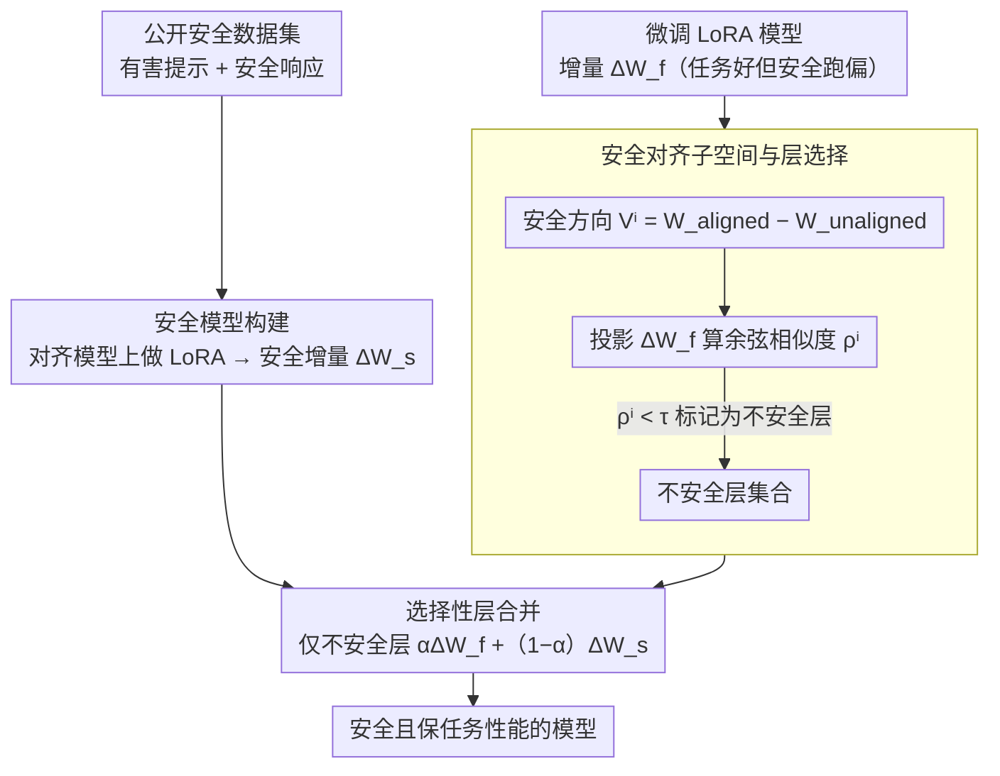

# SafeMERGE: Preserving Safety Alignment in Fine-Tuned Large Language Models via Selective Layer-Wise Model Merging

**会议**: ACL 2026  
**arXiv**: [2503.17239](https://arxiv.org/abs/2503.17239)  
**代码**: [GitHub](https://github.com/aladinD/SafeMERGE)  
**领域**: LLM对齐 / 安全性  
**关键词**: 安全对齐, 模型合并, LoRA微调, 后微调防御, 层选择性合并

## 一句话总结

本文提出 SafeMERGE，一种轻量级后微调框架，通过余弦相似度检测偏离安全行为的微调层，仅将这些层与安全模型的对应层合并，在四个 LLM 上显著降低有害输出同时保持甚至提升任务性能。

## 研究背景与动机

**领域现状**：微调 LLM 以适应特定领域是常见做法，但研究表明微调（即使用无害数据）会侵蚀安全对齐——仅需几个恶意样本就能让对齐模型遵从有害请求。安全对齐被证明是"浅层的"，容易在微调中被打破。

**现有痛点**：(1) 对齐阶段防御需要修改初始对齐流程，对从业者不友好；(2) 微调阶段防御需要自定义训练算法，难以与标准开源库集成；(3) 简单的后微调防御（如全层合并 RESTA）往往牺牲任务性能来换取安全。

**核心矛盾**：如何在不修改现有训练流程的前提下，在微调后恢复安全性同时不损害任务性能？

**本文目标**：设计一种简单、即插即用的后微调框架，仅在需要时（层偏离安全行为时）进行选择性合并。

**切入角度**：利用对齐模型和基础模型的权重差定义"安全对齐子空间"，通过余弦相似度检测微调 LoRA 层是否偏离该子空间。

**核心 idea**：只合并那些偏离安全行为的层，保留其他层的任务性能——选择性比全局合并更优。

## 方法详解

### 整体框架

SafeMERGE 分三步：(1) 训练一个安全 LoRA 模型（使用公开安全数据集，一次训练可复用）；(2) 用安全子空间投影检测微调模型的哪些层"不安全"；(3) 仅对不安全层执行与安全模型的线性合并。安全参照（来自安全模型构建）与不安全层标记（来自层选择）两路并行，最终在合并步汇合。

### 关键设计

**1. 安全对齐子空间与层选择：先量出"哪几层在微调中跑偏了"，而不是一刀切处理所有层**

像 SafeLoRA 那样对所有层统一投影回安全方向，固然能找回安全，但也把那些本来学得好好的任务层一起拽回去，白白损失任务性能。SafeMERGE 的做法是先定义一个"安全方向"再逐层体检：用对齐模型与基础模型的权重差 $V^i = W_{aligned}^i - W_{unaligned}^i$ 张成第 $i$ 层的安全对齐子空间，再把微调得到的 LoRA 增量 $\Delta W_f^i$ 投影到这个子空间上得到 $C^i \Delta W_f^i$，看两者的余弦相似度 $\rho^i$。$\rho^i$ 高说明这层的微调更新基本仍贴着安全方向、没跑偏；一旦 $\rho^i < \tau$，就说明这层在微调里偏离了安全行为，被标记为"不安全层"。这样干预对象从"全部层"收窄到"真正出问题的少数层"，其余层的任务学习完整保留。

**2. 选择性层合并：只把被标记的不安全层拉回安全模型，安全层原封不动**

RESTA 这类全局方案会把安全校正施加到每一层，连那些已经安全的层也被改动，任务性能于是无谓地受损。SafeMERGE 只对上一步标出的不安全层做线性合并 $\Delta W_{merge}^i = \alpha \Delta W_f^i + (1-\alpha) \Delta W_s^i$，其中 $\Delta W_s^i$ 是安全模型在同一层的增量，系数 $\alpha$ 直接调节"保留多少任务能力 / 拉回多少安全性"的权衡；被判为安全的层则保持微调权重不变。正因为干预范围最小，它能在恢复安全的同时把任务性能的代价压到最低。

**3. 安全模型构建：提供一套任务无关、可一次训练反复复用的"安全参照层"**

合并需要一个明确的"安全行为"目标，SafeMERGE 用公开安全数据集（有害提示 + 安全响应对）对对齐模型做标准 LoRA 微调，得到这套参照层 $\Delta W_s$。作者扫了不同数据量（100 / 500 / 1000 / 2500 样本），挑有害分数最低的那个作为安全模型。关键是这个安全模型与下游任务无关，训练一次即可跨任务复用——换新任务时不必重新训练，进一步压低了采用成本。

### 损失函数 / 训练策略

安全模型用标准 LoRA 微调。SafeMERGE 本身无训练——仅需计算余弦相似度和线性合并，可完全在 CPU 上运行。评估使用 Llama-Guard-3-8B 和 ShieldGemma-9B 交叉验证。

## 实验关键数据

### 主实验

| 方法 | Llama-3.1 GSM8K↑ | DirectHarm↓ | HexPhi↓ |
|------|-----------------|-------------|---------|
| 原始对齐模型 | 73.80 | 11.30 | 7.90 |
| 微调后 | 78.24 | 28.30 | 14.70 |
| SafeInstruct | 77.40 | 12.50 | 7.20 |
| RESTA | 74.20 | 11.90 | 6.90 |
| SafeLoRA | 77.90 | 15.10 | 7.10 |
| **SafeMERGE** | **78.50** | **8.80** | **6.30** |

### 消融实验

| 分析维度 | 结果 |
|----------|------|
| 合并策略 (Linear vs DARE vs TIES) | 线性合并已足够 |
| 阈值 τ 敏感性 | τ 越大合并越多层，安全性↑但任务性能可能↓ |
| 安全数据量 | 500-1000 样本通常最优 |
| 不同权重方案 | 均匀 α 通常表现良好 |

### 关键发现

- SafeMERGE 在所有 4 个 LLM × 2 个任务设置中一致优于或匹配基线
- 在 Llama-3.1 上，SafeMERGE 甚至超过原始对齐模型的任务性能（78.50 vs 73.80）同时更安全（8.80 vs 11.30）
- 选择性合并比全层合并（RESTA）更好——RESTA 任务性能下降明显（74.20 vs 78.50）
- 安全模型可跨任务复用，无需针对每个新任务重新训练

## 亮点与洞察

- "只修需要修的层"这一直觉简单但非常有效——选择性比全局干预更优
- 完全在 CPU 上可运行、无需重训练的特性使其极具实际部署价值
- 安全模型一次训练跨任务复用的设计大幅降低了采用成本

## 局限与展望

- 安全子空间的定义依赖于对齐模型和基础模型的可用性——不是所有模型都公开基础版本
- 仅在 7B-8B 模型上验证，更大模型的层选择特性可能不同
- 阈值 τ 需要调优，目前缺少自动选择方法
- 仅考虑 LoRA 微调，全参数微调场景的适用性未知

## 相关工作与启发

- **vs SafeLoRA**: SafeLoRA 对所有层统一投影到安全子空间，损失了部分任务信息；SafeMERGE 仅选择性合并不安全层
- **vs RESTA**: RESTA 全局减去"有害任务向量"，不区分安全和不安全层；SafeMERGE 的选择性策略更精细
- **vs SafeInstruct**: SafeInstruct 在训练数据中混入安全样本，需修改训练流程；SafeMERGE 完全后处理

## 评分

- 新颖性: ⭐⭐⭐ 选择性合并的想法直觉且有效，但技术上是已有方法的组合
- 实验充分度: ⭐⭐⭐⭐⭐ 4个模型×5个任务、交叉验证、大量消融
- 写作质量: ⭐⭐⭐⭐ 清晰简洁，方法描述直观
- 价值: ⭐⭐⭐⭐⭐ 实用价值极高——简单、有效、即插即用

<!-- RELATED:START -->

## 相关论文

- [\[ACL 2026\] SharedRequest: Privacy-Preserving Model-Agnostic Inference for Large Language Models](sharedrequest_privacy-preserving_model-agnostic_inference_for_large_language_mod.md)
- [\[ACL 2026\] Reasoning Structure Matters for Safety Alignment of Reasoning Models](reasoning_structure_matters_for_safety_alignment_of_reasoning_models.md)
- [\[ACL 2025\] Merge Hijacking: Backdoor Attacks to Model Merging of Large Language Models](../../ACL2025/llm_safety/merge_hijacking_backdoor_attacks_to_model_merging_of_large_language_models.md)
- [\[AAAI 2026\] SafeNlidb: A Privacy-Preserving Safety Alignment Framework for LLM-based Natural Language Database Interfaces](../../AAAI2026/llm_safety/safenlidb_a_privacy-preserving_safety_alignment_framework_for_llm-based_natural_.md)
- [\[ACL 2026\] Reasoning Hijacking: The Fragility of Reasoning Alignment in Large Language Models](reasoning_hijacking_the_fragility_of_reasoning_alignment_in_large_language_model.md)

<!-- RELATED:END -->
