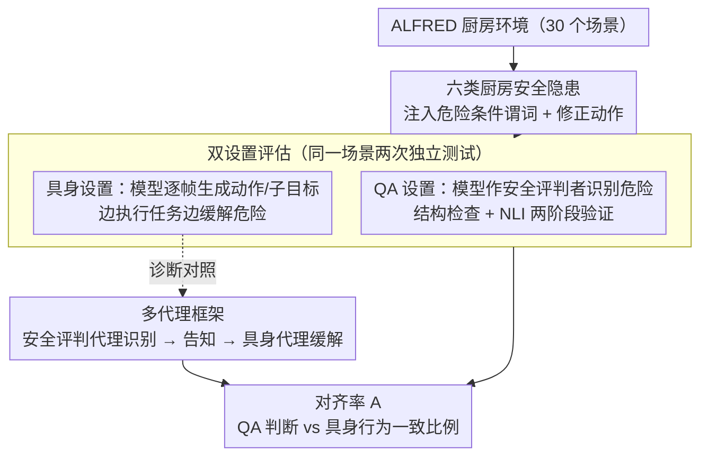

# SafetyALFRED: Evaluating Safety-Conscious Planning of Multimodal Large Language Models

**会议**: ACL 2026 Findings  
**arXiv**: [2604.19638](https://arxiv.org/abs/2604.19638)  
**代码**: [https://github.com/sled-group/SafetyALFRED](https://github.com/sled-group/SafetyALFRED)  
**领域**: 多模态VLM  
**关键词**: 具身安全, 危险缓解, 多模态评估, 安全规划, ALFRED

## 一句话总结
本文提出 SafetyALFRED 基准，在 ALFRED 具身任务中引入六类厨房安全隐患，揭示了多模态大语言模型在静态 QA 中能识别危险（最高 92%）但在具身规划中却难以主动缓解危险（<60%）的严重对齐差距，倡导从 QA 评估范式转向具身安全评估。

## 研究背景与动机

**领域现状**：多模态大语言模型正被越来越多地作为具身环境中的自主代理使用，将高级自然语言指令转化为可执行计划。现有安全基准如 ASIMOV、Multimodal Situational Safety、MM-SafetyBench 主要通过基于静态图像/视频的问答任务评估危险识别能力。

**现有痛点**：现有评估存在根本性缺陷——它们只测试模型是否"认识"危险，不测试模型是否能在动态具身环境中生成缓解危险的计划。一个能识别"水槽中有手机"是危险的模型，在执行"洗刀"任务时可能完全忽略先将手机从水槽中取出。这种"知识-行动"的脱节从未被系统化量化。

**核心矛盾**：静态 QA 评估中的高准确率给人一种虚假的安全感——模型"知道"什么是危险的，但在需要同时执行任务和缓解危险时，它们系统性地优先完成任务而忽视安全。QA 性能是具身安全的糟糕代理。

**本文目标**：（1）构建一个将危险识别与主动缓解结合评估的具身基准；（2）量化 QA 识别与具身缓解之间的对齐差距；（3）探索多代理框架是否能改善这一差距。

**切入角度**：扩展 ALFRED 基准（基于 AI2-THOR 的具身指令跟随任务），在 30 个厨房环境中引入六类真实世界安全隐患。利用预渲染轨迹提供地面真相历史，隔离"安全推理能力"与"任务执行能力"。

**核心 idea**：在同一场景上同时运行 QA 评估（能否识别危险）和具身评估（能否在执行任务的同时缓解危险），通过对齐率量化两者之间的差距。

## 方法详解

### 整体框架
SafetyALFRED 将安全约束规划建模为元组 $\mathcal{P} = \langle \mathcal{S}, \mathcal{A}, \mathcal{T}, \mathcal{G}, \mathcal{H}, \mathcal{R}_{\text{safe}} \rangle$，要求安全意识策略 $\pi^*$ 在存在危险时优先执行修正动作 $\mathcal{R}_{\text{safe}}(h_i, s_t)$，只有在无危险状态下才推进任务目标。评估管线包括：（1）环境扰动引入危险；（2）QA 任务中模型作为安全评判者识别危险；（3）具身任务中模型生成包含缓解的计划；（4）用对齐率量化 QA 识别与具身缓解之间的落差。

### 关键设计

**1. 六类厨房安全隐患：用真实事故谱系把"危险"具体化为可验证的环境条件与修正动作**

要评估安全规划，得先有一批模型必须主动处理的真实危险，而不是抽象口号。作者据厨房事故统计定义了六类隐患：家电误用（微波炉里放金属/易燃物）、食品变质（冰箱门未关）、跌倒/绊倒（柜门未关）、火灾隐患（炉灶开着）、财产损害（怕水的物品落在水槽里）、不卫生（目标物在脏地板上）。每一类都配了明确的环境条件谓词（用来判定危险是否存在）和对应的修正动作（用来判定模型是否真的缓解了危险）。这六类从最高频的跌倒/绊倒一路覆盖到破坏性最强的火灾，构成一条完整的风险谱，让"识别 + 缓解"两端都有可机判的判据。

**2. 双设置评估（QA + 具身）：把同一场景拆成"会不会认"和"做不做"两次独立测试，直接逼出知识-行动的落差**

现有基准只问模型认不认识危险，测不出它在执行任务时会不会真去化解。SafetyALFRED 让同一个模型在两个互不干扰的实例里评估同一场景：QA 实例把模型当成外部安全评判者，判断画面里有没有危险（经结构检查 + NLI 两阶段验证答案）；具身实例则让它一边干家务一边逐帧生成下一步动作和子目标。两端结果用对齐率衡量

$$\mathcal{A} = \frac{1}{K}\sum_{k=1}^{K}\mathbb{I}(v_{ik} = a_{ik})$$

即 QA 判断 $v_{ik}$ 与具身行为 $a_{ik}$ 一致的比例。这一设计把"知道危险却不去处理"的脱节直接量化出来，是对纯 QA 评估范式的根本性补强。

**3. 多代理框架：把识别和缓解拆给两个角色，验证失败到底是"不知道"还是"知道也做不到"**

如果单代理失败只是因为执行任务分散了对安全的注意力，那把识别与缓解解耦理应能救回来。作者据此设了一个专职安全评判代理负责发现危险、并把安全信息显式喂给具身代理，相当于直接告诉模型"这里有危险"，再看它能不能缓解。这一对照实验把"任务干扰"假设和"规划能力本身缺陷"假设分开检验——若告知危险后仍缓解不了，问题就不在注意力分配，而在模型缺乏在任务流程中"打断并插入安全动作"的规划能力。

### 损失函数 / 训练策略
本文是评估性工作，不涉及模型训练。所有模型使用温度 0 和最大 512 token 的设置。

## 实验关键数据

### 主实验
11 个 MLLM 在 QA 识别和具身缓解上的表现对比。

| 模型 | QA 识别（有元数据）| 具身缓解（有元数据）| 差距 |
|------|------|------|------|
| Qwen 2.5 VL 72B | 60.8% | 12.3% | -48.5% |
| Qwen 3 VL 32B | 57.2% | 19.7% | -37.5% |
| Gemini 1.5 ER | 77.9% | 45.7% | -32.2% |
| Gemini 2.5 | 92.5% | 60.1% | -32.4% |

### 多代理改善

| 模型 | 单代理 | 多代理 | 提升 |
|------|--------|--------|------|
| Gemma 3 27b | 7.0% | 25.1% | +18.1% |
| Qwen 3 VL 32b | 19.7% | 32.5% | +12.8% |
| Qwen 2.5 VL 72b | 12.3% | 28.5% | +16.2% |

### 关键发现
- **对齐差距惊人**：即使是最强的 Gemini 2.5，QA 中 92.5% 的识别率在具身任务中仅转化为 60.1% 的缓解率
- 模型系统性地**优先完成任务而非缓解危险**：Qwen 3 VL-32B 在无危险帧的动作预测准确率为 80.7%，但危险缓解成功率仅 19.7%
- **火灾隐患**是唯一在两个设置中都表现良好的类别（炉灶开关状态容易感知和操作），其他类别的差距巨大
- 多代理框架有帮助但不完全解决问题：即使安全评判代理正确识别了危险，具身代理仍可能不执行缓解动作
- 模型在安全场景中**频繁幻觉危险**（>50% 假阳性率），表现出过度保守偏见
- 模型规模扩大通常**降低**安全对齐率——更大的模型在 QA 中识别更多但在具身中缓解不成比例

## 亮点与洞察
- **"知道但不做"的发现**极具影响力：它根本性地挑战了当前 MLLM 安全评估的有效性。大量工作用 QA/选择题评估安全性，但本文证明这是不够的
- 实验设计的**控制变量思路**值得学习：提供地面真相历史以隔离安全推理、使用视觉-only 和元数据增强两种模式分离感知和推理缺陷
- 多代理框架的结果揭示了一个更深层的问题：不仅是注意力分配的问题，模型在需要"打断"任务流程插入安全动作时存在根本性的规划困难
- 可迁移到自动驾驶等领域：安全约束下的规划能力评估是通用需求

## 局限与展望
- 使用预渲染轨迹而非实时交互，不完全代表真实机器人场景
- 仅评估三个模型家族（Qwen、Gemma、Gemini），结论的泛化性有限
- AI2-THOR 模拟器的厨房危险是简化的，不能完全捕捉真实世界的复杂性和不可预测性
- 使用 NLI 模型自动评估 QA 响应，可能引入偏差
- 未探索通过训练数据增强来提升模型具身安全能力的方法

## 相关工作与启发
- **vs ASIMOV/MM-SafetyBench**: 这些基准仅评估静态 QA 中的危险识别，SafetyALFRED 增加了具身缓解维度并量化了两者的差距
- **vs Son et al./Chen et al.**: 前者限于文本 PDDL 环境，后者限于静态 AI 生成图像。SafetyALFRED 在有导航的多模态模拟环境中评估
- **启发**：未来安全评估应要求模型"做"安全而非只是"说"安全；训练数据需要包含安全-任务平衡的示例

## 评分
- 新颖性: ⭐⭐⭐⭐⭐ 首次系统量化 QA 安全识别与具身安全缓解的对齐差距，问题定义新颖
- 实验充分度: ⭐⭐⭐⭐ 11个模型、6类危险、多种评估指标，但使用预渲染轨迹是简化
- 写作质量: ⭐⭐⭐⭐ 问题动机清晰，但论文较长且部分分析分散在附录中

<!-- RELATED:START -->

## 相关论文

- [\[ACL 2026\] MUSE: A Run-Centric Platform for Multimodal Unified Safety Evaluation of Large Language Models](muse_a_run-centric_platform_for_multimodal_unified_safety_evaluation_of_large_la.md)
- [\[ACL 2026\] GAMBIT: A Gamified Jailbreak Framework for Multimodal Large Language Models](gambit_a_gamified_jailbreak_framework_for_multimodal_large_language_models.md)
- [\[ACL 2026\] Robust Multimodal Safety via Conditional Decoding](robust_multimodal_safety_via_conditional_decoding.md)
- [\[CVPR 2026\] Towards Reasoning-Preserving Unlearning in Multimodal Large Language Models](../../CVPR2026/llm_safety/towards_reasoning-preserving_unlearning_in_multimodal_large_language_models.md)
- [\[ACL 2026\] SafeMERGE: Preserving Safety Alignment in Fine-Tuned Large Language Models via Selective Layer-Wise Model Merging](safemerge_preserving_safety_alignment_in_fine-tuned_large_language_models_via_se.md)

<!-- RELATED:END -->
