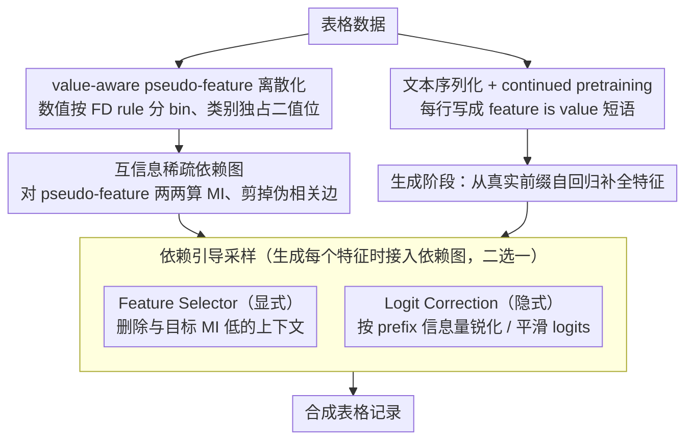

# SAGE: Sparse Adaptive Guidance for Dependency-Aware Tabular Data Generation

**会议**: ACL2026  
**arXiv**: [2604.24368](https://arxiv.org/abs/2604.24368)  
**代码**: https://github.com/ShuoYangtum/SAGE  
**领域**: 合成表格数据 / LLM 数据生成 / 依赖建模  
**关键词**: 表格数据生成、稀疏依赖、互信息、动态引导、合成数据质量

## 一句话总结
SAGE 把表格特征离散为 value-aware pseudo-features，并用互信息构建稀疏动态依赖图来引导 LLM 生成，从而提升合成表格数据的下游效用、约束一致性和真实感。

## 研究背景与动机
**领域现状**：合成表格数据在医疗、金融、教育等隐私敏感或低资源场景中很重要。传统 TVAE、CTGAN、扩散模型等方法主要学习数值矩阵分布；近年 LLM 方法会把一行表转换成“feature is value”的文本序列，利用语言模型的语义知识生成更合理的记录。

**现有痛点**：LLM 生成表格行时通常把所有历史 feature-value 对作为上下文，并依赖 dense attention 捕捉关系。这会引入无关特征之间的伪相关，导致逻辑不一致或下游模型性能下降。另一方面，已有显式依赖建模方法多使用静态特征图，不能表达“同一个特征取不同值时依赖关系改变”的现象。

**核心矛盾**：表格数据既有稀疏结构，又有条件动态性。比如贷款目的为教育和购房时，年龄、收入、职业稳定性之间的关联完全不同。若只建静态图，会忽略 value-conditioned dependency；若完全交给 LLM dense attention，又容易被表面共现误导。

**本文目标**：构造一种 LLM-based 表格生成框架，使模型在生成每个目标特征时只关注真正相关、且随已生成取值变化的上下文，同时避免显著增加推理成本。

**切入角度**：作者将原始特征扩展为 value-aware pseudo-features，并用互信息估计 pseudo-feature 之间的统计依赖。这样依赖图不再只描述“特征 A 与特征 B 相关”，而是描述“特征 A 的某个取值区间与特征 B 的生成相关”。

**核心 idea**：用互信息驱动的稀疏动态依赖图，在采样阶段通过显式上下文筛选或隐式 logit 修正，让 LLM 按当前 feature values 自适应地生成表格记录。

## 方法详解

### 整体框架
SAGE 分为两个阶段。预处理阶段先把表格数据转换为文本序列，对 LLM 做 continued pretraining，使其学习 feature-value 的语言化分布；同时把数值和类别特征离散成 pseudo-features，并基于训练集估计互信息矩阵。生成阶段从部分真实 feature-value 前缀出发，按自回归方式补全剩余特征，但每一步都会用互信息图控制上下文或输出置信度。

论文提出两种互补引导策略：Feature Selector 是显式策略，它直接删除与目标特征互信息较低的上下文；Logit Correction 是隐式策略，它不删除上下文，而是根据当前 prefix 的信息量调节候选值 logits。两者都旨在避免 LLM 在生成某个特征时被无关 feature-value 对牵引。

### 关键设计

**1. value-aware pseudo-feature 离散化：把依赖建模的粒度从"特征级"下沉到"取值级"**

静态特征图只能说"特征 A 和特征 B 相关"，却没法表达"贷款目的取教育还是购房时，年龄与收入的关联完全不同"这种 value-conditioned 的依赖。SAGE 的破题点是先把每个原始特征拆成一组二值 pseudo-feature：数值特征按 Freedman-Diaconis rule 自动定 bin 数、并设上限 16 来控制稀疏度，类别特征则每个类别独占一个 pseudo-feature。这样一条记录就被映射成一组被激活的二值 pseudo-feature，依赖的最小单元从"某个特征"变成"某个特征落在某个取值区间"，互信息于是能直接捕捉到条件相关性，而不再被特征层面的粗粒度抹平。

**2. 互信息稀疏依赖图：用一个轻量、无监督的统计量过滤掉 dense attention 里的伪相关边**

LLM 生成表格行时通常把所有历史 feature-value 对一股脑塞进上下文、靠 dense attention 自己理关系，结果常被表面共现误导，生成逻辑不一致的记录。SAGE 转而对任意两个 pseudo-feature 计算其二值激活之间的 mutual information，构成一张依赖矩阵。由于概率估计建立在 pseudo-feature 的激活上、而非原始数值尺度，数值与类别变量能被统一处理。互信息本身可解释、不需额外监督，相当于给上下文之间的边判了一次"信息量体检"，把无关边剪掉，为后面"生成某个特征时只看真正相关的上下文"打好基础。

**3. Feature Selector 与 Logit Correction：把依赖图真正接进采样过程，且提供显式/隐式两套可切换的接法**

光有依赖图还不够，得让它在每一步生成时起作用。SAGE 给出两种互补策略。Feature Selector 是显式硬过滤：生成目标特征时，只保留与它互信息高于阈值（默认取训练集互信息的中位数）的 prefix pseudo-feature，其余上下文直接删掉。Logit Correction 是隐式软调节：不动上下文，而是算出当前 prefix 对目标特征的平均互信息，与训练集平均互信息比较——prefix 信息量高就锐化目标 logits、让模型更自信，信息量低则平滑输出分布、避免被弱信号带偏。前者适合噪声多、依赖稀疏的高维表格，后者更适合依赖连续、删上下文会丢信息的场景，使用者可按数据形态选用。

### 损失函数 / 训练策略
训练阶段沿用 GReaT 风格的 LLM 表格建模：每行被写成多个“feature is value”短语，优化 value-related token 的负对数似然。作者还使用 GraDe 的 permutation strategy，随机打乱 feature-value 短语顺序，减少固定列顺序带来的伪依赖。实验设置中 batch size 为 8，AdamW 优化器，学习率 1e-4；采样采用 nucleus sampling，$p=0.95$，temperature 为 1.0，最大生成长度设为训练集中最大序列长度。

## 实验关键数据

### 主实验

实验覆盖六个数据集：Adult Income、HELOC、Iris、Diabetes、MIC 和 California Housing，任务包括二分类、多分类和回归。作者生成与原始数据同样规模的合成数据，再训练 DT/RF 等下游模型并在真实测试集上评估。

| 数据集 / 指标 | GReaT | GraDe | SPADA | SAGE w/FS | SAGE w/LC | 关键观察 |
|--------|------|------|------|------|------|------|
| Adult Income，DT F1 ↑ | 0.60 | 0.55 | 0.50 | 0.68 | 0.72 | LC 比 GReaT 高 12 个点 |
| Adult Income，RF F1 ↑ | 0.69 | 0.63 | 0.75 | 0.75 | 0.76 | 两个 SAGE 变体均显著优于 GReaT |
| HELOC，DT F1 ↑ | 0.61 | 0.67 | 0.61 | 0.68 | 0.69 | 动态依赖在信用数据上稳定提升 |
| Iris，RF ACC ↑ | 44.83 | 100.00 | 100.00 | 100.00 | 100.00 | SAGE 避免了 GReaT 在小数据上的过拟合崩塌 |
| California Housing，RF MAPE ↓ | 0.26 | 0.23 | 0.25 | 0.25 | 0.40 | FS 在回归上更稳，LC 在部分场景更偏保守 |

### 消融实验

| 配置 / 分析项 | 关键指标 | 说明 |
|------|---------|------|
| Feature Selector | Adult education-consistency violation 1.32% | 显式上下文筛选特别适合依赖少数精确属性的规则 |
| Logit Correction | Housing violation 比 GReaT 低约 1 个点 | 隐式调节对空间连续约束更友好 |
| 互信息阈值 | Appendix 显示性能在较宽阈值范围稳定 | 方法不完全依赖某个脆弱阈值 |
| 不同基础 LLM | GPT-2、Qwen-3、Llama-3 均保持相似趋势 | SAGE 的依赖引导不是单一模型特例 |
| 预处理与采样成本 | MI 计算为一次性开销，生成阶段受益于稀疏上下文 | 适合把成本前置到数据级预处理 |

### 关键发现
- 下游效用方面，SAGE 在几乎所有任务上优于 GReaT，Adult 数据集 F1 提升超过 10 个点，说明互信息引导能缓解 LLM 表格生成中的表面模式过拟合。
- 约束一致性方面，SAGE 生成的 California Housing 样本几乎不落在真实州界之外，TVAE 和 CTGAN 则较难重建这种复杂空间轮廓。
- 两种引导策略互补：Feature Selector 更擅长清除高维噪声和精确语义规则错误，Logit Correction 更擅长平滑的连续空间依赖。
- HELOC 上 Logit Correction 偶尔会压制有用信号，提示“上下文互信息被低估”会让隐式修正过于保守。

## 亮点与洞察
- 论文把 LLM 表格生成的问题从“文本化行建模”推进到“值条件依赖控制”。这比简单把表格行序列化更接近表格数据的结构本质。
- pseudo-feature 设计很实用：它既让数值特征有可离散统计的表示，又保留类别特征天然的取值结构，避免额外训练复杂图模型。
- Feature Selector 和 Logit Correction 的并列设计有工程价值。前者是可解释的硬过滤，后者是柔性的概率调节，适合不同数据集的依赖形态。
- 论文没有只报告下游分类分数，还评估 violation、SVM realism、DCR privacy 和可视化分布，使合成数据质量评估更全面。

## 局限与展望
- 依赖图主要基于两两互信息，无法显式建模多个特征共同影响目标特征的高阶关系。自回归 LLM 可部分弥补，但高阶结构仍缺少直接控制。
- 高维数据上的互信息矩阵预处理可能较重，虽然是一次性成本，但在特征数和 pseudo-feature 数极大时仍需稀疏化或近似估计。
- 互信息估计依赖训练 split 的统计质量，小样本或长尾类别会带来估计噪声，影响上下文筛选。
- 结果显示不同策略适合不同约束类型，未来可研究 FS 与 LC 的自适应混合，而不是人工选择变体。
- 隐私评估以 DCR 为主，仍需更强的成员推断、属性推断或差分隐私视角来验证敏感领域部署可靠性。

## 相关工作与启发
- **vs GReaT**: GReaT 证明 LLM 可以生成真实感表格行，但上下文建模是平铺的；SAGE 在此基础上加入互信息引导，减少无关 feature-value 对干扰。
- **vs GraDe / SPADA**: GraDe 和 SPADA 已强调结构依赖，但多偏向静态结构；SAGE 的关键差异是依赖随当前取值动态变化。
- **vs TVAE / CTGAN / TabSyn**: 传统生成模型擅长学习分布形状，但较难利用 feature 语义；SAGE 借助 LLM 的语义先验，同时用统计依赖约束它。
- **启发**: 对结构化数据的 LLM 生成，不应只设计 prompt 或序列模板，还应显式控制“生成某个字段时应该看哪些字段”。这一点可迁移到知识图谱补全、表单自动填充和半结构化文档合成。

## 评分
- 新颖性: ⭐⭐⭐⭐☆ value-aware pseudo-feature 与互信息引导结合得自然，创新主要在结构控制而非生成模型本身。
- 实验充分度: ⭐⭐⭐⭐☆ 六个数据集、多指标、多基线，覆盖较全面；但隐私与超高维扩展仍可更深入。
- 写作质量: ⭐⭐⭐⭐☆ 方法逻辑清楚，表格数据较多但主线明确。
- 价值: ⭐⭐⭐⭐☆ 对低资源和隐私敏感表格数据生成有实际意义，也为 LLM 生成结构化数据提供了可解释控制思路。

<!-- RELATED:START -->

## 相关论文

- [\[ICLR 2026\] Resource-Adaptive Federated Text Generation with Differential Privacy](../../ICLR2026/llm_safety/resource-adaptive_federated_text_generation_with_differential_privacy.md)
- [\[ACL 2026\] AGSC: Adaptive Granularity and Semantic Clustering for Uncertainty Quantification in Long-text Generation](agsc_adaptive_granularity_and_semantic_clustering_for_uncertainty_quantification.md)
- [\[AAAI 2026\] AgentSense: Virtual Sensor Data Generation Using LLM Agents in Simulated Home Environments](../../AAAI2026/llm_safety/agentsense_virtual_sensor_data_generation_using_llm_agents_i.md)
- [\[ACL 2026\] Differentially Private Synthetic Text Generation for Retrieval-Augmented Generation (RAG)](differentially_private_synthetic_text_generation_for_retrieval-augmented_generat.md)
- [\[ACL 2026\] CRISP: Persistent Concept Unlearning via Sparse Autoencoders](crisp_persistent_concept_unlearning_via_sparse_autoencoders.md)

<!-- RELATED:END -->
