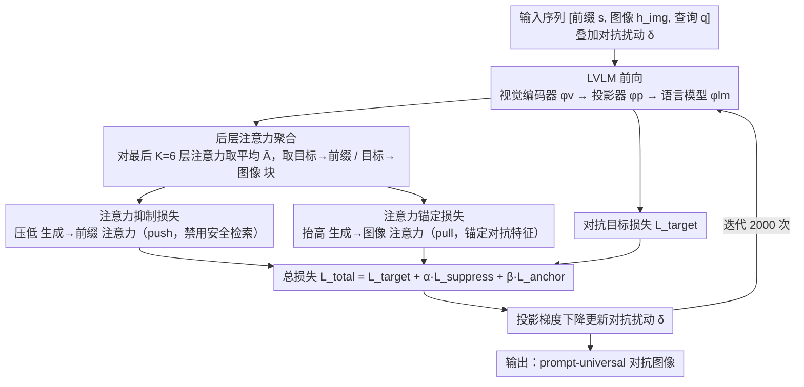

# Seeing No Evil: Blinding Large Vision-Language Models to Safety Instructions via Adversarial Attention Hijacking

**会议**: ACL 2026  
**arXiv**: [2604.10299](https://arxiv.org/abs/2604.10299)  
**代码**: [github.com/Landsayy/AttentionJailbreak](https://github.com/Landsayy/AttentionJailbreak)  
**领域**: 多模态VLM  
**关键词**: 视觉越狱攻击, 注意力操纵, 安全对齐, 梯度冲突, 大视觉语言模型

## 一句话总结

提出 Attention-Guided Visual Jailbreaking，通过抑制模型对安全指令的注意力并将注意力锚定到对抗图像特征上，绕过而非强攻安全对齐机制，在 Qwen-VL 上达到 94.4% 攻击成功率，同时减少 45% 的梯度冲突。

## 研究背景与动机

**领域现状**：大型视觉语言模型（LVLMs）广泛部署于 AI 助手、内容审核等安全关键场景，其安全对齐依赖模型在每个解码步骤中通过注意力机制持续检索前缀区域中的安全指令。

**现有痛点**：现有对抗攻击主要优化输出 logits 以最大化有害输出概率，但忽略了安全机制在模型内部的实现位置。这导致严重的**梯度冲突**——对抗梯度与安全检索梯度方向相反，20% 的优化迭代出现严重冲突（余弦相似度 $< -0.5$），造成优化振荡和收敛缓慢。

**核心矛盾**：安全对齐通过注意力机制在 Transformer 中间层实现，但攻击在最终输出层施加，产生**功能位置错配**。

**本文目标**：设计一种直接操纵注意力分布的攻击方法，绕过安全检索机制而非与之对抗。

**切入角度**：视觉模态的连续高维特性使得基于梯度的注意力分布雕刻成为可能，而文本模态中的离散组合搜索则无法做到。

**核心 idea**：安全对齐本质上是对前缀 token 的注意力检索过程，如果抑制这种注意力，模型不是"违反"安全规则，而是"无法检索"安全规则——即 safety blindness。

## 方法详解

### 整体框架

将 LVLM 分解为视觉编码器 $\phi_v$、多模态投影器 $\phi_p$ 和语言模型 $\phi_{lm}$。输入序列 $x_{\text{seq}} = [s, h_{\text{img}}, q]$，其中 $s$ 为前缀 token（系统指令和角色标记），$h_{\text{img}}$ 为图像 token，$q$ 为查询 token。每次前向后，先从模型后层聚合出注意力矩阵，再在标准对抗目标之上施加抑制和锚定两个注意力辅助损失，形成一推一拉（push-pull）的机制，最后用投影梯度下降迭代更新对抗扰动 $\delta$。

### 关键设计

1. **注意力抑制损失（Suppression Loss）**：最小化生成 token 对前缀 token 的注意力权重 $\mathcal{L}_{\text{suppress}} = \frac{1}{|\mathcal{I}_{\text{gen}}|} \sum_{i \in \mathcal{I}_{\text{gen}}} \sum_{j \in \mathcal{I}_{\text{prefix}}} \bar{A}_{i,j}$，阻断模型检索安全指令的通道。设计动机是安全行为通过前缀注意力持续检索，抑制此注意力可从源头禁用安全机制。

2. **注意力锚定损失（Anchoring Loss）**：最大化生成 token 对图像 token 的注意力 $\mathcal{L}_{\text{anchor}} = -\frac{1}{|\mathcal{I}_{\text{gen}}|} \sum_{i \in \mathcal{I}_{\text{gen}}} \sum_{j \in \mathcal{I}_{\text{img}}} \bar{A}_{i,j}$。利用 softmax 归一化的竞争性，确保被抑制的注意力质量重新分配到图像 token 而非查询 token，使生成过程锚定于对抗性视觉特征。

3. **后层注意力聚合**：对最后 $K=6$ 层的注意力矩阵取平均 $\bar{A} = \frac{1}{K} \sum_{\ell=L-K+1}^{L} \frac{1}{H} \sum_{h=1}^{H} A^{(\ell,h)}$，基于先前研究发现拒绝行为集中在 Transformer 后层的证据。通过二元位置选择器提取目标→前缀和目标→图像注意力块，整个干预纯粹通过损失驱动，不修改模型前向计算。

### 损失函数 / 训练策略

总损失为三项加权组合：$\mathcal{L}_{\text{total}} = \mathcal{L}_{\text{target}} + \alpha \cdot \mathcal{L}_{\text{suppress}} + \beta \cdot \mathcal{L}_{\text{anchor}}$，通过投影梯度下降优化图像扰动 $\delta$：$\delta^{(t+1)} = \Pi_{\|\cdot\|_\infty \leq \epsilon}[\delta^{(t)} - \eta \cdot \nabla_\delta \mathcal{L}_{\text{total}}]$。默认参数 $\alpha=10, \beta=5, \eta=1/255, K=6$，2000 次迭代。攻击是 prompt-universal 的，单张对抗图像可跨不同有害查询使用。

## 实验关键数据

### 主实验

| 方法 | ε | Qwen-VL AdvBench (G) | LLaVA-1.5 AdvBench (G) | Qwen-VL StrongREJECT (G) |
|------|---|---------------------|----------------------|-------------------------|
| VAE-JB | 32 | 68.8% | 57.9% | 55.6% |
| BAP | 32 | 4.2% | 54.8% | 9.3% |
| **Ours** | **32** | **94.4%** | **77.5%** | **90.4%** |
| **Ours** | **16** | **44.8%** | **62.3%** | **66.5%** |

### 消融实验

| 配置 | α | β | AdvBench | StrongREJECT | HarmBench | JB | 平均 |
|------|---|---|---------|-------------|-----------|-----|------|
| 仅 $\mathcal{L}_{\text{target}}$ | 0 | 0 | 55.0 | 47.0 | 70.5 | 69.0 | 60.4 |
| +Suppress | 10 | 0 | 63.3 | 70.0 | 72.0 | 73.0 | 69.6 |
| +Anchor | 0 | 5 | 57.5 | 44.1 | 72.5 | 70.0 | 61.0 |
| **Full** | **10** | **5** | **77.5** | **78.0** | **84.0** | **84.0** | **80.9** |

### 关键发现

- 两项损失表现出**协同效应**：单独增益之和为 70.2%，但组合达到 80.9%，超出线性组合 10.7%
- 成功攻击将系统提示注意力抑制 80%，图像注意力放大 4.1×
- 因果干预实验：在对抗图像上恢复系统注意力（$b=2.0$），ASR 从 88.0% 降至 26.0%，证明注意力抑制是攻击成功的因果必要条件
- 跨模型迁移：对抗图像在 GPT-4o 上达 52.0% ASR，Claude-3.5 上 39.6%

## 亮点与洞察

- **Safety Blindness 机制发现**：攻击成功不是因为模型"违反"安全规则，而是因为模型"看不见"安全规则，这一视角对理解和改进安全对齐极具启发
- **梯度冲突分析**首次量化了输出导向攻击中对抗梯度与安全梯度的对抗关系，为优化困难提供了原理性解释
- Push-pull 设计简洁优雅，仅增加两个简单的辅助损失就显著提升攻击效率
- MM-SafetyBench 上跨 13 种安全场景均有提升，整体 ASR 达 47.38%（Qwen-VL），显示方法的通用性

## 局限与展望

- 方法依赖白盒梯度访问，黑盒场景下的扩展是重要方向
- 超参数（$\alpha, \beta$）在所有模型上使用固定值，自适应加权策略可能进一步提升效果
- 发现的 safety blindness 机制应启发防御方向：强化注意力层面的安全冗余，而非仅依赖前缀指令
- InternVL2 上效果较弱（白盒 ASR 仅 ~18%），可能因其安全机制不完全依赖前缀注意力
- 对抗图像在紧扰动预算（$\epsilon=8/255$）下仍能维持 59.0% ASR，优于基线的 45.7%
- 未来可探索将注意力干预与输出优化自适应组合，根据攻击阶段动态调整权重

## 相关工作与启发

- **Superficial Alignment Hypothesis**：安全对齐主要编码在少量格式化 token 中，这解释了为什么抑制前缀注意力就足以绕过安全机制
- **Representation Engineering**：安全行为是结构化、可检索的信号而非弥散性副作用，支持了定向注意力干预的可行性
- **文本对抗攻击**（GCG、PAIR 等）：视觉模态的连续性使注意力操纵比离散文本搜索更高效
- 对 LLM 安全防御研究的启示：需要设计对注意力操纵鲁棒的安全机制

## 评分

- **新颖性**: ⭐⭐⭐⭐⭐ 从注意力机制角度理解和利用安全对齐的脆弱性，safety blindness 概念极具原创性
- **实验充分度**: ⭐⭐⭐⭐⭐ 5 个 benchmark、4 个模型、因果干预分析、梯度冲突量化、跨模型迁移，实验设计极为严谨
- **写作质量**: ⭐⭐⭐⭐⭐ 逻辑清晰，从问题诊断（梯度冲突）到解决方案（attention-guided）到机制验证（因果分析），叙事完整流畅
- **价值**: ⭐⭐⭐⭐ 既推进了对 LVLM 安全机制的理解，也为防御研究指出了新方向

<!-- RELATED:START -->

## 相关论文

- [\[ACL 2026\] AutoRAN: Automated Hijacking of Safety Reasoning in Large Reasoning Models](autoran_automated_hijacking_of_safety_reasoning_in_large_reasoning_models.md)
- [\[ACL 2026\] Reasoning Hijacking: The Fragility of Reasoning Alignment in Large Language Models](reasoning_hijacking_the_fragility_of_reasoning_alignment_in_large_language_model.md)
- [\[ACL 2026\] Rethinking Jailbreak Detection of Large Vision Language Models with Representational Contrastive Scoring](rethinking_jailbreak_detection_of_large_vision_language_models_with_representati.md)
- [\[CVPR 2026\] Test-Time Attention Purification for Backdoored Large Vision Language Models](../../CVPR2026/llm_safety/test-time_attention_purification_for_backdoored_large_vision_language_models.md)
- [\[ACL 2026\] Preventing Safety Drift in Large Language Models via Coupled Weight and Activation Constraints](preventing_safety_drift_in_large_language_models_via_coupled_weight_and_activati.md)

<!-- RELATED:END -->
