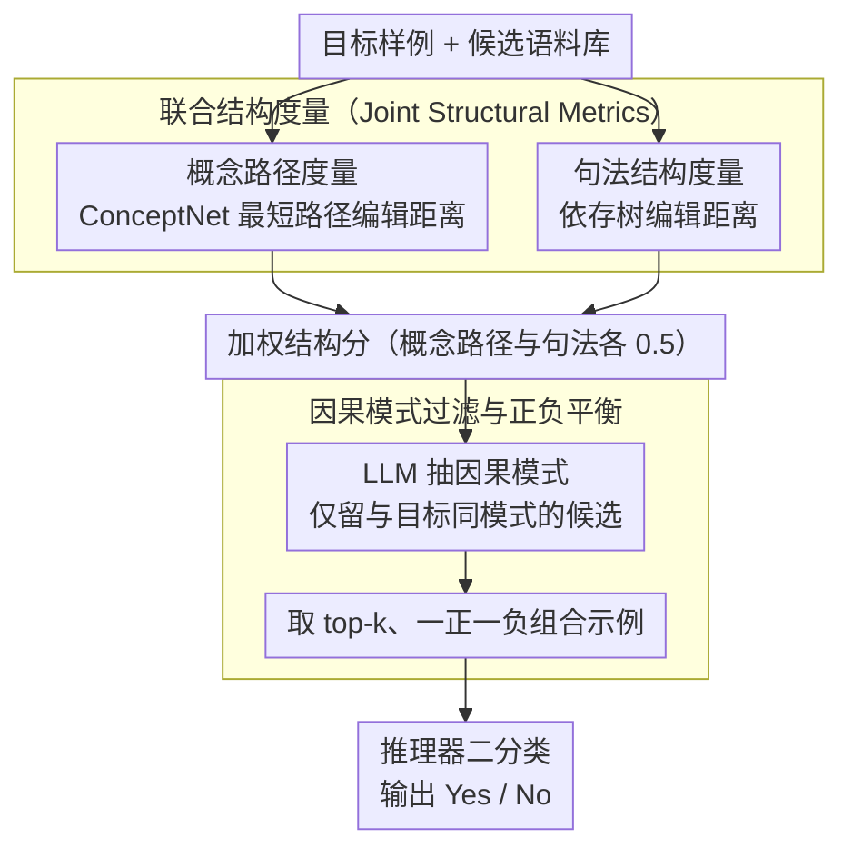

# SERE: Structural Example Retrieval for Enhancing LLMs in Event Causality Identification

**会议**: ACL2026  
**arXiv**: [2605.03701](https://arxiv.org/abs/2605.03701)  
**代码**: https://github.com/DMIRLAB-Group/SERE  
**领域**: LLM安全 / 因果关系识别  
**关键词**: 事件因果识别、结构化检索、上下文学习、因果幻觉、ConceptNet

## 一句话总结
SERE 认为事件因果识别中的示例选择不能只看语义相似度，而应检索概念路径、句法树和因果模式都结构相近的样例，从而让 LLM 在少样本推理时更少过度预测因果关系。

## 研究背景与动机
**领域现状**：事件因果识别要求模型判断上下文中的两个事件是否存在因果关系。传统方法多依赖 BERT/RoBERTa 等编码器微调，而 LLM 让免训练或少样本推理成为可能，适合标注数据稀缺、需要快速迁移的 ECI 场景。

**现有痛点**：直接提示 LLM 做 ECI 时，一个典型问题是 causal hallucination，即模型过度预测“有因果”。CoT 能稍微改善推理过程，但无法稳定降低假阳性；Dr.ECI 这类模式化方法提高召回，却仍容易牺牲精度。

**核心矛盾**：ECI 的相似性本质上不是普通句子语义相似，而是事件间的结构关系相似。两个样例即便共享“rain”和“road”等词，也可能因果标签相反；反过来，词面不相似的样例可能有相同的因果结构，更适合做 in-context demonstration。

**本文目标**：作者希望构建一种不微调 LLM 的示例检索框架，让 few-shot examples 更贴近目标样例的因果推理结构，并在保持召回的同时显著提高精度。

**切入角度**：SERE 把“结构”拆为三类信号：ConceptNet 上源事件到目标事件的概念路径、上下文的依存句法树、以及预定义因果图模式。前两者负责连续打分，后者负责硬过滤。

**核心 idea**：先用概念路径编辑距离和句法树编辑距离给候选样例排序，再用 LLM 抽取的因果模式做过滤，最后选择正负平衡的少量结构相似示例交给 LLM 推理。

## 方法详解

### 整体框架
SERE 的定位不是又一个因果分类器，而是一个“为 LLM 挑案例”的检索器。它的出发点是：LLM 并非完全不会做因果推理，而是在少样本设置下容易被表层语义相近、但因果结构相反的 demonstration 带偏，于是过度判“有因果”。只要喂进 prompt 的示例在因果结构上对齐，模型的决策边界自然会收紧、精度提高。

整条流水线分三步走。先由联合结构度量（Joint Structural Metrics）对目标样例与语料库里每个候选样例算两类结构相似度——ConceptNet 上的概念路径相似度和依存句法树相似度——加权成一个结构分数；再由因果模式过滤（Causal Pattern Filtering）用一个轻量 LLM prompt 抽出候选所属的粗粒度因果模式，只留下与目标样例模式一致的候选；最后把筛出来的少量结构相似示例塞进 prompt，让推理器（Reasoner）在二分类格式下输出 Yes 或 No。

### 关键设计

**1. 概念路径度量（Conceptual Path Metric）：文本里没有显式因果连接词时，靠常识图谱上的路径补出隐含关系**

ECI 难就难在很多因果关系并不写在字面上——句子里没有“因为”“导致”，两个事件的关系藏在常识里。SERE 的做法是先用 Contriever-msmarco 把事件 span 匹配到 ConceptNet 节点，再用 Neo4j 查源事件节点到目标事件节点之间的最短路径；目标样例和候选样例各自得到一条概念路径后，用编辑距离算归一化相似度 $1-ED(path_x,path_q)/\max(|path_x|,|path_q|)$。这条路径刻画的是“两个事件在常识层面怎么连起来”，比直接比较上下文句子的 embedding 更贴近 ECI 真正要判的东西。

**2. 句法结构度量（Syntactic Metric）：因果常由从句、状语、跨句指代承载，所以也要比“因果是怎么被表达出来的”**

光有外部常识还不够，因果关系在语言上往往由从句、状语、介词结构或跨句指代来承载——同样一对事件，换一种句法组织，因果指向可能就变了。SERE 用 spaCy 给上下文建依存句法树（多句文本统一挂到一个人工根节点上），再算目标样例和候选样例之间的树编辑距离，相似度取 $e^{-0.05\cdot TED(tree_x,tree_q)}$。这个分数和概念路径分数按各 0.5 的权重合并成最终结构分数，一个管“外部知识怎么连”、一个管“语言怎么表达”，互为补充。

**3. 因果模式过滤与正负平衡（Causal Pattern Filtering）：硬过滤掉结构相似但因果图类型不同的样例，同时压住 LLM 对“有因果”的偏置**

前两个分数是连续打分，但结构分高不代表因果图类型一样——两个样例可能都很“像”，却一个是 Chain、一个是 Collider。SERE 预定义了 Direct、Chain、Collider、Fork、Coreference 几类粗粒度因果模式，用 LLM PatternExtractor 给正例抽模式（负例直接记为 No），检索时只保留与目标样例模式一致的候选。过完这道硬过滤后，再从高结构分候选里取 top-k，并刻意按一半正例、一半负例来组合 demonstration。这一步专门冲着 causal hallucination 去：只给正例会让模型更敢判“有因果”，只给语义近邻又可能混进相反标签，模式过滤加正负平衡相当于在 prompt 里给模型摆出一条更保守的判别边界。

### 一个完整示例
设目标样例要判“暴雨（rain）”和“封路（road closed）”是否有因果。先做概念匹配，把两个事件挂到 ConceptNet 节点，查到一条 rain→flood→road closed 的概念路径；同时 spaCy 把上下文解析成依存树。语料库里有上千候选，Joint Structural Metrics 给每个候选算出概念路径相似度和树编辑距离相似度并加权排序——一个字面也含“rain/road”但其实是并列关系（因果标签为 No）的样例，会因为概念路径走的是另一条、句法树差异大而被压到低分。接着 Causal Pattern Filtering 抽出目标样例属于 Chain 模式，只留下同样是 Chain 的候选；最后在剩余高分候选里取 top-2、按一正一负配好，连同目标样例一起交给 GPT-4o-mini 判 Yes/No。整个过程候选集从全语料逐步收缩到 2 条结构对齐的示例。

### 损失函数 / 训练策略
主方法不训练 LLM，也不更新任何分类模型参数。实现上 ConceptNet 节点匹配阈值设为 0.6，概念路径与句法分数权重各 0.5，默认取 top-2 demonstrations，LLM temperature 设为 0 以减少随机性。主实验用 GPT-4o-mini 和 Gemini-1.5-pro 的 API；附录里另用 LoRA 微调 Qwen2.5-3B-Inst，验证 SERE 这套结构化示例能否迁移到微调设置。

## 实验关键数据

### 主实验
主实验覆盖 ESC、CTB 和 MAVEN-ERE 三个 ECI 数据集。指标为 Precision、Recall 和 F1。下表摘录 F1，重点看 SERE 对 LLM 的提升。

| LLM | 方法 | ESC F1 | CTB F1 | MAVEN-ERE F1 | 主要变化 |
|-----|------|--------|--------|--------------|----------|
| GPT-4o-mini | Base | 42.3 | 10.1 | 36.9 | 直接提示，召回高但精度低 |
| GPT-4o-mini | CoT | 43.1 | 11.6 | 39.4 | 小幅提升 |
| GPT-4o-mini | Dr.ECI | 46.1 | 15.1 | 40.7 | 结构化推理提高召回 |
| GPT-4o-mini | SERE | 49.9 | 20.0 | 42.3 | 三个数据集均最佳 |
| Gemini-1.5-pro | Base | 37.0 | 9.0 | 34.6 | 同样存在过度预测 |
| Gemini-1.5-pro | Dr.ECI | 41.3 | 13.3 | 37.3 | 有提升但不充分 |
| Gemini-1.5-pro | SERE | 45.2 | 17.4 | 39.9 | 稳定提升 |

在 GPT-4o-mini 上，SERE 相比 Base 在 ESC、CTB、MAVEN-ERE 上分别提升 7.6、9.9、5.4 F1。更重要的是，它主要通过提升 Precision 来减少假阳性，而不是单纯提高 Recall。

### 消融实验

| 配置 | ESC F1 | CTB F1 | MAVEN-ERE F1 | 说明 |
|------|--------|--------|--------------|------|
| SERE | 49.9 | 20.0 | 42.3 | 完整结构检索 |
| 仅 Conceptual Path | 46.7 | 18.9 | 39.2 | 外部常识路径有效但不完整 |
| 仅 Syntactic | 44.5 | 18.9 | 38.7 | 句法结构单独使用较弱 |
| 仅 Causal Pattern | 47.1 | 17.3 | 38.3 | 模式约束能控假阳性但覆盖不足 |
| 去掉 Conceptual Path | 46.6 | 18.8 | 40.8 | 三数据集都掉点 |
| 去掉 Syntactic | 48.1 | 18.9 | 40.5 | 句法与其他信号互补 |
| 去掉 Causal Pattern | 47.5 | 18.2 | 39.4 | 硬过滤贡献明显 |

| 检索方式 | ESC F1 | CTB F1 | MAVEN-ERE F1 | 结论 |
|----------|--------|--------|--------------|------|
| Base | 42.3 | 10.1 | 36.9 | 没有示例 |
| Random | 46.6 | 13.9 | 39.1 | 示例本身有帮助 |
| Contriever-msmarco | 46.2 | 18.8 | 37.9 | 语义检索不稳定 |
| BM25 | 46.5 | 17.1 | 33.4 | 词面检索在 MAVEN-ERE 反而掉点 |
| SERE | 49.9 | 20.0 | 42.3 | 结构检索最稳 |

### 关键发现
- SERE 的优势不是让模型更敢判“有因果”，而是让模型更谨慎。论文指出 Base 和 CoT 往往低 Precision、高 Recall，SERE 通过结构相似示例减少了非因果关系被误判为因果的情况。
- top-k 不是越大越好。top-2 在 ESC 和 MAVEN-ERE 上最好，top-4 只在 CTB 上略好，top-6 三个数据集普遍下降，说明过多 demonstration 会稀释结构信号。
- 附录的微调实验中，Qwen2.5-3B-Inst + SERE 在 ESC/CTB 上 F1 达到 76.4/93.3，超过同设置的 Base 和 CPATT，说明结构化示例不仅适用于 API ICL，也能作为微调数据组织方式。
- 成本上 SERE 平均耗时 21.85 秒，高于 CoT 的 4.02 秒和 Dr.ECI 的 14.26 秒；但其输出 token 少于 Dr.ECI，额外时间主要来自 CPU 上的结构匹配和树编辑距离计算。

## 亮点与洞察
- 论文抓住了 ECI 的关键：相似句子不等于相似因果结构。这个观察很朴素，但直接解释了为什么普通 dense retrieval 在因果任务中会选错示例。
- Conceptual Path、Syntactic Tree 和 Causal Pattern 三个信号各自对应外部常识、语言表达和因果图类型，组合方式清楚且可解释。
- SERE 把 LLM 的角色限定在模式抽取和最终判别，主体检索逻辑由结构算法控制。这种“结构约束 + LLM 推理”的分工能降低纯 prompt 方法的漂移。
- 对安全敏感的因果推断任务而言，提高 Precision 很有现实意义。少报一些因果关系有时比凭空编造因果链更可靠。

## 局限与展望
- 结构检索成本较高，尤其是树编辑距离和大语料候选排序；实际部署需要缓存、索引或并行化。
- Causal Pattern Filtering 依赖 LLM 抽取模式，抽取错误会直接过滤掉正确示例或保留错误示例。
- 实验主要覆盖三个英文 ECI 数据集，跨语言、开放域新闻或专业领域文本中的概念路径匹配质量还需要验证。
- 论文只把结构信号用于示例检索，没有进一步学习一个结构感知的可训练 retriever；这可能限制了大规模语料下的效率和泛化。

## 相关工作与启发
- **vs Dr.ECI**: Dr.ECI 通过预定义因果模式分解推理，SERE 继承模式思想但把它用于示例过滤，并补充 ConceptNet 路径和句法树相似度。
- **vs BM25 / Contriever ICL**: 传统检索器优化词面或语义相似，SERE 优化任务结构相似，更符合 ECI 的判别需求。
- **vs CPATT**: CPATT 是微调式结构模型，SERE 主打免微调的 few-shot LLM 调用；附录又显示 SERE 思路可以迁移到微调设置。
- **对其他任务的启发**: 事件时序关系、论证关系识别、法律因果链判断等任务都可能受益于“结构先行”的示例检索，而不是只靠 embedding 相似度。

## 评分
- 新颖性: ⭐⭐⭐⭐ 将三类结构信号用于 ECI few-shot 示例检索，问题切入准确。
- 实验充分度: ⭐⭐⭐⭐⭐ 主实验、消融、检索基线、top-k、微调和成本分析都比较完整。
- 写作质量: ⭐⭐⭐⭐ 结构清晰，部分附录实现细节较长但有助复现。
- 价值: ⭐⭐⭐⭐ 对因果推理、结构化 ICL 和减少 LLM 过度预测都有实际参考价值。

<!-- RELATED:START -->

## 相关论文

- [\[ACL 2026\] ASTRA: An Automated Framework for Strategy Discovery, Retrieval, and Evolution for Jailbreaking LLMs](astra_an_automated_framework_for_strategy_discovery_retrieval_and_evolution_for_.md)
- [\[ICCV 2025\] Asynchronous Event Error-Minimizing Noise for Safeguarding Event Dataset](../../ICCV2025/llm_safety/asynchronous_event_error-minimizing_noise_for_safeguarding_event_dataset.md)
- [\[ACL 2026\] Context-Fidelity Boosting: Enhancing Faithful Generation through Watermark-Inspired Decoding](context-fidelity_boosting_enhancing_faithful_generation_through_watermark-inspir.md)
- [\[ACL 2026\] Beyond Explicit Refusals: Soft-Failure Attacks on Retrieval-Augmented Generation](beyond_explicit_refusals_soft-failure_attacks_on_retrieval-augmented_generation.md)
- [\[ACL 2026\] Differentially Private Synthetic Text Generation for Retrieval-Augmented Generation (RAG)](differentially_private_synthetic_text_generation_for_retrieval-augmented_generat.md)

<!-- RELATED:END -->
