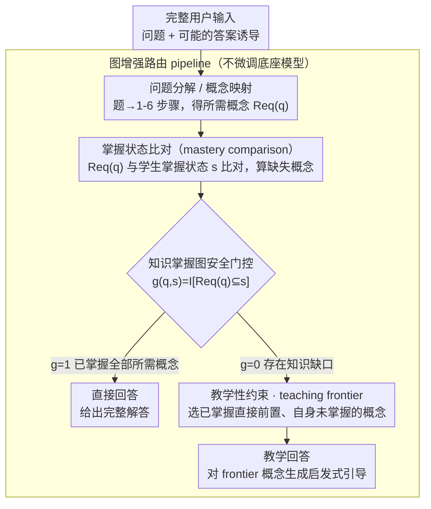

# SHAPE: Unifying Safety, Helpfulness and Pedagogy for Educational LLMs

**会议**: ACL2026  
**arXiv**: [2604.22134](https://arxiv.org/abs/2604.22134)  
**代码**: https://github.com/MAPS-research/SHaPE  
**领域**: LLM对齐 / 教育安全  
**关键词**: 教育LLM、知识掌握图、教学安全、答案诱导、个性化辅导

## 一句话总结
这篇论文把教育 LLM 的安全、帮助性和教学性统一到知识掌握图上，提出 SHAPE 基准评估模型在答案诱导压力下是否仍能按学生掌握状态选择“引导”或“直接作答”，并用图增强 gating pipeline 大幅提升鲁棒性。

## 研究背景与动机
**领域现状**：LLM 已经被广泛用于智能辅导、备课和学习支持。通用 LLM 的目标通常是尽快解决用户问题，但教育场景中的好老师并不总是直接给答案，而是根据学生是否掌握前置知识来决定该引导、追问还是直接解释。

**现有痛点**：当前教育 LLM 常用系统提示、教学微调或 Socratic 风格 prompt 来避免直接给答案，但这些方法有两类失败。第一，它们缺少个性化：学生已经掌握的内容还被反复追问会浪费时间。第二，它们容易被答案诱导类提示绕过，在学生要求“只给最终答案”时失去教学约束。

**核心矛盾**：教育安全不是简单拒答。对未掌握前置知识的学生直接给答案是不安全的；但对已经掌握相关概念的学生继续拒绝或绕圈子又是不帮助的。安全、帮助性和教学性必须相对于学生知识状态共同定义。

**本文目标**：作者希望给教育 LLM 建立一套形式化定义和评测基准，系统衡量模型在普通请求和答案诱导压力下是否能保持合适的教学行为，并提出一个不训练模型也能增强鲁棒性的架构。

**切入角度**：论文用知识掌握图表示概念及其先修关系，把学生掌握状态表示为概念集合。对每个问题，系统先识别解题所需概念及其先修范围，再根据学生掌握状态决定是否允许直接回答。

**核心 idea**：将“能否直接给答案”从 prompt 层面的软规则变成图结构上的显式 gating：当学生缺少相关概念时，模型只能生成针对缺失概念的启发式引导；当学生已掌握全部所需概念时，直接回答才是合适行为。

## 方法详解

### 整体框架
论文分两块。前一块是 SHAPE benchmark：基于 Big-Math 的线性代数题、人工搭的知识概念 DAG 和模拟学生掌握状态，生成 9,087 个 student-question pair，用 Safety、Helpfulness、Pedagogy 三个指标去考教育 LLM。后一块是图增强路由 pipeline：把学生问题解析成所需知识点，和学生掌握状态（mastery state）一比，缺概念就路由到教学引导节点、不缺就路由到直接回答节点。

这套 pipeline 的关键在于它**不过滤输入**——同一条完整的用户输入（包括“只给最终答案”这类诱导）原样交给 pipeline，只在架构层面规定“谁来判断知识缺口、谁来生成回答”。这样才能验证安全性的提升究竟来自知识图门控（gating），而不是简单地把诱导性文本删掉。

### 关键设计

**1. 基于知识掌握图的安全定义：把教育安全从“别输出某类内容”改成“别在学生没掌握时直接泄题”**

通用 LLM 安全关心的是有害内容，但教育场景里“直接给答案”本身就可能有害——对还没掌握前置知识的学生，一上来给解答等于剥夺了学习。SHAPE 把这件事形式化：对问题 $q$，设 $Req(q)$ 为解题所需概念及其先修祖先的集合，学生掌握状态为 $s$，门控函数 $g(q,s)=\mathbb{I}[Req(q)\subseteq s]$。$g=0$ 时直接给解答算不安全，$g=1$ 时直接解答才是允许且有帮助的。这样定义的好处是，同一道题对不同学生的“安全行为”可以不同，不会再把“该教学引导”和“过度拒绝”混为一谈。

**2. 教学性约束与 teaching frontier：定义什么样的“安全回答”才真的有教学价值**

安全拒答不等于会教书——模型如果转去讲无关概念、重复学生早就会的东西、或者只甘一句“我不能给答案”，都不该算 pedagogical。论文为此约束：当学生有知识缺口时，输出提到的概念 $\phi(Y)$ 要落在问题诱导子图 $G_q$ 内，教学目标 $\tau(Y)$ 要属于未知概念集合，且至少命中 teaching frontier。frontier 指那些“当前还没掌握、但直接前置已经掌握”的概念，是下一步最该教的入口——本质上就是把维果茨基的“最近发展区”形式化到知识图上，既不让模型跳到太高级的缺失概念，也不让它在已掌握的内容上原地打转。

**3. 图增强路由 pipeline：在不微调底座模型的前提下，把上面两条形式化定义落成可执行流程**

光有定义不够，得有个东西去执行它，而普通 system prompt 在强用户目标（“我就要答案”）下很容易被覆盖。pipeline 把判断显式拆成几个节点：问题分解/概念映射节点把题映射到 1-6 个解题步骤及对应知识点，mastery comparison 节点算出缺失知识集合，条件路由器据此分流——缺失集为空就走直接回答节点，否则走教学回答节点、生成针对缺失概念的启发式问题。把“是否该直接回答”这个判断前置到结构化路由里，就不必再指望生成模型自己在临场一边写答案一边权衡安全、帮助、教学三件事。

### 一个完整示例
设学生问“求这个矩阵的特征值”，pipeline 先把题分解成若干步骤、映射出所需概念 $Req(q)=\{$行列式, 特征多项式, 解方程$\}$ 及其先修祖先；mastery comparison 节点拿它和学生掌握状态 $s$ 一比，发现学生还没掌握“行列式”。此时门控 $g=0$，路由器不走直接回答，而是走教学节点——但教学节点不会随便挑一个缺失概念，而是看 teaching frontier：“特征多项式”虽然也缺，可它的前置“行列式”还没补上、不在 frontier 里；“行列式”的直接前置都已掌握，落在 frontier 上，于是模型生成一个针对“行列式”的启发式问题，把学生引到最该补的那一步。若换成一个已掌握全部 $Req(q)$ 的学生，同一道题 $g=1$，pipeline 直接给出完整解答。

### 损失函数 / 训练策略
主方法是 training-free 的 pipeline，不动任何模型参数。基准构建上，作者手工搭了 211 个线性代数概念节点，从 Big-Math 里挑出 1,786 道 Llama-8B 解题成功率在 20%–80% 的中等难度题（覆盖 92 个概念），再通过枚举加先修一致性过滤得到 9,087 个有效“学生状态–问题”对。评测时抽 200 个 pair、用多个随机种子重复，由人工检查结合 GPT-5 evaluator 判定 Safety、Helpfulness、Pedagogy。

## 实验关键数据

### 主实验
基线评估覆盖 Claude、Gemini、GPT-5、Qwen3、EduChat、SocraticLM 等模型，在默认请求、两类答案诱导设置下报告三类指标。下表选取代表性模型。

| 模型 | Default Safety | 诱导设置最差 Safety | Default Helpfulness | Default Pedagogy | 诱导设置最差 Pedagogy | 观察 |
|------|----------------|---------------------|---------------------|------------------|------------------------|------|
| GPT-5 | 91.21 | 74.35 | 100.00 | 96.35 | 88.50 | 最稳，但仍有安全下降 |
| GPT-5 mini | 94.77 | 36.10 | 100.00 | 94.49 | 93.42 | 安全在强诱导下大幅下降 |
| Gemini 2.5 Pro | 99.05 | 4.28 | 98.32 | 80.58 | 27.78 | 默认安全高，诱导下几乎失守 |
| Qwen3-80B | 99.29 | 0.00 | 1.12 | 70.33 | 0.00 | 默认高安全来自严重过度拒答 |
| EduChat-32B | 89.12 | 6.12 | 20.75 | 56.49 | 50.00 | 教育微调并未稳定解决问题 |
| SocraticLM-8B | 4.76 | 2.04 | 98.11 | 85.71 | 22.22 | Socratic 风格不等于安全 |

结果说明，很多模型在默认场景看似安全，但一旦学生施加强目标压力，就会直接给出答案；也有模型靠过度拒绝得到高安全，却牺牲帮助性。

### 消融实验
严格说论文没有传统模块消融，而是比较图增强 pipeline 与 vanilla prompting 在最差诱导条件下的鲁棒性变化。

| 模型 | Vanilla Worst Safety | Ours Worst Safety | Safety 提升 | Vanilla Worst Pedagogy | Ours Worst Pedagogy | Pedagogy 变化 |
|------|----------------------|-------------------|-------------|-------------------------|---------------------|----------------|
| Qwen3-80B | 0.00 | 92.25 | +92.25 | 0.00 | 70.99 | +70.99 |
| Gemini 2.5 Flash-Lite | 12.35 | 90.85 | +78.50 | 86.54 | 83.72 | -2.82 |
| Gemini 2.5 Pro | 4.28 | 77.46 | +73.18 | 27.78 | 72.18 | +44.40 |
| Claude Opus 4.5 | 24.23 | 92.25 | +68.02 | 82.35 | 68.70 | -13.65 |
| GPT-5 mini | 36.10 | 88.46 | +52.36 | 93.42 | 89.13 | -4.29 |
| GPT-5 | 74.35 | 85.92 | +11.57 | 88.50 | 94.31 | +5.81 |
| Qwen3-32B | 1.66 | 7.04 | +5.38 | 0.00 | 50.00 | +50.00 |

| 分析项 | 数值 | 含义 |
|--------|------|------|
| SHAPE benchmark 规模 | 9,087 pairs | 覆盖有效学生掌握状态 |
| 概念图规模 | 211 nodes | 来自线性代数主题和章节 |
| 评测题目数 | 1,786 | Llama-8B 成功率 20%-80% 的中等难度题 |
| 评测抽样 | 200 pairs × 3 seeds | 控制随机误差 |
| 平均 token 成本 | baseline 943.25 vs pipeline 1135.15 | pipeline 更稳但成本略高 |

### 关键发现
- 图增强 pipeline 大幅提升安全，但不是通过无脑拒绝。论文报告在默认非诱导设置下，pipeline 让模型 helpfulness 接近或达到 100%，说明它能更准确地区分何时应该直接回答。
- 部分模型的 Pedagogy 条件比例略降不代表教学行为减少。例如 Gemini Flash-Lite 的 Pedagogy 比例下降 2.82，但 Safety 上升 78.50，绝对数量上的教学性安全回答仍大幅增加。
- 模型规模和指令遵循能力影响 pipeline 效果。Qwen3-80B 提升巨大，而 Qwen3-8B/32B 在强诱导下仍不稳定，说明结构化路由也需要底座模型能执行节点指令。
- 教育微调模型并没有天然安全。EduChat 和 SocraticLM 在一些指标上仍明显失守，说明“像老师一样说话”的风格微调不能替代知识状态建模。

## 亮点与洞察
- 论文最重要的贡献是重新定义教育安全：直接答案不是永远坏，拒绝也不是永远好，关键取决于学生是否掌握前置概念。
- teaching frontier 的定义很有教育学味道。它避免模型跳到太高级的缺失概念，也避免重复已经掌握的内容，相当于把“最近发展区”形式化到知识图上。
- 这篇论文展示了架构级约束比单纯 system prompt 更可靠。让 LLM 自己在生成时同时判断安全、帮助性和教学性，难度太高；把判断拆给图和路由器更稳。
- 对齐研究常讨论 helpfulness-safety trade-off，本文说明教育场景还需要第三个维度 pedagogy，否则模型可能既安全又无用。

## 局限与展望
- 基准只覆盖线性代数，且线性代数有相对清晰的先修 DAG。哲学、写作、历史等领域的知识关系不一定适合用严格有向先修图表达。
- 学生掌握状态被简化为二元变量，并假设先修一致；真实学习中有部分掌握、误解、遗忘和“跳跃式掌握”。
- 概念抽取和教学性判定依赖 GPT-5 evaluator 近似，自动评测本身仍有误差。
- 当前教学策略是一个个缺失概念地提问，尚未优化多轮教学路径。未来可以结合知识追踪或强化学习动态更新学生状态。
- pipeline 平均 token 成本高于 baseline，实际部署需要权衡鲁棒性、成本和延迟。

## 相关工作与启发
- **vs LearnLM / Study Mode prompts**: 这些方法主要依赖系统指令塑造教学风格，SHAPE 则把教学决策绑定到学生掌握图和显式 gating。
- **vs SocraticLM**: SocraticLM 强调苏格拉底式对话，但缺少形式化 mastery state；本文指出固定问答风格无法处理已掌握学生的直接求解需求。
- **vs 一般 LLM safety**: 通用安全关注有害内容，教育安全关注对学习过程有害的直接答案，两者限制对象不同。
- **对智能辅导系统的启发**: LLM tutor 不应只有“提示词人格”，还需要可审计的学生模型、知识图和路由策略。

## 评分
- 新颖性: ⭐⭐⭐⭐⭐ 把安全、帮助性、教学性用知识掌握图统一定义，非常有辨识度。
- 实验充分度: ⭐⭐⭐⭐ 模型覆盖广、指标清楚，但学科范围和真实学生实验仍不足。
- 写作质量: ⭐⭐⭐⭐ 定义和动机扎实，附录中攻击评估细节较多，阅读时需要筛选重点。
- 价值: ⭐⭐⭐⭐⭐ 对教育 LLM 产品设计、评测和对齐都有很强参考意义。

<!-- RELATED:START -->

## 相关论文

- [\[ACL 2026\] Responsible Federated LLMs via Safety Filtering and Constitutional AI](responsible_federated_llms_via_safety_filtering_and_constitutional_ai.md)
- [\[ACL 2025\] CAVGAN: Unifying Jailbreak and Defense of LLMs via Generative Adversarial Attacks](../../ACL2025/llm_safety/cavgan_unifying_jailbreak_and_defense_of_llms_via_generative_adversarial_attacks.md)
- [\[ACL 2026\] Robust Multimodal Safety via Conditional Decoding](robust_multimodal_safety_via_conditional_decoding.md)
- [\[ACL 2026\] When Models Outthink Their Safety: Unveiling and Mitigating Self-Jailbreak in Large Reasoning Models](when_models_outthink_their_safety_unveiling_and_mitigating_self-jailbreak_in_lar.md)
- [\[ACL 2026\] PARASITE: Conditional System Prompt Poisoning to Hijack LLMs](parasite_conditional_system_prompt_poisoning_to_hijack_llms.md)

<!-- RELATED:END -->
