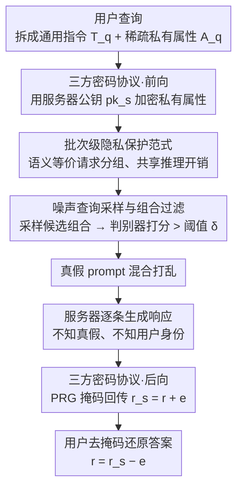

<!-- 由 src/gen_stubs.py 自动生成 -->
# SharedRequest: Privacy-Preserving Model-Agnostic Inference for Large Language Models

**会议**: ACL 2026  
**arXiv**: [2606.05004](https://arxiv.org/abs/2606.05004)  
**代码**: [GitHub](https://github.com/NusIoraPrivacy/SharedRequest)  
**领域**: LLM安全  
**关键词**: 隐私保护推理, 模型无关, 批次级混淆, 差分隐私, LLM安全

## 一句话总结
提出 SharedRequest，一种模型无关的隐私保护 LLM 推理框架，通过将隐私保护从单个 prompt 级提升到批次级——混合真实与噪声 prompt 并共享语义等价请求的推理开销——实现 >20% 的效用提升和最高 5.6× 的查询成本降低。

## 研究背景与动机
**领域现状**: 公共 LLM（ChatGPT/Claude/Gemini）部署在云端，用户 prompt 常含敏感信息。现有隐私保护方法面临隐私-效用-效率三难困境。

**现有痛点**: (1) SMPC 方法（Iron/BOLT/NEXUS）计算和通信开销巨大，不适合大规模部署；(2) 本地差分隐私（LDP）方法（RanText/CusText/DP-Prompt）逐 prompt 扰动严重损害语义，效用下降显著；(3) 现有模型无关方法独立扰动每个查询，语义扭曲大。

**核心矛盾**: 隐私保护和效用保持之间的根本矛盾——扰动越强隐私越好但效用越差；而现有方法将隐私保护限定在单个 prompt 粒度，无法利用批次级的统计特性分摊开销。

**本文目标**: 设计一种不需要修改 LLM 架构或访问模型参数的隐私保护推理框架，在保持高效用的同时提供强隐私保证并降低查询成本。

**切入角度**: 两个关键观察——(1) 商业 LLM 处理大规模批次查询（ChatGPT 每秒 >11500 次），可跨用户分摊成本；(2) prompt 中敏感信息往往是稀疏的（如仅"cybersecurity"一词敏感），不需要保护所有 token。

**核心 idea**: 批次级隐私保护——将语义等价请求分组共享推理开销 + 混合真实与噪声 prompt 混淆敏感属性 + 三方密码协议确保安全通信。

## 方法详解

### 整体框架
SharedRequest 里有三方：用户（手里握着含敏感属性的查询）、噪声采样器（按语义等价性把请求聚类、并往里注入噪声 prompt）、服务提供商（收到打乱后的真假混合 prompt 集合、生成回答）。一条查询的生命周期是：用户先把敏感属性加密，噪声采样器把语义等价的请求聚成组、为每组采样出噪声属性组合拼成假 prompt，和真 prompt 混在一起打乱后发给服务器，服务器的响应再通过掩码方案安全回传给用户。

它和现有方法最大的不同，是把隐私保护的粒度从"单个 prompt"抬到了"一个批次"。现有 LDP 方法逐 prompt 独立加扰，扰动一强语义就垮、效用就掉；SharedRequest 不去改写真 prompt 的内容，而是让真 prompt 藏在一堆以假乱真的噪声 prompt 里，靠"批次中的归属不可辨"来保护隐私。

### 关键设计

**1. 批次级隐私保护范式：把保护粒度从单 prompt 抬到批次，让噪声查询的开销摊到整个用户群上**

逐 prompt 独立扰动有两个老毛病：成本高、语义损失大。SharedRequest 换了个思路——把用户 prompt 拆成通用指令 $T_q$ 和私有属性 $A_q$ 两部分，对语义等价的通用指令分组共享，再为每组采样噪声属性替代品生成噪声 prompt，和真 prompt 混合打乱后一起发给服务器。服务器眼里看到的就是一批匿名的、真假难分的 prompt 集合，分不清哪条来自哪个用户、哪条是真的。这一范式之所以成立，靠的是两个观察：商业 LLM 本就在处理海量并发查询（ChatGPT 每秒 >11500 次），噪声查询的额外成本可以摊到大量用户身上；而 prompt 里真正敏感的信息往往很稀疏（可能就"cybersecurity"一个词），没必要保护所有 token。

**2. 轻量级三方密码协议：同时对噪声采样器藏住敏感数据、对服务器藏住用户身份**

批次混淆要成立，得保证两个方向都不漏：噪声采样器不能看到明文敏感属性，服务器不能把响应和用户对上号。协议为此分两段。前向传输时，用户用服务器公钥 $pk_s$ 加密私有属性，于是经手的噪声采样器拿到的是密文、看不到明文。后向传输时，用户发一个随机种子 $s$ 给服务器，服务器用 PRG 生成掩码 $e = PRG(s)$ 把响应混淆成 $r_s = r + e$ 再回传，用户本地用同一个种子重算 $e$、做 $r = r_s - e$ 还原——这样响应内容对中间的噪声采样器始终不可见。双层加密加掩码，恰好把两个方向的隐私各管一头。

**3. 噪声查询采样与组合过滤：高效造出"以假乱真"的噪声 prompt，让服务器无从区分真假**

噪声 prompt 不是随便填——填得不像，服务器一眼就能把真 prompt 认出来。但多属性 prompt 的候选组合空间是指数级的（$k^\mu$），直接枚举不现实。SharedRequest 的做法是：用户为每个属性各自指定候选替代品 $\{\mathcal{A}_1', ..., \mathcal{A}_{|A(q)|}'\}$，噪声采样器随机采样候选组合，用一个预训练判别器给每个组合的"真实性"打分，只留下超过阈值 $\delta$ 的合格组合 $\mathcal{A}^n$。为保证以高概率覆盖到合格组合，采样量需满足 $m \geq (\log(1-p) - \log(\mu k))/\log(1-1/k)$。判别器这道过滤是关键——它保证留下的噪声 prompt 和真 prompt 对服务器统计上不可区分，混淆才真正生效。

### 一个完整示例
设用户的真 prompt 是"针对一家做 cybersecurity 的公司，给一份合规检查清单"，其中敏感属性只有"cybersecurity"这一项。用户先用服务器公钥把该属性加密；噪声采样器把这条请求和其它语义等价的"给某行业公司做合规清单"请求聚成一组，并为"cybersecurity"采样出 finance、healthcare、retail 等候选替代品，组合出若干噪声 prompt，经判别器打分后留下几条足够像真的，和真 prompt 混在一起打乱发给服务器。服务器并不知道这一批里哪条是真的、来自谁，只是逐条生成回答；用户用事先约好的随机种子把对应自己那条响应的掩码去掉、还原出真正答案。整个过程里，噪声采样器没见过明文"cybersecurity"，服务器没见过用户身份，而真 prompt 一个字没改、效用几乎无损。

### 损失函数 / 训练策略
- 不训练 LLM：整个框架对模型完全无关，可直接套在任何商业 LLM API 上。
- 隐私形式化：协议提供 $(A_n, \epsilon)$-indistinguishability，这是差分隐私的一个用户自定义放松变体。
- 理论保证：Theorem 4 证明该协议满足 $(A_n, \epsilon)$-indistinguishability。

## 实验关键数据

### 主实验（效用对比，3 个数据集 × 3 个 GPT 模型）

| 设置 | MMLU-Biz (F1) | Medical-QA (评分) | Legal-QA (评分) |
|------|-------------|-----------------|---------------|
| GPT-4o 非私有 | 0.899 | 8.81 | 8.81 |
| GPT-4o + Ours (Original) | **0.900** | 8.74 | 8.79 |
| GPT-4o + Ours (Simplified) | 0.848 | 8.40 | 8.46 |
| GPT-4o-mini 非私有 | 0.853 | 8.60 | 8.69 |
| GPT-4o-mini + Ours (Original) | 0.851 | 8.58 | 8.63 |

### 与 DP 基线对比（MMLU-Biz F1，ε=1）

| 方法 | GPT-4o-mini | GPT-4o |
|------|-----------|--------|
| RanText (Standard DP) | 0.381 | 0.390 |
| CusText (Standard DP) | 0.511 | 0.473 |
| DP-Prompt (Standard DP) | 0.497 | 0.496 |
| CusText+ (Relaxed DP) | 0.686 | 0.694 |
| InferDPT (Relaxed DP) | 0.700 | 0.712 |
| **Ours (Simplified)** | **0.817** | **0.848** |

### 关键发现
- Original 版本效用几乎无损（与非私有设置差距 <1%）；Simplified 版本平均损失约 4.9%
- 在 ε=1 时，比 RanText/CusText/DP-Prompt/CusText+/InferDPT 平均分别高出 2.2×/1.7×/1.7×/1.2×/1.2× 效用
- 查询成本：在集中分布（β=0.05）下降低最高 5.6×；Simplified 进一步提升批处理效率
- 攻击实验：组合过滤将攻击成功率从 ~80% 降至 58-63%，降低约 32.7%
- 属性推断攻击 ASR 与 DP-Prompt/CusText+/InferDPT 相当，但效用显著更高

## 亮点与洞察
- 批次级隐私保护是一个优雅的范式转换——从"保护每个 prompt"到"保护 prompt 在批次中的归属"
- 完全模型无关：不需要访问模型参数或修改架构，可直接应用于任何商业 LLM API
- Original 版本几乎零效用损失的同时提供隐私保护，这是因为真实 prompt 原封不动发送（只是混在噪声 prompt 中）
- 理论和实验的结合扎实：$(A_n, \epsilon)$-indistinguishability 定义清晰，与标准 DP 的关系阐述明确

## 局限与展望
- 假设噪声采样器和服务提供商不会串通（curious-but-honest），虽然论文在附录中讨论了多服务器扩展以应对更强威胁模型
- 用户需自行识别私有属性并生成替代品，这增加了用户端负担
- 请求分组依赖通用指令的语义聚类质量，长尾罕见指令可能难以分组（但这恰恰是成本降低最需要的场景）
- Simplified 版本的 prompt 简化引入额外效用损失，简化策略的选择影响最终效果

## 相关工作与启发
- Iron / BOLT / NEXUS 等 SMPC 方法提供强保证但开销大，SharedRequest 以更轻量的方式实现实用隐私保护
- CusText / DP-Prompt 等 LDP 方法直接扰动 token，SharedRequest 通过批次混淆避免语义损失
- 差分隐私的放松变体 $(A_n, \epsilon)$-indistinguishability 是一种有意义的理论贡献，可启发其他领域的隐私定义
- 利用商业 LLM 大规模并发特性进行隐私保护的思路可推广到其他云服务场景

## 评分
- 新颖性: ⭐⭐⭐⭐⭐ 批次级隐私保护范式是根本性的创新，三方协议设计完整
- 实验充分度: ⭐⭐⭐⭐ 效用/攻击/成本三方面评估全面，多模型多数据集验证
- 写作质量: ⭐⭐⭐⭐ 问题形式化严谨，理论分析和实验验证配合良好
- 价值: ⭐⭐⭐⭐⭐ 解决了 LLM 隐私保护的实际需求，实用性极强

<!-- RELATED:START -->

## 相关论文

- [\[ICLR 2026\] SecP-Tuning: Efficient Privacy-Preserving Prompt Tuning for Large Language Models via MPC](../../ICLR2026/llm_safety/secp-tuning_efficient_privacy-preserving_prompt_tuning_for_large_language_mode.md)
- [\[ACL 2026\] SafeMERGE: Preserving Safety Alignment in Fine-Tuned Large Language Models via Selective Layer-Wise Model Merging](safemerge_preserving_safety_alignment_in_fine-tuned_large_language_models_via_se.md)
- [\[ACL 2026\] Privacy Collapse: Benign Fine-Tuning Can Break Contextual Privacy in Language Models](privacy_collapse_benign_fine-tuning_can_break_contextual_privacy_in_language_mod.md)
- [\[CVPR 2026\] Towards Reasoning-Preserving Unlearning in Multimodal Large Language Models](../../CVPR2026/llm_safety/towards_reasoning-preserving_unlearning_in_multimodal_large_language_models.md)
- [\[NeurIPS 2025\] CryptoMoE: Privacy-Preserving and Scalable Mixture of Experts Inference via Balanced Expert Routing](../../NeurIPS2025/llm_safety/cryptomoe_privacy-preserving_and_scalable_mixture_of_experts_inference_via_balan.md)

<!-- RELATED:END -->
