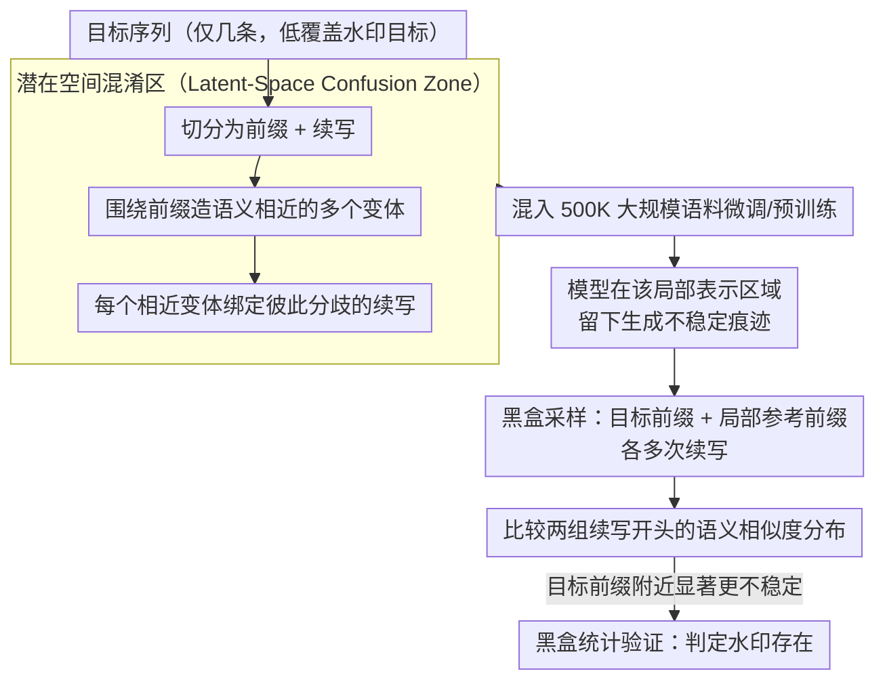

# SLIM: Stealthy Low-Coverage Black-Box Watermarking via Latent-Space Confusion Zones

**会议**: ACL2026 Findings  
**arXiv**: [2601.03242](https://arxiv.org/abs/2601.03242)  
**代码**: https://github.com/Henry-WWHHYY/SLIM/  
**领域**: LLM安全 / 数据水印 / 训练数据归属验证  
**关键词**: 数据水印, 黑盒验证, 低覆盖率, 潜在空间混淆, 训练数据溯源

## 一句话总结
SLIM 提出一种面向单个数据所有者的低覆盖数据水印思路：通过让模型在局部潜在空间学到相近前缀对应分歧续写的模式，最终在黑盒生成中表现出可统计检测的局部不稳定性。

## 研究背景与动机
**领域现状**：大模型训练数据越来越昂贵，也越来越涉及版权、隐私和数据授权问题。数据所有者希望知道自己的文本是否被用于模型训练，但现代 LLM 往往泛化强、记忆痕迹弱，单纯依靠 membership inference 很难给出可靠结论。

**现有痛点**：已有数据水印方法通常要求控制较大比例的数据，或者依赖明显的字符模式、虚构事实、参考模型、loss/perplexity 等白盒或半白盒信号。对普通个人或小机构而言，他们通常只贡献一小部分数据，甚至只有几条文档或邮件，无法大规模协调水印覆盖率。

**核心矛盾**：实用数据水印同时要满足三点：低覆盖率下仍可检测、混入大规模语料后不易被清洗发现、只通过 API 黑盒访问也能验证。这三点相互冲突：水印越明显越容易检测，也越容易被过滤；越隐蔽越难在海量训练后保留可验证信号。

**本文目标**：作者聚焦 low-coverage data watermarking，试图让少量数据贡献者也能验证模型是否使用了自己的数据，同时尽量不损害模型常规能力，也不引入容易被自动清洗规则识别的重复模式。

**切入角度**：论文利用 LLM 的潜在表示特性：语义相近的前缀通常映射到相邻 latent region，而自回归生成又会强烈依赖前缀表示。若训练数据在同一局部区域绑定多个分歧续写，模型就可能在该区域产生异常生成不稳定性。

**核心 idea**：把水印从表面字符串模式转移到局部潜在空间行为，让验证者通过统计比较目标前缀与局部参考前缀的生成稳定性来判断水印信号是否存在。

## 方法详解

### 整体框架
SLIM 想解决的是「只有几条数据的个人，能不能验证模型偷用了自己的文本」。它分水印、验证两个阶段。水印阶段挑出极少量目标序列，把每条切成前缀与续写，再围绕这个前缀造出若干语义接近、但续写方向彼此分歧的变体，悄悄混进训练语料；模型在这些相近前缀附近被反复拉向不同的合理续写，就会在该局部表示区域留下行为痕迹。验证阶段只用黑盒生成访问：对目标前缀和它周围的局部参考前缀各采样多次续写，比较两组续写开头的语义相似度分布——若目标前缀附近的生成明显更不稳定，就判定水印信号存在。

这篇笔记只总结论文的高层机制、实验与局限，不展开生成水印样本或验证流程的可执行操作细节。

### 关键设计

**1. 低覆盖水印目标：让只有几条数据的人也能维权**

现实训练语料来自海量个体，单个数据所有者根本控制不了大比例数据；如果方法必须高覆盖才生效，实际的授权验证价值就几乎为零。SLIM 因此把水印信号从「大面积重复注入」转向「集中作用在极少数目标序列附近的局部表示区域」，默认每个水印实例只改动单个目标序列，并在 500K 条 arXiv abstract 语料里模拟这种信号被严重稀释的真实场景。换句话说，它赌的不是数量，而是同一小块潜在空间里的异常行为。

**2. Latent-Space Confusion Zone：把水印藏进局部生成行为而非表面字符**

要在低覆盖下还能被检测，信号必须既隐蔽又稳定。SLIM 利用了 LLM 的一个表示特性：语义相近的前缀会落到潜在空间相邻区域，而自回归生成又强烈依赖前缀表示。训练时把这些相近前缀关联到多个差异较大的合理续写，模型在这个局部区域的上层生成分布就会形成一个「混淆区」；推理时对同一前缀多次采样，续写开头之间的相似度会异常降低或剧烈波动。相比随机字符或虚构知识，这种局部潜在空间行为不依赖任何显眼的表面模式，因此更容易绕过常规去重、压缩异常检测和 embedding 密度清洗。

**3. 黑盒统计验证：不碰权重、loss 和内部表示也能判定归属**

商业模型通常只开放 API，能拿到 loss、perplexity 或内部 logits 的假设并不现实。SLIM 的验证因此严格走黑盒：对目标前缀和局部参考前缀各收集多次生成，比较两组生成开头的 pairwise 语义相似度分布，再用统计检验得到验证分数。如果有公开或可获取的基座模型，可走 reference model-based 比较；如果没有，就用非水印样本构造 reference model-free 的零假设分布，把目标前缀的不稳定性放进这个零假设里看是否显著越界。

### 损失函数 / 训练策略
SLIM 本身不是新的模型训练目标，而是一套数据侧的水印构造 + 验证框架。实验主要在 Gemma-3-4B 的微调阶段和 Pythia-1.4B 的预训练阶段评估，训练语料取 gfissore/arxiv-abstracts-2021 的前 500,000 条序列（约 100M tokens），训练两个 epoch 以降低过拟合影响；生成验证用随机解码来放大局部不稳定性。

## 实验关键数据

### 主实验
Traceability 实验表明，在 reference model-based 设置中，水印样本的统计量偏移会随水印变体数量增加而单调增强，非水印样本则接近零波动。作者报告在 $K=16$ 时，固定阈值 $\Delta t=-40$ 已能区分水印与非水印样本；在 reference model-free 设置中，$K=64$ 时三个水印样本都落在非水印零假设分布之外。

模型效用实验显示，加入少量 SLIM 水印后，常规 benchmark 分数几乎不变。

| 模型 | ARC 无/有水印 | MMLU 无/有水印 | BBQ 无/有水印 | 结论 |
|------|---------------|----------------|---------------|------|
| Pythia-160M | 0.324 / 0.316 | 0.246 / 0.245 | 0.469 / 0.488 | 变化小于 0.02，未见系统性退化 |
| Llama-3.2-1B | 0.679 / 0.689 | 0.262 / 0.274 | 0.466 / 0.451 | 有升有降，整体影响很小 |
| Gemma-3-4B | 0.819 / 0.822 | 0.554 / 0.555 | 0.557 / 0.565 | 大模型上效用基本保持 |

隐蔽性实验比较了随机字符、虚构知识和 SLIM。SLIM 在三类自动检测上都通过，而两个对照方法至少被一种规则识别。

| 方法 | N-Gram 过滤 | Zlib 压缩异常 | Embedding 相似度 | 解释 |
|------|-------------|----------------|------------------|------|
| 随机字符插入 | 通过 | 未通过 | 通过 | 高熵字符串容易造成压缩异常 |
| 虚构知识注入 | 未通过 | 通过 | 未通过 | 重复语义和词面模式更明显 |
| SLIM | 通过 | 通过 | 通过 | 表面更自然，语义密度不形成显著异常 |

### 消融实验
论文进一步测试了可扩展性和后训练鲁棒性。语料从 200K 增加到 500K 时，水印信号会被稀释但仍在可检测区域；模型从 1B 到 9B 时，极小模型信号不稳定，大模型可能需要更高强度维持 margin；多个独立水印同时存在时没有观察到显著互相干扰。

| 设置 | 关键结果 | 含义 |
|------|----------|------|
| 数据规模 200K→500K | 平均 $\Delta t$ 逐渐衰减但仍低于检测阈值 | 数据越大信号越被稀释，可能需要增强水印强度 |
| 模型规模 Gemma 1B/4B/9B | 1B 上信号不明显，4B/9B 可检测但 margin 有变化 | 潜在混淆区依赖模型容量与表示结构 |
| 同时注入 3/5/7 个水印 | 个体与平均 $\Delta t$ 均保持可检测 | 多个低覆盖水印短期内不明显冲突 |
| 后训练 Full FT / LoRA / RLHF | 三个样本后训练后仍可检测 | 信号具有一定持久性，但微调会削弱幅度 |

后训练表格中，三个水印样本在无后训练时的 $\Delta t$ 分别为 -141.300、-152.916、-90.047；经过 RLHF 后分别为 -134.951、-157.963、-102.662，说明 RLHF 对该信号影响较小。Full FT 和 LoRA 会明显削弱部分样本，例如 S2 在 Full FT 后变为 -64.704，LoRA 后变为 -47.797，但仍在作者设定的可检测区域。

### 关键发现
- 低覆盖率是本文最重要的现实约束：方法默认个体只能改动极少量数据，而不是控制整个训练集。
- 水印信号不是表面重复模式，而是局部生成不稳定性，因此在常见文本清洗指标上更隐蔽。
- 方法在黑盒访问下仍能验证，这是比依赖 loss、perplexity 或内部 logits 更贴近商业 API 的设定。
- 数据规模和模型规模都会改变检测 margin，说明 SLIM 的强度参数需要随真实部署规模重新校准。

## 亮点与洞察
- 论文把数据水印的关键限制从“能不能检测”推进到“极少数据贡献者能不能检测”，这个问题定义很有现实意义。
- Latent-Space Confusion Zone 是一个比较巧妙的视角：它不试图让模型记住某个显式 token，而是让模型在局部表示空间留下行为痕迹。
- 实验覆盖 traceability、utility、stealthiness、scalability 和 post-training persistence，评价维度比较完整。
- 对训练数据治理的启发是：未来的数据授权系统不一定只依赖法律合同或平台日志，也可以配合统计型行为证据，但必须严控误报和可解释性。

## 局限与展望
- 实验规模仍小于真实前沿模型训练，500K 序列和 1B/4B/9B 模型只能部分说明趋势。
- 方法依赖“语义相近前缀在 latent space 中相邻”以及“分歧续写能形成局部不稳定”这两个假设，不同架构、tokenizer 和训练配方下需要更多验证。
- 水印样本单独人工检查时可能仍显得异常，论文的隐蔽性主要建立在大规模混入和自动清洗场景下。
- 验证需要多次黑盒采样，对只提供低温或受限采样 API 的模型可能更难实施。
- 统计阈值和误报控制是实际部署核心，尤其在真实授权争议中，单一统计信号不应被过度解释为决定性证据。

## 相关工作与启发
- **vs WATERFALL / STAMP / TRACE**: 这些 radioactive watermark 方法通常更依赖较高覆盖或参考模型条件，SLIM 把重点放在个体级低覆盖和严格黑盒。
- **vs 随机字符 / Unicode 水印**: 表面字符水印容易被压缩异常或文本清洗发现，SLIM 试图把信号隐藏到生成行为中。
- **vs 虚构知识水印**: 虚构知识可用于特定 QA 验证，但容易形成语义重复或上下文限制；SLIM 更强调开放文本续写中的局部不稳定。
- **启发**: 对 LLM 数据治理而言，训练数据归属验证可能需要“数据侧标记 + 行为侧统计 + 审计流程”组合，而不是单独依靠某一种检测技术。

## 评分
- 新颖性: ⭐⭐⭐⭐⭐ 低覆盖黑盒数据水印问题定义清楚，潜在空间混淆区的思路有辨识度。
- 实验充分度: ⭐⭐⭐⭐☆ 评价维度丰富，但真实超大模型和更复杂语料下仍需验证。
- 写作质量: ⭐⭐⭐⭐☆ 主线清晰，术语和实验设置解释充分；部分未来模型设定略显理想化。
- 价值: ⭐⭐⭐⭐☆ 对训练数据溯源和数据所有权保护很有启发，但实际部署还需要更强的统计严谨性和法律审计配套。

<!-- RELATED:START -->

## 相关论文

- [\[ACL 2026\] Compiling Activation Steering into Weights via Null-Space Constraints for Stealthy Backdoors](compiling_activation_steering_into_weights_via_null-space_constraints_for_stealt.md)
- [\[ACL 2026\] Rethinking LLM Watermark Detection in Black-Box Settings: A Non-Intrusive Third-Party Framework](rethinking_llm_watermark_detection_in_black-box_settings_a_non-intrusive_third-p.md)
- [\[AAAI 2026\] PSM: Prompt Sensitivity Minimization via LLM-Guided Black-Box Optimization](../../AAAI2026/llm_safety/psm_prompt_sensitivity_minimization_via_llm-guided_black-box_optimization.md)
- [\[AAAI 2026\] GraphTextack: A Realistic Black-Box Node Injection Attack on LLM-Enhanced GNNs](../../AAAI2026/llm_safety/graphtextack_a_realistic_black-box_node_injection_attack_on_llm-enhanced_gnns.md)
- [\[CVPR 2026\] Omni-Attack: Adversarial Attacks on Open-Ended VQA in Black-Box Multimodal LLMs](../../CVPR2026/llm_safety/omni-attack_adversarial_attacks_on_open-ended_vqa_in_black-box_multimodal_llms.md)

<!-- RELATED:END -->
