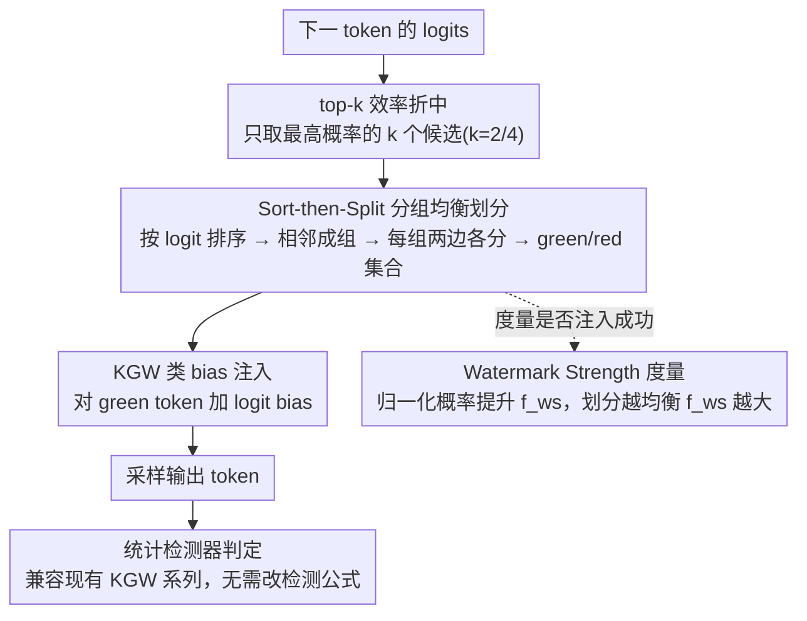

# SSG: Logit-Balanced Vocabulary Partitioning for LLM Watermarking

**会议**: ACL 2026  
**arXiv**: [2604.22438](https://arxiv.org/abs/2604.22438)  
**代码**: https://github.com/AllenG-L/SSG  
**领域**: LLM安全 / 文本水印 / 内容溯源  
**关键词**: LLM水印、低熵生成、logit-balanced partition、watermark strength、内容归因

## 一句话总结
这篇论文分析了 KGW 类 LLM 水印在代码生成和数学推理等低熵场景中失效的原因，提出 Watermark Strength 度量和 SSG 的 logit-balanced vocabulary partition，让高概率 token 更均衡地分布到两类集合中，从而在不进一步降低生成质量的前提下显著提升水印可检测性。

## 研究背景与动机
**领域现状**：LLM 水印常用于内容溯源、模型输出归因和生成内容治理。KGW 是代表性的 logit-based 水印方案：它把词表分成 green/red 两组，对 green token 加 logit bias，使生成文本在统计上包含可检测信号。

**现有痛点**：KGW 在普通自然语言生成中表现较好，但在代码生成、数学推理、JSON/SQL 等低熵任务上检测能力明显下降。这些任务的下一 token 分布通常非常尖锐，少数高概率 token 决定输出；如果这些高概率 token 恰好落在同一组，水印 bias 很难有效改变采样分布。

**核心矛盾**：水印想在不破坏输出质量的前提下注入统计信号，但低熵分布本身允许调整的空间很小。简单增大 logit bias 可以增强信号，却会损伤代码正确性或数学答案准确率。

**本文目标**：作者希望改进的是水印注入阶段，而不是只在检测阶段修补低熵问题。目标是在保持与 KGW 类检测器兼容的同时，提高每个 token 位置可注入的统计信号下界。

**切入角度**：论文提出 Watermark Strength，用来度量 watermark bias 对 green-set 总概率的归一化提升，并指出随机词表划分在低熵场景会让该值接近 0。

**核心 idea**：不要随机划分高概率 token，而是先按 logit 排序，再把相邻高 logit token 成组后均衡分到两边，使 green/red 集合在高概率区域更平衡。

## 方法详解
这篇论文的重点是内容溯源和水印可靠性分析。下面只总结高层方法、实验结论和局限，不展开可直接复现检测规避的操作细节。

### 整体框架
SSG 是一个可插进 KGW 系列水印框架的词表划分模块。每生成一个 token 前，模型先吐出下一 token 的 logits；SSG 在高 logit 候选上做一次更平衡的 green/red 划分，再沿用 KGW 类方法对 green token 注入 bias，最后交给兼容的统计检测器判断文本是否带水印。关键变化不在检测公式，而在「哪些 token 被分到 green set」——这正是低熵场景里水印成败的命门。

### 关键设计

**1. Watermark Strength 度量：把「低熵任务水印难」变成可分析的 token 级指标**

KGW 在代码、数学这类低熵任务上检测变弱，过去只是个经验现象，说不清病根在哪。SSG 先给它一个量化定义：设 green set 原始概率为 $p_g$、加 bias 后为 $\tilde{p}_g$，用归一化的概率提升 $f_{ws}$ 衡量 bias 真正改变采样分布的能力。当 $p_g$ 接近 0 或 1 时，分布几乎没有可调空间，$f_{ws}$ 就趋近 0——这恰好对应低熵分布里少数高概率 token 决定一切、却又全被随机划分到同一边的情形。有了这个指标，水印失效就从「玄学」落到了每个 token 位置可注入信号的下界上。

**2. Sort-then-Split by Groups 划分策略：从源头把高概率 token 摊到两边**

既然问题出在高概率 token 容易扎堆同一组，那就别再随机划分。SSG 先按 logits 对候选 token 排序，把高 logit token 按相邻成组、每组内分配到不同集合，让最影响采样分布的区域 green/red 两边不至于严重失衡；剩下的低概率 token 仍按随机思路划分即可。这样直接抬高了 $p_g$ 的下界，而不必靠粗暴加大 bias——后者虽然也能增强信号，却会连带损伤代码正确性和数学答案准确率。

**3. top-k 效率折中：只在真正决定输出的几个 token 上动刀**

每步对整个词表排序会明显拖慢解码，而低熵场景里真正左右输出的往往只是排在最前面的几个 token。SSG 因此发现只在 top-k 高概率 token 上执行排序划分就能拿到大部分检测收益，其余 token 随机划分即可。实验比较了 $k\in\{2,4,8,16\}$，$k=2$ 或 $k=4$ 通常是检测收益与速度的最佳折中；而且整套操作不改检测器，依旧与现有 KGW 系列检测方法兼容。

### 损失函数 / 训练策略
SSG 不是训练型方法，不改模型参数、不需额外微调，只作用在解码阶段的词表划分与 logit bias 注入。实验中作者把 SSG 分别接到 KGW、SWEET、EWD 三种水印方法上，统一比较检测率、F1 和生成质量。

## 实验关键数据

### 主实验

| 任务 / 模型 / 方法 | 质量指标 P@1 | TPR@1 | F1@1 | TPR@5 | F1@5 | 观察 |
|--------|------|------|------|------|------|------|
| HumanEval / Qwen2.5-Coder / KGW | 26.2 | 22.0 | 35.8 | 36.0 | 51.3 | KGW 低熵代码检测较弱 |
| HumanEval / Qwen2.5-Coder / KGW+SSG | 25.6 | 39.0 | 55.9 | 45.7 | 60.7 | 检测提升，P@1 基本相近 |
| MBPP / Qwen2.5-Coder / KGW | 38.4 | 37.8 | 54.6 | 64.0 | 75.9 | 原方法已有一定信号 |
| MBPP / Qwen2.5-Coder / KGW+SSG | 37.0 | 58.7 | 73.6 | 71.7 | 81.3 | TPR@1 和 F1@1 明显提升 |
| GSM8K / DSMath-7B / KGW | 21.7 | 41.7 | 58.5 | 57.6 | 71.0 | 数学低熵场景仍有不足 |
| GSM8K / DSMath-7B / KGW+SSG | 25.8 | 90.9 | 94.9 | 91.7 | 93.4 | 检测大幅增强且准确率更高 |
| GSM8K / LLaMA-3-8B / EWD | 35.6 | 74.2 | 84.8 | 95.5 | 95.5 | 强检测基线 |
| GSM8K / LLaMA-3-8B / EWD+SSG | 35.6 | 99.2 | 99.2 | 99.2 | 97.4 | 接近满分检测，质量不降 |

### 消融实验

| 分析项 | 结果 | 说明 |
|------|------|------|
| Watermark Strength 分布 | KGW 产生更多近零强度 token，SSG 明显减少近零值 | SSG 的收益来自更稳定的 token-level 注入强度 |
| top-k 选择 | top-2 已显著提升检测；k>2 只带来边际收益 | k=2 或 k=4 是推荐折中，较大 k 会拖慢解码 |
| 无原始 prompt 检测 | SSG 在部分设置提升、部分设置下降 | 方法依赖原 prompt 条件下的 logit 值，现实可用性受影响 |
| 改写鲁棒性 | 所有方法 TPR 都明显下降；SSG 在 LLaMA-3-8B 上更稳，在 DSMath-7B 上较弱 | 文本改写会削弱统计信号，鲁棒性仍未完全解决 |
| 高熵任务 | C4 与 CNN/DailyMail 上也能提升 KGW/SWEET/EWD 的 TPR 与 F1 | 虽为低熵而设计，但不局限于低熵任务 |

### 关键发现
- SSG 的提升主要来自注入端：它让高概率 token 更均衡地落在两类集合中，因此同样的 bias 能产生更稳定的统计位移。
- 生成质量与检测强度之间仍有基本 trade-off。论文观察到加入水印通常会降低 Pass@1，但 SSG 相比对应 baseline 没有进一步显著恶化质量。
- prompt-free 和改写鲁棒性是短板：当检测时缺少原始 prompt 或文本被重写，SSG 的优势会变得不稳定。

## 亮点与洞察
- Watermark Strength 是很好的分析工具，它把“低熵任务水印难”具体化为每个 token 位置可注入概率质量的下界问题。
- SSG 没有改检测器，而是改词表划分，这是一个很直接但有效的方向。它说明低熵水印不一定只能靠更复杂的检测统计来补救。
- top-k 版本很实用：只处理最重要的高 logit token，就能拿到大部分检测收益，符合低熵任务的概率结构。

## 局限与展望
- 实验任务主要是 HumanEval、MBPP、GSM8K、C4 和 CNN/DailyMail，低熵结构化生成的更多形态还需要验证，例如 SQL、JSON、配置文件和长代码工程生成。
- SSG 最优检测依赖原始 prompt，因为划分与条件 logits 相关；现实场景中 prompt 未必可得，这会限制部署范围。
- 对文本改写的鲁棒性仍然有限，论文实验显示改写后所有方法检测率都会显著下降。
- 每步排序或 top-k 处理会带来额外解码开销，虽然 top-k 可缓解，但在高吞吐 API 场景仍需工程优化。

## 相关工作与启发
- **vs KGW**: KGW 使用随机词表划分，低熵时可能让高概率 token 聚在一边；SSG 用 logit-balanced 划分提高注入强度下界。
- **vs SWEET / EWD**: SWEET 和 EWD 主要改进低熵检测或加权策略，SSG 作为注入侧模块可以叠加到这些方法上。
- **vs WaterMod / concurrent logit-balanced 方法**: 同类工作也注意到 token rank/概率平衡的重要性；本文的特色是给出 Watermark Strength 分析和系统实验。
- **启发**: 对 LLM 安全水印来说，解码时的概率几何很关键。与其只关注检测统计，不如同时优化“水印信号在采样分布中是否真的被注入”。

## 评分
- 新颖性: ⭐⭐⭐⭐☆ logit-balanced partition 简洁有效，Watermark Strength 分析让问题定义更清楚。
- 实验充分度: ⭐⭐⭐⭐☆ 覆盖代码、数学、高熵文本、top-k、无原始 prompt 和改写鲁棒性；更多真实部署场景还可补充。
- 写作质量: ⭐⭐⭐⭐☆ 动机、理论和实验主线清楚，部分表格因方法组合较多略显密集。
- 价值: ⭐⭐⭐⭐☆ 对低熵任务的水印溯源很有参考价值，但 prompt 依赖和改写鲁棒性限制了直接落地。

<!-- RELATED:START -->

## 相关论文

- [\[AAAI 2026\] WaterMod: Modular Token-Rank Partitioning for Probability-Balanced LLM Watermarking](../../AAAI2026/llm_safety/watermod_modular_token-rank_partitioning_for_probability-balanced_llm_watermarki.md)
- [\[ACL 2026\] STELA: A Linguistics-Aware LLM Watermarking via Syntactic Predictability](a_linguistics-aware_llm_watermarking_via_syntactic_predictability.md)
- [\[ACL 2026\] XMark: Reliable Multi-Bit Watermarking for LLM-Generated Texts](xmark_reliable_multi-bit_watermarking_for_llm-generated_texts.md)
- [\[ACL 2026\] AgentMark: Utility-Preserving Behavioral Watermarking for Agents](agentmark_utility-preserving_behavioral_watermarking_for_agents.md)
- [\[ACL 2026\] Detoxification for LLM from Dataset Itself](detoxification_for_llm_from_dataset_itself.md)

<!-- RELATED:END -->
