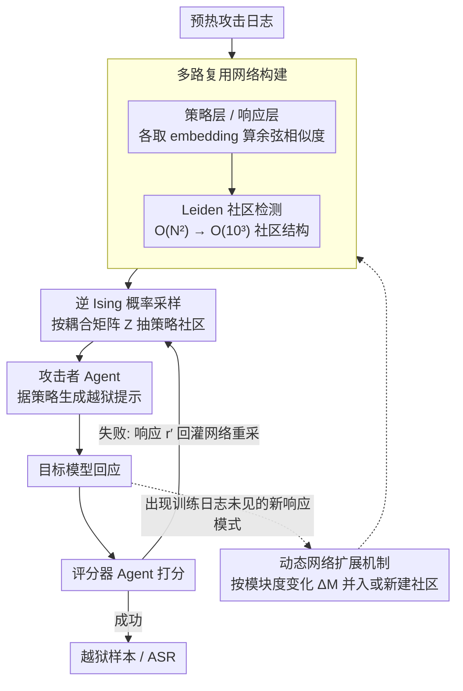

# STAR-Teaming: A Strategy-Response Multiplex Network Approach to Automated LLM Red Teaming

**会议**: ACL 2026 Findings  
**arXiv**: [2604.18976](https://arxiv.org/abs/2604.18976)  
**代码**: [https://github.com/selectstar-ai/STAR-Teaming-paper](https://github.com/selectstar-ai/STAR-Teaming-paper)  
**领域**: LLM对齐  
**关键词**: 红队测试、LLM安全、多路复用网络、策略采样、越狱攻击

## 一句话总结
本文提出 STAR-Teaming，一种基于策略-响应多路复用网络（Multiplex Network）的自动化红队测试框架，通过将攻击策略选择建模为逆 Ising 问题的概率优化，在 HarmBench 上达到平均 74.5% 的攻击成功率，比最强基线高 13.5%，同时显著降低计算开销。

## 研究背景与动机

**领域现状**：随着 LLM 在安全敏感领域的部署，评估其对越狱攻击的鲁棒性变得至关重要。自动化红队测试已从手动方法发展为基于优化（如 GCG、PAIR、TAP）和基于策略（如 PAP、Rainbow Teaming、AutoDAN-Turbo）两大类自动化方法。

**现有痛点**：现有方法面临两个关键限制。第一，大多数方法需要大量计算资源（反复查询或强化学习优化），限制了可扩展性。第二，基于策略的方法虽然引入了人类开发的越狱模式，但缺乏对"为什么某些策略有效"的透明解释——它们通常基于 embedding 相似度采样，而不分析成功的因果模式，难以理解模型漏洞。

**核心矛盾**：基于 embedding 相似度的策略检索会过度采样某些策略（单个策略占比高达 15%），导致攻击多样性低且效率差。语义相似的策略并不意味着攻击效果相似，需要从"策略-响应"的统计关联角度来指导采样。

**本文目标**：构建一个兼顾高攻击成功率、低计算成本和高可解释性的自动化红队测试框架。

**切入角度**：将攻击策略和目标模型响应分别建模为两层网络，通过社区检测将高维搜索空间降维为可处理的社区级结构，然后用逆 Ising 模型学习社区间的耦合关系，实现概率性策略采样。

**核心 idea**：将不可处理的高维 embedding 搜索空间重构为可处理的网络社区结构，通过统计物理中的 Boltzmann 分布来建模策略-响应关联，指导攻击策略的高效采样。

## 方法详解

### 整体框架
STAR-Teaming 要同时拿下「高攻击成功率、低算力、还要能解释为什么某策略有效」这个三难。它由两块拼成：一是多智能体系统（MAS），由攻击者、目标模型、评分器三个 LLM Agent 组成迭代循环；二是策略-响应多路复用网络，负责基于历史攻击日志做概率性策略采样。一轮攻击这样转：从网络采样一个策略 → 攻击者据此生成越狱提示 → 目标模型回应 → 评分器打分 → 失败就从网络重采一个新策略重试。网络是大脑，MAS 是手脚。

### 关键设计

**1. 多路复用网络构建：把高维 embedding 搜索空间压成可处理的社区结构**

直接在原始 embedding 空间里搜策略，参数量是 $O(N^2)$，根本学不动。STAR-Teaming 给策略和响应各建一层网络：每层先提取文本 embedding，算两两余弦相似度矩阵 $\mathbb{S}$，按阈值 $\alpha$ 生成邻接矩阵，再用 Leiden 算法做社区检测。策略社区成员向量用了一个特殊编码——所属社区记为 1，其余位置记为 $-\frac{1}{N_I-1}$，这个负项一身二用：既当正则化项防止参数发散，又保证概率分布能被合理地此消彼长地调整。经这一步压缩，参数空间从 $O(N^2)$ 降到 $O(N_I \times N_J) \approx O(10^3)$，学习效率被极大拉高。

**2. 逆 Ising 模型的概率优化与采样：用统计物理学到「哪类策略克哪类响应」**

有了社区结构，接下来要学社区之间的耦合强度来指导采样。论文定义能量函数 $E(r_p, s_q) = -\sum_{ij} Z_{ij} \mathbf{O}_{pq}^{ij}$，其中 $Z_{ij}$ 是策略社区 $i$ 与响应社区 $j$ 的耦合参数，通过最大化 Boltzmann 分布的对数似然来优化 $Z$；这个问题是凸的，有唯一解。采样时，给定一个新响应 $r'$，策略社区 $k$ 被抽中的概率为 $P(\mathbf{H}(s_k) \mid \mathbf{G}(r'), Z) \propto \exp(\beta \sum_j Z_{kj} \mathbf{G}(r')_j)$。梯度更新里还乘进了评分函数 $f_{sc}(r^t)$（成功攻击为正、失败为负），让系统能从失败中学习。这套概率优化正是为了取代纯 embedding 相似度采样——后者会把单个策略反复抽到占比高达 15%，多样性和效率都很差。

**3. 动态网络扩展机制：让网络随攻防对抗边打边长**

预热日志建好的网络是静态的，挡不住部署后才冒出来的新防御行为。STAR-Teaming 因此让网络在运行时动态吸纳新模式：新节点出现时，用模块度变化量 $\Delta M$ 决定它该加入已有社区还是新建社区——$\Delta M < 0$ 就另起新社区，否则并入最兼容的已有社区，超参数 $\lambda$ 控制合并偏好。这一步让结构不再被初始预热日志框死。消融显示动态扩展把 ASR 从 71.0% 提升到 77.3%，同时还减少了平均攻击轮次。

### 一个完整示例：一轮攻击是怎么走完的
以攻击一个强对齐模型为例。系统先从策略-响应网络里采样一个攻击策略——由于逆 Ising 模型学到的耦合让概率高度集中，top-3 策略大约承载 80% 的概率质量，所以这次大概率抽中历史上对「拒答类响应」最有效的那个社区里的策略，而不是像 embedding 检索那样反复抽中同一个占比 15% 的策略。攻击者 Agent 拿着这个策略生成一条越狱提示，目标模型回应，评分器给这次回应打分。若被拒答、评分为负，系统把这条失败响应 $r'$ 喂回网络：按 $P(\mathbf{H}(s_k) \mid \mathbf{G}(r'), Z) \propto \exp(\beta \sum_j Z_{kj} \mathbf{G}(r')_j)$ 重新计算各策略社区的采样概率，避开刚刚失败的方向，再抽一个新策略重试。如果途中冒出一类训练日志里没见过的新响应模式，动态扩展机制会用模块度变化量 $\Delta M$ 判断它该并入已有社区还是另起新社区，让网络边打边长。整条链路里矩阵 $Z$ 的优化不到一秒，所以重试代价很低。

### 损失函数 / 训练策略
映射矩阵 $Z$ 的优化通过梯度上升最大化对数似然，梯度是经验共现与模型期望共现之差，再乘上评分函数 $f_{sc}$，整次优化不到一秒。逆温度参数 $\beta$ 自适应调节，使 top-3 策略承载约 80% 的概率质量。

## 实验关键数据

### 主实验

| 目标模型 | GCG | PAIR | TAP | AutoDAN-Turbo | STAR-Teaming |
|---------|-----|------|-----|---------------|-------------|
| Llama-2 7B | 32.5 | 9.3 | 9.3 | 36.6 | **71.0** |
| Llama-2 13B | 30.0 | 15.0 | 14.2 | 34.6 | **71.5** |
| Qwen3-4B | 32.0 | - | - | - | **72.5** |
| GPT-4o | - | 53.0 | 66.0 | 76.0 | **76.1** |
| Claude 3.5 Sonnet | - | 4.0 | 5.0 | 2.0 | **12.0** |
| 平均 | 44.3 | 37.3 | 44.8 | 61.0 | **74.5** |

### 消融实验

| 配置 | ASR | Self-BLEU | Gini | Pearson |
|------|-----|-----------|------|---------|
| w/ Multiplex Network | 71.0% | 0.25 | 0.19 | 0.81 |
| w/o Multiplex Network | 65.0% | 0.46 | 0.36 | -0.08 |
| w/ Dynamic Expansion | 77.3% | - | - | - |

### 关键发现
- STAR-Teaming 是唯一在 Claude 3.5 Sonnet 上超过 10% ASR 的方法（12.0%），显示了对强对齐闭源模型的有效性
- 多路复用网络使策略采样更均匀（Gini 从 0.36 降至 0.19）且更偏向高效策略（Pearson 从 -0.08 升至 0.81）
- 在 StrongReject 数据集上，STAR-Teaming 平均得分 0.52，比第二名 TAP 高 0.41 分
- 切换攻击者 LLM（Gemma-7b vs Llama3-8b）对最终 ASR 几乎没有影响，说明框架的有效性不依赖于特定的攻击模型

## 亮点与洞察
- 将统计物理中的逆 Ising 模型引入红队测试的策略选择是非常新颖的跨学科应用。参数空间仅约 $O(10^3)$，优化不到一秒，兼顾了理论优雅性和实际效率。
- 多路复用网络的可解释性是一大亮点：映射矩阵 $Z$ 的每个元素直接量化了特定攻击策略类型与响应模式之间的关联强度，研究者可以直观了解哪些策略对哪些防御有效。
- 动态网络扩展机制的设计体现了"攻防对抗是动态演化的"这一洞察——静态网络无法捕捉部署后出现的新型防御行为，而动态扩展同时提升了 ASR (+6.3pp) 和效率（减少攻击轮次）。

## 局限与展望
- 框架的有效性依赖于各 LLM Agent（攻击者、评分器、策略提取器）的内在能力，需要精心的 prompt engineering
- 社区中心在长期部署中不会追溯性重新优化，可能导致概念漂移
- 目前仅关注文本模态，未来计划扩展到视觉和多模态红队测试
- 单一评分器 Agent 的可靠性是潜在漏洞，集成多异构 LLM 评分器可以进一步提升评判准确性

## 相关工作与启发
- **vs AutoDAN-Turbo (Liu et al., 2024)**: 同为基于策略的多 Agent 框架，但 AutoDAN-Turbo 用 embedding 相似度检索策略导致过度采样；STAR-Teaming 用网络社区结构和概率优化实现更均匀有效的采样，平均 ASR 高 13.5%
- **vs TAP (Mehrotra et al., 2024)**: TAP 通过分支和剪枝加速 PAIR 的迭代搜索，但在强对齐模型上效果有限（Claude 上仅 5%）；STAR-Teaming 通过结构化的策略空间探索在所有模型上均表现更好

## 评分
- 新颖性: ⭐⭐⭐⭐⭐ 将多路复用网络和逆 Ising 模型引入红队测试策略选择，跨学科创新极具原创性
- 实验充分度: ⭐⭐⭐⭐ 覆盖多种开源和闭源目标模型，两个评测基准，网络消融实验充分
- 写作质量: ⭐⭐⭐⭐ 方法部分数学推导清晰，但符号较多需要仔细阅读
- 综合推荐: ⭐⭐⭐⭐⭐ 对 AI 安全领域的自动化漏洞发现具有实际应用价值

<!-- RELATED:START -->

## 相关论文

- [\[ACL 2026\] Red-Bandit: Test-Time Adaptation for LLM Red-Teaming via Bandit-Guided LoRA Experts](red-bandit_test-time_adaptation_for_llm_red-teaming_via_bandit-guided_lora_exper.md)
- [\[ICLR 2026\] Tree-based Dialogue Reinforced Policy Optimization for Red-Teaming Attacks (DialTree)](../../ICLR2026/llm_safety/tree-based_dialogue_reinforced_policy_optimization_for_red-teaming_attacks.md)
- [\[ICML 2026\] Stable-GFlowNet: Toward Diverse and Robust LLM Red-Teaming via Contrastive Trajectory Balance](../../ICML2026/llm_safety/stable-gflownet_toward_diverse_and_robust_llm_red-teaming_via_contrastive_trajec.md)
- [\[ACL 2026\] ASTRA: An Automated Framework for Strategy Discovery, Retrieval, and Evolution for Jailbreaking LLMs](astra_an_automated_framework_for_strategy_discovery_retrieval_and_evolution_for_.md)
- [\[ICML 2026\] FoeGlass: Simple In-Context Learning Is Enough for Red Teaming Audio Deepfake Detectors](../../ICML2026/llm_safety/foeglass_simple_in-context_learning_is_enough_for_red_teaming_audio_deepfake_det.md)

<!-- RELATED:END -->
