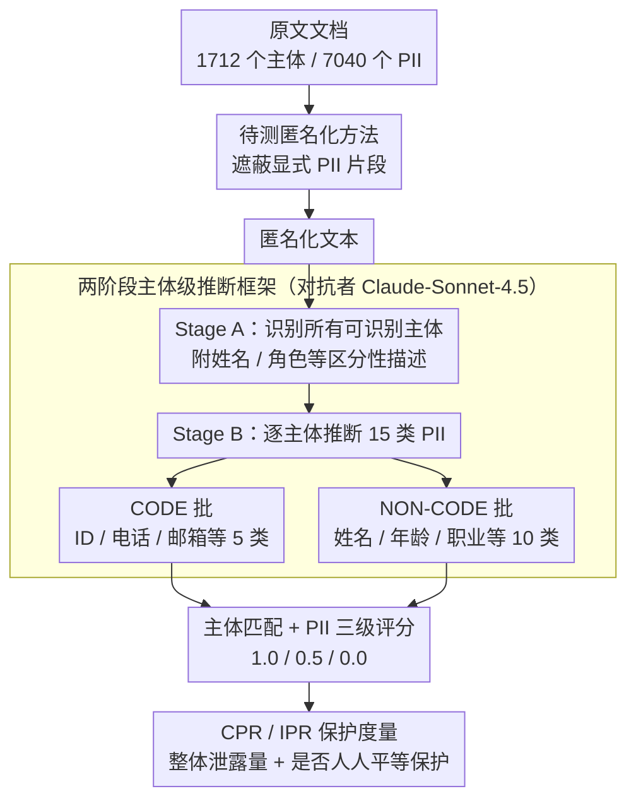

# Subject-level Inference for Realistic Text Anonymization Evaluation

**会议**: ACL 2026  
**arXiv**: [2604.21211](https://arxiv.org/abs/2604.21211)  
**代码**: [https://github.com/maisonOP/spia.git](https://github.com/maisonOP/spia.git)  
**领域**: LLM评测  
**关键词**: 文本匿名化, 隐私评估, 主体级推断, PII推理, 多主体保护

## 一句话总结

SPIA 提出首个主体级 PII 推断评估基准（675 篇文档、1712 个主体、7040 个 PII），揭示即使 90%+ 的 PII 片段被遮蔽，主体级推断保护率可低至 33%，且聚焦单一目标主体的匿名化会导致非目标主体暴露更多。

## 研究背景与动机

**领域现状**：文本匿名化通过修改文本来防止个人身份识别，是 GDPR 等隐私法规的核心要求。现有评估方法以 Token Recall 和 Entity Recall 等基于片段（span）的指标为主，测量显式 PII 提及是否被遮蔽。已有基准包括 i2b2/UTHealth（医疗）、TAB（法律）、WikiPII（维基百科）等。

**现有痛点**：两个关键缺陷。第一，基于片段的指标无法捕获推断风险——Staab et al. (2025) 显示即使经过 NER 匿名化，66.3% 的个人属性仍可从上下文推断出来。第二，现有方法假设文档只有单一数据主体，但真实世界文本（法律判决、医疗记录、在线帖子）通常涉及多个个体。当前技术主要保护一个主要主体，其他被提及的个体保护不足。

**核心矛盾**：遮蔽所有显式 PII 提及（高 span recall）不等于保护所有个体（高 inference protection）。LLM 可以从上下文线索推断出被遮蔽的个人信息，且多主体文档中非目标主体的保护被系统性忽视。这是评估单元的根本错误——应从文本片段转向个体人物。

**本文目标**：将匿名化评估的单元从文本片段转移到个体，构建覆盖多主体、多领域的推断式评估基准，并设计新的主体级保护度量。

**切入角度**：定义"主体"为文档中可识别的任何个人，对每个主体独立评估其 PII 是否可被对抗性 LLM 从匿名化文本中推断出来。

**核心 idea**：评估单元 = 个体人物（而非文本片段），保护指标 = 推断后剩余可知 PII 比例（而非遮蔽率）。

## 方法详解

### 整体框架

SPIA 想回答一个被现有匿名化评估忽视的问题：把文档里显式的 PII 片段遮蔽掉，是否真的保护了文档里的每一个人？它由两部分组成——一个主体级标注的基准，和一套基于对抗推断的评估流水线。基准侧从 TAB（法律判决）和 PANORAMA（在线文本）筛出 675 篇文档，经人工 + LLM 标注出 1712 个"主体"（文档里任何可识别的个人）和 7040 个分属 15 个类别的 PII。评估侧是一条三阶段流水线：先让待测匿名化方法处理原文，再让对抗性 LLM（Claude-Sonnet-4.5）在匿名化文本上做两阶段推断，最后做主体匹配、PII 评分，并算出 CPR / IPR 两个保护率。

### 关键设计

**1. 两阶段主体级推断框架：把"画像单个作者"扩展成"逐个还原文档里每个人"**

现有的推断式隐私评估（如 Staab et al. 2024）只针对单一作者画像，无法处理一篇文档里同时出现申请人、证人、法官的真实场景。SPIA 把推断拆成两个阶段：Stage A 先从匿名化文本里识别出所有可识别主体，并为每个主体附上姓名、角色等区分性描述；Stage B 再逐个主体推断其 15 类 PII。第二阶段又按类别拆成两批独立推断——CODE 类（ID 号、电话、邮箱等 5 类）和 NON-CODE 类（姓名、年龄、职业等 10 类）分开跑，这样既避免模型一次吞下 15 个类别、压缩了 prompt 长度，也让每种类型能用各自合适的处理方式。这个对抗者并非随手选定：作者横向验证了 11 个 LLM，Claude-Sonnet-4.5 在主体匹配（96%）和推断准确率（91%）上都最强，才被定为标准对抗者。

**2. CODE / NON-CODE 的 PII 分类体系：按结构特征而非标识强度切分 15 类 PII**

把哪些 PII 纳入推断评估、怎么组织它们，直接决定基准能不能覆盖真实泄露面。SPIA 按结构特征把 15 类 PII 分成两组：CODE 类有固定格式模式（ID 号、驾照、电话、护照、邮箱），NON-CODE 类是自由文本（姓名、性别、年龄、位置、国籍、教育、关系、职业、隶属、职位）。之所以连 CODE 类也送进推断评估，是因为基于模式的 NER 会漏掉没见过的格式，只靠遮蔽率会高估保护。相比传统按"直接标识符 / 准标识符"划分（这种划分依赖上下文、边界模糊），按结构特征切分更稳定，也更贴合检测时的实际处理方式。这套划分也直接决定了上面 Stage B 把推断拆成 CODE / NON-CODE 两批的方式。

**3. CPR 与 IPR 两个保护度量：一个看整体泄露量，一个看是否人人都被平等保护**

有了逐主体、逐类别的推断结果，还需要把它压成可比较的数字，而且要能暴露"整体看着安全、个别人却全裸"的情况。作者给出两个互补指标。CPR（Collective Protection Rate）按 PII 数量加权，PII 多的主体权重更大：

$$\text{CPR} = 1 - \frac{\sum_i A_i}{\sum_i O_i}$$

IPR（Individual Protection Rate）则对所有主体等权平均，只要有人被完全曝光就会被拉低：

$$\text{IPR} = \frac{1}{N}\sum_i\left(1 - \frac{A_i}{O_i}\right)$$

其中 $O_i$ 是原文中主体 $i$ 的 PII 总数，$A_i$ 是对抗者从匿名化文本里仍能推断出的数量；两个指标都是 1 表示完全保护、0 表示完全暴露。CPR 衡量整体泄露规模，IPR 衡量保护是否公平——一篇文档可能 CPR 很高，却因为某几个非目标主体被忽视而 IPR 偏低，这正是多主体匿名化最容易翻车的地方。

### 损失函数 / 训练策略
本文是评估基准和框架，不涉及模型训练。对抗性 LLM 使用 Claude-Sonnet-4.5，PII 评分采用三级制：1.0 精确匹配、0.5 部分匹配、0.0 不匹配。

## 实验关键数据

### 主实验（TAB 法律数据集，部分匿名化方法 × 最优骨干）

| 方法 | Token Recall | Entity Recall (di) | CPR | IPR | Utility |
|------|-------------|-------------------|-----|-----|---------|
| Longformer | 0.940 | 0.997 | 0.330 | 0.325 | 0.874 |
| DeID-GPT (GPT-4.1) | 0.990 | 1.000 | 0.674 | 0.665 | 0.754 |
| DP-Prompt (Claude-Sonnet) | 0.789 | 0.450 | 0.452 | 0.446 | 0.764 |
| Adversarial (GPT-4.1) | 0.894 | 1.000 | 0.359 | 0.365 | 0.857 |

### Span-based vs Inference-based 差异

| 数据集 | 最高 Token Recall | 对应 CPR | 差距 |
|--------|------------------|----------|------|
| TAB | 0.990 | 0.674 | 31.6%p |
| TAB (Longformer) | 0.940 | 0.330 | 61.0%p |
| PANORAMA | 0.984 | 0.799 | 18.5%p |

### 关键发现
- **Span 指标严重高估保护水平**：Longformer 的 Entity Recall 高达 99.7%，但 CPR 仅 33.0%，意味着即使几乎所有 PII 片段都被遮蔽，2/3 的个人信息仍可通过上下文推断
- **聚焦目标主体的匿名化（Adversarial）暴露非目标主体**：在 TAB 上，1-AAC（目标主体保护）明显高于 CPR（全体保护），说明对抗性匿名化在保护申请人的同时忽视了证人、法官等非目标主体
- **TAB（长法律文档）比 PANORAMA（短在线文本）差距更大**：法律文档上下文丰富，推断空间更大
- 即使在最佳配置下（DeID-GPT + GPT-4.1），TAB 上的 CPR 也仅 67.4%，仍有近 1/3 的 PII 可被推断
- 更换对抗者模型（GPT-4.1、Claude-Haiku-4.5）后 Spearman ρ > 0.98，评估结果稳健

## 亮点与洞察
- **评估单元从片段到个体的转变**是本文最大的贡献。这个简单但深刻的观察改变了匿名化评估的逻辑基础，揭示了整个领域被 span 指标误导的盲区
- **多主体差异暴露**的发现非常实用：对抗性匿名化保护了目标主体但忽视了其他人，这在 GDPR 要求保护所有可识别个体的背景下是严重合规风险
- 两阶段推断框架可迁移到其他隐私相关任务，如匿名化文本的隐私审计、LLM 训练数据的 PII 检测等

## 局限与展望
- 仅包含英语文档，PII 推断难度可能因语言和文化差异而变化
- 基准规模相对较小（675 篇），特别是 TAB 仅 144 篇
- 未评估更先进的匿名化方法（如结合差分隐私的生成式方法）
- CPR/IPR 对 PII 类别不加区分——泄露姓名与泄露年龄的隐私风险显然不同
- 未来可扩展到多语言、更大规模的文档集合，并引入 PII 类别权重

## 相关工作与启发
- **vs TAB**: TAB 提供全面的 PII 覆盖但缺乏推断评估，SPIA 在 TAB 数据上增加了推断层
- **vs PersonalReddit**: 支持推断评估但仅针对单一作者。SPIA 扩展到多主体
- **vs PII-Bench**: 区分主体但停留在 span 评估。SPIA 同时支持多主体和推断评估
- **vs Staab et al. (2024) AAC**: AAC 只衡量目标主体的保护，SPIA 的 CPR/IPR 衡量所有主体

## 评分
- 新颖性: ⭐⭐⭐⭐⭐ 评估范式转移（span → 个体）是有影响力的贡献，多主体视角切中 GDPR 的核心要求
- 实验充分度: ⭐⭐⭐⭐ 4 种匿名化方法 × 6 个骨干 × 2 个数据集，换对抗者验证稳健性
- 写作质量: ⭐⭐⭐⭐ Figure 1 的三种评估方式对比非常直观，概念层次清晰
- 价值: ⭐⭐⭐⭐⭐ "90% 遮蔽但 67% 可推断"的发现对隐私保护实践有直接影响

<!-- RELATED:START -->

## 相关论文

- [\[ACL 2026\] Adaptive Text Anonymization: Learning Privacy-Utility Trade-offs via Prompt Optimization](adaptive_text_anonymization_learning_privacy-utility_trade-offs_via_prompt_optim.md)
- [\[ACL 2026\] Look Twice before You Leap: A Rational Framework for Localized Adversarial Anonymization](look_twice_before_you_leap_a_rational_framework_for_localized_adversarial_anonym.md)
- [\[ACL 2026\] De-Anonymization at Scale via Tournament-Style Attribution](de-anonymization_at_scale_via_tournament-style_attribution.md)
- [\[ICML 2026\] AliMark: Enhancing Robustness of Sentence-Level Watermarking Against Text Paraphrasing](../../ICML2026/llm_safety/alimark_enhancing_robustness_of_sentence-level_watermarking_against_text_paraphr.md)
- [\[ACL 2026\] Do Multimodal RAG Systems Leak Data? A Comprehensive Evaluation of Membership Inference and Image Caption Retrieval Attacks](do_multimodal_rag_systems_leak_data_a_comprehensive_evaluation_of_membership_inf.md)

<!-- RELATED:END -->
