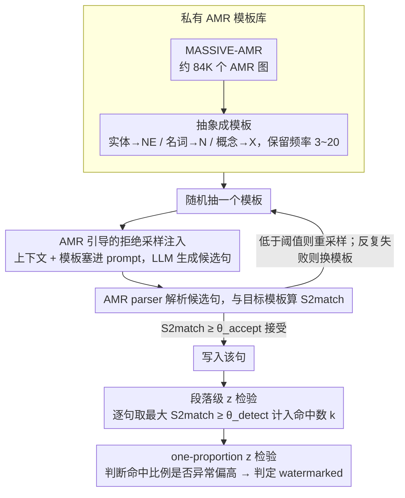

# SWAN: Semantic Watermarking with Abstract Meaning Representation

**会议**: ACL2026  
**arXiv**: [2605.04305](https://arxiv.org/abs/2605.04305)  
**代码**: 无  
**领域**: LLM安全 / 文本水印 / 语义表示  
**关键词**: 语义水印, AMR, paraphrase robustness, S2match, 文本溯源  

## 一句话总结
SWAN 用 Abstract Meaning Representation 模板把水印嵌入句子的语义图结构，而不是 token 或 embedding 区域，因此在保持原意的 paraphrase 后仍能通过 AMR 解析、模板匹配和比例 z 检验检测出水印。

## 研究背景与动机
**领域现状**：LLM 生成文本越来越自然，文本水印成为识别 AI 生成内容、追踪内容来源和缓解大规模误导信息的重要技术路线。

**现有痛点**：主流 token-level watermark 通过改变生成时的 token 采样偏好，把更多 token 推向 secret green list。这类方法实现简单、检测方便，但遇到 paraphrase、同义替换或轻微重写时很容易丢失信号。

**核心矛盾**：水印既要隐蔽、可检测，又要能经受保持语义的改写。token 级信号太表层，embedding 级语义水印虽然更稳，但如果 paraphrase 把句向量推到另一个语义区域，检测仍会下降。

**本文目标**：作者希望把水印锚定到比 token 和 sentence embedding 更稳定的层级：句子的抽象语义结构。只要改写没有改变“谁对谁做了什么”这类核心语义关系，水印就应该保留。

**切入角度**：Abstract Meaning Representation 用图表示句子语义，节点代表概念或事件，边代表语义角色。多种表层不同的 paraphrase 可以映射到同一个或高度相似的 AMR 图，这天然适合做 paraphrase-robust watermark。

**核心 idea**：构建一个私有 AMR template bank，生成时让每个句子匹配随机抽取的 AMR 模板，检测时解析文本 AMR 并统计与私有模板匹配的句子比例。

## 方法详解

### 整体框架

SWAN 的核心改动，是把"水印 key"从词表哈希或 embedding 分区，换成一个私有的 AMR 模板库；整个方法 training-free——不训练水印模型、不接触目标 LLM 的 logits，只靠 prompt 引导加拒绝采样，把句子"挤"进目标语义结构。

构建阶段，作者从 MASSIVE-AMR（约 84K 个 AMR 图、对应 1685 条信息查询类语句）出发，把原始 AMR 进一步抽象成模板：具体命名实体换成 NE、普通名词换成 N、不指定的概念换成 X，只保留频率落在 3~20 之间、且至少含 3 个概念节点的 pattern，得到一个私有 template bank。

生成阶段，每写一句话就从私有库里随机抽一个模板，把当前上下文和模板一起塞进 LLM prompt，要求它生成一句既连贯、又满足用户原意、还尽量贴合模板语义结构的句子；生成后用 AMR parser 把候选句解析成图，再用 S2match 和目标模板算相似度，超过注入阈值就接受、否则重采样，若某模板在当前上下文反复失败就换一个，避免死磕不兼容的结构。检测阶段则把候选段落切句、逐句解析 AMR，算它与私有库里所有模板的最大 S2match，超过检测阈值即记为 watermarked，最后对整段 watermarked 句子的比例做 one-proportion z 检验。

### 关键设计

**1. 私有 AMR 模板库：把水印密钥从"词表/向量区域"换成"抽象语义图结构"**

token 级方法的 key 是绿名单词表，embedding 级方法的 key 是向量区域，二者都活在表层或连续空间里，paraphrase 一改就容易移位。SWAN 把 key 定义成一组抽象语义图：从 MASSIVE-AMR 抽出图结构后，剥掉具体实体和词汇细节，只留谓词、语义角色和概念关系。模板频率的区间（3~20）是刻意卡的——频率太低的 pattern 太稀有、生成时很难命中，频率太高的又太常见、会推高误报，中等频率才兼顾可生成性和判别力。只要这个 bank 保密，检测方就能验证结构匹配，而攻击者根本不知道该绕开哪些 AMR pattern。

**2. AMR 引导的拒绝采样注入：不改参数、不碰 logits，把句子推向目标语义结构**

直接往句子里硬插关键词会破坏流畅度，也容易被删掉。SWAN 改为让模型"围着模板写"：prompt 里同时给出历史上下文和目标 AMR 模板，要求生成自然句并把 NE/N/X 等占位概念实例化；每个候选句被解析成 $\hat{g}$ 后与目标模板 $g$ 算 S2match，只有当 $S2match(\hat{g}, g) \geq \theta_{accept}$ 时才接受，否则重采样。这样水印被藏进谓词-论元结构里，表层文字依旧自然；又因为不依赖 logits、是黑盒生成，方法可以直接套在闭源 API 模型上。

**3. 段落级 z 检验：把逐句的模板匹配累积成段落级溯源判断**

单句 AMR 解析本身有噪声，单句误报也躲不掉，只看一句话不足以下结论。SWAN 对段落里每句算它与 bank 的最大模板相似度，超过 $\theta_{detect}$ 就计入命中数 $k$；给定总句数 $n$ 和零假设下的随机命中率 $\lambda$，用

$$z = \frac{k - \lambda n}{\sqrt{n\lambda(1-\lambda)}}$$

判断命中比例是否异常偏高。这把弱的句级信号聚合成强的段落级统计，思路与 token 水印里的 z-score detector 一脉相承，只是把"token 命中"换成了"语义模板命中"。

### 损失函数 / 训练策略
SWAN 没有训练损失，关键超参来自生成和检测流程。AMR bank 默认大小为 50，作者也测试了 100、500、800 的设置。水印生成使用 DeepSeek-R1-Distill-Qwen-14B，temperature 0.6、top_p 0.9，每句最多尝试 50 次（最多 10 个模板、每个模板最多 5 次生成）。检测用 amrlib 的 parse_xfm_bart_large pipeline（基于 BART-large、在 AMR-3 上训练）。paraphrase attack 用 Pegasus、Parrot 和 Claude 3.7 Sonnet；文本质量则让 Claude 3.7 从 coherence、fluency、diversity 三个维度做 reference-free 评分。

## 实验关键数据

### 主实验
无 paraphrase 场景下，SWAN 的 raw detectability 与强 sentence-level baselines 接近，并优于 token-level SynthID 的低 FPR 指标。

| 方法 | AUC↑ | TPR@1%↑ | TPR@5%↑ |
|------|------|----------|----------|
| SynthID | 97.0 | 64.8 | 84.8 |
| SemStamp | 99.4 | 96.8 | 100.0 |
| k-SemStamp | 99.1 | 96.8 | 96.4 |
| SWAN | 99.1 | 91.6 | 97.6 |

在最关键的 paraphrase robustness 上，SWAN 在三类攻击下 AUC 都最高，尤其对 Claude 3.7 这种强 LLM 改写优势明显。

| 方法 | Pegasus AUC/TPR@1%/TPR@5% | Parrot AUC/TPR@1%/TPR@5% | Claude AUC/TPR@1%/TPR@5% |
|------|----------------------------|---------------------------|---------------------------|
| SemStamp | 97.6 / 87.2 / 97.6 | 94.8 / 69.2 / 97.6 | 84.4 / 36.8 / 84.8 |
| k-SemStamp | 97.3 / 88.8 / 88.4 | 92.8 / 68.0 / 66.8 | 87.6 / 53.6 / 53.2 |
| SWAN | 98.1 / 81.2 / 92.8 | 97.5 / 82.0 / 92.4 | 98.3 / 86.0 / 95.2 |

这个表直接体现 AMR 语义锚定的价值：Claude 改写会显著削弱 SemStamp 和 k-SemStamp，但 SWAN 的 AUC 反而保持在 98.3。

### 消融实验
AMR bank size 对 AUC 的影响较小，说明方法对模板库规模不敏感。

| AMR bank size | AUC↑ |
|---------------|------|
| 50 | 99.1 |
| 100 | 98.7 |
| 500 | 98.4 |
| 800 | 99.3 |

采样效率方面，SWAN 比 SemStamp 更慢一些，但大多数句子很快收敛。

| 指标 | SWAN | 对比 / 说明 |
|------|------|-------------|
| 平均接受尝试次数 | 17.7 | SemStamp 为 13.8 |
| 10 次内接受比例 | 42% | 说明相当多模板容易满足 |
| 15 次内接受比例 | 54% | 超半数句子在较低预算内成功 |
| 最大预算附近 spike | 46-50 trials | 表示部分模板与上下文语义不兼容 |
| 生成规模 | 1,250 句 | 250 samples × 每段 5 句 |

### 关键发现
- SWAN 在原文未改写场景不牺牲 detectability，AUC 与 SemStamp/k-SemStamp 基本同档。
- paraphrase 后差距显著扩大，尤其 Claude 改写下 SWAN AUC 98.3，而 SemStamp 只有 84.4，k-SemStamp 为 87.6。
- AMR bank 从 50 扩到 800 后 AUC 仍保持 98+，说明模板覆盖和误报之间的平衡比较稳。
- 拒绝采样开销存在，但 42% 句子 10 次内成功，整体 overhead 可以接受；真正难点在 context-aware template selection。
- 文本质量评估显示所有水印方法都会造成轻微质量下降，但 SWAN 与 sentence-level baselines 相近，没有为鲁棒性付出额外明显质量代价。

## 亮点与洞察
- SWAN 最有价值的洞察是“paraphrase 保留 meaning，因此水印应写进 meaning representation”。这比在 token 或 embedding 上追着 paraphrase 跑更自然。
- AMR 模板库把水印变成可解释的结构信号。检测失败时可以分析是哪类谓词-论元结构没解析出来，而不是只得到一个 opaque embedding hash。
- training-free 和 black-box generation 使方法更容易接入闭源或 API 模型，因为它不需要 logits access，也不需要改模型权重。
- 段落级 z-test 继承了传统 watermark detector 的统计思想，同时把 token 命中换成语义模板命中，是一个很干净的抽象迁移。

## 局限与展望
- 检测高度依赖 AMR parser 质量，解析错误会导致漏检或误报。在低资源语言、专业术语密集文本或非新闻体裁中，AMR 解析可能不稳定。
- AMR bank 是私有 key，如果攻击者猜到或泄露模板库，就可以刻意改写语义结构避开检测。
- 当前方法主要评估英文 RealNews，领域和语言覆盖有限。
- 拒绝采样仍有成本，部分模板与上下文不兼容时会反复失败；需要更智能的 template-context matching。
- SWAN 关注句级 AMR，面对合并句子、拆分句子、跨句改写等攻击时，水印结构可能被重组。未来可探索 paragraph-level AMR 或 AMR subgraph watermark。

## 相关工作与启发
- **vs SynthID / token-level watermark**: SynthID 依靠 token 分布扰动，低 FPR 检测有效但对 paraphrase 脆弱。SWAN 不改 token 偏好，而是约束语义结构，因此更抗表层重写。
- **vs SemStamp**: SemStamp 把句向量空间划为 green buckets，具备一定 paraphrase robustness，但强改写会移动 embedding。SWAN 用 AMR 图匹配，能在语义等价改写下保持结构信号。
- **vs k-SemStamp**: k-SemStamp 用聚类改进语义区域划分，但仍是连续 embedding 区域。SWAN 的离散图结构更可解释，也更贴近“含义不变”的定义。
- **vs PostMark / post-hoc watermark**: PostMark 通过段落语义和 watermark words 注入信号，实用但可能留下词汇痕迹。SWAN 不依赖固定词表，信号藏在语义角色组合中。

## 评分
- 新颖性: ⭐⭐⭐⭐⭐ 用 AMR 图结构做文本水印非常新颖，和 token/embedding 水印路线差异明显。
- 实验充分度: ⭐⭐⭐⭐☆ 检测、paraphrase、bank size、采样效率和质量评估都覆盖了，语言与领域范围仍偏窄。
- 写作质量: ⭐⭐⭐⭐☆ 方法解释清楚，实验表直接，但 AMR 解析误差与阈值选择还可展开更多。
- 价值: ⭐⭐⭐⭐⭐ 对鲁棒文本水印和 AI 生成内容溯源都有实际启发，尤其适合研究语义级 provenance。

<!-- RELATED:START -->

## 相关论文

- [\[ICLR 2026\] PMark: Towards Robust and Distortion-free Semantic-level Watermarking with Channel Constraints](../../ICLR2026/llm_safety/pmark_towards_robust_and_distortion-free_semantic-level_watermarking_with_channe.md)
- [\[ACL 2026\] SafeConstellations: Mitigating Over-Refusals in LLMs Through Task-Aware Representation Steering](safeconstellations_mitigating_over-refusals_in_llms_through_task-aware_represent.md)
- [\[ACL 2026\] Representation-Guided Parameter-Efficient LLM Unlearning](representation-guided_parameter-efficient_llm_unlearning.md)
- [\[ACL 2026\] AGSC: Adaptive Granularity and Semantic Clustering for Uncertainty Quantification in Long-text Generation](agsc_adaptive_granularity_and_semantic_clustering_for_uncertainty_quantification.md)
- [\[ACL 2026\] XMark: Reliable Multi-Bit Watermarking for LLM-Generated Texts](xmark_reliable_multi-bit_watermarking_for_llm-generated_texts.md)

<!-- RELATED:END -->
