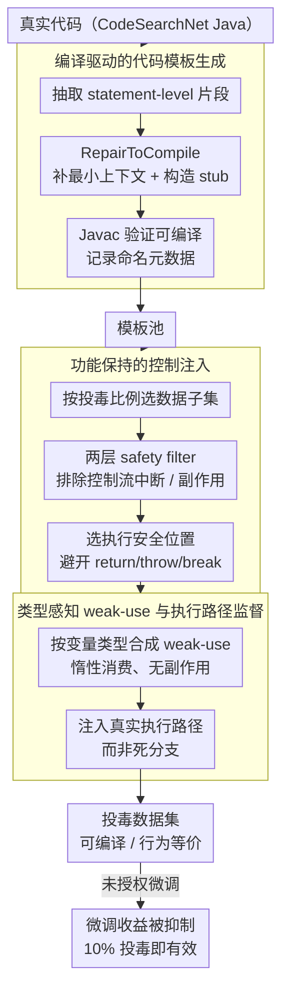

# Train in Vain: Functionality-Preserving Poisoning to Prevent Unauthorized Use of Code Datasets

**会议**: ACL2026  
**arXiv**: [2604.22291](https://arxiv.org/abs/2604.22291)  
**代码**: 待确认（论文称开源，但本地缓存未给出仓库 URL）  
**领域**: 代码大模型 / 数据治理  
**关键词**: 代码数据保护, 数据投毒, 功能保持, CodeLLM, 未授权微调

## 一句话总结
这篇论文提出 FunPoison，在保持 Java 代码可编译、可执行和功能等价的前提下，把执行惰性的弱使用片段注入真实执行路径，只污染 10% 数据就能显著削弱未授权 CodeLLM 微调收益，并对格式化、重写、静态分析和检测清洗表现出较强鲁棒性。

## 研究背景与动机
**领域现状**：CodeLLM 的能力很大程度来自大规模公开代码数据，如 CodeSearchNet 和 The Stack。很多数据作者并未授权模型训练，但一旦数据被抓取并用于微调，事后追责、版权诉讼或水印归因往往成本高、周期长、效果不稳定。

**现有痛点**：数据投毒可以作为 proactive protection，让未授权训练无法获得收益。可是代码数据有特殊要求：普通用户仍需要编译、运行、测试和集成这些代码。已有 CoProtector 这类方法要么破坏语法或语义，导致可编译性接近崩溃，要么只改注释，污染效果很弱，还常需要 100% 全量投毒才明显。

**核心矛盾**：保护性投毒要让模型训练“学坏”，但不能让人类使用代码“用坏”。这要求投毒片段既要在训练 token 序列里产生分布干扰，又不能改变程序可观测行为，并且还要能逃过常见清洗与静态分析。

**本文目标**：作者希望构建一种 functionality-preserving poisoning 框架，在真实 partial poisoning 设置下就能抑制未授权微调，同时保证正常代码质量、编译成功率和运行行为不受影响。

**切入角度**：FunPoison 不插入死代码或明显坏代码，而是把短小、可编译、无副作用的模板片段放到执行路径中，并用类型感知的 weak-use 语句让这些片段在静态分析和格式化后仍保留。关键假设是：片段运行时惰性，但在自回归训练时不是惰性的，因为模型仍要学习这些 token。

**核心 idea**：把“对程序无害”的代码片段变成“对未授权模型微调有害”的训练信号，让功能保持和训练阻断共存。

## 方法详解

### 整体框架
FunPoison 的威胁模型是：数据拥有者发布可正常使用的代码，但不授权大规模模型训练；攻击者可以收集这些数据、控制训练流程、使用清洗、格式化、静态分析、LLM 重写或监督检测等方法。防御目标不是让投毒不可检测，而是在合理误报率、语义保持和成本约束下，让攻击者难以清除足够多的污染信号，同时让未授权微调无法超过 base model 太多。

方法分两大阶段。第一阶段构造模板池：从真实代码中抽取 statement-level fragments，经过编译修复、最小上下文补全、类型解析、变量匿名化和冲突元数据记录，保留可移植的模板。第二阶段控制注入：按投毒比例选取数据子集，对模板做安全过滤，在宿主代码中寻找执行安全位置，合成类型感知 weak-use，并解决命名冲突后注入。最终得到的代码仍应可编译、行为等价，但会在训练时向模型暴露额外的结构模式。

### 关键设计
1. **编译驱动的代码模板生成：从真实代码里提炼可编译、能迁移的短片段。**

	直接复制真实代码片段往往依赖上下文、一拿出来就编译失败；可过度规范化又让模式高度重复、一眼就能被检测出来。FunPoison 的折中是从方法体里抽取 statement-level fragments（而非完整函数或类型声明），再用 RepairToCompile 给不完整片段补上最小必要上下文——导入标准库类型、为非 JDK 类型构造轻量 stub、把孤立对象构造改写成有变量接收的形式，最后通过 Javac 验证能否编译。

	验证通过后，系统记录下变量名、方法名、类名和占位符等元数据，留给注入阶段处理命名冲突。这样得到的模板既保留真实代码风格、不易被识破，又因为补全了上下文而具备跨项目迁移能力。

2. **功能保持的控制注入：把模板塞进宿主程序，但绝不动可观测行为。**

	代码数据保护有个硬约束——投毒不能牺牲普通开发者的使用体验，编译和运行行为必须稳定，否则这套机制根本没法作为数据治理手段被讨论。FunPoison 先用两层 safety filter 过滤模板：概念层排除控制流中断、反射依赖、共享状态等模式，程序层排除 I/O、并发、进程控制、容器突变和非局部赋值等副作用。

	注入位置也只挑方法体里语法稳定、语义惰性的地方，主动避开 return、throw、break、continue、边界位置以及任何可观测副作用附近，并在注入时做作用域跟踪与变量重命名。最终代码保持可编译、控制流/输出/异常/I/O/全局状态全部不变，只是在训练 token 序列里多暴露了一些结构模式。

3. **类型感知 weak-use 与执行路径监督：让片段躲过清洗，又真正干扰训练。**

	注入的片段如果被编译器、formatter 或静态分析当成无用代码删掉，投毒就白做了；可若放进 `always-false` 死分支，模型又学不到它。FunPoison 的关键是根据变量类型合成弱使用语句，只做身份、元数据或安全查询这类惰性消费，避免 I/O、并发和全局状态变化，并把这些片段放进真实执行路径而非死分支。

	这背后的假设是：投毒效果来自自回归模型对执行路径 token 分布的学习干扰，而不是"模型见过某些模板文本"。论文的机制分析支撑了这点——失败生成里 weak-use 与 template signatures 高度共现；而 DeadBranchInsertion 用同一模板池却放进死分支，几乎复现不出 FunPoison 的性能退化。这正是它与死代码插入、注释扰动的根本区别。

### 损失函数 / 训练策略
FunPoison 本身不是训练一个模型，因此没有新的优化损失。实验中攻击者对 DeepSeek-Coder、StarCoderBase、CodeLlama 等 CodeLLM 进行微调，评估 poisoned dataset 是否让 fine-tuned model 在 HumanEval-X 和 MBPP 上无法获得 clean fine-tuning 的收益。主要指标是 $Delta Pass@k$，即微调模型与 base model 在 Pass@k 上的差值；如果 clean fine-tuning 提升明显，而 FunPoison fine-tuning 后提升消失甚至转负，就说明防御有效。

## 实验关键数据

### 主实验

| 设置 | 指标 | Base | Clean FT | FunPoison | 结论 |
|--------|------|------|------|------|------|
| DeepSeek-Coder-1.3B / HumanEval-X | Pass@1, T=0.0 | 0.31 | 0.38 | 0.20 (10% poisoning) | 只污染 10% 就让微调收益变成明显退化 |
| CodeLlama-7B / HumanEval-X | Pass@1, T=0.0 | 0.29 | 0.31 | 0.23 (10% poisoning) | 7B 规模仍能抑制收益 |
| CodeLlama-7B-Instruct / HumanEval-X | Pass@1, T=0.0 | 0.30 | 0.38 | 0.30 (10% poisoning) | 指令模型上把 clean FT 增益基本抹平 |
| DeepSeek-1.3B / MBPP | Pass@1, T=0.0 | 0.31 | 0.41 | 0.16 (10% poisoning) | 跨 benchmark 仍有强退化 |

### 消融实验

| 配置 | 投毒率 | Pass@1 | 说明 |
|------|------|------|------|
| Base | - | 0.31 | 未微调模型 |
| Clean fine-tuned | 0% | 0.38 | 正常微调带来收益 |
| FunPoison | 10% | 0.20 | 执行路径弱使用片段导致明显退化 |
| DeadBranchInsertion | 1% | 0.37 | 同模板放入死分支，几乎等同 clean FT |
| DeadBranchInsertion | 10% | 0.38 | 说明模板暴露本身不是关键 |
| DeadBranchInsertion | 50% | 0.34 | 高比例也远弱于 FunPoison |
| DeadBranchInsertion | 100% | 0.35 | 全量死分支仍不能复现 FunPoison 效果 |

| 功能保持指标 | Clean | FunPoison | 解读 |
|------|------|------|------|
| Compilation success | 984/984 | 984/984 | 编译成功率保持 100% |
| p95 time overhead | 基线 | mean 2.29%, p95 25% | 平均时间开销较小 |
| p95 memory overhead | 基线 | mean 0.09%, p95 2.41% | 内存影响很低 |
| Line coverage | 100% | 100% | 执行覆盖不变 |
| Execution jitter | 8.17% | 8.12% | 稳定性基本一致 |
| Behavior consistency | Preserved | Preserved | 输出、异常和 I/O 行为保持一致 |

| 防御/清洗方式 | 关键结果 | 对 FunPoison 的含义 |
|------|------|------|
| LLM rewriting / CodeLlama | ACC 0.07, CodeBLEU 0.70, 平均 76.42s | 重写成功率低且成本高 |
| LLM rewriting / GPT-4 | ACC 0.06, CodeBLEU 0.56, 平均 70.07s | 更强模型也难以可靠清除 |
| CodeQL static analysis | 与 clean 类似，Rule 32: 4.3% | 标准规则不能把污染样本分离出来 |
| CodeBERT adaptive detector | FPR 100%, Accuracy 10.39% | 监督检测倾向过度误报 benign code |
| clang-format | 格式化后仍低于 clean FT 和 base | 只改布局无法去除训练信号 |

### 关键发现
- FunPoison 最关键的实证结果是 partial poisoning 有效。CoProtector 的破坏性变换通常要到 100% 才明显，而 FunPoison 在 10% 就能显著压制微调收益。
- DeadBranchInsertion 消融很有说服力：同样模板如果不在执行路径中，效果接近 clean fine-tuning，说明训练干扰来自执行路径监督，而不是模板文本本身。
- 功能保持证据比较全面：984 个任务全部编译运行，Apache Commons Lang 的 57,764 个单元测试也全部通过，说明方法不是靠破坏代码质量取胜。
- 鲁棒性实验覆盖检测、清洗、LLM 重写、静态分析、格式化和自适应监督检测，虽然不能证明不可移除，但说明常见低成本清洗策略效果有限。

## 亮点与洞察
- 论文最强的点是把“投毒有效性”和“代码可用性”这两个通常冲突的目标放在一起优化。对代码数据治理来说，保持普通使用体验是方法能否落地的前提。
- 执行路径监督这个机制解释很重要。片段运行时无害，但自回归训练时仍是 token 监督，因此能影响模型学到的代码分布，这个观察比单纯插入坏代码更细。
- 实验没有只看 Pass@1，还加入动态分析、真实项目测试、重写攻击、静态分析和 adaptive detector，让论文更像完整防御系统评估。
- FunPoison 也提出一个更广泛的问题：如果数据拥有者想允许人类使用但限制模型训练，技术机制、许可治理和透明披露必须协同设计。

## 局限与展望
- 论文只系统评估 Java，其他语言需要不同 parser、编译器、weak-use 设计和副作用过滤规则。Rust、Go、JavaScript 或 C/C++ 的可迁移性还不能直接假设。
- FunPoison 依赖可用插入位置。论文提到 CodeSearchNet Java 中 80.3% 函数在全覆盖设置下有有效位置，但高度紧凑或强优化代码可能空间不足。
- 它不是理论不可移除。更激进的训练流程、从头预训练、数据去重、语义规范化、强人工审计或 RL-based adaptation 可能改变效果。
- 方法具有明显双用性。负责任部署需要在 dataset card、README 或 license addendum 中透明披露，并为授权训练用户提供 clean data；不适合默认投放到开放协作生态中。
- 目前评估主要面向 executable code generation。代码检索、补全、修复、测试生成或代码理解任务是否同样受影响，还需要任务级研究。

## 相关工作与启发
- **vs CoProtector**: CoProtector 通过 CC/CS/CR/CSR 等变换破坏代码或注释，常牺牲可编译性或依赖全量投毒；FunPoison 把功能保持作为硬约束，并在 10% partial poisoning 下有效。
- **vs 代码水印 / 归因方法**: 水印和归因通常用于事后证明数据被用过，FunPoison 的目标是事前降低未授权微调收益，两者可互补。
- **vs 后门攻击 / 通用数据投毒**: 许多投毒研究追求 targeted misbehavior 或 label corruption；本文是 untargeted deterrence，且要求代码行为不变。
- **vs 清洗与重写防御**: KillBadCode、DeCoMa、CodeQL、formatter 和 LLM rewriting 是攻击者可能采用的清理工具；本文把它们作为 robustness test，而不是直接方法对比。
- **启发**: 对受版权和许可约束的数据集，单靠法律文本很难阻止模型训练。未来可能需要把访问控制、数据 provenance、透明披露和技术扰动组合起来，形成更细粒度的数据使用治理。

## 评分
- 新颖性: ⭐⭐⭐⭐☆ 功能保持式代码投毒和执行路径监督机制很有辨识度，区别于破坏性代码扰动。
- 实验充分度: ⭐⭐⭐⭐⭐ 模型、benchmark、防御、真实项目和动态分析覆盖较全面，消融也抓住关键机制。
- 写作质量: ⭐⭐⭐⭐☆ 结构清楚，威胁模型和责任边界写得比较完整；部分代码链接信息在缓存中不够明确。
- 价值: ⭐⭐⭐⭐☆ 对代码数据治理、未授权微调防护和 CodeLLM 训练安全都有启发，但部署必须非常谨慎。

<!-- RELATED:START -->

## 相关论文

- [\[ACL 2025\] Can LLM Watermarks Robustly Prevent Unauthorized Knowledge Distillation?](../../ACL2025/llm_safety/llm_watermark_distillation_robustness.md)
- [\[NeurIPS 2025\] ImageSentinel: Protecting Visual Datasets from Unauthorized Retrieval-Augmented Image Generation](../../NeurIPS2025/llm_safety/imagesentinel_protecting_visual_datasets_from_unauthorized_retrieval-augmented_i.md)
- [\[ACL 2026\] PARASITE: Conditional System Prompt Poisoning to Hijack LLMs](parasite_conditional_system_prompt_poisoning_to_hijack_llms.md)
- [\[ACL 2026\] AgentMark: Utility-Preserving Behavioral Watermarking for Agents](agentmark_utility-preserving_behavioral_watermarking_for_agents.md)
- [\[ACL 2026\] Knowledge Poisoning Attacks on Medical Multi-Modal Retrieval-Augmented Generation](knowledge_poisoning_attacks_on_medical_multi-modal_retrieval-augmented_generatio.md)

<!-- RELATED:END -->
