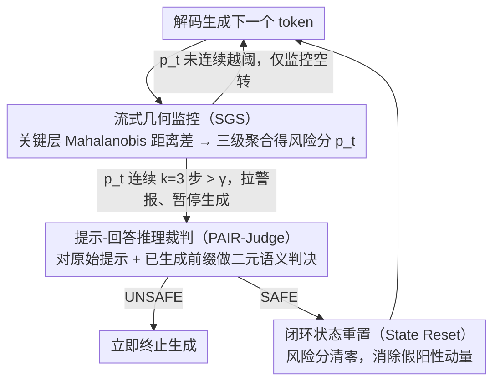

# TrajGuard: Streaming Hidden-state Trajectory Detection for Decoding-time Jailbreak Defense

**会议**: ACL 2026 Findings  
**arXiv**: [2604.07727](https://arxiv.org/abs/2604.07727)  
**代码**: 无  
**领域**: LLM对齐 / AI安全  
**关键词**: 越狱防御, 隐藏状态轨迹, 解码时检测, 实时安全, 无训练防御

## 一句话总结

本文提出 TrajGuard，一种无需训练的解码时越狱防御框架，通过滑动窗口聚合关键层隐藏状态轨迹实时量化风险，仅在风险持续超过阈值时触发轻量级语义裁判，在 12 种越狱攻击上实现 95% 平均防御率，检测延迟仅 5.2ms/token，误报率低于 1.5%。

## 研究背景与动机

**领域现状**：LLM 已深度集成到现实服务中，其安全性至关重要。尽管经过严格的安全对齐训练（RLHF等），精心构造的越狱攻击仍能绕过安全护栏，在经过 RLHF 对齐的模型上实现高攻击成功率。

**现有痛点**：现有防御主要依赖静态检测——要么在输入端过滤提示（如 Llama Guard），要么在输出端检查完整回复。输入端过滤无法检测语义伪装的越狱提示，输出端过滤虽然更有效但需要生成完整回复后才能审查，引入不可忽略的端到端延迟。一些利用模型内部激活的方法仍然操作于静态的提示表示上，且依赖高维几何分数，可解释性差。

**核心矛盾**：越狱风险不是在某个时刻瞬间触发的，而是在解码过程中通过上下文的恶意意图逐步积累形成的。现有方法将安全检测视为离散的二分类任务，忽略了解码过程中语义的动态演化——这是当前防御范式的关键盲区。

**本文目标**：利用解码过程中隐藏状态的动态轨迹来实现实时越狱检测，不依赖额外训练的安全模型。

**切入角度**：作者通过实证分析发现了一个关键的"伪装-暴露"模式：越狱提示在潜空间中与良性提示纠缠（语义伪装），但一旦模型开始生成具体的有害步骤，隐藏状态就会持续漂移向恶意区域。这种漂移在早期解码片段中就已出现。

**核心 idea**：将解码过程中隐藏状态的时序轨迹作为越狱检测信号，通过"流式几何监控 + 按需语义裁判"的粗到细架构，实现低开销、实时的越狱拦截。

## 方法详解

### 整体框架

TrajGuard 想在不重新训练任何安全模型的前提下，趁越狱"刚要暴露"的那一刻把生成掐断。它把检测拆成粗到细的两道防线：解码每吐出一个 token，先让轻量的**流式几何监控（SGS）**盯着隐藏状态轨迹算一个风险分数，绝大多数良性交互到这里就结束了，几乎零额外开销；只有当风险分数持续异常、SGS 拉响警报时，才暂停生成、唤醒昂贵的**语义裁判（PAIR-Judge）**做一次真正的语义判决。裁判说 UNSAFE 就立刻终止，说 SAFE 就由**闭环状态重置（State Reset）**把 SGS 攒下的风险清零、继续往下生成。整条链路因此只有"疑似有事"时才付出大代价，平时一直跑在便宜的"仅监控"模式。

### 关键设计

**1. 流式几何监控（SGS）：从一串抖动的隐藏状态里，捞出稳定的"正在偏向恶意"信号**

逐 token 看隐藏状态会很吵——单步判断很容易被瞬态波动带偏，真正的越狱不是某一步突然出现，而是隐藏状态持续驻留在高风险区域。SGS 的做法是先用 MVD（均值向量差异）挑出对良恶最敏感的 Top-K（K=8）关键层，在这些层上分别为良性/恶意模式拟合高斯分布；解码时对每个 token 算它到良性质心和恶意质心的 Mahalanobis 距离之差 $r_{l,t} = d^{\mathcal{B}}_{l,t} - d^{\mathcal{M}}_{l,t}$，差越大说明越靠恶意区。单层单步的 $r_{l,t}$ 仍然噪声大，于是再经三级聚合压平：先在每层内做窗口 $w=8$ 的滑动截断均值削掉离群点，再跨 K 层取平均，最后用 EWMA 做时序平滑，得到稳定的流式风险分数 $p_t$。最关键的是触发条件不是"某一步越线就报警"，而是要求 $p_t$ **连续 $k=3$ 步**都超过阈值 $\gamma$ 才拉警报——这个滞后机制把瞬态几何噪声挡在外面，保证只有"持续往恶意区域漂"的真意图才会惊动后面昂贵的裁判。

**2. 提示-回答推理裁判（PAIR-Judge）：几何上靠近恶意区，不等于语义上真的恶意，得有人复核**

SGS 给的是高维空间里的距离信号，安全但敏感的话题（比如认真讨论网络安全）也可能在几何上凑近恶意区，直接据此封杀会误伤。所以警报一旦响起，PAIR-Judge 先暂停生成，把当前完整上下文——原始提示 $x$ 加已生成前缀 $y_{\leq t}$——套进一个安全系统提示模板 $\mathcal{P}$，丢给一个安全对齐的 LLM 做一次二元判决 $d = \mathcal{M}_{judge}(\mathcal{P}(x, y_{\leq t}))$。判 UNSAFE 就立即终止生成，判 SAFE 就放行。这一步把抽象的内部几何信号翻译成"看得懂、说得清"的安全决策，既补上了语义层的核验，又保留了可解释性。

**3. 闭环状态重置（State Reset）：一次虚惊，不该让后面一路跟着误报**

SGS 的风险分数是带历史动量的（EWMA 会记住之前的偏移），如果某次只是良性内容偶然蹭到高风险区、被 PAIR-Judge 判成 SAFE，残留的风险动量会让接下来几步继续踩在警报线附近，反复惊动裁判、把正常对话拖垮。State Reset 就是给这个闭环兜底：只要语义裁判判 SAFE，就把 SGS 的风险分数 $S_t$ 强制拉回初始安全值，清掉这次"假阳性"积累的动量。这样一次误触发被裁判否决后就翻篇，不会演变成连锁误报——这套"误报后主动清零"的思路其实也能搬到别的异常检测系统里。

### 一个完整示例：一次 GCG 越狱被掐断

设用户输入一条经 GCG 优化、语义伪装得很像正常请求的越狱提示。$t=0$ 时它在潜空间里和良性提示几乎重叠，SGS 算出的 $p_t$ 平平无奇，系统只在"仅监控"模式空转，没有任何额外开销。随着模型开始生成具体的有害步骤，隐藏状态持续向恶意质心漂移，$r_{l,t}$ 转正、经三级聚合后 $p_t$ 一路抬高；当 $p_t$ **连续 3 步**都越过阈值 $\gamma$，SGS 拉响警报、暂停生成。PAIR-Judge 接手，把"原始提示 + 已生成的这段有害前缀"打包判决，认定 UNSAFE，生成被立即终止——全程只在这一次触发时付出语义裁判的代价，平均每 token 仅 5.2ms。作为对照，若换成一条只是敏感但合法的提问，$p_t$ 偶尔冲高触发裁判，PAIR-Judge 判 SAFE，State Reset 随即把风险分数清零，对话顺畅继续，不会被后续动量反复打断。

### 损失函数 / 训练策略

TrajGuard 完全无训练，只需一个预处理步骤：用 8,000 条良性指令和 10,000 条恶意指令估计隐藏空间里安全/不安全区域的分布（各层的质心与协方差矩阵）。由于隐藏维度很高、协方差直接求逆数值不稳，采用收缩正则化 $\widehat{\Sigma}_{\star,l} = \Sigma_{\star,l} + \lambda I$ 增强稳定性。之后即可即插即用到任意开源 LLM，无需任何微调。

## 实验关键数据

### 主实验

| 模型 | 防御方法 | 12种攻击平均ASR↓ | 最佳单攻击ASR |
|------|---------|-----------------|-------------|
| Llama-2-7B | No Defense | 0.52 | - |
| Llama-2-7B | Llama Guard 3 | 0.20 | GCG: 0.02 |
| Llama-2-7B | Qwen3Guard | 0.07 | GCG: 0.00 |
| Llama-2-7B | **TrajGuard** | **0.02** | 多数攻击: 0.00 |
| Llama-3.1-8B | No Defense | 0.57 | - |
| Llama-3.1-8B | **TrajGuard** | **0.04** | - |
| Mistral-7B | No Defense | 0.75 | - |
| Mistral-7B | **TrajGuard** | **0.05** | - |

| 指标 | TrajGuard 表现 |
|------|---------------|
| 平均防御率 | 95% |
| 检测延迟 | 5.2 ms/token |
| 误报率 (XSTest) | < 1.5% |
| Alpaca 正常任务保持率 | 高（详见论文） |

### 消融实验

| 配置 | 关键影响 | 说明 |
|------|---------|------|
| Full TrajGuard | AVG ASR ≈ 0.02-0.05 | 完整模型 |
| w/o PAIR-Judge | 误报率上升 | 仅靠几何监控会将安全但敏感的内容误判 |
| w/o State Reset | 连锁误报 | 误触发后后续解码持续报警 |
| w/o 持续性触发 | 噪声增加 | 单步判断容易被瞬态波动影响 |
| 不同窗口大小 w | w=8 最优 | 太小噪声大，太大延迟高 |

### 关键发现

- **隐藏状态轨迹比输入提示提供更强更稳定的越狱信号**：越狱提示在潜空间中与良性提示纠缠（t=0时重叠），但解码开始后隐藏状态持续向恶意区域漂移
- **不同模型的"漂移延迟"差异显著**：Llama-2-7B 在 37 步后才开始恶化，而 Vicuna-7B 几乎立即下降，反映了不同模型安全对齐的鲁棒性差异
- **TrajGuard 在多数攻击上将 ASR 降至接近 0**，尤其在 GCG、AutoDAN、PAIR 等主流攻击上表现突出
- Cipher 类攻击是唯一仍有一定成功率的攻击类型（ASR 0.10-0.25），可能因为加密输入在隐藏空间中的表示模式与常规越狱不同

## 亮点与洞察

- **"伪装-暴露"观察非常精妙**：越狱提示的语义伪装在输入阶段有效，但模型一旦开始生成具体有害步骤，内部表示就不可避免地向恶意区域漂移。这个观察将越狱检测从静态分类问题转化为动态轨迹监控问题
- **粗到细的层次设计实用性强**：绝大部分时间仅运行轻量级的几何监控（5.2ms/token），只有疑似风险时才调用昂贵的语义裁判，实现了精度和效率的极佳平衡
- **完全无训练**的特性使其可即插即用到任何开源 LLM，无需额外安全数据或微调成本
- **闭环状态重置机制**可以迁移到其他异常检测系统中，解决"一次误报导致连锁反应"的通用问题

## 局限与展望

- 需要预先构建良性/恶意区域的分布估计，依赖 8K+10K 标注数据的质量和覆盖范围
- 对 Cipher 类加密攻击防御效果相对较弱，隐藏状态可能未充分暴露加密输入的恶意意图
- 仅在 7B-8B 规模的开源模型上验证，对更大规模或闭源模型的适用性未知
- PAIR-Judge 使用目标模型本身作为裁判，在模型安全对齐较弱时裁判质量可能下降

## 相关工作与启发

- **vs Llama Guard 3**：静态输入/输出过滤器，无法利用解码过程中的动态信息。TrajGuard 在几乎所有攻击上大幅优于它
- **vs SafeDecoding (Xu et al., 2024)**：需要训练安全专家模型来重新加权解码概率，TrajGuard 无需训练，直接利用基础模型的隐藏状态
- **vs ShieldHead (Xuan et al., 2025)**：附加 token 级安全头需要额外训练，且仍是逐 token 的静态判断，不建模时序轨迹
- **vs Goal Prioritization (Zhang et al., 2024)**：在部分模型上表现不佳（Mistral-7B 上 AVG ASR 0.44），说明提示工程方法对攻击的鲁棒性不足

## 评分

- 新颖性: ⭐⭐⭐⭐⭐ 首次将解码时隐藏状态轨迹用于越狱检测，"伪装-暴露"观察新颖且有说服力
- 实验充分度: ⭐⭐⭐⭐⭐ 12种攻击、4个模型、多个基线、完整消融，非常全面
- 写作质量: ⭐⭐⭐⭐ 结构清晰，动机推导自然，图表丰富
- 价值: ⭐⭐⭐⭐⭐ 无训练、低延迟、高防御率的实时防御方案，实用价值极高

<!-- RELATED:START -->

## 相关论文

- [\[ICLR 2026\] Inference-Time Backdoors via Hidden Instructions in LLM Chat Templates](../../ICLR2026/llm_safety/inference-time_backdoors_via_hidden_instructions_in_llm_chat_templates.md)
- [\[ACL 2026\] Rethinking Jailbreak Detection of Large Vision Language Models with Representational Contrastive Scoring](rethinking_jailbreak_detection_of_large_vision_language_models_with_representati.md)
- [\[ACL 2026\] LeakDojo: Decoding the Leakage Threats of RAG Systems](leakdojo_decoding_the_leakage_threats_of_rag_systems.md)
- [\[ACL 2025\] CAVGAN: Unifying Jailbreak and Defense of LLMs via Generative Adversarial Attacks](../../ACL2025/llm_safety/cavgan_unifying_jailbreak_and_defense_of_llms_via_generative_adversarial_attacks.md)
- [\[ACL 2026\] Robust Multimodal Safety via Conditional Decoding](robust_multimodal_safety_via_conditional_decoding.md)

<!-- RELATED:END -->
