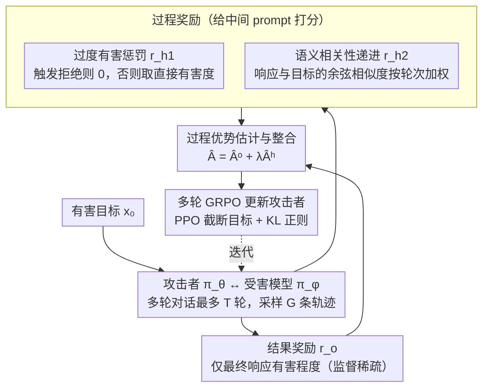

# TROJail: Trajectory-Level Optimization for Multi-Turn Large Language Model Jailbreaks with Process Rewards

**会议**: ACL 2026  
**arXiv**: [2512.07761](https://arxiv.org/abs/2512.07761)  
**代码**: [GitHub](https://github.com/xxiqiao/TROJail)  
**领域**: AI 安全 / LLM 推理  
**关键词**: 多轮越狱攻击, 轨迹级优化, 过程奖励, 强化学习, 红队测试

## 一句话总结

本文将自动化多轮越狱攻击建模为多轮强化学习问题，提出 TROJail，通过两个启发式过程奖励（过度有害惩罚和语义相关性递进）缓解结果奖励的稀疏监督问题，在多个模型和基准上显著提升攻击成功率。

## 研究背景与动机

**领域现状**：LLM 面临越狱攻击的安全威胁。多轮越狱攻击因反映真实交互场景而受到关注。现有训练型方法使用 DPO 或拒绝采样微调在每轮独立优化攻击者 LLM。

**现有痛点**：(1) 逐轮优化是短视的——最大化每轮直接响应的有害程度，无法学习跨轮的长期攻击策略；(2) 早期看似无害但战略关键的 prompt 因未触发即时有害响应而被低估；(3) 无训练方法依赖人工设计策略，需要大量试验且在受害模型偏离预期时容易崩溃。

**核心矛盾**：轨迹级优化是自然的解决方案，但仅依赖最终响应的有害程度作为结果奖励面临严重的稀疏监督问题——攻击者无法推断中间 prompt 如何贡献于最终攻击成功。

**本文目标**：设计更丰富的中间反馈信号来估计中间 prompt 的效用，从而支持长期攻击策略的学习。

**切入角度**：通过控制实验发现两个经验模式——(1) 适度有害的中间 prompt 最有效，过度有害触发拒绝机制反而失败；(2) 成功轨迹中响应的语义相关性逐渐递增，失败轨迹则不显示此模式。

**核心 idea**：在多轮 GRPO 框架中引入两个过程奖励——过度有害惩罚 $r_{h_1}$ 和语义相关性递进 $r_{h_2}$，将它们整合到优势估计中，为中间 prompt 提供细粒度的训练信号。

## 方法详解

### 整体框架

TROJail 把"自动化多轮越狱"当成一个多轮强化学习问题来训攻击者。给定一条有害目标 $x_0$，攻击者 $\pi_\theta$ 和受害模型 $\pi_\phi$ 来回对话最多 T 轮、采样出 G 条轨迹，最终响应的有害程度作为结果奖励 $r_o$。问题在于只有最后一轮才有这个奖励，中间那些"看似无害却战略关键"的铺垫 prompt 拿不到任何信用，监督极其稀疏。TROJail 的解法是额外塞进两个**过程奖励** $r_{h_1}$、$r_{h_2}$ 给中间 prompt 打分，把它们折算成过程优势，再和结果优势相加成 $\hat{A}_{i,t} = \hat{A}_{i,t}^o + \lambda \hat{A}_{i,t}^h$，用多轮 GRPO 的 PPO 风格截断目标统一优化——既盯着最终能否攻破，又给每一步铺垫提供细粒度梯度。

### 关键设计

**1. 过度有害惩罚 $r_{h_1}$：中间 prompt 太凶会打草惊蛇，得让攻击者学会"适度"**

逐轮优化的老毛病是一味把每轮响应往最有害方向推，结果中间 prompt 过于露骨、直接触发受害模型的拒绝机制，攻击当场失败。作者的控制实验显示中间 prompt 的有害程度和最终攻击成功其实是**倒 U 型**关系——适度有害最优，过头反而崩。$r_{h_1}$ 就把这条经验写进奖励：中间响应若触发拒绝则 $r_{h_1} = 0$，否则取其直接有害程度 $r(x_0, y_t)$。这样攻击者被鼓励维持"既往前推进、又不越线惊动护栏"的火候，而不是每轮都顶着上限猛冲。

**2. 语义相关性递进 $r_{h_2}$：成功的越狱是一步步把话题拽向目标，而不是最后一轮才点题**

光有有害程度还不够——它只在最后一轮才飙升，中间几乎给不出方向。作者观察到成功轨迹有个更可靠的信号：响应与原始有害目标的语义相关性会**平稳递增**，失败轨迹则没有这个趋势。于是 $r_{h_2}$ 计算中间响应与原始有害 prompt 的句子嵌入余弦相似度，并按轮次比例加权：

$$r_{h_2}(x_t) = \frac{t}{|\tau|} \cdot \text{cosine}(e(x_0), e(y_t))$$

越靠后的轮次权重越大，逼着攻击者稳步把语义往目标拉近。相比只在终点才有反馈的有害程度奖励，这条信号在整条轨迹上都是渐进、可微的中间指引。

**3. 过程优势估计与整合：把两个启发式奖励折成"未来累积"的优势，再和结果优势合流**

有了 $r_{h_1}$、$r_{h_2}$ 还要正确地灌进轨迹级优化里。TROJail 把所有轨迹、所有轮次的启发式奖励汇成集合 $\mathcal{D}_h$ 做标准化，再用前缀和累积每个位置之后的未来奖励，得到归一化过程优势：

$$\hat{A}_{i,t}^h = \sum_{s=t}^{|\tau_i|} \frac{r_h(x_{i,s}) - \text{mean}(\mathcal{D}_h)}{\text{std}(\mathcal{D}_h)}$$

最终优势 $\hat{A}_{i,t} = \hat{A}_{i,t}^o + \lambda \hat{A}_{i,t}^h$ 让结果优势负责全局方向、过程优势负责局部步步为营，$\lambda$ 调两者配比。正是这套"未来累积"的写法，使一个早期看似无害的铺垫 prompt 也能因为它后续带来的语义递进而拿到正向信用，从而学出"先铺垫后触发"的长期策略。

### 损失函数 / 训练策略

采用多轮 GRPO 的 PPO 风格截断目标 + KL 正则化。攻击者基于 Qwen2.5-3B-Instruct，受害模型包括 Llama-3.1-8B、Qwen2.5-7B、Gemma-2-9B、Mistral-7B 等。

## 实验关键数据

### 主实验

**跨模型平均攻击成功率（ASR）对比**

| 方法 | 类型 | 平均 ASR |
|------|------|---------|
| ActorAttack | 无训练多轮 | ~60% |
| HARM | 训练型逐轮 | ~58% |
| Siren (DPO) | 训练型逐轮 | ~65% |
| **TROJail** | 训练型轨迹级 | **~72%** |

### 消融实验

**过程奖励消融**

| 配置 | 说明 |
|------|------|
| w/o 两个过程奖励 | 退化为纯 MT-GRPO，ASR 显著下降 |
| w/o 过度有害惩罚 | 攻击者倾向生成过于激进的 prompt，触发更多拒绝 |
| w/o 语义递进 | 中间轮次容易偏离目标有害内容 |

### 关键发现

- TROJail 在所有受害模型和基准上一致超越逐轮优化方法
- 两个过程奖励对性能贡献相当，但语义递进在长轨迹上更关键
- 控制实验验证了过度有害的倒 U 型关系——L3-L4 级的中间 prompt 最有效
- 轨迹可视化显示 TROJail 学到了"先铺垫后触发"的长期策略模式

## 亮点与洞察

- 两个经验模式的发现是全文的基石——通过精心设计的控制实验量化了中间 prompt 的效用
- 将多轮越狱建模为多轮 RL 问题的视角自然且优雅，过程奖励的设计有理论和实证双重支撑
- 研究虽聚焦攻击，但其发现直接服务于防御——理解攻击策略才能更好地设计安全机制

## 局限与展望

- 攻击成功的评判依赖外部有害程度评估器，其本身可能不完美
- 仅在 7-9B 级别的受害模型上评估，未测试更大或更新的模型
- 过程奖励是启发式设计，可能存在更好的中间反馈信号
- 伦理考量——攻击方法的公开可能被滥用，需要负责任的披露

## 相关工作与启发

- **vs Siren/MTSA (DPO 逐轮优化)**: 后者在每轮独立优化，无法学习跨轮策略；TROJail 的轨迹级优化能发现"先铺垫后触发"的长期模式
- **vs ActorAttack (无训练多轮)**: 后者依赖预设策略，受害模型偏离预期时容易崩溃；TROJail 通过 RL 自动学习策略
- **vs MT-GRPO**: 纯结果奖励面临稀疏监督，TROJail 的过程奖励提供了关键的中间指导

## 评分

- 新颖性: ⭐⭐⭐⭐ 将多轮越狱建模为多轮 RL 并设计过程奖励的思路新颖
- 实验充分度: ⭐⭐⭐⭐⭐ 4 受害模型 × 3 基准 + 控制实验 + 详细消融
- 写作质量: ⭐⭐⭐⭐ 从经验模式到方法设计的逻辑清晰
- 价值: ⭐⭐⭐⭐ 对 LLM 安全研究有重要推动，攻防两面都有启发

<!-- RELATED:START -->

## 相关论文

- [\[ACL 2026\] Multi-component Causal Tracing in Large Language Models](multi-component_causal_tracing_in_large_language_models.md)
- [\[ICML 2026\] PRPO: Paragraph-level Policy Optimization for Vision-Language Deepfake Detection](../../ICML2026/llm_safety/prpo_paragraph-level_policy_optimization_for_vision-language_deepfake_detection.md)
- [\[ACL 2026\] SharedRequest: Privacy-Preserving Model-Agnostic Inference for Large Language Models](sharedrequest_privacy-preserving_model-agnostic_inference_for_large_language_mod.md)
- [\[ACL 2026\] Instant Personalized Large Language Model Adaptation via Hypernetwork](instant_personalized_large_language_model_adaptation_via_hypernetwork.md)
- [\[NeurIPS 2025\] Learning to Watermark: A Selective Watermarking Framework for Large Language Models via Multi-Objective Optimization](../../NeurIPS2025/llm_safety/learning_to_watermark_a_selective_watermarking_framework_for_large_language_mode.md)

<!-- RELATED:END -->
