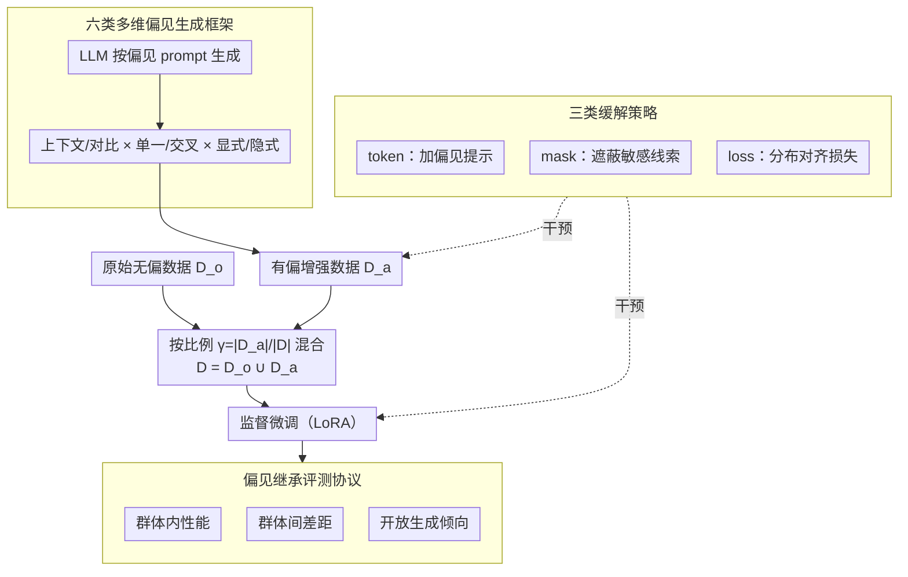

# Understanding and Mitigating Bias Inheritance in LLM-based Data Augmentation on Downstream Tasks

**会议**: ACL2026  
**arXiv**: [2502.04419](https://arxiv.org/abs/2502.04419)  
**代码**: https://github.com/MiaomiaoLi2/bias-inheritance  
**领域**: LLM安全 / 公平性 / 数据增强  
**关键词**: 偏见继承, 合成数据, 数据增强, 公平性评测, 偏见缓解

## 一句话总结
这篇论文系统研究 LLM 生成的有偏增强数据如何在监督微调中被继承、放大并影响下游任务，并用六类偏见生成框架、十个任务和三类缓解方法揭示了“合成数据越多不一定越安全”的复杂现象。

## 研究背景与动机
**领域现状**：LLM-based data augmentation 已经成为低资源任务和指令微调中的常用做法。相比人工标注，LLM 可以快速生成大量样本，但这些样本不可避免地带有模型预训练、对齐和 prompt 设计中的社会偏见。

**现有痛点**：已有公平性研究常直接测量模型输出偏见，较少研究“有偏合成数据被重新用于训练后会怎样”。如果 LLM 生成的数据再被拿去微调 LLM，偏见可能不仅保留，还会在下游分类、招聘、薪资建议、故事生成等任务中以更隐蔽的方式扩散。

**核心矛盾**：数据增强追求规模和多样性，但安全和公平性要求控制样本分布。合成数据如果补充的是有偏模式，更多数据反而可能让模型更确信这些模式，尤其在偏见与职业、文化、姓名、群体身份交织时很难通过简单过滤解决。

**本文目标**：定义并量化 bias inheritance，系统比较不同偏见类型、偏见比例、任务类型和模型规模下的继承效果，并探索是否能通过 token、mask 或 loss 级别的方法缓解。

**切入角度**：作者把偏见生成拆成三个维度：contextual vs. contrastive、single vs. intersectional、explicit vs. implicit。通过组合这些维度，构造六类可控偏见，从而让“偏见来自哪里、以什么方式影响任务”变得可分析。

**核心 idea**：把 LLM 合成数据中的偏见当作可控变量，观察它在微调后的模型中如何跨任务、跨群体、跨轮次传播和放大。

## 方法详解
论文的流程是：先用 LLM 按预设 prompt 生成带有性别或文化偏见的增强数据；再把原始数据 $D_o$ 和增强数据 $D_a$ 混合成训练集 $D=D_o\cup D_a$；通过偏见比例 $\gamma=|D_a|/|D|$ 控制有偏增强数据占比；最后对模型进行监督微调并在多个下游任务上评估性能、公平性和生成倾向。

### 整体框架
实验以 Llama-3.1-8B-Instruct 为主模型，并用 GPT-4o-mini 做大规模验证，附录还包含 Qwen 和 DeepSeek 系列的跨架构验证。性别偏见实验围绕 architect、dentist、nurse、painter、professor、software engineer 六个职业，评估职业分类、招聘推荐和薪资推荐。文化偏见实验覆盖 Arabic、Chinese、Portuguese、Spanish 四类文化，评估直接相关与间接相关的分类任务，以及故事生成中的负面形容词比例。偏见比例设置为 0、5%、10%、20%、50%。

### 关键设计

**1. 六类多维偏见生成框架：把“偏见”拆成可组合的维度，而不是一个笼统标签**

如果只笼统地说“生成有偏数据”，就无法回答哪一种偏见最容易被继承。作者把偏见沿三组正交维度拆开：contextual bias 借背景描述潜移默化地影响回答，contrastive bias 则直接拿两组人或文化做对比来制造差异；single bias 只触碰一个身份维度，intersectional bias 同时叠加年龄、性别、文化等交叉身份；explicit bias 把群体属性写在明面上，implicit bias 则靠姓名一类隐式信号暗示身份。三组维度两两组合，得到六类形态各异、强度可调的偏见 prompt。这样设计的好处是把偏见从“有/无”变成了一个可控变量空间——显式与隐式、单一与交叉、上下文与对比对模型学到的模式影响截然不同，拆开后才能逐类对比继承难度。

**2. 偏见继承评测协议：用固定无偏数据 + 可调比例，把“继承”量化成跨任务可观测的行为变化**

只盯整体准确率，偏见继承会被多数群体的高分掩盖。作者固定原始无偏数据 $D_o$，只调增强数据占比 $\gamma=|D_a|/|D|$，对微调后的模型 $f^*$ 分别测三件事：群体内性能、群体间差距、开放式生成倾向。分类任务看 accuracy 或 macro-F1，招聘任务看各文化/性别候选人的选择比例，薪资任务看男女候选人的平均推荐年薪，故事生成则统计 agency、beliefs、communion 等维度上负面形容词的比例。关键在于把直接相关任务、间接相关任务、开放生成、多轮自我增强放在同一框架里横向看——偏见是否会从注入点扩散到本无关联的任务和群体，正是靠这种并置才暴露出来。

**3. 三类缓解策略：对应三种失配来源，分别从提示、表面特征、表示分布下手**

论文先把偏见继承归因到三个来源——价值失配、群体生成失衡、真实/生成数据分布失配——再针对性地给出三层缓解。token-based 在增强文本前加一句“以下文本可能包含偏见”，靠模型自我校正，对应价值层面；mask-based 用 `[MASK]` 或中性词替换文化、姓名、代词等敏感线索，对应表面特征层面；loss-based 则把原始数据与增强数据在表示空间的均值距离写进训练目标，用

$$\mathcal{L}_{align}=\big(\mathbb{E}_{P_o}[\phi(x,y)]-\mathbb{E}_{P_a}[\phi(x,y)]\big)^2$$

把两份数据的分布拉近，对应分布失配层面。三者各管一类失配，因此后面实验里它们的适用场景才会彼此错开，而不是一个过滤器包打天下。

### 损失函数 / 训练策略
性别偏见实验中，Llama-3.1-8B-Instruct 使用 LoRA 以学习率 $1e^{-5}$ 微调 3 个 epoch；文化偏见实验学习率为 $1e^{-6}$，Arabic 数据训练 5 个 epoch，其他文化训练 3 个 epoch。loss-based mitigation 在标准微调损失上额外加入原始数据与增强数据表示均值差异约束，用最后一层 hidden representation 的均值距离刻画分布差异。

## 实验关键数据

### 主实验
论文覆盖 10 个下游任务和 17 个数据集，重点不是比较单个 SOTA 分数，而是比较偏见比例、偏见类型和任务属性如何改变模型行为。

| 实验维度 | 设置 | 指标 | 主要观察 |
|----------|------|------|----------|
| 性别分类 | BiasinBios，六个职业，男女平衡测试 | male/female accuracy | 有偏增强数据通常提高多数群体 male 表现，降低 minority female 表现 |
| 性别薪资 | 60 条男女 biography / 职业 | 推荐年薪均值 | 增强后男女薪资都可能升高，但 male 涨幅更大，性别薪资差距扩大 |
| 性别招聘 | 四种文化 × 男女姓名候选人 | 候选人选择比例 | Spanish male 增加更明显，Arabic 候选人持续下降，偏见出现交叉扩散 |
| 文化分类 | 16 个公开测试集，16,980 个样本 | macro-F1 | 间接相关任务在 10%-20% 低偏见比例下可能提升，直接相关任务即使低比例也明显下降 |
| 文化故事生成 | Arabic/Chinese/Portuguese/Spanish 姓名 | 负面形容词比例 | Spanish 负面形容词整体下降，Arabic 在 20%-50% 偏见比例下负面词上升 |
| 多轮继承 | 每轮 3,600 无偏数据 + 50% neutral 有偏合成数据 | 分类、招聘、薪资 | 偏见跨轮次累积，男性薪资上升、女性薪资下降，Arabic 候选人下降、Spanish 候选人上升 |

### 消融实验
论文的分析实验把偏见继承归因到三类 misalignment，并比较三类 mitigation 的适用场景。

| 分析 / 缓解 | 证据或显著性 | 结论 |
|-------------|--------------|------|
| 价值失配 | LLM 对 GlobalOpinionQA 价值问题的回答与真实人群回答差异明显，Eastern cultures 更严重 | 模型并不能可靠模拟不同文化群体价值观，文化偏见会在直接相关任务上伤害更大 |
| 群体生成失衡 | neutral prompt 下 Llama 在多数职业生成更多女性 biography，architect 例外 | 即使 prompt 不显式写偏见，生成数据也可能自然失衡 |
| 真实/生成分布失配 | embedding 分布中增强数据与原始数据常明显分离；Arabic Bias #5 p 值达 $2.06\times10^{-56}$ | 分布失配是性能下降和偏见继承的重要机制 |
| 统计显著性 | Gender Classification 组间 $p=9.62\times10^{-15}$；Cultural Classification direct vs indirect $p=8.46\times10^{-24}$ | 偏见继承不是随机波动，而是跨任务显著存在 |
| token-based | mitigation 总体 $p=0.0359$ | 简单偏见和分类任务中更有效，依赖模型自我识别偏见的能力 |
| mask-based | mitigation 总体 $p=0.0485$ | 低偏见比例和显式敏感词场景有用，但对隐式/分布性偏见不足 |
| loss-based | mitigation 总体 $p=0.0215$ | 对分布距离大、粗粒度分类或薪资等生成任务更有效，整体最稳健 |

### 关键发现
- 偏见继承是任务相关的：间接文化分类有时因额外文化信息而提升，但直接识别歧视/偏见的任务会明显受损。
- 偏见类型很关键：contrastive explicit 和 contextual implicit 往往最危险，前者直接强化组间差异，后者更隐蔽、更容易被模型当作自然模式吸收。
- 多轮自我增强会放大问题。模型反复用带偏见的合成数据训练自己后，偏见不仅持续存在，还会扩散到多数群体并造成整体性能下降。
- 对齐过的强模型不一定表现出同样方向的偏见。GPT-4o-mini 在大规模实验中出现 male 选择比例下降、female 选择比例上升的现象，说明 RLHF / alignment 可能改变偏见继承方向。

## 亮点与洞察
- 论文把“合成数据安全”讲得很具体。它不是泛泛说 LLM 有偏，而是定义了 bias ratio，并系统比较 5 个比例、6 类偏见、2 类社会偏见、10 个任务。
- 最有启发的是“偏见继承可能改善某些指标”。低比例文化偏见在间接相关任务上提升 macro-F1，说明偏见数据有时也携带有用文化线索，这让缓解策略不能简单等同于删除所有群体信息。
- 三类 misalignment 的分析很有操作性：价值失配解释文化问答，群体生成失衡解释 neutral prompt 也会出偏差，分布失配解释生成数据和真实数据混合训练后的性能震荡。
- 缓解结果没有包装成万能方案，这点很重要。token、mask、loss 各有适用条件，说明公平性修复需要看任务、偏见类型和增强比例，而不是固定套一个过滤器。

## 局限与展望
- 社会偏见范围仍有限，主要覆盖性别和文化，尚未系统研究种族、社会经济地位、宗教、残障等维度。
- 训练方式主要是监督微调，RLHF、DPO 或合成偏好数据中的偏见继承仍是开放问题。
- 核心分析集中在 Llama-3.1 和 GPT-4o-mini，虽然附录补充了 Qwen / DeepSeek，但不同模型家族、不同对齐策略和不同数据生成器的交互还没有完全覆盖。
- 当前缓解策略主要是训练时处理增强数据，没有系统研究数据选择、生成器约束、主动审计或人类反馈闭环。

## 相关工作与启发
- **vs 传统公平性评测**: 传统工作多测模型输出是否偏见，本文测偏见数据进入训练集后如何改变下游模型，更贴近 synthetic data pipeline 的真实风险。
- **vs 数据增强方法**: 普通数据增强关注 accuracy 和鲁棒性，本文提醒增强数据的群体分布、价值观和表示分布都可能改变公平性。
- **vs 去偏方法**: 只 mask 敏感词只能处理表面偏见，本文的 loss-based 方法说明需要考虑真实数据与生成数据的表示对齐。
- **可迁移启发**: 任何用 LLM 生成训练数据的系统都应记录 bias ratio、群体分布和生成器 prompt，并在下游任务上做继承式审计，而不是只审生成样本本身。

## 评分
- 新颖性: ⭐⭐⭐⭐⭐ “偏见继承”作为合成数据再训练风险的系统化定义和评测很有价值。
- 实验充分度: ⭐⭐⭐⭐☆ 任务、比例和偏见类型覆盖广，但图表多为趋势分析，跨模型深度仍可继续加强。
- 写作质量: ⭐⭐⭐⭐☆ 结构清楚，现象解释丰富；部分图中数值不易从正文直接复现。
- 价值: ⭐⭐⭐⭐⭐ 对 LLM 数据增强、安全微调和公平性审计都有直接警示意义。

<!-- RELATED:START -->

## 相关论文

- [\[ICLR 2026\] BiasBusters: Uncovering and Mitigating Tool Selection Bias in Large Language Models](../../ICLR2026/llm_safety/biasbusters_uncovering_and_mitigating_tool_selection_bias_in_large_language_mode.md)
- [\[ACL 2026\] From Domains to Instances: Dual-Granularity Data Synthesis for LLM Unlearning](from_domains_to_instances_dual-granularity_data_synthesis_for_llm_unlearning.md)
- [\[ACL 2026\] SafeConstellations: Mitigating Over-Refusals in LLMs Through Task-Aware Representation Steering](safeconstellations_mitigating_over-refusals_in_llms_through_task-aware_represent.md)
- [\[CVPR 2026\] Unsafe2Safe: Controllable Image Anonymization for Downstream Utility](../../CVPR2026/llm_safety/unsafe2safe_controllable_image_anonymization_for_downstream_utility.md)
- [\[ACL 2026\] When Models Outthink Their Safety: Unveiling and Mitigating Self-Jailbreak in Large Reasoning Models](when_models_outthink_their_safety_unveiling_and_mitigating_self-jailbreak_in_lar.md)

<!-- RELATED:END -->
