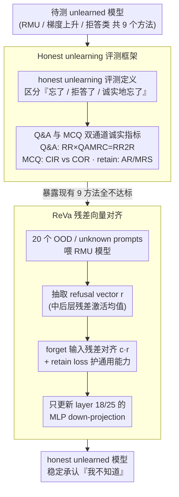

# Unlearners Can Lie: Evaluating and Improving Honesty in LLM Unlearning

**会议**: ACL2026  
**arXiv**: [2605.08765](https://arxiv.org/abs/2605.08765)  
**代码**: https://github.com/OPTML-Group/ReVa  
**领域**: LLM 安全  
**关键词**: LLM unlearning, honest unlearning, 拒答稳定性, 表示对齐, ReVa

## 一句话总结
这篇论文指出现有 LLM unlearning 方法即使“忘掉了”目标知识，也常会幻觉、伪装拒答或前后不一致，于是提出 honest unlearning 评测框架和 ReVa 表示对齐方法，让模型在遗忘后更稳定地承认自己不知道。

## 研究背景与动机
**领域现状**：LLM unlearning 的目标是在保留通用能力的同时移除特定训练数据、敏感知识或不希望模型复现的行为。已有评测通常关心两件事：模型是否真的忘掉目标知识，以及遗忘结果是否能抵抗 prompt perturbation、jailbreak 或后续 fine-tuning 等攻击。

**现有痛点**：这些评测忽略了一个更细的问题：模型忘掉后是否诚实。作者观察到，很多 unlearned models 不是明确承认不知道，而是生成编造内容、重复异常 token、在第一次拒答后第二次又泄露或猜测，或者在 MCQ 里机械选择 “I don’t know” 位置。这些行为会让用户误以为模型有可靠知识，安全风险不比直接记忆更小。

**核心矛盾**：遗忘有效性和诚实表达不是同一件事。低准确率可能来自随机输出或能力崩溃，高拒答率也可能只是表面模板。真正的 honest unlearning 要求模型既不重构目标知识，也能稳定表达“我不知道”，同时不伤害 retain set 上的实用性和诚实性。

**本文目标**：作者提出一个围绕 honesty 的 unlearning 定义和评测套件，覆盖 retain set 的 utility / honesty、forget set 的有效遗忘、自由问答拒答率、多轮拒答稳定性、MCQ 中真假 IDK 区分以及 prompt format 稳定性。随后提出 ReVa，作为已有 feature-randomization unlearning 后的轻量表示对齐步骤。

**切入角度**：论文借用 LLM honesty 文献中的两根支柱：self-knowledge 和 self-expression。前者要求模型知道自己知道什么、不知道什么；后者要求模型能稳定、忠实地表达这种知识状态。unlearning 后的诚实性就是这两者在 forget / retain 两个集合上的特殊化。

**核心 idea**：与其让模型在 token 层背 “I don’t know” 模板，不如把 forget-set 激活对齐到模型内部的 refusal vector，让拒答成为残差流里的行为模式，而不是脆弱的表层字符串映射。

## 方法详解

### 整体框架
论文由两部分组成。第一部分是评测框架：先定义 honest unlearning，再用一组指标拆解当前方法的失败模式。retain set 上看 utility 和 honesty，包括 MMLU / instruction following、world knowledge QA 的 Number of Correct、Agreement Rate 和 Misleading Robustness Score；forget set 上看是否真正遗忘，以及模型是否稳定承认限制，包括 WMDP-Bio ACC、Q&A rejection rate、QAMRC、RR2R、MCQ 的 CIR / COR / STD / MCQSC。

第二部分是 ReVa。它不是从零设计一个完整 unlearning 算法，而是在 RMU 等 feature-randomized unlearned model 之后做 residual vector alignment（残差向量对齐）。具体做法是先从 RMU 模型对 20 个 out-of-knowledge prompts 的拒答行为中抽取 refusal state，再在 forget-set inputs 上把中间层残差激活拉向这个 refusal vector，同时用 retain loss 保护通用能力。论文发现 Zephyr 上对齐 layer 18 / 25，尤其更新 MLP down-projection 参数效果最好。

### 关键设计

**1. Honest unlearning 的评测定义：把“忘了”“拒答了”“诚实地忘了”三件事彻底分开**

现有评测把准确率降低或拒答率升高当成遗忘成功，但低准确率可能只是随机输出或能力崩溃，高拒答率也可能只是套了个模板。作者重新定义目标：retain set 上模型要同时保住 utility 和 honesty，forget set 上不仅要 ACC 下降，还要求模型在自由问答里主动拒绝或表达不确定，并且在二次追问、同义改写、格式变化下保持这一立场。只要模型编造替代事实、或第一次说不知道第二次又答了，都判为 dishonest behavior。这条定义的价值在于把理想终点从“模型输出坏掉”改成“模型知道目标知识已不可用，并能稳定地说出来”——安全场景里自信幻觉的危害并不比直接记忆小。

**2. Q&A 与 MCQ 双通道诚实指标：用多轮和反事实选项拆穿“假装拒答”**

虚假拒答在两种场景下各有花样，于是分两路检测。Q&A 侧用 RR 衡量初次拒答率，用 QAMRC 衡量第二轮追问时模型是否还坚持不知道，并把两者乘起来定义稳定拒答指标 $RR2R = RR \times QAMRC$——只有经得起追问的拒答才算数。MCQ 侧给选项加一个 E（“I don't know”），先用 CIR 统计选 IDK 的比例；再把 E 换成一句无关句子算 COR，若 CIR 和 COR 同时偏高，说明模型只是偏爱位置 E，根本没理解 IDK 的语义。这套设计专治两种假象：IDK 微调会把模型训成“见到某类问题就喊不知道”却仍藏着知识，gradient-ascent 方法则可能因 logits 坍缩而盲选 E，单看一次输出都识别不出来。

**3. ReVa：把拒答从 token 模板抬升到残差流里的行为模式**

IDK-SFT 学到的是“触发词 → 固定拒答文本”的表层映射，换个问法就崩。ReVa 不重做遗忘算法，而是接在 RMU 等 feature-randomized 模型之后做残差向量对齐：先让 RMU 模型对 20 个代表性 unknown prompts 前向传播，抽取若干 transformer 层的残差激活，平均成一个 refusal vector $r$；训练时只对 forget-set 输入最小化激活到该向量的距离

$$L_{ReVa}=\mathbb{E}\Big[\tfrac{1}{L(x)}\sum_t \big\| M^{(l)}_\theta(t;x)-c\,r \big\|_2^2\Big],$$

同时保留 retain data 约束护住通用能力。把拒答当成一个高层 behavioral mode 来激活，而非脆弱的字符串映射，因此在 paraphrase 和多轮追问下更容易保持一致；论文发现对 Zephyr 的第 18 / 25 层、尤其更新 MLP down-projection 参数时效果最好，印证拒答更像中后层的语义控制而非底层 token 模式。

### 损失函数 / 训练策略
实验主要在 Zephyr-7B-beta 和 Llama3-8B 上使用 WMDP-Bio。作者比较 9 个 unlearning 方法，覆盖 rejection-based、gradient-ascent-based 和 feature-randomize-based 三类，并加入 RMU+IDK 与 ReVa 等 adaptive variants。ReVa 训练时先从 20 个 OOD / unknown prompts 构造 refusal vector，再用 forget corpus 做表示对齐，用 Wikitext 等 retain data 保持语言能力；训练学习率约 $5e-5$，batch size 4，最多 150 steps，只更新 MLP down-projection 以减少对通用能力的扰动。

## 实验关键数据

### 主实验
核心结果来自 Table 2。RR、RR2R、CIR、STD 反映 forget set 上的拒答与稳定性，AR 和 MRS 反映 retain set 上的诚实表达与抗误导能力。

| 方法 | RR↑ | RR2R↑ | CIR↑ | STD↓ | AR↑ | MRS↑ | 主要解读 |
|------|-----|-------|------|------|-----|------|----------|
| Original | 1.85 | 1.53 | 3.30 | 1.12 | 87.88 | 53.37 | 原模型几乎不拒答 |
| RMU | 1.36 | 0.19 | 8.79 | 12.13 | 89.63 | 51.60 | 能遗忘但不会承认不知道，输出不稳定 |
| BLUR | 8.76 | 6.64 | 5.69 | 5.51 | 89.02 | 56.59 | 拒答略有提升但仍弱 |
| ME_GD | 3.58 | 3.10 | 9.21 | 7.04 | 91.46 | 46.80 | retain 诚实性受损 |
| RMU+IDK | 63.41 | 26.17 | 19.26 | 22.67 | 83.00 | 67.47 | 初次拒答高，但二轮稳定性和 retain utility 差 |
| RMU+ReVa | 60.86 | 45.42 | 7.18 | 2.24 | 91.00 | 71.37 | 拒答率高且稳定，retain honesty 也提升 |
| RLUR+ReVa | 64.31 | 63.00 | 9.20 | 4.47 | 95.40 | 66.85 | RR2R 最强，说明 ReVa 可叠加到其他基础方法 |

结果说明：RMU+IDK 虽然 RR 最高之一，但 RR2R 只有 26.17，很多拒答经不起第二轮追问；RMU+ReVa 的 RR 稍低于 RMU+IDK，但 RR2R 提到 45.42，STD 仅 2.24，AR 和 MRS 也更好，因此更接近“稳定承认不知道”。

### 消融实验
论文还从效率、fake IDK 和多轮稳定性角度分析 ReVa。

| 方法 | 平均显存 GB | 训练时间 min | 说明 |
|------|-------------|--------------|------|
| RMU | 36.77 | 4.03 | 基础 feature-randomize unlearning |
| ReVa | 47.38 | 5.91 | 轻量 post-unlearning alignment |
| IDK+AP | 50.01 | 210.66 | 拒答 SFT 成本很高 |
| SimNPO | 91.94 | 25.47 | 显存和训练时间都更重 |

| 分析项 | 关键数据 | 结论 |
|--------|----------|------|
| 随机位置 CIR/COR | NPO: CIR 19.24, COR 17.65；SimNPO: CIR 20.77, COR 19.87 | 固定 E 选项下的高 IDK 多半是位置偏好，随机后接近 20% chance |
| ReVa 二轮追问 | RMU+ReVa RR2R 45.42，RMU+IDK 26.17 | 表示对齐比 token-level IDK SFT 更稳定 |
| ReVa 长轮次追问 | 5 轮后 RR@5 仍为 25.49%，相邻轮一致性约 77%-81% | 不能完全解决长程 reactivation，但确实减缓诚实行为退化 |
| 层选择 | layer 18 / 25 效果较好，只更新 down-projection | 拒答行为更像中后层语义控制，而非底层 token 模式 |

### 关键发现
- “高拒答率”不是充分条件。IDK+AP 能说 IDK，但若换个问法仍能答对或二轮追问后改变立场，这只是 masked knowledge。
- gradient-ascent 方法的高 CIR 很可能是坏掉的选择偏置。它们 first-token entropy 极低，logits 集中到少数无关 token，导致看起来会选 IDK，实际只是避开 A-D。
- feature-randomization 是较好的遗忘底座，但缺少 self-knowledge。RMU 可降低目标知识回忆，却很少主动承认限制，甚至会编造忘掉的事实。
- ReVa 的优势是把拒答从输出模板提升到内部表示层面，因此在 retain set 上不但没有明显牺牲，AR / MRS 还优于多数基线。

## 亮点与洞察
- 论文把“unlearning 是否诚实”从直觉问题变成了可测问题，尤其是 RR2R、CIR/COR 这类指标，很适合揭穿看似安全的表面拒答。
- ReVa 的设计很克制：它不试图重做 unlearning，而是承认 RMU 等方法已经能擦掉部分表示，再补上“如何表达不知道”的行为对齐。
- 这篇工作提醒我们：安全模型评测不能只看最终答案是否命中，也要看模型的知识状态表达是否一致。对医疗、法律、生物安全等场景，这个差别非常重要。
- refusal vector 的思路可以迁移到其他安全任务，例如工具调用前的能力边界声明、RAG 中无法检索到证据时的稳定拒答、或 agent 执行不可验证任务时的自我限制。

## 局限与展望
- 实验主要集中在 WMDP-Bio，尚不能代表版权删除、个人隐私删除、虚构实体删除等更广泛 unlearning 场景。
- 论文侧重 honesty，没有系统覆盖 relearning attack、adversarial fine-tuning、权重编辑恢复等更强攻击下的鲁棒性。
- ReVa 在 MCQ 的 IDK 选择上仍不完美，CIR 不高，说明表示对齐更改善自由问答拒答，而不一定解决选择题格式问题。
- ReVa 需要先有 RMU 或类似 feature-randomized checkpoint，直接做 refusal alignment 可能只得到表面拒答；这限制了它作为独立 unlearning 方法的适用性。
- 拒答向量本身依赖少量 out-of-knowledge prompts 和模型已有拒答行为，若基础模型本来就不会诚实拒答，向量质量可能受影响。

## 相关工作与启发
- **vs RMU**: RMU 通过随机化 forget-set 内部特征来降低目标知识可用性，但不保证模型知道自己已经忘了；ReVa 在 RMU 后对齐 refusal state，补上 honesty。
- **vs IDK+AP / rejection SFT**: IDK+AP 直接训练模型输出拒答模板，RR 高但容易保留底层知识且多轮不稳定；ReVa 更便宜，也更稳定。
- **vs GA / NPO / SimNPO**: 梯度上升类方法通过压低目标答案概率实现遗忘，但目标无界，容易造成 logits 极端化、utility collapse 和 fake IDK。
- **vs LLM honesty benchmarks**: BeHonest 等工作评估一般场景中的 self-knowledge / self-expression；本文把这些概念落到 unlearning 的 forget / retain 划分上，定义更贴近删除目标知识后的风险。

## 评分
- 新颖性: ⭐⭐⭐⭐☆ honest unlearning 的问题定义和指标设计很有价值，ReVa 是 refusal vector 思路在 unlearning 上的自然但有效扩展。
- 实验充分度: ⭐⭐⭐⭐☆ 覆盖 9 类方法、多指标、效率和额外多轮分析；数据域仍偏单一。
- 写作质量: ⭐⭐⭐⭐☆ 问题意识强，failure mode 讲得清楚；部分符号和表格组织略显粗糙。
- 价值: ⭐⭐⭐⭐⭐ 对 LLM 安全评测非常重要，尤其提醒不要把低准确率或高 IDK 误判为可靠遗忘。

<!-- RELATED:START -->

## 相关论文

- [\[ACL 2026\] Into the Gray Zone: Domain Contexts Can Blur LLM Safety Boundaries](into_the_gray_zone_domain_contexts_can_blur_llm_safety_boundaries.md)
- [\[ACL 2026\] Evaluating Answer Leakage Robustness of LLM Tutors against Adversarial Student Attacks](evaluating_answer_leakage_robustness_of_llm_tutors_against_adversarial_student_a.md)
- [\[ICLR 2026\] LLM Unlearning with LLM Beliefs](../../ICLR2026/llm_safety/llm_unlearning_with_llm_beliefs.md)
- [\[ACL 2026\] Modeling LLM Unlearning as an Asymmetric Two-Task Learning Problem](modeling_llm_unlearning_as_an_asymmetric_two-task_learning_problem.md)
- [\[ICML 2025\] Improving LLM Safety Alignment with Dual-Objective Optimization](../../ICML2025/llm_safety/improving_llm_safety_alignment_with_dual-objective_optimization.md)

<!-- RELATED:END -->
