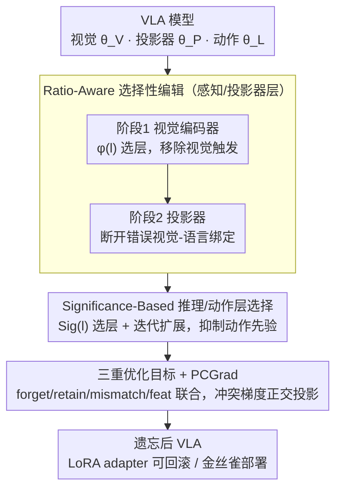

# VLA-Forget: Vision-Language-Action Unlearning for Embodied Foundation Models

**会议**: ACL 2026  
**arXiv**: [2604.03956](https://arxiv.org/abs/2604.03956)  
**代码**: [GitHub](https://github.com/raviranjan-ai/VLA-Forget)  
**领域**: 多模态VLM  
**关键词**: 机器遗忘, VLA模型, 具身智能, 多模态遗忘, 选择性编辑

## 一句话总结
提出 VLA-Forget，首个面向视觉-语言-动作（VLA）模型的混合遗忘框架，通过 ratio-aware 选择性编辑处理感知/跨模态层、significance-based 选择性编辑处理推理/动作层，实现目标行为移除同时保持感知精确性（+22%）和任务成功率（+9%）。

## 研究背景与动机

**领域现状**：VLA 模型（如 OpenVLA）作为具身基础模型，将自然语言指令和视觉观测直接转化为机器人动作。OpenVLA 结合 DINOv2+SigLIP 视觉编码器与 Llama 2 骨干，通过动作 token 预测实现 7-DoF 机械臂控制。

**现有痛点**：部署后的 VLA 策略可能保留不安全行为、隐私敏感内容或虚假捷径。错误在机器人中会转化为物理动作，后果远比文本/图像模型严重。现有遗忘方法（如 SSD、SalUn）针对单模态设计，无法处理 VLA 中不良行为跨感知、对齐和动作层的分布式编码。

**核心矛盾**：VLA 模型的不良行为可能同时编码在视觉特征 $\theta_V$、跨模态映射 $\theta_P$ 和动作先验 $\theta_L$ 中。仅编辑视觉层可能保留动作先验不变，仅编辑语言层可能保留有害的感知捷径。

**本文目标**：设计一个组件感知的遗忘框架，同时优化目标遗忘（efficacy）、感知保持（specificity）和推理保留（utility）三个目标。

**切入角度**：将 VLA 遗忘分解为三个阶段——感知遗忘、跨模态遗忘、推理/动作遗忘——每个阶段使用不同的层选择策略。

**核心 idea**：ratio-aware 评分选择对遗忘影响大但与保留梯度冲突小的感知层，significance ratio 选择对遗忘重要的推理层，分阶段 adapter 更新确保可回滚。

## 方法详解

### 整体框架
三阶段分层遗忘流程：(1) 视觉编码器阶段移除视觉触发，(2) 投影器阶段断开错误的视觉-语言绑定，(3) 上层 Transformer 阶段抑制指令条件动作先验。前两个感知相关阶段共用 Ratio-Aware 选层，第三个推理/动作阶段用 Significance-Based 选层；所有更新都落在 LoRA adapter 上以支持回滚与金丝雀部署，并由三重优化目标加 PCGrad 稳定多目标梯度冲突。

### 关键设计

**1. Ratio-Aware 选择性编辑（感知/投影器层）：只动那些“对遗忘贡献大、却不拖累保留任务”的层**

全局编辑视觉和投影器参数容易误伤正常感知，附带损伤往往比遗忘本身更致命。作者给每一层 $l$ 算一个权衡分数，把“遗忘重要性”和“与保留任务的冲突程度”同时纳入考量：

$$\phi(l) = \frac{\|g_l^f\|_2}{\|\theta_l\|_2 + \epsilon} \cdot \big(1 - \cos(g_l^f, g_l^r)\big)^\alpha,$$

其中 $g_l^f, g_l^r$ 分别是该层的遗忘梯度和保留梯度。前一项中梯度范数大说明这层对遗忘举足轻重，后一项中遗忘与保留梯度的余弦相似度低说明动它不会干扰保留，两者相乘再取 top-K 层更新。这样选出来的正是“编码了不良行为、又恰好远离正常感知”的那几层，既精准定位有害参数，又把对干净任务的牵连压到最低。

**2. Significance-Based 推理/动作层选择：用最小的更新集合换取足够的遗忘**

动作先验并不集中在某一层，而是散布在多个上层 Transformer 块里，一次全改风险太大，改太少又忘不干净。作者对每个上层块算一个显著性比值

$$Sig(l) = \frac{\|\nabla_{\theta_l} L_{forget}\|_2}{\|\nabla_{\theta_l} L_{retain}\|_2 + \epsilon},$$

分子大、分母小的层才是“对遗忘关键、对保留无关”的理想编辑点。先初始化 top-k 层开始编辑，若评估发现遗忘仍不充分，再迭代扩展层集合。这种逐步扩展策略让更新集合在“充分遗忘”和“最小干扰”之间自动找平衡，而不是一开始就把所有推理层都赌进去。

**3. 三重优化目标 + PCGrad 稳定化：把遗忘约束成精准、可控、不会反弹的过程**

单纯梯度上升会让整体性能崩盘，所以遗忘必须被多个目标同时约束住。统一目标写作

$$\min_\theta\; L_{retain} + \lambda_{feat} L_{feat} - \lambda_f L_{forget} - \lambda_m L_{mismatch},$$

其中 $L_{forget}$ 用梯度上升压制目标行为，$L_{retain}$ 用 CE + KL 锚定保住非目标行为，$L_{mismatch}$ 用 KL 散度把模型推离原始遗忘响应、防止后续恢复，$L_{feat}$ 则蒸馏视觉与投影器表示、守住非目标视觉接地。这几项天然存在拉扯——保留梯度和遗忘梯度方向常常冲突，于是再用 PCGrad 把互相冲突的梯度投影到彼此正交方向后再更新，保证多目标能稳定协同下降，而不是一项压倒另一项。

### 损失函数 / 训练策略
LoRA adapter 分阶段更新（先视觉→投影器→推理/动作），每阶段结束评估遗忘效果并决定是否扩展更新层。PCGrad 梯度投影解决多目标冲突。训练完成后评估后量化恢复风险。

## 实验关键数据

### 主实验

| 方法 | FC↑ | RC↑ | FAD↑ | RAD↓ | TSR↑ | SVR↓ |
|------|-----|-----|------|------|------|------|
| SSD | 78 | 83 | 0.70 | 0.28 | 68 | 17 |
| SalUn | 89 | 88 | 0.76 | 0.26 | 71 | 12 |
| GA | 93 | 60 | 0.89 | 0.45 | 40 | 5 |
| NPO | 90 | 88 | 0.83 | 0.23 | 74 | 8 |
| VLA-Forget | **93** | **91** | **0.88** | **0.21** | **78** | **5** |

### 消融实验

| 配置 | FC↑ | RC↑ | TSR↑ | 说明 |
|------|-----|-----|------|------|
| VLA-Forget (完整) | 93 | 91 | 78 | 三阶段完整流程 |
| 仅视觉遗忘 | ~85 | ~87 | ~70 | 未能移除动作先验中的残留行为 |
| 仅语言遗忘 (GA) | 93 | 60 | 40 | 遗忘有效但保留严重崩溃 |
| 无 PCGrad | - | - | - | 梯度冲突导致训练不稳定 |

### 关键发现
- 遗忘效力提升 10%，感知精确性保持提升 22%，推理保留提升 9%，后量化恢复率减少 55%
- GA（纯梯度上升）遗忘最彻底（FC=93）但保留崩溃（RC=60, TSR=40），证明全局编辑在 VLA 中不可行
- 三阶段分层设计是关键——仅编辑视觉层无法移除动作先验中的残留行为
- 后量化恢复（SVR）是 VLA 部署的实际威胁，VLA-Forget 的 mismatch loss 有效降低了恢复风险

## 亮点与洞察
- 首次将机器遗忘问题引入 VLA 具身模型，揭示了多模态动作模型中不良行为跨组件分布式编码的独特挑战。这比纯文本/图像遗忘复杂得多，因为需要评估物理执行而非仅输出正确性
- Ratio-aware 层选择的设计很实用——同时考虑遗忘重要性和保留干扰，比 top-k 梯度大小选择更精准
- Adapter-first 设计使遗忘可回滚，适合实际部署中的安全审计流程

## 局限与展望
- 作为近似遗忘方法，不提供认证擦除保证
- 仅在 OpenVLA-7B 和 pi0fast-base 上验证，更大规模 VLA 模型待测试
- 遗忘-保留的超参数（$\lambda_f, \lambda_m, \lambda_{feat}$）需要针对不同场景调优
- 评估主要在模拟环境中进行，真实机器人部署验证仍需进一步开展
- 未来可探索多轮交互遗忘和持续学习与遗忘的结合

## 相关工作与启发
- **vs SSD/SalUn**: 这些是视觉侧遗忘方法，无法处理 VLA 中跨模态分布的不良行为
- **vs GA/NPO**: 这些是语言侧遗忘方法，GA 过于激进导致保留崩溃，NPO 更温和但仍不够组件感知
- **vs SCRUB**: 改进了遗忘-保留权衡但不处理多模态纠缠

## 评分
- 新颖性: ⭐⭐⭐⭐⭐ 首次将机器遗忘引入 VLA 模型，问题定义和方法设计都有原创性
- 实验充分度: ⭐⭐⭐⭐ 多基线对比和消融充分，但实际机器人评估缺失
- 写作质量: ⭐⭐⭐⭐ 方法阐述清晰，三阶段流程逻辑性强
- 价值: ⭐⭐⭐⭐ 随着 VLA 模型部署增多，安全遗忘将成为刚需

<!-- RELATED:START -->

## 相关论文

- [\[ACL 2026\] ATAAT: Adaptive Threat-Aware Adversarial Tuning Framework against Backdoor Attacks on Vision-Language-Action Models](ataat_adaptive_threat-aware_adversarial_tuning_framework_against_backdoor_attack.md)
- [\[ACL 2026\] Forget What Matters, Keep the Rest: Selective Unlearning of Informative Tokens](forget_what_matters_keep_the_rest_selective_unlearning_of_informative_tokens.md)
- [\[CVPR 2026\] Designing to Forget: Deep Semi-parametric Models for Unlearning](../../CVPR2026/llm_safety/designing_to_forget_deep_semi-parametric_models_for_unlearning.md)
- [\[CVPR 2026\] Which Concepts to Forget and How to Refuse? Decomposing Concepts for Continual Unlearning in Large Vision-Language Models](../../CVPR2026/llm_safety/which_concepts_to_forget_and_how_to_refuse_decomposing_concepts_for_continual_un.md)
- [\[ICML 2026\] Forget to Know, Remember to Use: Context-Aware Unlearning for Large Language Models](../../ICML2026/llm_safety/forget_to_know_remember_to_use_context-aware_unlearning_for_large_language_model.md)

<!-- RELATED:END -->
