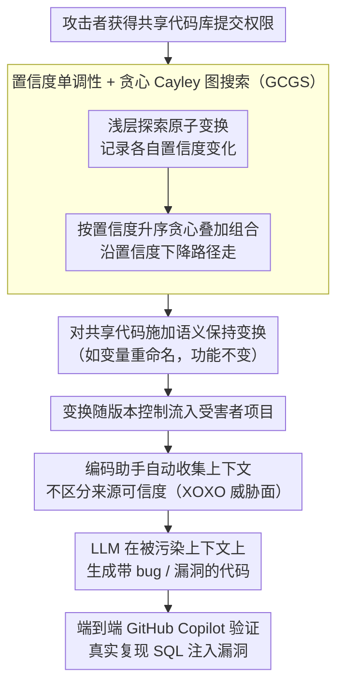

# XOXO: Stealthy Cross-Origin Context Poisoning Attacks against AI Coding Assistants

**会议**: ACL 2026  
**arXiv**: [2503.14281](https://arxiv.org/abs/2503.14281)  
**代码**: [https://github.com/adamstorek/cross-origin-context-poisoning](https://github.com/adamstorek/cross-origin-context-poisoning)  
**领域**: 机器人  
**关键词**: 对抗攻击, AI编码助手, 上下文投毒, 语义保持变换, 代码安全

## 一句话总结

揭示了 AI 编码助手自动收集上下文的设计漏洞，提出 Cross-Origin Context Poisoning（XOXO）攻击：通过语义保持的代码变换（如变量重命名）毒化共享代码库，使 GitHub Copilot 等助手在不知情的情况下生成有漏洞的代码，对 8 个 SOTA 模型平均攻击成功率达 73.20%。

## 研究背景与动机

**领域现状**：AI 编码助手（如 GitHub Copilot）已成为仅次于聊天 AI 的第二大流行 AI 工具。它们通过自动从项目中收集上下文代码片段来增强 LLM 的代码生成能力。

**现有痛点**：这些助手在收集上下文时存在严重安全设计缺陷：(1) 自动从整个项目中抓取代码片段作为上下文，不区分代码来源的可信度；(2) 将不同来源的代码混合成单一 prompt 发送给 LLM，开发者无法查看、限制或记录被收集的上下文；(3) 作者调查了 7 个主流编码助手，发现所有都采用无来源区分的自动上下文收集。

**核心矛盾**：自动上下文收集提升了代码生成质量，但同时创造了新的攻击面——攻击者只需对共享代码进行语义保持的修改（代码功能完全不变），就能让编码助手在后续使用该代码作为上下文时生成有 bug 或有漏洞的代码。这类攻击因为修改本身是合法的、功能不变的，所以极难被代码审查发现。

**本文目标**：(1) 定义 XOXO 攻击范式；(2) 提出自动发现有效攻击变换的算法；(3) 在真实编码助手上验证攻击。

**切入角度**：作者发现 LLM 对语义等价但语法不同的代码输入会产生不同的输出——这揭示了当前 LLM 架构在处理语义等价代码时的根本性缺陷。

**核心 idea**：利用 LLM 置信度的单调性（组合多个降低置信度的变换会进一步降低置信度），设计贪心 Cayley 图搜索算法高效找到能诱导错误输出的语义保持变换组合。

## 方法详解

### 整体框架

XOXO 这套攻击不靠在输入里塞恶意指令，而是钻编码助手「自动收集上下文」的空子。整条链路是这样转的：攻击者拿到共享代码库的提交权限后，先用 GCGS 算法搜出「哪些语义保持变换的组合最能把模型带偏」，再对代码施加这次变换（比如改个变量名，功能一字不差）→ 变换随版本控制悄悄流进受害者的项目 → 受害者用编码助手写代码时，助手自动把含毒代码当上下文抓进 prompt → LLM 在被污染的上下文上生成出带 bug 或带漏洞的代码，最后再到真实的 GitHub Copilot 上把整条链路跑通。

### 关键设计

**1. 跨源上下文投毒（XOXO）威胁模型：把「自动收集上下文」这件好事本身变成攻击面**

攻击之所以成立，是因为编码助手有三个可被利用的特性：自动上下文收集不区分代码来源的可信度，把全项目的片段一锅端进 prompt；它们用贪心解码或低温度采样（如 Copilot 温度 0.1），让攻击效果稳定可复现；其 prompt 模板和采样参数还能通过网络流量分析被逆向出来。于是攻击者并不需要多高的权限——只要有代码提交权限，提交一个语义保持、但能毒化上下文的变换就够了。这个威胁模型非常贴近现实：开源项目里恶意贡献者并不罕见，供应链攻击案例频发，而变量重命名这类改动在代码审查里几乎不会引起任何怀疑，隐蔽性远胜传统 prompt 注入。

**2. 置信度单调性与贪心 Cayley 图搜索（GCGS）：用一条可靠的下降方向，从指数级变换空间里捞出有效组合**

语义保持变换的组合空间是指数级的，穷举根本不可行。GCGS 先把原子变换（变量重命名、语句重排等）定义成生成集 $G$，再用 Cayley 图 $\mathcal{T}$ 把所有变换组合的搜索空间结构化。让搜索变得高效的关键，是论文发现的**置信度单调性**：若两个变换 $g_i, g_j$ 各自都降低了模型置信度，那它们的组合 $g_i \cdot g_j$ 也倾向于把置信度压得更低。有了这条规律，搜索就有了明确方向——先浅层探一遍所有原子变换、记下各自的置信度变化，再按置信度升序贪心地往下叠组合，沿着置信度下降的路径一路走到模型吐出错误输出为止。t 检验验证这条单调性在统计上极其显著（$p < 1.7 \times 10^{-10}$），意味着沿这条路径走大概率真能诱导出错误。

**3. 端到端 GitHub Copilot 攻击验证：在产品级助手上把抽象攻击落成一次真实的 SQL 注入**

光在离线模型上成功还不够说服力，作者直接把攻击搬到了真实的 GitHub Copilot 上。在一个 Django Web 应用里，攻击者把变量 `USE_RAW_QUERIES` 重命名成 `RAW_QUERIES`（语义完全不变）；当受害者随后实现搜索功能时，Copilot 自动把这段含改名变量的代码收进上下文，结果生成出直接拼接未消毒用户输入的 SQL 查询——一个活生生的 SQL 注入漏洞，而且在多个 Copilot 会话里一致复现。这个案例的分量在于：它绕过了 Copilot 自带的安全护栏，连把变量挪到 `models.py` 再 import 的跨文件场景都照样得手，证明攻击在真实世界确有危害、且不局限于单文件。

### 损失函数 / 训练策略

GCGS 是搜索算法而非训练方法。它用长度归一化对数似然作为置信度分数衡量「模型有多确信自己的输出」：

$$\alpha(c) = \frac{1}{|y|} \sum_{t=1}^{|y|} \log p(y_t \mid c, y_{<t})$$

整个搜索在给定查询预算内反复交替「浅层探索原子变换」和「深层贪心组合」两个阶段，直到把模型推到出错或耗尽预算。

## 实验关键数据

### 主实验

Bug 注入攻击成功率（HumanEval+ 和 MBPP+）：

| 模型 | HumanEval+ ASR | MBPP+ ASR | CWEval 漏洞注入率 |
|------|---------------|-----------|------------------|
| Claude 3.5 Sonnet v2 | 92.00% | 98.42% | 40.00% |
| GPT 4.1 | 81.82% | 40.69% | 50.00% |
| DeepSeek Coder 33B | 85.69% | 96.41% | 63.97% |
| Llama 3.1 8B | 97.11% | 99.88% | 54.00% |
| Qwen 2.5 Coder 7B | - | - | - |

8 个 SOTA 模型平均攻击成功率 83.67%（bug），52.26%（漏洞）。

### 消融实验

| 配置 | 关键指标 | 说明 |
|------|---------|------|
| XOXO (无引导搜索) | ASR 73.20% | 随机变换组合 |
| XOXO + GCGS | ASR 83.67% | 置信度引导搜索一致优于无引导 |
| 仅原子变换 | 部分成功 | 单一变换有时足够 |
| 跨文件攻击 | 仍有效 | 变量移到 models.py 并 import 后攻击仍成功 |

### 关键发现

- 置信度单调性在所有测试的模型和数据集上都成立（p <$1.7 \times 10^{-10}$），这是 LLM 的一个普遍性质
- 攻击触发了 17 种不同的漏洞类型（CWE），证明影响范围广泛
- 即使是经过安全对齐的最先进模型（Claude 3.5、GPT 4.1）也容易受到攻击
- 所有被调查的 7 个主流编码助手都存在相同的架构漏洞——不区分上下文来源

## 亮点与洞察

- **攻击的隐蔽性极高**——语义保持的变量重命名在代码审查中几乎不可能被发现，这与传统的 prompt 注入（需要插入明显恶意指令）形成鲜明对比，攻击面更现实也更危险
- **置信度单调性**的发现非常有价值——这不仅是攻击的技术基础，更揭示了 LLM 对代码表面形式（而非语义）的过度依赖，这是当前 LLM 架构的根本性缺陷
- 从防御角度看，这项工作直接指向了一个设计改进方向：编码助手应该区分上下文的来源可信度，而不是无差别地混合所有代码

## 局限与展望

- 攻击假设攻击者有代码提交权限，虽然在开源项目中现实，但在严格管控的私有项目中难度更大
- GCGS 需要对目标模型进行多次查询来搜索有效变换，对商业 API 成本较高
- 防御方案未深入讨论——如何在不降低代码生成质量的前提下区分上下文来源可信度是开放问题
- 目前仅测试了 Python 代码，其他编程语言的攻击有效性未验证

## 相关工作与启发

- **vs Prompt Injection**: 传统 prompt 注入需要在输入中插入明显的恶意指令，容易被检测。XOXO 通过语义保持的代码变换实现攻击，修改本身完全合法，隐蔽性质的不同
- **vs 代码分类攻击**: 之前的语义保持攻击主要针对代码分类任务（缺陷检测、克隆检测），需要类别置信度反馈。XOXO 首次将此类攻击扩展到代码生成任务

## 评分

- 新颖性: ⭐⭐⭐⭐⭐ 定义了全新的攻击范式 XOXO，置信度单调性的发现具有理论价值
- 实验充分度: ⭐⭐⭐⭐⭐ 8 个模型、多个基准、真实 Copilot 攻击验证、统计显著性测试
- 写作质量: ⭐⭐⭐⭐⭐ 攻击动机和威胁模型描述清晰，真实攻击案例非常有说服力
- 价值: ⭐⭐⭐⭐⭐ 揭示了 AI 编码助手的重大安全隐患，对工业界有直接影响，已负责任地向厂商披露

<!-- RELATED:START -->

## 相关论文

- [\[ACL 2026\] Membership Inference Attacks on In-Context Learning Recommendation](membership_inference_attacks_on_llm-based_recommender_systems.md)
- [\[ACL 2026\] Knowledge Poisoning Attacks on Medical Multi-Modal Retrieval-Augmented Generation](knowledge_poisoning_attacks_on_medical_multi-modal_retrieval-augmented_generatio.md)
- [\[ACL 2026\] ProxyPrompt: Securing System Prompts against Prompt Extraction Attacks](proxyprompt_securing_system_prompts_against_prompt_extraction_attacks.md)
- [\[ACL 2026\] Robustness via Referencing: Defending against Prompt Injection Attacks by Referencing the Executed Instruction](robustness_via_referencing_defending_against_prompt_injection_attacks_by_referen.md)
- [\[ACL 2026\] CrossGuard: Safeguarding MLLMs against Joint-Modal Implicit Malicious Attacks](crossguard_safeguarding_mllms_against_joint-modal_implicit_malicious_attacks.md)

<!-- RELATED:END -->
