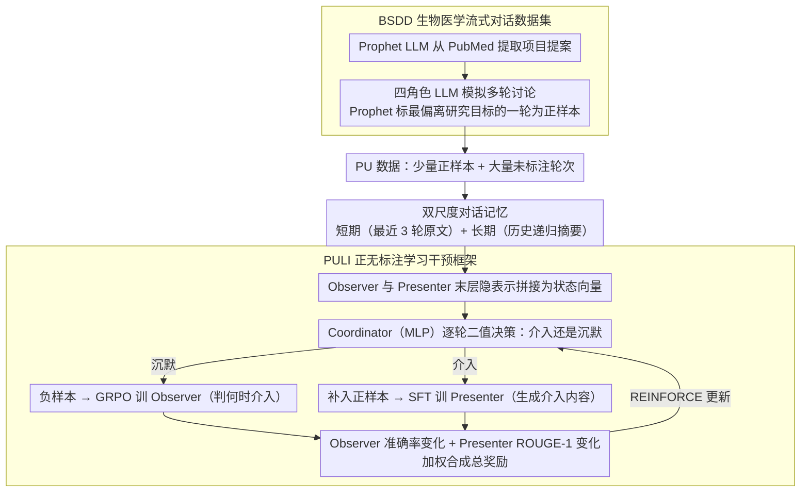

# "Excuse Me, May I Say Something…" CoLabScience: A Proactive AI Assistant for Biomedical Discovery

**会议**: ACL 2026  
**arXiv**: [2604.15588](https://arxiv.org/abs/2604.15588)  
**代码**: [https://github.com/YANGWU001/CoLabScience](https://github.com/YANGWU001/CoLabScience)  
**领域**: 医学NLP
**关键词**: 主动干预、科学协作、正无标注学习、强化学习、生物医学对话

## 一句话总结
CoLabScience 通过 PULI（正无标注学习干预）框架，训练一个能在生物医学团队讨论中**主动判断何时介入、如何介入**的 LLM 助手，利用 GRPO 和强化学习协调器从流式对话中自动识别最佳干预时机并生成科学建议。

## 研究背景与动机

**领域现状**：LLM 已广泛应用于生物医学研究，包括药物重定位、疾病诊断、临床问答等任务，但现有模型主要以"被动响应"（reactive）模式运行——只有在用户明确提问后才会回答。

**现有痛点**：在多人科学协作场景中，团队讨论往往是流式的、多角色交替进行的。被动模式下的 LLM 无法在讨论偏离目标或遗漏关键知识时及时介入，容易错失重要的科学洞察机会。

**核心矛盾**：科学协作需要"主动参与"（proactive），但现有方法要么依赖手工设计的提示规则，要么缺乏可学习的干预时机判断机制，无法做到自适应、上下文感知的介入。

**本文目标**：设计一个主动式 LLM 助手，能够：(1) 在流式科学讨论中判断**何时介入**；(2) 生成**高质量的干预内容**。

**切入角度**：将问题建模为"正无标注"（PU）学习问题——对话中仅有少量最佳干预点被标注为正样本，其余为未标注，通过强化学习协调器从中发现隐含的正负样本。

**核心 idea**：用一个轻量 Observer 判断干预时机、一个大模型 Presenter 生成干预内容，通过 RL 协调器端到端联合优化两者。

## 方法详解

### 整体框架

CoLabScience 要让一个 LLM 在多人科学讨论里学会「该不该插话、插什么话」，于是把这件事拆给三个分工明确的组件协同完成。一段流式对话进来，**Coordinator**（协调器，一个轻量 MLP）先读当前对话状态，给出二值决策——介入还是沉默；一旦决定介入，**Observer**（观察者，小型 LLM，用 GRPO 训练）负责判断「此刻是不是好时机」，**Presenter**（呈现者，大型 LLM，用 SFT 训练）负责真正生成那句科学建议。三者读到的上下文除了项目提案 $C$（研究目标、背景知识、数据集），还有一份双尺度记忆：短期记忆 $\mathcal{M}^S$ 留最近 3 轮原文，长期记忆 $\mathcal{M}^L$ 把更早的历史递归压成摘要。整套系统通过一个 RL 协调机制端到端联合优化——「何时介入」和「如何介入」两个目标互相牵引、一起训。

### 关键设计

**1. PULI 正无标注学习干预框架：把「每轮该不该插话」从昂贵的全标注问题，转成只标少量正样本的 PU 学习**

真实协作里没人能逐轮标注「这一轮 AI 该不该介入」，硬让 LLM 对每一轮做细判断又会引入大量幻觉噪声。PULI 的做法是只给每段对话标一个最偏离研究目标的轮次当正样本，其余全部视为未标注，再用强化学习把隐含的正负样本挖出来。具体地，Coordinator 为每个未标注轮次预测「介入/沉默」：被判沉默的样本当负例去训 Observer，被判介入的样本则补进正集去训 Presenter；两个模型训完后的性能变化——Observer 的准确率变化 $r^{\text{when}}$ 与 Presenter 的 ROUGE-1 变化 $r^{\text{how}}$——再作为 reward 回灌给 Coordinator，用 REINFORCE 更新。这样只需标少量高置信正样本就能驱动整个循环，既省标注又压住了幻觉风险。

**2. 双尺度对话记忆：让干预决策同时看得见眼前的语境突变和久远的研究主线**

干预时机判断既依赖即时上下文、又不能丢掉早期定下的研究目标，但把全部历史塞进去又会让内存无限膨胀。于是记忆分两尺度：短期记忆 $\mathcal{M}^S$ 只保当前轮及前两轮的原文，捕捉即时的语境变化；长期记忆 $\mathcal{M}^L$ 则由 LLM 摘要器 $\Gamma(\cdot)$ 把所有历史对话递归压缩成摘要，防止关键背景被遗忘。Coordinator 决策所依据的状态向量 $S_n$，正是由 Observer 和 Presenter 的最后隐层表示拼接而成，相当于让协调器同时读到「时机判断」和「内容生成」两路信号。

**3. BSDD 生物医学流式对话数据集：为「主动干预」这件没有现成基准的事造一套训练与评测数据**

现有生物医学对话数据集（如 MedDialog）几乎都聚焦医患问答，缺乏科学团队的多角色讨论，更没有干预时机的标注，PULI 没有现成数据可用。BSDD 用一条 LLM 流水线补上这块空白：先由 Prophet LLM 从 PubMed 论文里提取项目提案，再由 Dialogue-Simulator LLM 扮演药理学家、药物化学家、生物信息学家、临床医生四种角色进行多轮讨论，最后仍由 Prophet LLM 把最偏离研究目标的那一轮标成正干预点。这样产出的对话既有真实的科学协作形态，又自带 PULI 所需的稀疏正标签。

### 损失函数 / 训练策略

协调器的总奖励把两个目标加权合在一起：

$$r_{\text{total}} = \lambda \cdot r^{\text{when}} + (1-\lambda) \cdot r^{\text{how}}$$

取 $\lambda = 0.6$ 在干预时机与内容质量之间平衡（过小 Observer 准确率暴跌、过大则拖累 Presenter 质量）。三个组件各用各的训练方式：Coordinator 用 REINFORCE 策略梯度更新，Observer 用 GRPO 训练，Presenter 用 LoRA（rank=16, $\alpha=64$）做 SFT。

## 实验关键数据

### 主实验

| 模型配置 | 指标 | PULI | ICL | Proactive Agent |
|--------|------|------|----------|------|
| Qwen3-0.6B + Qwen3-14B | Accuracy | **64.1%** | 55.7% | 53.9% |
| Qwen3-0.6B + Qwen3-14B | F1 | **46.4%** | 28.9% | 24.5% |
| Qwen3-0.6B + Qwen3-14B | ROUGE-1 | **32.4%** | 29.4% | 27.6% |
| LLaMA3.2-1B + LLaMA3.1-8B | Accuracy | **67.4%** | 58.4% | 54.5% |
| LLaMA3.2-1B + LLaMA3.1-8B | F1 | **65.4%** | 56.7% | 60.2% |
| LLaMA3.2-1B + LLaMA3.1-8B | WR-Intra | **39.2%** | 20.8% | 7.5% |

### 消融实验

| 配置 | Accuracy | F1 | WR-Intra | 说明 |
|------|---------|------|------|------|
| PULI | **67.4%** | **65.4%** | **57.5%** | 完整模型 |
| w DPO | 64.6% | 63.1% | 31.7% | 用 DPO 替代 GRPO |
| w SFT | 61.9% | 58.6% | 6.7% | 纯 SFT Observer |
| w PN | 57.3% | 54.5% | 4.1% | 全部未标注视为负 |

### 关键发现
- PULI 在跨模型族对比中，LLaMA3 对 WR 达 45.8%，显著超过 GPT 对的 ICL（18.3%），表明小型开源模型+PULI 可超越 GPT-4o
- $\lambda=0.6$ 是最优平衡点，过小导致 Observer 准确率暴跌，过大损害 Presenter 质量
- 人类评估中 PULI 在 Timing（4.65 vs 4.36）、Quality（4.35 vs 4.18）、Helpfulness（4.60 vs 4.43）全面超越 GPT 对基线

## 亮点与洞察
- **PU 学习用于干预检测**是一个巧妙的建模选择：稀疏标注避免了让 LLM 对每一轮做细粒度判断引入的幻觉噪声，同时 RL 协调器可以自动发现未标注数据中的隐含正负样本
- **Observer-Presenter 分离架构**实现了效率与质量的平衡：轻量 Observer 实时监控，仅在需要时调用昂贵的 Presenter，适合实时协作场景
- 这种"何时行动+如何行动"的双目标 RL 框架可迁移到其他需要时机判断的任务，如教育辅导中的自动提示、会议助手的要点提醒

## 局限与展望
- 数据基于 LLM 模拟的对话，真实科学会议中的叠话、非正式推理、目标动态演变等复杂性未被完全捕获
- 每段对话仅标注一个正干预点，可能遗漏多个有价值的干预时机
- 实际部署需集成 ASR/TTS，原型引入约 0.8 秒/轮额外延迟
- 目前仅聚焦"目标偏离"型干预，未覆盖澄清误解、促进协作等多样化干预类型

## 相关工作与启发
- **vs Proactive Agent (Lu et al., 2024b)**: 后者用手工系统提示控制主动行为，PULI 通过 RL 学习自适应干预策略，准确率高 12.9%
- **vs VideoLLM-Online**: 后者在多模态流中学习叙述时机，PULI 针对文本科学对话的干预时机，目标更聚焦于科学协作

## 评分
- 新颖性: ⭐⭐⭐⭐ PU 学习+RL 协调器用于主动干预是全新组合，但数据集构建方式较为常规
- 实验充分度: ⭐⭐⭐⭐ 多模型族、多基线、人类评估、消融实验覆盖全面
- 写作质量: ⭐⭐⭐⭐ 问题定义清晰，框架图易懂，但符号系统略重

<!-- RELATED:START -->

## 相关论文

- [\[ACL 2026\] Responsible Evaluation of AI for Mental Health](responsible_evaluation_of_ai_for_mental_health.md)
- [\[ACL 2026\] Dr. Assistant: Enhancing Clinical Diagnostic Inquiry via Structured Diagnostic Reasoning Data and Reinforcement Learning](dr_assistant_enhancing_clinical_diagnostic_inquiry_via_structured_diagnostic_rea.md)
- [\[ACL 2026\] BioHiCL: Hierarchical Multi-Label Contrastive Learning for Biomedical Retrieval with MeSH Labels](biohicl_hierarchical_multi-label_contrastive_learning_for_biomedical_retrieval_w.md)
- [\[ACL 2026\] Ryze: Evidence-Enriched Data Synthesis from Biomedical Papers](ryze_evidence-enriched_data_synthesis_from_biomedical_papers.md)
- [\[ACL 2025\] One Size Fits None: Rethinking Fairness in Medical AI](../../ACL2025/medical_nlp/one_size_fits_none_rethinking_fairness_in_medical_ai.md)

<!-- RELATED:END -->
