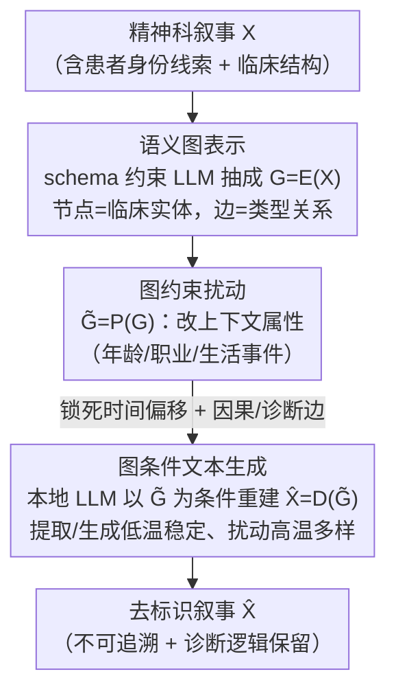

# Anonpsy: A Graph-Based Framework for Structure-Preserving De-identification of Psychiatric Narratives

**会议**: ACL 2026 Findings  
**arXiv**: [2601.13503](https://arxiv.org/abs/2601.13503)  
**代码**: 无  
**领域**: 医学NLP
**关键词**: 去标识化, 精神科叙事, 语义图, 结构保持, LLM生成

## 一句话总结

提出Anonpsy框架，将精神科叙事的去标识化重新定义为图引导的语义重写问题——先将叙事转换为语义图，在图上进行受约束的扰动以修改身份信息同时保持临床结构，最后通过图条件生成重建叙事。

## 研究背景与动机

**领域现状**：精神科叙事包含丰富的临床信息（症状时间线、因果关系、诊断逻辑），对下游诊断预测等任务至关重要，但也嵌入了大量患者身份信息。

**现有痛点**：(1) Token级PHI掩码保留临床结构但语义相似度过高，残余再识别风险大；(2) LLM-based合成数据创建（SDC）降低了可识别性但不受控地扭曲了临床结构——如将被害妄想改为夸大妄想；(3) 两种方法都将文本视为无结构序列，忽略了精神科叙事中的关系和时间依赖。

**核心矛盾**：在精神科叙事中，可识别性来源于叙事结构本身（特异性生活事件、时间线）而非仅显式标识符。需要同时修改身份信息和保持临床结构——这对文本级方法是根本性矛盾。

**本文目标**：将去标识化重新定义为结构保持的生成问题，在中间图表示上实现精细控制。

**切入角度**：将叙事转换为包含临床实体、时间锚点和类型关系的语义图，在图上进行受约束的扰动。

**核心 idea**：通过解耦事件结构和表面文本，可以在图级别精确控制哪些保留、哪些修改，再从修改后的图重新生成连贯叙事。

## 方法详解

### 整体框架

Anonpsy 要解决的核心难题是：精神科叙事的可识别性不只藏在显式标识符里，更藏在叙事结构本身——特异的生活事件、症状随时间展开的顺序，本身就能反推出是哪位患者。直接在文本序列上掩码或重写，要么改不干净（残余可追溯），要么改过头（把临床逻辑也改坏了）。它的破局思路是把去标识化挪到一个中间的图表示上做：先把叙事编码成语义图 $G = \mathcal{E}(X)$，让"事件结构"和"表面文本"解耦；然后在图上做受约束的扰动 $\tilde{G} = \mathcal{P}(G)$，只动会暴露身份的上下文属性、保住诊断需要的结构；最后再以改过的图为条件重新生成一段连贯叙事 $\hat{X} = \mathcal{D}(\tilde{G})$。三个算子全部用本地部署的 LLM 实现，无需训练。

### 关键设计

**1. 语义图表示：把叙事拆成"可编辑的结构"，解耦结构与内容**

文本级方法之所以左右为难，根子在于它把叙事当成无结构的 token 序列，没法分辨哪些字眼是身份线索、哪些是临床骨架。Anonpsy 先用一个 schema 约束的 LLM 把叙事抽成语义图：节点 $V$ 是临床实体（症状、治疗、诊断），边 $E$ 是带类型的关系（诊断依赖、因果关系、时间序列）。这一步的价值在于把"保留什么、修改什么"显式地摊在图上——人口学属性和具体生活事件落在可改的节点属性里，症状到诊断的关系则落在不可动的边上，临床人员甚至能直接检查这张图、人工干预改写范围。

**2. 图约束扰动：只改暴露身份的上下文，锁死支撑诊断的结构**

精神科诊断高度依赖症状的时间发展顺序和因果链条，这些一旦被扰动，叙事就会从"被害妄想"漂移成"夸大妄想"这种临床上完全不同的东西——这正是 LLM 直接合成（SDC）的通病。扰动算子的做法是只选择性地修改上下文属性（年龄、职业、某个具体生活事件），同时让时间偏移关系和因果/诊断边原封不动。换句话说，被改写的是"这件事发生在谁身上、是什么事"，而"症状按什么顺序出现、谁导致了谁"被严格保住，从而在消除可追溯性的同时不破坏诊断逻辑。

**3. 图条件文本生成：从改过的图重建连贯叙事，并用温度分工平衡稳定与多样**

光有改过的图还不够，还得把它变回医生读得懂的自然叙事。生成算子以 $\tilde{G}$ 为条件，用本地 LLM（gpt-oss:120b）重写出新叙事。这里有一个温度上的分工：schema 提取和叙事生成用较低温度保证稳定（图结构和成文不出幺蛾子），而扰动环节用较高温度换取多样性（避免改写千篇一律、反而留下新的模式线索）。整条管线全本地运行，是因为真实临床隐私环境通常禁止把患者数据送上云 API。

### 损失函数 / 训练策略

无需训练，三个算子（转换、扰动、生成）均通过 prompt 工程和确定性控制流实现。所有 LLM 处理在 4 块 RTX A6000 上本地运行。

## 实验关键数据

### 主实验

| 方法 | 诊断保真度(F1) | 可识别性(cosine sim) | 说明 |
|------|--------------|---------------------|------|
| PHI掩码 | 高 | 高(危险) | 结构完整但可追溯 |
| LLM-SDC | 低(语义漂移) | 低 | 安全但临床失真 |
| Anonpsy | 高 | 低 | 两者平衡 |

### 消融实验

| 配置 | 关键指标 | 说明 |
|------|---------|------|
| 无图扰动 | 可识别性高 | 结构不变则高度可追溯 |
| 无结构约束 | 诊断F1降低 | 自由重写损害临床意义 |
| 专家评估 | 低再识别风险 | 精神科医生无法追溯原始案例 |
| GPT-5评估 | 低语义相似度 | 自动化评估与人工一致 |

### 关键发现
- Anonpsy在隐私保护-临床保真度的trade-off中占据最佳位置
- 图中间表示使得"修改什么"变得透明可控
- 专家评估确认去标识后的叙事保持了原始的诊断逻辑

## 亮点与洞察
- 将去标识化从"文本处理"提升到"结构感知生成"的范式转变
- 语义图表示使临床人员可以检查和干预修改过程
- 完全本地部署保证了真实临床环境的可用性

## 局限与展望
- 仅在90个精神科案例上测试，规模较小
- 语义图的提取质量依赖LLM能力
- 目前仅针对精神科叙事，其他临床专科的适用性未验证
- 未来可扩展到多语言和更大规模的临床数据

## 相关工作与启发
- **vs PHI掩码**: 在语义层面而非token层面操作，更彻底地消除可识别信息
- **vs LLM-SDC**: 通过图约束控制重写范围，避免不受控的语义漂移
- **vs 知识图谱方法**: 不用于检索或推理，而是用于控制生成，是KG的新用途

## 评分
- 新颖性: ⭐⭐⭐⭐⭐ 图引导的去标识化是全新范式
- 实验充分度: ⭐⭐⭐ 数据规模小但评估维度全面
- 写作质量: ⭐⭐⭐⭐ 问题定义清晰，方法形式化严谨
- 价值: ⭐⭐⭐⭐⭐ 对临床NLP隐私保护有重要实际意义

<!-- RELATED:START -->

## 相关论文

- [\[ACL 2025\] RedactX: An LLM-Powered Framework for Automatic Clinical Data De-Identification](../../ACL2025/medical_nlp/redactor_an_llm-powered_framework_for_automatic_clinical_data_de-identification.md)
- [\[ACL 2026\] Reliable Automated Triage in Spanish Clinical Notes: A Hybrid Framework for Risk-Aware HIV Suspicion Identification](reliable_automated_triage_in_spanish_clinical_notes_a_hybrid_framework_for_risk-.md)
- [\[ACL 2026\] Region-Grounded Report Generation for 3D Medical Imaging: A Fine-Grained Dataset and Graph-Enhanced Framework](region-grounded_report_generation_for_3d_medical_imaging_a_fine-grained_dataset_.md)
- [\[ACL 2026\] MultiDx: A Multi-Source Knowledge Integration Framework towards Diagnostic Reasoning](multidx_a_multi-source_knowledge_integration_framework_towards_diagnostic_reason.md)
- [\[ACL 2026\] HeteroRAG: A Heterogeneous Retrieval-Augmented Generation Framework for Medical Vision Language Tasks](heterorag_a_heterogeneous_retrieval-augmented_generation_framework_for_medical_v.md)

<!-- RELATED:END -->
