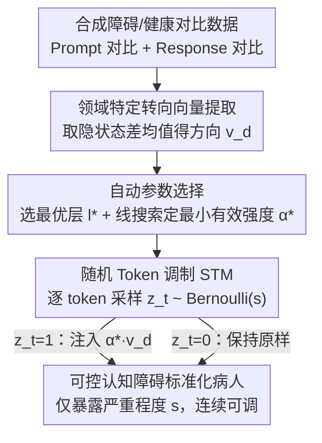

# Beyond Prompt: Fine-grained Simulation of Cognitively Impaired Standardized Patients via Stochastic Steering

**会议**: ACL 2026 Findings  
**arXiv**: [2604.12210](https://arxiv.org/abs/2604.12210)  
**代码**: 无  
**领域**: 医学NLP
**关键词**: 标准化病人模拟, 认知障碍, 转向向量, 随机调制, 临床训练

## 一句话总结
提出 StsPatient，通过从对比指令/回复对中提取领域特定的转向向量（Steering Vector），配合随机 Token 调制（STM）机制控制注入概率来模拟不同认知障碍领域和严重程度的标准化病人，相比 prompt engineering 方法在临床真实性上平均提升 11.23%，在严重程度可控性上超越最佳基线 18.54%。

## 研究背景与动机

**领域现状**：认知障碍患者（如阿尔茨海默症、轻度认知障碍）在记忆、注意力等多个认知领域表现出不同程度的缺陷，这些缺陷会显著影响其语言模式。临床工作人员需要与这类患者沟通的专门训练，传统方法依赖人类演员扮演标准化病人（SP）。

**现有痛点**：(1) 认知障碍的异质性极高——同一诊断可能表现为不同领域（注意力/记忆/执行功能等）的缺陷，且严重程度从轻度到重度不等，人类演员难以覆盖这种多样性且成本高昂；(2) 现有 LLM-based SP 方法主要依赖 prompt engineering，但 prompt 本质上是离散的、粗粒度的，无法精确控制特定认知领域的缺陷程度；(3) 传统转向向量方法通过缩放系数 $\alpha$ 控制强度，但 $\alpha$ 与行为输出的关系高度非线性且不稳定。

**核心矛盾**：需要在多个认知领域 × 多个严重程度的组合空间中实现精细、稳定、可控的模拟，但 prompt 太粗、传统转向向量太不稳定。

**本文目标**：设计一个可以 (1) 针对不同认知领域提取特定的行为调制信号，(2) 在连续的严重程度谱上稳定控制缺陷表现的框架。

**切入角度**：从生物神经科学中突触传递的概率性本质获得启发——突触强度不是由信号幅度调节，而是由神经递质释放的概率调节。类比地，不改变转向向量的幅度，而是改变其在每个 token 上的应用概率。

**核心 idea**：固定转向向量的强度（只要足够触发缺陷），用伯努利采样控制每个 token 是否注入转向向量，概率 $s$ 直接映射到严重程度。

## 方法详解

### 整体框架
StsPatient 想做的事是：让一个 LLM 在多个认知领域（注意力/记忆/执行功能）× 多档严重程度的组合里，稳定、连续、可控地扮演认知障碍患者，而不是靠 prompt 粗粒度地"演一下"。整条流程分两阶段：先在**离线**阶段为每个认知领域抽出一个领域特定的转向向量（steering vector）——用 LLM 合成"障碍 vs 健康"的对比数据，取隐状态均值之差，并自动定好注入层和强度；再在**推理时**做随机 Token 调制（Stochastic Token Modulation, STM）——固定向量强度，用伯努利（Bernoulli）采样以概率 $s$ 决定当前 token 要不要注入这个向量，$s$ 直接就是严重程度旋钮。

### 关键设计

**1. 领域特定转向向量提取：用双通道对比，抽出"某个认知领域出问题"的语言方向**

要精确模拟"记忆障碍"而不是泛泛的"病人腔"，就得先找到隐状态空间里专门编码记忆缺陷的那个方向。StsPatient 构建两种互补的对比子集：**Prompt 对比子集**是系统指令层面的对照（"扮演记忆障碍患者" vs "扮演健康人"），**Response 对比子集**是行为层面的对照（同一临床问题下，障碍回复 vs 健康回复）。把对比对喂进模型，取隐状态差的均值就得到转向向量 $\mathbf{v}_d = \text{mean}(\mathbf{h}^+ - \mathbf{h}^-)$（具体在哪一层提取、用多大强度注入，交给下面的自动参数选择决定）。双通道一起上，是因为单看指令只拿到"意图"信号、单看回复只拿到"行为表征"，两者合起来缺陷特征才完整，这也解释了消融里去掉任一通道都会掉点。

**2. 自动参数选择：把内部旋钮都藏起来，只给用户留严重程度 $s$ 一个**

传统转向向量方法要手动调缩放系数 $\alpha$、手动选注入层，门槛高也难复现。StsPatient 把这两件事都自动化：最优注入层 $l^*$ 由"最大化正负样本嵌入质心距离"自动选出——即缺陷信号最突出的那一层；强度 $\alpha^*$ 则在 $[1,6]$ 内用线搜索按"缺陷可观察 + 文本不崩坏"两个标准自动确定，确定后固定下来、推理时不再变。最终暴露给使用者的只有严重程度 $s$ 这一个语义清晰的控制量，方法因此能即插即用地挂到不同 LLM 上，无需微调。

**3. 随机 Token 调制（STM）：把控制变量从"幅度"换成"概率"，让严重程度连续可调**

传统转向向量靠缩放系数 $\alpha$ 控制强度，但 $\alpha$ 和实际行为高度非线性又不稳定——小调没反应、大调直接让模型胡言乱语，根本架不住"轻度到重度"这种连续谱的要求。STM 的灵感来自突触传递：突触强度不是靠信号幅度、而是靠神经递质释放的**概率**来调节。于是它把强度固定在上一步自动选出的 $\alpha^*$（保证缺陷可观察、又不至于崩成乱码），推理时每生成一个 token 就采样 $z_t \sim \text{Bernoulli}(s)$，只有 $z_t=1$ 时才把 $\alpha^* \cdot \mathbf{v}_d$ 注入隐状态。

$$z_t \sim \text{Bernoulli}(s), \qquad \mathbf{h}_t \leftarrow \mathbf{h}_t + z_t \cdot \alpha^* \cdot \mathbf{v}_d$$

这样严重程度 $s \in [0,1]$ 就有了直白的统计含义：$s$ 越大，被调制的 token 占比越高，缺陷越重。控制因此变得平滑可预测，实验里即便 $s=0.9$ 语言仍保持完整，而传统缩放在 $\alpha>4$ 时就频繁产出不连贯文本。

## 实验关键数据

### 主实验（GPT-5 治疗师场景，LLM + 人类评估）

| 方法 | CDC↑(LLM) | CDC↑(Human) | IDI↓(LLM) | IDI↓(Human) | Auth↑ | Tra↑ |
|------|----------|-------------|----------|-------------|-------|------|
| Direct Prompt | 0.54 | 0.68 | 0.47 | 0.42 | 3.32 | 3.40 |
| PATIENT-ψ | 0.50 | 0.60 | 0.52 | 0.48 | 3.83 | 3.96 |
| Roleplay-doh | 0.58 | 0.68 | 0.44 | 0.38 | 3.78 | 3.72 |
| **StsPatient** | **最优** | **最优** | **最优** | **最优** | **最优** | **最优** |

### 消融实验

| 配置 | 说明 |
|------|------|
| 无 STM (仅缩放 α) | 严重程度控制不稳定，高 $\alpha$ 导致输出崩溃 |
| 仅 Prompt 对比 | 缺少行为层面信息，缺陷表现不够自然 |
| 仅 Response 对比 | 缺少意图层面信号，领域特异性降低 |
| **完整 StsPatient** | 所有指标最优 |

### 关键发现
- **StsPatient 在所有指标上平均提升 11.23%**，在严重程度可控性上超越最佳基线 18.54%
- **STM 是关键**：传统缩放方法在 α>4 时经常产生不连贯输出，而 STM 即使在 s=0.9 时也保持语言完整性
- **不同认知领域的转向向量确实编码了不同的缺陷特征**：注意力缺陷向量和记忆缺陷向量在表征空间中方向明显不同
- **严重程度 s 与临床评分的对应关系是单调的**，虽然不是线性的，但满足教育模拟器的需求

## 亮点与洞察
- **从突触传递概率到 token 调制概率的类比**非常优雅——将神经科学中的控制原理迁移到 LLM 行为控制。这种"概率门控"思路可以广泛用于任何需要连续可控行为调制的场景
- **转向向量的领域特异性**证明了 LLM 的隐状态空间确实编码了不同认知领域的语言特征，这对可解释性研究也有启发
- **无需微调的推理时干预**使得方法可以即插即用到不同 LLM 上

## 局限与展望
- 严重程度 s 与标准临床评分（如 MMSE）之间的映射不是直接的线性关系
- 认知领域目前手动定义，能否自动发现认知障碍的潜在维度？
- 转向向量的稳定性依赖于合成对比数据的质量
- 仅在英文数据上验证，跨语言（如中文认知障碍患者的语言特征）有待探索
- 未与真实临床数据（如实际 AD 患者对话录音）做对比验证

## 相关工作与启发
- **vs Prompt-based SP**: prompt 是离散的粗粒度控制，StsPatient 在连续表征空间操作，控制更精细
- **vs 传统 SV 方法 (Rimsky et al.)**: 传统方法缩放 α 导致不稳定，STM 通过概率控制解决了这个核心问题
- **vs PATIENT-ψ**: 关注叙事控制但不做领域特定的缺陷模拟，StsPatient 可以精确控制"哪个领域出问题"

## 评分
- 新颖性: ⭐⭐⭐⭐⭐ STM 机制的生物启发设计非常新颖，领域特异性转向向量的应用也是首创
- 实验充分度: ⭐⭐⭐⭐ 有 LLM 和人类评估，但缺少与真实临床数据的对比
- 写作质量: ⭐⭐⭐⭐⭐ 动机和方法论述清晰，图示直观
- 价值: ⭐⭐⭐⭐ 对临床 AI 训练有实际意义，STM 方法可迁移到其他行为控制场景

<!-- RELATED:START -->

## 相关论文

- [\[ACL 2025\] LLMs Can Simulate Standardized Patients via Agent Coevolution](../../ACL2025/medical_nlp/evopatient_standardized_patient.md)
- [\[ACL 2026\] ProMedical: Hierarchical Fine-Grained Criteria Modeling for Medical LLM Alignment via Explicit Injection](promedical_hierarchical_fine-grained_criteria_modeling_for_medical_llm_alignment.md)
- [\[ACL 2026\] CT-FineBench: A Diagnostic Fidelity Benchmark for Fine-Grained Evaluation of CT Report Generation](ct-finebench_a_diagnostic_fidelity_benchmark_for_fine-grained_evaluation_of_ct_r.md)
- [\[ACL 2026\] Region-Grounded Report Generation for 3D Medical Imaging: A Fine-Grained Dataset and Graph-Enhanced Framework](region-grounded_report_generation_for_3d_medical_imaging_a_fine-grained_dataset_.md)
- [\[ACL 2026\] Beyond the Individual: Virtualizing Multi-Disciplinary Reasoning for Clinical Intake via Collaborative Agents](beyond_the_individual_virtualizing_multi-disciplinary_reasoning_for_clinical_int.md)

<!-- RELATED:END -->
