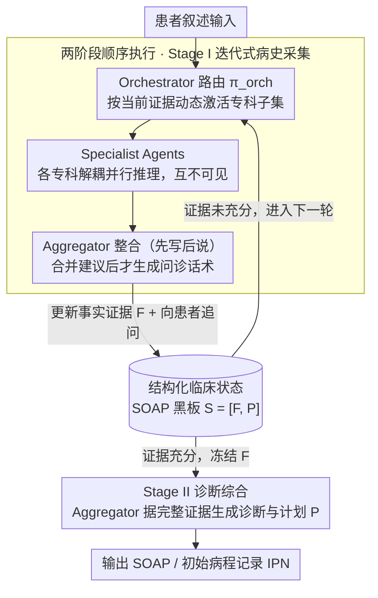

# Beyond the Individual: Virtualizing Multi-Disciplinary Reasoning for Clinical Intake via Collaborative Agents

**会议**: ACL 2026  
**arXiv**: [2604.08927](https://arxiv.org/abs/2604.08927)  
**代码**: [GitHub](https://github.com/HovChen/Aegle)  
**领域**: 医疗NLP
**关键词**: 多学科会诊, 多智能体, 临床问诊, SOAP笔记, 动态拓扑

## 一句话总结
提出 Aegle 框架，通过图结构多智能体架构虚拟化多学科会诊（MDT），将解耦并行推理和动态拓扑引入门诊问诊流程，在24个科室53项指标上超越SOTA模型。

## 研究背景与动机

**领域现状**：初诊问诊是临床决策的关键阶段，医生需将患者的非结构化叙述转化为SOAP格式的初始病程记录（IPN）。当前LLM辅助问诊主要有两类：文档生成（如Med-PaLM 2）和交互式问诊（如AMIE），但都是单模型架构。

**现有痛点**：(1) 单一医生/模型在时间压力下容易产生锚定偏差（anchoring bias），过度关注显著症状而忽略细微线索；(2) 现有交互式系统多为"被动接收者"，缺乏主动排除性提问能力；(3) 多学科会诊（MDT）虽能缓解认知偏差，但成本高、难以扩展到日常门诊。

**核心矛盾**：MDT级别的系统性推理深度与实时门诊场景的资源约束之间的矛盾。同时，多智能体系统中的"缺陷共识"问题——智能体可能互相强化偏差、压制正确的少数意见。

**本文目标**：将MDT的认知优势虚拟化，以低成本在实时门诊中实现多视角协作推理。

**切入角度**：用图结构多智能体架构模拟MDT协作——解耦并行推理保持假设多样性，动态拓扑按需激活专科智能体，SOAP结构化状态确保推理可追溯。

**核心 idea**：通过Orchestrator动态激活专科Agent、各Agent解耦并行推理、Aggregator整合输出并更新结构化临床状态的三层架构，虚拟化MDT会诊流程。

## 方法详解

### 整体框架
Aegle基于DeepSeek-V3.2构建，采用两阶段有限状态机执行问诊：Stage I为迭代式病史采集（证据收集），Stage II为诊断综合（冻结证据集后生成诊断）。全程维护一个增量更新的结构化临床状态 $\mathcal{S}_t = [\mathcal{F}_t, \mathcal{P}_t]$，其中 $\mathcal{F}$ 对应SOAP的S+O（事实证据），$\mathcal{P}$ 对应A+P（诊断与计划）。Stage I 内由 Orchestrator、Specialist Agents、Aggregator 三类节点协作循环，所有节点都读写同一块 SOAP 黑板；证据充分后才切换到 Stage II 一次性下诊断。

### 关键设计

**1. 结构化临床状态：用一块 SOAP 黑板把"收证据"和"下诊断"硬性隔开**

LLM 问诊最容易犯的错是证据还没收齐就急着抛诊断（premature commitment），结论一旦说出口很难回头。Aegle 把 SOAP 病历形式化成一块所有 Agent 共享的黑板 $\mathcal{S}_t = [\mathcal{F}_t, \mathcal{P}_t]$：其中 $\mathcal{F}$（Case Features）对应 SOAP 的 S+O，持续累积基本信息、现病史、既往史、体检结果等可验证事实；$\mathcal{P}$（Diagnosis & Plan）对应 A+P，只有等 $\mathcal{F}$ 稳定后才允许生成。框架强制 $\mathcal{F} \to \mathcal{P}$ 的单向依赖，于是任何一条诊断结论都能反查回它依据的具体证据，既防住了过早承诺，也让推理链可追溯。

**2. 动态多智能体图拓扑：按病情现场召集专科，而不是让所有专家一拥而上**

把所有科室都塞进上下文既贵又会互相干扰，真实 MDT 也是按需召集相关专家。Aegle 用三类节点协作来还原这一点：Orchestrator 充当路由策略 $\pi_{orch}$，根据对话历史和当前证据动态挑出要激活的专科子集 $A_{sub}$；被选中的 Specialist Agents 各自独立、并行地分析病例，彼此看不到对方的中间推理（解耦推理）；Aggregator 再按"先写后说"协议把各专科建议整合进状态 $\mathcal{S}_{t+1}$，然后才生成面向患者的那句话。解耦并行是这里的关键——各 Agent 保持假设多样性，避免了多智能体常见的 group think 与"缺陷共识"（少数正确意见被多数压制）。

**3. 两阶段顺序执行：把"先充分讨论再形成共识"做成显式的偏差控制闸门**

锚定偏差往往来自在证据不全时就锁死了诊断方向。Aegle 用一个两阶段有限状态机把这道闸门写死：Stage I 是迭代式病史采集，Orchestrator 反复激活专科 Agent 提追问建议、Aggregator 整合后生成下一轮问诊，循环推进直到证据充分；证据足够后才转入 Stage II，此时冻结 $\mathcal{F}$，基于完整证据集一次性生成 $\mathcal{P}$（诊断 + 治疗计划）。两阶段的物理隔离，等于把真实 MDT"先讨论清楚病情再下结论"的纪律变成了系统层面不可逾越的约束。

### 一个完整示例：一次门诊问诊怎么走

以一位主诉"突发剧烈头痛"的患者为例。Stage I 开始，黑板上的 $\mathcal{F}$ 还只有这条主诉，$\mathcal{P}$ 为空。Orchestrator 根据这条线索激活神经内科与急诊两个专科 Agent：神经内科 Agent 独立怀疑蛛网膜下腔出血、建议追问"是否伴随颈强直、意识改变"；急诊 Agent 则关注是否有高血压史与起病速度——两者并行给出建议，互不知晓对方思路。Aggregator 先把这些追问写进内部状态，再合成一句自然的问诊话发给患者。患者回答后，新证据补进 $\mathcal{F}$，进入下一轮：Orchestrator 可能据此追加眼科 Agent 排查视乳头水肿。如此往复，直到 $\mathcal{F}$ 里的事实足以支撑判断，状态机才切到 Stage II——冻结全部证据，让 Aggregator 综合各专科意见，一次性写出 $\mathcal{P}$（如"高度怀疑 SAH，建议急查头颅 CT"）。整条流程里，诊断始终落后于证据，多专科视角始终并行而不互相污染。

### 损失函数 / 训练策略
Aegle为推理框架（非训练方法），基于DeepSeek-V3.2的zero-shot能力，通过结构化prompt和角色分配实现协作。无需额外训练。

## 实验关键数据

### 主实验

| 数据集 | 指标 | Aegle | DeepSeek-V3.2 | GPT-4o | 提升 |
|--------|------|-------|---------------|--------|------|
| ClinicalBench | IDEA | 63.80 | 50.51 | 41.05 | +13.3 |
| ClinicalBench | SOAP | 53.42 | 38.64 | 29.38 | +14.8 |
| ClinicalBench | READ | 76.20 | 71.73 | 67.66 | +4.5 |
| RAPID-IPN | IDEA | 67.31 | 54.35 | 44.70 | +13.0 |
| RAPID-IPN | SOAP | 60.09 | 47.39 | 34.79 | +12.7 |
| RAPID-IPN | READ | 80.18 | 72.14 | 69.89 | +8.0 |

覆盖24个临床科室，53项细粒度指标。

### 消融实验

| 配置 | IDEA | SOAP | 说明 |
|------|------|------|------|
| Aegle (完整) | 63.80 | 53.42 | 完整框架 |
| 单Agent (DeepSeek-V3.2) | 50.51 | 38.64 | 无MDT协作 |
| MiniMax-M2 | 57.78 | 46.18 | 最强单模型baseline |

### 关键发现
- Aegle在所有53项指标上一致性地超越所有baseline，包括GPT-4o、Gemini 2.5等闭源模型
- 即使底座模型相同（DeepSeek-V3.2），多智能体框架带来了+13.3 IDEA分的提升，证明协作架构本身的价值
- 真实临床数据集RAPID-IPN上的提升更显著，说明框架在真实场景中泛化良好

## 亮点与洞察
- **解耦并行推理**：各专科Agent独立分析避免了"缺陷共识"问题，这比辩论式多智能体更安全可控。可迁移到其他需要多视角分析的场景（如法律、金融风险评估）
- **SOAP结构化状态作为共享黑板**：将临床文档标准提升为推理控制机制，不仅是记录格式，更是偏差控制工具。这种"结构即约束"的思路很有启发性
- **先写后说协议**：Aggregator先更新内部状态再生成对话，确保技术精确性与患者沟通的分离，对医疗AI的可部署性很重要

## 局限与展望
- 完全依赖DeepSeek-V3.2的zero-shot能力，未探索针对临床场景的微调
- 多Agent调用增加了推理成本（API调用次数倍增），实际部署需考虑延迟和成本
- 评估主要基于中文临床数据，跨语言和跨文化的泛化性待验证
- 未涉及影像、实验室检验等多模态信息的整合

## 相关工作与启发
- **vs AMIE**: AMIE是单模型交互式问诊，易受锚定偏差影响；Aegle通过多Agent并行推理扩展假设空间
- **vs MDAgents**: MDAgents根据任务复杂度调整拓扑，但交互仍是黑盒；Aegle通过SOAP结构化状态显式约束推理链路
- **vs MedAgents**: MedAgents用辩论式协作，可能产生缺陷共识；Aegle的解耦并行+独立推理避免了Agent间的相互干扰

## 评分
- 新颖性: ⭐⭐⭐⭐ 将MDT虚拟化的框架设计新颖，SOAP结构化状态的形式化处理有创意
- 实验充分度: ⭐⭐⭐⭐⭐ 24个科室、53项指标、ClinicalBench+真实数据集、多个SOTA baseline对比
- 写作质量: ⭐⭐⭐⭐ 框架描述清晰，但公式符号较多，部分地方可进一步简化

<!-- RELATED:START -->

## 相关论文

- [\[ACL 2026\] MARCH: Multi-Agent Radiology Clinical Hierarchy for CT Report Generation](march_multi-agent_radiology_clinical_hierarchy_for_ct_report_generation.md)
- [\[ACL 2026\] MultiDx: A Multi-Source Knowledge Integration Framework towards Diagnostic Reasoning](multidx_a_multi-source_knowledge_integration_framework_towards_diagnostic_reason.md)
- [\[ACL 2026\] Multi-View Attention Multiple-Instance Learning Enhanced by LLM Reasoning for Cognitive Distortion Detection](multi-view_attention_multiple-instance_learning_enhanced_by_llm_reasoning_for_co.md)
- [\[ACL 2026\] SEMA-RAG: A Self-Evolving Multi-Agent Retrieval-Augmented Generation Framework for Medical Reasoning](sema-rag_a_self-evolving_multi-agent_retrieval-augmented_generation_framework_fo.md)
- [\[ACL 2026\] Beyond the Leaderboard: Rethinking Medical Benchmarks for Large Language Models](beyond_the_leaderboard_rethinking_medical_benchmarks_for_large_language_models.md)

<!-- RELATED:END -->
