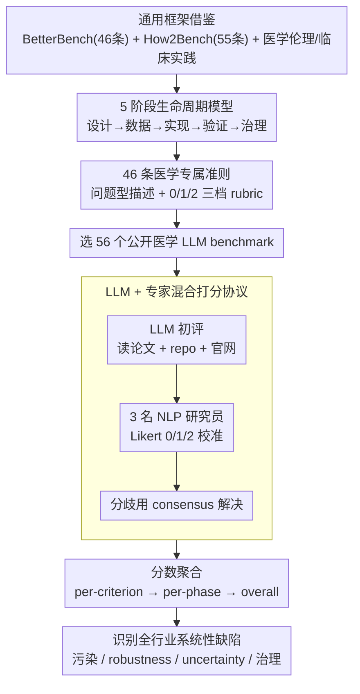

# Beyond the Leaderboard: Rethinking Medical Benchmarks for Large Language Models

**会议**: ACL 2026  
**arXiv**: [2508.04325](https://arxiv.org/abs/2508.04325)  
**代码**: 待确认  
**领域**: 医学 NLP / LLM 评测 / Benchmark 审计  
**关键词**: MedCheck, 医学 benchmark, 生命周期评估, 临床效度, 数据污染

## 一句话总结
作者提出 MedCheck——首个面向医学 LLM benchmark **生命周期**的评估框架，把 benchmark 构建拆成 5 个阶段共 46 条标准，用它对 56 个医学 benchmark 做审计，发现医学 NLP 评测领域存在 3 个系统性问题：(1) 50% 不对齐任何医学标准（ICD/SNOMED），(2) 88% 不处理数据污染，(3) 89% 不测模型 robustness、91% 不测 uncertainty——结论是当前"排行榜进步"很大程度是幻象。

## 研究背景与动机

**领域现状**：医学 LLM benchmark 在过去 3 年爆炸式增长，从 MedQA、MedMCQA 这种考试题 QA 演进到 MedHELM、AgentClinic 这种综合临床任务。但这些 benchmark 大多是 paper-driven 一次性产出——发完文章就不再维护，质量参差不齐。

**现有痛点**：作者梳理出 3 个被反复诟病但从未系统量化的问题：(1) **临床脱节**——大量 benchmark 用 close-form MCQA 测"医学知识"，但临床实际是开放式推理；(2) **数据污染**——benchmark 来源于学术资料（USMLE、教科书），LLM 预训练阶段已见，分数虚高；(3) **缺安全维度评测**——医疗场景对模型鲁棒性、不确定性表达、推理可解释性的需求极高，但绝大多数 benchmark 只看 accuracy。

**核心矛盾**：通用 AI benchmark 治理框架（BetterBench、How2Bench）虽然存在但**不适配医学领域特殊性**——医学需要专业术语、患者数据伦理、严格的安全标准。Reuel et al. 2024 的 BetterBench 框架 46 条标准全是通用，不能告诉你"这个 benchmark 是否 ICD 兼容、是否做了 HIPAA 合规、专家评审情况如何"。

**本文目标**：建立医学领域专用的**生命周期视角** benchmark 评估框架，并用它对现有 56 个 benchmark 做实证审计，回答"现在的医学 LLM benchmark 到底差在哪"。

**切入角度**：借鉴软件工程的 lifecycle 思想——benchmark 不是一次性数据集，而是工程产品，要从 design 到 governance 全周期看。

**核心 idea**：**把医学 benchmark 构建分解为 5 个连续阶段（设计→数据→实现→验证→治理），每阶段定义医学专属标准（共 46 条），对 56 个 benchmark 系统打分，识别系统性弱点**。

## 方法详解

### 整体框架
这篇论文不训练模型，做的是"造一把尺子再用它量整个行业"。它要回答的问题是：现在的医学 LLM benchmark 到底差在哪。整套方法论分三步走，像一次工程化的 systematic review：先**搭框架**——在通用 benchmark 治理框架 BetterBench（46 条通用准则）和代码 benchmark 框架 How2Bench（55 条代码准则）的底子上，结合医学伦理与临床实践，蒸馏出 46 条医学专属准则，分布在 5 个生命周期阶段；再**系统打分**——选 56 个公开医学 LLM benchmark，先用 LLM-as-judge 对论文 + repo + 官网做初评，再请 3 名有临床信息学背景的 NLP 研究员用 0/1/2 三档 Likert 校准、分歧用 consensus 解决；最后**聚合分析**——把分数从 per-criterion 汇总到 per-phase 再到 overall，识别全行业普遍存在的薄弱环节。

### 关键设计

**1. 5 阶段医学 benchmark 生命周期模型：把"benchmark 质量"这个虚概念拆成可独立审计的工序**

现有评估往往是"挑个数据集看一眼"，没有生命周期意识，所以总有维度被漏掉。借鉴软件工程把产品看作全周期工程品的思路，作者把 benchmark 构建拆成五个连续阶段：(I) **Design & Conceptualization**——评的是什么医学能力（QA / 诊断推理）、有无临床效度、医学专家是否参与；(II) **Dataset Construction & Management**——信源可追溯、隐私合规（HIPAA/GDPR）、专家审核、污染检测；(III) **Technical Implementation & Evaluation Methodology**——可复现、超越单一 accuracy、评推理过程、测 robustness / generalization / uncertainty；(IV) **Benchmark Validity & Performance Verification**——content/construct validity、判别力、与真实临床表现的相关性；(V) **Documentation, Openness, Governance**——文档、开源、licensing、维护计划、反馈渠道。把流程摊开后，问题立刻浮出水面：阶段 III 平均分仅 52.4%、全场最低，说明"评什么"比"怎么收集数据"更被忽视。

**2. 46 条医学专属评估准则：把每个阶段的抽象目标落成可重复的 yes/no 审计项**

光有五个阶段还太粗，得让每条标准都能被独立、可重复地判定。于是每条准则都写成问题型描述，配标准化的 0/1/2 三档 rubric，例如准则 #9"是否对齐 ICD、SNOMED CT、LOINC 等国际医学标准？"、#23"是否检测并处理了数据污染风险？"、#28"是否有评测模型 robustness 的实验？"、#30"是否测了模型表达不确定性的能力？"。与 BetterBench 的关键差别在于这 46 条**全部针对医学场景特化**——HIPAA、ICD、临床指南、患者安全、医生 in-the-loop 等术语贯穿其中，让审计结果对医疗从业者直接可读，而不是一堆通用 AI 黑话。

**3. LLM + 专家混合打分协议：在 2576 个单元格的工作量下同时撑住规模与可信度**

56 个 benchmark × 46 条标准等于 2576 个待评单元格，纯人工扛不住、纯 LLM 又会被幻觉和 prompt 敏感性带偏。协议的做法是分工：先让 LLM 基于论文 + code + website 做初评，再由 3 名 NLP 研究员独立审核调整，分歧通过 consensus discussion 解决，且全程只依据公开 artifacts、不做主观臆测。LLM 负责跑量、专家负责把关、Likert 三档加 consensus 兜底可信度，这是在大规模审计工程里务实又可复用的折中。

### 损失函数 / 训练策略
本文不训练模型，只做评估方法论。整体研究是"工具开发 + 实证审计"双任务，类似 systematic review。

## 实验关键数据

### 主实验：56 个医学 benchmark 在 5 个阶段的整体合规率

| 生命周期阶段 | 平均合规率 | 最严重的缺陷 |
|---|---|---|
| I. Design & Conceptualization | ~75% | 50% 不对齐 ICD/SNOMED 等医学标准；45% 不考虑安全/公平；34% 仅评 accuracy |
| II. Dataset Construction & Management | ~60% | **88% 不做数据污染处理**；66% 多样性/代表性不足；55% 无专家审核 |
| III. Technical Implementation & Evaluation Methodology | **52.4% (全场最低)** | **89% 不测 robustness**；**91% 不测 uncertainty**；48% 不评推理过程 |
| IV. Benchmark Validity & Performance Verification | ~60% | 只 54% 提供 content validity 论证；只 38% 用高真实性临床场景 |
| V. Documentation, Openness, Governance | ~65% | 39% 不指明 license；**80% 无明确维护计划**；63% 无反馈渠道 |

### 消融实验：MedCheck 揭示的典型 benchmark 缺陷（在 56 个 benchmark 中触发的比例）

| 缺陷类型 | 触发比例 | 影响 |
|---|---|---|
| 不对齐医学标准 (ICD/SNOMED/LOINC) | 50% (28/56) | 临床互操作性差 |
| 不考虑安全与公平 | 45% (25/56) | 部署风险高 |
| 仅评 accuracy 单维度 | 34% (19/56) | 完整性/可解释性缺失 |
| 未做数据污染检测/处理 | 88% (49/56) | 分数虚高，leaderboard 不可信 |
| 多样性/代表性不足 | 66% (37/56) | 边缘患者群体性能未知 |
| 不测 robustness（input perturbation） | 89% (50/56) | 模型脆弱性未知 |
| 不测 uncertainty | 91% (51/56) | 临床安全隐患 |
| 不评推理过程 | 48% (27/56) | 黑盒决策风险 |
| 无明确维护计划 | 80% (45/56) | "fire-and-forget" 不可持续 |
| 无公共反馈渠道 | 63% (35/56) | 社区无法纠错 |

### 关键发现
- **"Clinical Disconnect"是设计阶段最普遍问题**：98% 的 benchmark 都"定义了目标"，但 50% 不对齐任何医学标准，作者称这是 "academic-first, clinical-second" 心态——开发者偏向用 MedQA/MedMCQA 这种现成考试题，而不是真实临床流程。
- **数据污染危机最深**：88% 的 benchmark 完全不处理污染。即使闭源模型难以做 post-hoc 检测，开发者也可用 canary string、temporal cutoff 等**主动**手段，但几乎没人做。
- **第 III 阶段（评估方法）评分最低（52.4%）**：这是最让作者担忧的，因为 robustness、uncertainty、reasoning 三者恰好是临床可信度的核心，benchmark 不测等于行业默认这些不重要。
- **治理一塌糊涂**：80% benchmark 无维护计划。意味着 benchmark 一旦发表就是"博物馆藏品"，无法跟随模型演化更新——这是 ad-hoc paper-driven 评估生态的根源。

## 亮点与洞察
- **把 benchmark 当工程产品看 lifecycle 的思路非常对**：这是从 SE / clinical informatics 里借来的成熟视角，搬到 NLP 评估领域后立刻揭示出大量被忽视的维度（维护、反馈、licensing）。
- **"academic-first, clinical-second"这个诊断很精准**：解释了为什么医学 LLM benchmark 看起来繁荣但临床医生不买账——评测口径根本不是医生关心的口径。
- **46 条 checklist 可直接被 benchmark 作者当 todo list 用**：本文不仅审计现状，更是 actionable guideline，对未来 benchmark 设计有强引导力。
- **混合 LLM + 专家打分协议**：在 systematic review 工程上很务实，对其他大规模 benchmark / dataset 审计可复用。
- **第 III 阶段最差这个结论本身很反直觉**：大家通常以为"数据"或"transparency"是最大问题，本文用数据告诉我们"评估方法"才是黑洞——把 community 注意力从 "more data" 引向 "better metrics"。

## 局限与展望
- 作者承认：(1) 56 个 benchmark 不是 exhaustive，医学 benchmark 数量仍在快速增长；(2) 打分有一定主观性，尽管有 protocol；(3) 只看公开 artifacts，看不到内部实践；(4) MedCheck 是 snapshot，需随 AI 能力（multimodal、agentic）演进。
- 自己观察：(a) 文章是诊断为主，**没有验证 MedCheck 分数与"模型在真实临床部署中的表现"的相关性**，所以 MedCheck 高分 benchmark 是否真就更可靠仍是开放问题；(b) 46 条标准之间可能不独立，加权方案没讨论；(c) 没有对"如何用 MedCheck 设计一个示范级 benchmark"做案例研究。
- 改进思路：(a) 建一个 living repository（类似 BetterBench Stanford 的网站），benchmark 上线时即接受 MedCheck 评分，公示给社区；(b) 把 MedCheck 扩展到多模态、agentic、long-horizon clinical reasoning；(c) 加入"benchmark 与真实临床 outcome 相关性"的实证验证维度。

## 相关工作与启发
- **vs BetterBench (Reuel et al., 2024)**: BetterBench 是通用 AI benchmark 46 条标准，本文是医学专属 46 条；差异在术语、伦理、安全维度的医学深度——例如本文显式要求 HIPAA 合规、ICD/SNOMED 对齐、医学专家参与，BetterBench 没有。
- **vs How2Bench (Cao et al., 2025)**: How2Bench 是代码 benchmark 55 条 checklist，结构同源但场景不同；本文借用了 lifecycle-aware 思想。
- **vs TRIPOD-LLM (Gallifant et al., 2025)**: TRIPOD-LLM 关注 reporting standards，本文关注 construction quality，两者互补——一个管"怎么写论文"，一个管"怎么造数据集"。
- **vs Alaa et al. 2025**: 他们实证了 medical benchmark 分数与真实临床表现弱相关，本文为这一发现提供了诊断框架——告诉你为什么会这样、要补哪些维度。
- **启发**：lifecycle-aware checklist 范式可迁移到 (a) 法律 LLM benchmark、(b) 教育 LLM benchmark、(c) AI safety benchmark 审计。任何 high-stakes 领域都需要这种 engineering-grade 评估纪律。

## 评分
- 新颖性: ⭐⭐⭐⭐ 首个医学领域专属 lifecycle 评估框架，思路虽借鉴成熟领域但医学化做得到位。
- 实验充分度: ⭐⭐⭐⭐⭐ 56 个 benchmark × 46 条 × 多人评 + LLM 协议，统计扎实。
- 写作质量: ⭐⭐⭐⭐⭐ 5 阶段 → 46 条 → findings 结构清晰，每阶段都有"发现+命名"（Clinical Disconnect / Crisis of Foundational Validity 等）非常便于传播。
- 价值: ⭐⭐⭐⭐⭐ 直接服务 community，46 条 checklist 可被未来 benchmark 设计者直接采用；对 ACL/EMNLP 评审流程也是参考。

<!-- RELATED:START -->

## 相关论文

- [\[ACL 2026\] Inflated Excellence or True Performance? Rethinking Medical Diagnostic Benchmarks with Dynamic Evaluation](inflated_excellence_or_true_performance_rethinking_medical_diagnostic_benchmarks.md)
- [\[ACL 2026\] Text-Attributed Knowledge Graph Enrichment with Large Language Models for Medical Concept Representation](text-attributed_knowledge_graph_enrichment_with_large_language_models_for_medica.md)
- [\[AAAI 2026\] Measuring Stability Beyond Accuracy in Small Open-Source Medical Large Language Models for Pediatric Endocrinology](../../AAAI2026/medical_nlp/measuring_stability_beyond_accuracy_in_small_open-source_medical_large_language_.md)
- [\[ACL 2026\] RePrompT: Recurrent Prompt Tuning for Integrating Structured EHR Encoders with Large Language Models](reprompt_recurrent_prompt_tuning_for_integrating_structured_ehr_encoders_with_la.md)
- [\[ACL 2026\] MedFact: Benchmarking the Fact-Checking Capabilities of Large Language Models on Chinese Medical Texts](medfact_benchmarking_the_fact-checking_capabilities_of_large_language_models_on_.md)

<!-- RELATED:END -->
