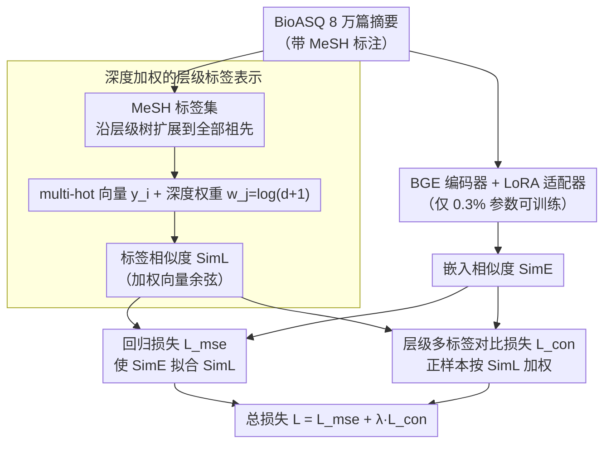

# BioHiCL: Hierarchical Multi-Label Contrastive Learning for Biomedical Retrieval with MeSH Labels

**会议**: ACL 2026  
**arXiv**: [2604.15591](https://arxiv.org/abs/2604.15591)  
**代码**: [https://github.com/MengfeiLan/BioHiCL](https://github.com/MengfeiLan/BioHiCL)  
**领域**: 医疗NLP
**关键词**: 生物医学检索、MeSH层级、对比学习、多标签、参数高效微调

## 一句话总结
BioHiCL 利用 MeSH（医学主题词）的**层级多标签标注**为稠密检索器提供结构化监督，通过深度加权的标签相似度对齐嵌入空间与 MeSH 语义空间，使 0.1B 模型在生物医学检索、句子相似度和问答任务上超越大多数专用模型。

## 研究背景与动机

**领域现状**：通用域稠密检索器（如 BGE、E5）在通用 IR 基准上表现优异，但无法捕获生物医学特有的术语和语义关系。专用的生物医学检索模型（如 MedCPT、BMRetriever）通过大规模对比学习提升了语义对齐。

**现有痛点**：现有生物医学检索模型依赖粗粒度的相关性信号——要么是二值标注（相关/不相关），要么是 query-article 点击数据。这种粗粒度信号无法捕获生物医学文本中**部分语义重叠**的复杂关系（如两篇标注为"无关"的文章实际共享疾病层级的父概念）。

**核心矛盾**：生物医学文本间的语义关系是分级的、层级化的，但训练信号是二值的——用二值信号学习分级语义关系导致检索精度受限。

**本文目标**：设计一种利用 MeSH 层级结构提供**细粒度、分级的监督信号**来适配通用检索器到生物医学领域的方法。

**切入角度**：MeSH 提供了天然的多方面监督——每篇文献有多个 MeSH 标签，标签本身形成层级树，标签重叠的程度和层级深度可以量化语义相似度。

**核心 idea**：将嵌入空间的相似度与 MeSH 深度加权标签空间的相似度对齐，用层级多标签对比学习取代二值对比学习。

## 方法详解

### 整体框架
在通用域稠密检索器 BGE 基础上，用 BioASQ 的 8 万篇带 MeSH 标注的摘要做 LoRA 微调。整个训练是一条**双路对齐**的流水线：标签路把每篇摘要的 MeSH 标签沿层级树展开、深度加权后算出"标签相似度" $\text{SimL}$，嵌入路用 BGE+LoRA 编码器算出"嵌入相似度" $\text{SimE}$，两路在两个损失里汇合——(1) 回归损失 $\mathcal{L}_{\text{mse}}$ 使 $\text{SimE}$ 拟合 $\text{SimL}$；(2) 层级对比损失 $\mathcal{L}_{\text{con}}$ 使语义相关的文档在嵌入空间中靠近、不相关的远离。

### 关键设计

**1. 深度加权的层级标签表示：把 MeSH 的树形结构压成一个可算的相似度**

二值标注里两篇文章只有"相关 / 不相关"，可生物医学文本之间往往是部分语义重叠的——两篇被标成"无关"的文章，可能在疾病层级上共享同一个父概念。BioHiCL 借 MeSH 标签把这种分级关系量化出来：先把每篇摘要的 MeSH 标签集沿层级树扩展到包含全部祖先节点，得到完整路径 $m_i^{\text{hier}}$，编码成 multi-hot 向量 $y_i \in \{0,1\}^C$。关键一步是给每个概念 $c_j$ 按深度赋权 $w_j = \log(d(c_j)+1)$，越深、越具体的概念权重越大；两篇文档的标签相似度就定义为加权向量的余弦 $\text{SimL}(k_p, k_q) = \cos(y_p \odot \mathbf{w}, y_q \odot \mathbf{w})$。这样一来，浅层标签（如"疾病"）撞上不算数，只有深层标签（如"颅内出血"）匹配才被当成真正的语义相关，监督信号自动聚焦在有意义的细粒度匹配上。

**2. 层级多标签对比损失：在拟合相似度的同时撑住嵌入空间不坍缩**

单靠一个回归损失去逼嵌入相似度拟合标签相似度，很容易把所有向量都挤到一个点上，失去判别性。对比损失负责把空间重新撑开：标签相似度 $\text{SimL} > \beta$ 的文档对算正样本、完全无标签重叠（$\text{SimL}=0$）的算负样本，并且正样本对还要按它的标签相似度加权，

$$\mathcal{L}_{\text{con}} = -\mathbb{E}_i \log\frac{\text{SimL}(k_i, k_i^+) \cdot \exp(\text{SimE}(k_i, k_i^+))}{\sum_{k_j^-} \exp(\text{SimE}(k_i, k_j^-))}$$

阈值 $\beta$ 把弱关联对滤掉以减少噪声监督。这么设计的好处是双向的：对比项靠推远不相关文档维持空间结构，而"标签相似度加权"又让真正高度相关的正样本对贡献更大的梯度，相当于把分级监督直接写进了对比目标里。

**3. LoRA 参数高效微调：用 0.3% 的参数把通用检索器搬进生物医学领域**

BioASQ 这点数据做全参数微调既容易过拟合、成本又高，还会冲掉 BGE 原有的通用语言理解。BioHiCL 改走 LoRA：冻结 BGE 全部原始权重，只在每层注入低秩适配器 $W_{\text{adapted}}^{(l)} = W^{(l)} + B^{(l)} A^{(l)}$，可训练参数仅占 0.3%。既保住了底座的通用能力，又以极低成本完成领域适配——消融里它的表现和全参数微调几乎持平。

### 损失函数 / 训练策略
总损失 $\mathcal{L} = \mathcal{L}_{\text{mse}} + \lambda \mathcal{L}_{\text{con}}$，$\lambda=0.1$，$\beta=0.3$。在 BioASQ v2022 的 8 万篇摘要上训练，TREC-CT 2022 验证集选择最优检查点。单 A100 40GB GPU 可完成训练和推理。

## 实验关键数据

### 主实验

| 任务/数据集 | 指标 | BioHiCL-Base (0.1B) | BMRetriever-1B | bge-base (0.1B) |
|--------|------|------|----------|------|
| IR Average | nDCG@10 | **0.543** | 0.531 | 0.529 |
| NFCorpus | nDCG@10 | 0.379 | 0.344 | 0.368 |
| TREC-COVID | nDCG@10 | **0.812** | 0.840 | 0.798 |
| BIOSSES | Spearman | **0.896** | 0.858 | 0.860 |
| PubMedQA | Recall@1 | 0.893 | 0.810 | 0.856 |

### 消融实验

| 配置 | IR Avg | 说明 |
|------|---------|------|
| BioHiCL-Base | **0.543** | 完整模型 |
| w/o $\mathcal{L}_{\text{con}}$ | 0.528 | 去掉对比损失，降幅最大 |
| w/o Ancestor Label | 0.538 | 不扩展祖先节点 |
| w/o $\mathcal{L}_{\text{mse}}$ | 0.537 | 去掉回归损失 |
| w/o Depth Weight | 0.541 | 不做深度加权 |
| w/o LoRA (全参数) | 0.542 | LoRA 与全参数性能相当 |

### 关键发现
- 0.1B 的 BioHiCL-Base 在 IR 平均指标上超越了 1B 的 BMRetriever，说明结构化监督信号可以弥补模型规模差距
- 对比损失是最关键的组件（去掉后 IR 平均降 0.015），验证了防止嵌入坍缩的必要性
- BMRetriever 用 BioHiCL 方法微调后性能严重下降（0.501→0.279），因为替换原始指令式训练目标破坏了其检索特化的嵌入几何
- LoRA 仅用 0.3% 参数达到全参数微调相当的性能，验证了参数高效方法在领域适配中的有效性

## 亮点与洞察
- **利用 MeSH 层级结构作为分级监督信号**是非常自然且有效的设计：MeSH 是专家维护的标准化词表，天然提供了文档间语义关系的精确度量。这种"借用现有结构化知识做监督"的思路可迁移到任何有层级标签体系的领域（如法律条文分类、产品分类）
- **深度加权的标签相似度**以极简方式（一行公式 $w_j = \log(d(c_j)+1)$）编码了"具体概念比抽象概念更重要"的领域直觉
- 0.1B 模型的极高效率使其适合大规模实际部署，这在 BMRetriever/MedCPT 等需要 1B+ 参数的系统面前具有明显的实用优势

## 局限与展望
- 仅在 BioASQ 的 8 万篇摘要上训练，数据规模远小于 MedCPT（click 数据）和 BMRetriever（多任务数据）
- MeSH 标注的覆盖范围和粒度受限于 NLM 维护的标签集，新兴概念可能缺乏
- 未探索将 MeSH 层级信息与指令式训练（instruction-based retrieval）结合的可能性
- SCIDOCS 上的提升有限（0.215→0.225），跨领域泛化仍需改进

## 相关工作与启发
- **vs MedCPT (Jin et al., 2023)**: 后者用 query-article 点击做对比学习，BioHiCL 用 MeSH 层级提供更细粒度的监督信号
- **vs BMRetriever (Xu et al., 2024)**: 后者用大规模多任务训练 1B 模型，BioHiCL 仅用 0.1B + MeSH 监督达到同等性能，效率更高
- **vs BiCA (Sinha et al., 2025)**: 后者做生物医学适配但未利用层级标签结构，BioHiCL 补充了层级维度

## 评分
- 新颖性: ⭐⭐⭐ MeSH 监督的对比学习是自然的组合，但核心想法不算出人意料
- 实验充分度: ⭐⭐⭐⭐ 多任务评估（IR+相似度+QA）、详细消融、效率分析，覆盖全面
- 写作质量: ⭐⭐⭐⭐ 方法描述清晰简洁，但 Related Work 略薄

<!-- RELATED:START -->

## 相关论文

- [\[AAAI 2026\] Learning Cell-Aware Hierarchical Multi-Modal Representations for Robust Molecular Modeling](../../AAAI2026/medical_nlp/learning_cell-aware_hierarchical_multi-modal_representations.md)
- [\[ACL 2026\] Multi-View Attention Multiple-Instance Learning Enhanced by LLM Reasoning for Cognitive Distortion Detection](multi-view_attention_multiple-instance_learning_enhanced_by_llm_reasoning_for_co.md)
- [\[ACL 2026\] SEMA-RAG: A Self-Evolving Multi-Agent Retrieval-Augmented Generation Framework for Medical Reasoning](sema-rag_a_self-evolving_multi-agent_retrieval-augmented_generation_framework_fo.md)
- [\[ACL 2026\] ProMedical: Hierarchical Fine-Grained Criteria Modeling for Medical LLM Alignment via Explicit Injection](promedical_hierarchical_fine-grained_criteria_modeling_for_medical_llm_alignment.md)
- [\[ACL 2026\] RADS: Reinforcement Learning-Based Sample Selection Improves Transfer Learning in Low-resource and Imbalanced Clinical Settings](rads_reinforcement_learning-based_sample_selection_improves_transfer_learning_in.md)

<!-- RELATED:END -->
