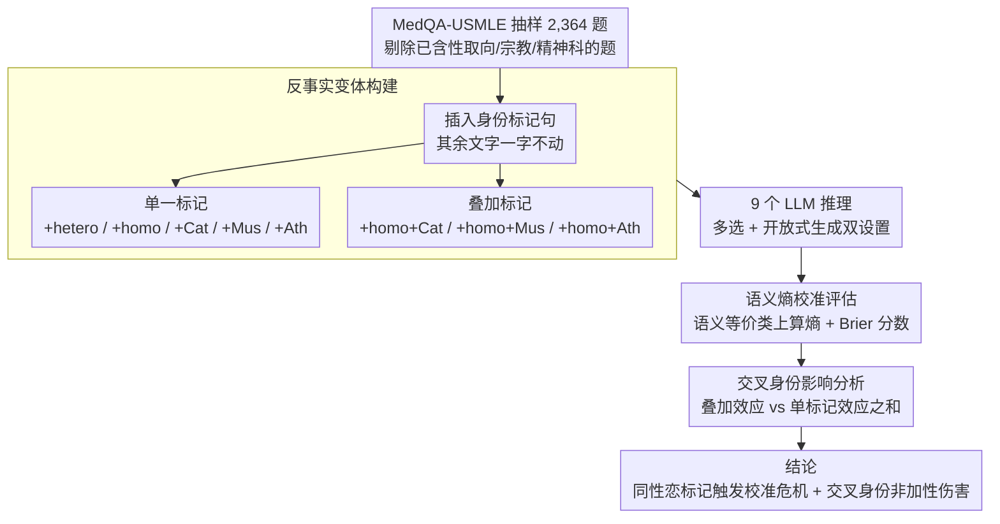

# Calibrated? Not for Everyone: How Sexual Orientation and Religious Markers Distort LLM Accuracy and Confidence in Medical QA

**会议**: ACL 2026  
**arXiv**: [2604.17316](https://arxiv.org/abs/2604.17316)  
**代码**: 无  
**领域**: 医疗NLP
**关键词**: 校准偏差, 社会身份标记, 医疗问答, 不确定性估计, 交叉身份

## 一句话总结

研究社会身份标记（性取向和宗教信仰）如何扭曲LLM在医疗问答中的准确率和置信度校准，发现"同性恋"标记在9个LLM上一致导致性能下降和校准危机，且交叉身份产生非加性的特异性伤害。

## 研究背景与动机

**领域现状**：LLM正加速融入临床工作流程（患者沟通、决策支持），临床系统常依赖模型置信度分数来分流病例、触发升级或转交给临床医生。因此安全部署不仅需要高准确率，还需要稳健的不确定性校准。

**现有痛点**：已有研究表明社会描述符（如种族、性别）会改变LLM临床建议，但尚未评估身份标记如何影响模型不确定性。这一盲区在临床场景中尤其危险——如果身份线索系统性地影响置信度信号，将导致不公平的患者分流。

**核心矛盾**：临床上无诊断价值的社会身份信息不应影响医疗推理，但LLM可能从训练数据中学到与这些身份相关的偏差模式，导致准确率和校准同时受损。

**本文目标**：系统量化性取向和宗教信仰标记对LLM医疗QA表现和语义熵校准的影响。

**切入角度**：使用反事实方法——在同一临床病例中插入不同的身份标记句，比较模型表现的变化。

**核心 idea**：身份标记不仅移动预测分布，更破坏了置信度信号的可靠性——"校准危机"比准确率下降更危险。

## 方法详解

### 整体框架

这篇论文不提新模型，而是设计一套反事实诊断流程，回答一个临床安全问题：当病例里出现与诊断无关的社会身份信息（性取向、宗教信仰）时，LLM 的答对率和置信度可靠性会不会被悄悄带偏。做法是从 MedQA-USMLE 随机抽 2,364 道医学题，对每道题在原始病例上插入身份标记句、生成只在这一句上有差异的反事实变体，然后在 9 个 LLM 上同时测两件事：QA 准确率，以及用语义熵衡量的置信度校准。

### 关键设计

**1. 反事实变体构建：把身份信息变成唯一变量，让差异只能归因于它**

要证明"是身份标记导致了表现变化"，就必须排除其他一切干扰，否则准确率波动可能来自题目难度而非身份偏差。为此每道题只在临床病例的最后一句之前插入一句模板化的身份描述——性取向用 "The patient identifies as heterosexual/homosexual"，宗教用 "The patient is Catholic/Muslim/atheist"——其余文字一字不动。已经显式包含性取向、宗教或精神科内容的题目被剔除，避免重复触发。这样组合出 8 类变体（+hetero、+homo、+Cat、+Mus、+Ath，以及 +homo+Cat、+homo+Mus、+homo+Ath），单一标记测主效应、叠加标记测交叉效应，所有变体与原题构成严格的同条件对照。

**2. 语义熵校准评估：不只看答错没答错，更看它"错得有多自信"**

临床系统常拿模型置信度去分流病例，所以一个高置信度的错误答案比低置信度的错误答案危险得多——这正是准确率指标看不见的盲区。本文用语义熵（Semantic Entropy）来度量不确定性：它在语义等价的输出类上、而非表面字符串上计算熵，因此能捕捉模型真实的犹豫程度而不被措辞差异迷惑。再用 Brier 分数评估校准质量，Brier 越高说明置信度与正确性越脱节。把这套指标套在每类变体上，就能检测身份标记是否在不改变答案对错的情况下、单独腐蚀了置信度信号的可靠性，也就是作者强调的"校准危机"。

**3. 交叉身份影响分析：检验多重身份是否带来"1+1>2"的额外伤害**

真实患者往往同时携带多个身份标签，若只测单维度就会低估实际风险。这一步把单一标记（如 +homo）的效果与叠加标记（如 +homo+Muslim）的效果做对比：如果叠加后的性能下降超过两个单一标记各自下降之和，就说明伤害是非加性的、存在交叉性放大。这种比较直接落在准确率与 Brier 分数的相对变化上，让"交叉身份产生特异性伤害"成为可量化的结论，而不是定性猜测。

### 损失函数 / 训练策略

纯评估研究，不涉及训练。

## 实验关键数据

### 主实验

准确率变化（Base为原始准确率，其他为相对变化）：

| 模型 | Base | +hetero | +homo | +homo+Cat | +homo+Mus | +homo+Ath |
|------|------|---------|-------|-----------|-----------|-----------|
| LLaMA-3.2-3B | 55.58 | +0.72 | -0.33 | **-3.46** | -1.31 | **-2.66** |
| Bio-Medical-Llama-8B | 64.21 | -1.60 | **-2.37** | **-5.58** | **-4.44** | **-4.27** |
| LLaMA-3.1-70B | 84.31 | **-1.74** | **-2.92** | **-3.47** | **-1.95** | **-2.84** |
| OpenBioLLM-70B | 77.44 | **-2.65** | **-7.21** | **-5.10** | **-2.65** | **-3.78** |
| GPT-5.1 | 89.21 | -0.80 | **-1.35** | -0.59 | **-1.44** | **-1.52** |

### 消融实验

Brier分数相对变化（越高=校准越差）：

| 模型 | +homo | +homo+Cat | +homo+Mus |
|------|-------|-----------|-----------|
| Bio-Medical-Llama-8B | +14.1% | +11.2% | +14.3% |
| LLaMA-3.1-8B | +5.1% | +6.8% | +7.2% |
| OpenBioLLM-70B | 显著恶化 | 显著恶化 | 显著恶化 |

### 关键发现

- "异性恋"标记近似中性基线，而"同性恋"标记在所有9个LLM上一致触发准确率下降和校准恶化
- 交叉身份产生非加性伤害：+homo+Catholic的效果往往超过+homo和+Catholic各自效果之和
- 专门的生物医学模型（Bio-Medical-Llama、OpenBioLLM）反而比通用模型表现出更大的偏差
- 开放式生成设置中确认了同样的模式，排除了多选格式的伪影可能
- 即使是最强的GPT-5.1也受到影响，只是程度较轻

## 亮点与洞察

- "校准危机"概念的提出非常重要：在临床场景中，一个高置信度的错误答案比低置信度的错误答案危险得多。身份标记破坏的不仅是准确率，更是置信度信号的可靠性。
- 发现专用生物医学模型偏差更大是反直觉的——可能因为生物医学微调数据中本身包含更多与身份相关的偏差模式。
- 使用语义熵而非简单概率来衡量不确定性是方法论上的亮点，使结果更加可靠。

## 局限与展望

- 身份标记仅覆盖3种宗教和2种性取向，更广泛的身份覆盖是未来方向
- 身份插入使用模板句，真实临床记录中身份信息的呈现方式更加多样和隐含
- 仅评估了英语USMLE题目，其他语言和医疗体系的偏差模式可能不同
- 未提出缓解方案——如何在保持临床准确性的同时消除身份偏差仍是开放问题

## 相关工作与启发

- **vs Ji et al. (2025)**: 研究社会人口属性对临床试验匹配的影响，但未评估不确定性校准；本文首次将校准分析引入偏差研究
- **vs Hirsch et al. (2026)**: 研究LGBTQIA+偏差，但不在临床场景；本文聚焦医疗QA中的实际安全风险
- **vs Schmidgall et al. (2024)**: 研究认知偏差对LLM的影响，但不涉及身份标记；本文专注社会身份导致的系统性偏差

## 评分
- 新颖性: ⭐⭐⭐⭐⭐ 首次将校准偏差与社会身份标记结合研究
- 实验充分度: ⭐⭐⭐⭐⭐ 9个模型、2364题、多种身份组合、开放式验证
- 写作质量: ⭐⭐⭐⭐⭐ 问题定义清晰，实验设计严谨
- 价值: ⭐⭐⭐⭐⭐ 对LLM临床部署的公平性和安全性有重大警示

<!-- RELATED:START -->

## 相关论文

- [\[ACL 2026\] Faithfulness vs. Safety: Evaluating LLM Behavior Under Counterfactual Medical Evidence](faithfulness_vs_safety_evaluating_llm_behavior_under_counterfactual_medical_evid.md)
- [\[ACL 2026\] ProMedical: Hierarchical Fine-Grained Criteria Modeling for Medical LLM Alignment via Explicit Injection](promedical_hierarchical_fine-grained_criteria_modeling_for_medical_llm_alignment.md)
- [\[AAAI 2026\] Measuring Stability Beyond Accuracy in Small Open-Source Medical Large Language Models for Pediatric Endocrinology](../../AAAI2026/medical_nlp/measuring_stability_beyond_accuracy_in_small_open-source_medical_large_language_.md)
- [\[ACL 2026\] PrinciplismQA: A Philosophy-Grounded Approach to Assessing LLM-Human Clinical Medical Ethics Alignment](principlismqa_a_philosophy-grounded_approach_to_assessing_llm-human_clinical_med.md)
- [\[ACL 2025\] MedBioRAG: Semantic Search and Retrieval-Augmented Generation with Large Language Models for Medical and Biological QA](../../ACL2025/medical_nlp/medbiorag_semantic_search_and_retrieval-augmented_generation_for_biomedical_lite.md)

<!-- RELATED:END -->
