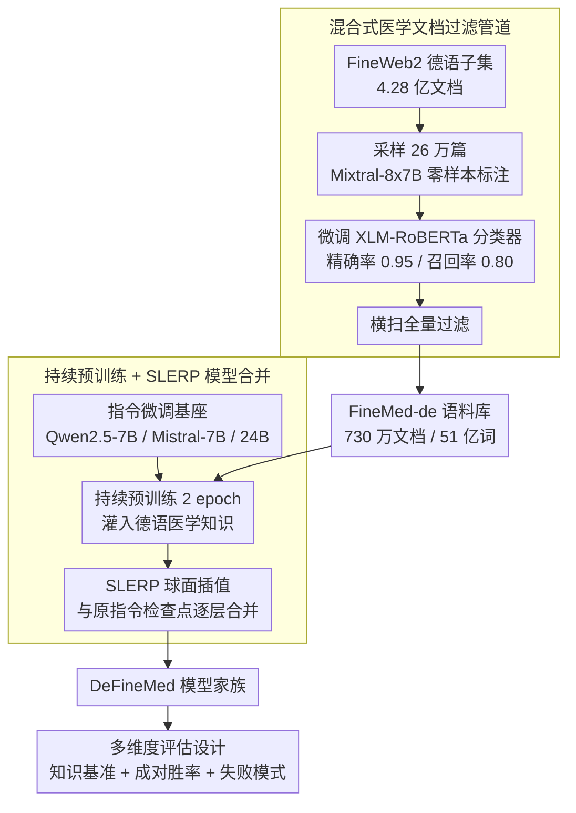

# Can Continual Pre-training Bridge the Performance Gap between General-purpose and Specialized Language Models in the Medical Domain?

**会议**: ACL 2026  
**arXiv**: [2604.19394](https://arxiv.org/abs/2604.19394)  
**代码**: 无  
**领域**: 医学NLP
**关键词**: 持续预训练, 领域适应, 德语医学LLM, 模型合并, 数据过滤

## 一句话总结

本文通过构建高质量德语医学语料库 FineMed-de（从 FineWeb2 过滤 730 万文档/51 亿词），对三种 LLM（7B-24B）进行持续预训练和 SLERP 模型合并，创建 DeFineMed 模型家族，证明领域特化的 7B 模型可以在德语医学任务上显著缩小与 24B 通用模型的性能差距（胜率提升约 3.5 倍）。

## 研究背景与动机

**领域现状**：LLM 在医疗领域展现了变革性潜力，但将其整合到临床工作流程中仍面临挑战。通用模型通常无法以足够的准确度捕捉领域特定知识和术语。

**现有痛点**：(1) 严格的数据保护法规要求本地部署，使大规模 API 服务不可行，偏好更小的模型；(2) 小模型缺乏领域特定数据支撑，难以处理复杂的医学术语；(3) 非英语（特别是德语）的高质量医学数据稀缺。

**核心矛盾**：法规约束要求使用小模型，但小模型需要针对性的领域知识才能达到临床可用的性能水平——这形成了合规性与性能之间的关键权衡。

**本文目标**：通过持续预训练和模型合并进行领域适应，使 7B 模型在复杂医学任务上能与 24B 通用模型竞争。

**切入角度**：构建一套从数据过滤到模型适应的完整方法论，结合 LLM 辅助标注和经典 ML 分类器实现可扩展的数据筛选。

**核心 idea**：高质量领域数据 + 持续预训练 + 模型合并可以使资源高效的小模型成为复杂医学任务的竞争性解决方案。

## 方法详解

### 整体框架

方法分为两大部分：(1) **医学过滤管道**——使用 Mixtral 对 FineWeb2 德语子集进行零样本标注，训练 XLM-RoBERTa 分类器扩展到全量数据，得到 FineMed-de 语料库；(2) **模型适应**——对指令微调模型进行持续预训练，然后使用 SLERP 与原始指令微调检查点合并以恢复指令跟随能力。最后用多维度评估检验 DeFineMed 是否真能缩小与大模型的差距。

### 关键设计

**1. 混合式医学文档过滤管道：用 LLM 的标注质量喂养经典分类器的吞吐量**

德语高质量医学语料稀缺，而 FineWeb2 德语子集握着 4.28 亿文档的原始矿藏，难点是怎么以可承受的成本把"医学"那一小撮淘出来——直接用大模型逐篇判别质量够好但跑全量烧不起，纯关键词又会把"医学新闻"和"临床指南"混为一谈。本文走两段式：先从全量采样 26 万文档，让 Mixtral-8x7B 做零样本医学/非医学二分类（人工抽检 F1=91.1%），把这批高质量标注当作训练信号去微调一个 279M 的 XLM-RoBERTa 分类器（精确率 0.95、召回率 0.80）；再用这个轻量分类器横扫全部 4.28 亿文档，最终筛出 730 万篇医学文档、51 亿词，命名为 FineMed-de。LLM 负责"定义什么是医学"，小分类器负责"把这个定义廉价地铺到全量"，两者各取所长，既要到了标注质量，又压住了全量过滤的成本。

**2. 持续预训练 + SLERP 模型合并：先灌知识，再把被冲掉的指令能力插值回来**

直接在领域语料上持续预训练有个老毛病：next-token 目标会侵蚀指令微调阶段建立起来的对话与跟随能力，出现灾难性遗忘。本文的做法是先在 FineMed-de 上对指令微调模型做 2 epoch 持续预训练（FSDP + Flash Attention + 混合精度），把德语医学知识灌进去；再用 SLERP（球面线性插值）把预训练后的权重与原始指令微调检查点按层逐层插值合并。SLERP 不需要任何额外微调，就能在"新注入的领域知识"和"原有指令跟随能力"之间找回平衡点，相当于用一次几乎零成本的权重融合，把持续预训练顺手丢掉的对话能力捞回来。三种基座 Qwen2.5-7B、Mistral-7B、Mistral-Small-24B 都走这套流程，得到 DeFineMed 模型家族。

**3. 多维度评估设计：用三类互补探针，避免单一基准掩盖真实差距**

领域适应到底带来了什么、又付出了什么代价，单看一个准确率数字看不清。本文把评估拆成三根正交的轴：知识密集型基准（MMLU-de 医学子集 + MedQA-de）量"记住了多少医学知识"；成对胜率分析（pairwise win-rate）量"复杂医学指令到底跟得好不好"，这是 7B 能否真正叫板 24B 的关键证据；失败模式分析则专门盯副作用——SLERP 合并恢复了指令能力，却也引入了德英语言混合、回答冗长等问题，只有显式去量这些代价，才能给"7B 竞争 24B"这个结论划出一条诚实的边界。

### 损失函数 / 训练策略

持续预训练使用标准语言建模目标（next token prediction），AdamW 优化器，线性学习率衰减，500 步 warmup。使用 FSDP、Flash Attention、激活检查点和序列打包优化训练效率。

## 实验关键数据

### 主实验

**德语医学基准平均准确率**

| 模型 | 平均准确率 |
|------|----------|
| BioMistral-7B (基线) | 43.55 |
| BioMistral-7B-SLERP | 48.22 |
| Mistral-7B-Instruct | 49.73 |
| DeFineMed-Mistral-7B-SLERP | **56.46** |
| Qwen2.5-7B-Instruct | 59.08 |
| DeFineMed-Qwen2.5-7B | **64.91** |

### 消融实验

- 基于 Qwen2.5 的 DeFineMed 7B 模型在成对胜率分析中对 Mistral-Small-24B-Instruct 的胜率提升约 3.5 倍
- 模型合并（SLERP）成功恢复了指令跟随能力，但引入了语言混合（德英混杂）和冗长度增加等副作用
- 持续预训练对 Qwen2.5 基础模型的提升（+5.83）大于对 Mistral 模型的提升（+6.73），但两者均显著

### 关键发现

- 持续预训练 + 模型合并可以使 7B 模型在德语医学任务上接近甚至竞争 24B 模型
- 数据质量比数据规模更重要——精心过滤的 51 亿词语料库足以实现显著提升
- 模型合并在恢复指令跟随能力方面有效，但存在语言混合等固有权衡
- 基础模型的选择对最终效果有重大影响（Qwen2.5 > Mistral）

## 亮点与洞察

- 混合式数据过滤管道（LLM 标注 + ML 分类器）实用且可复制到其他领域/语言
- "7B 竞争 24B"的结论对资源受限的临床场景有重要实践意义
- 失败模式分析（语言混合、冗长度）提供了诚实的权衡评估
- 方法论可直接推广到其他非英语语言的医学 LLM 开发

## 局限与展望

- 仅针对德语，未扩展到其他语言
- 语言混合和冗长度问题需要后续的针对性微调解决
- 持续预训练与指令微调的最优顺序仍是开放问题
- 未在真实临床场景中验证模型的可用性

## 相关工作与启发

- 与 BioMistral 相比，本文不仅追求基准分数提升，更关注小模型对大模型的竞争力
- Apollo-2 采用指令微调路线，而本文采用持续预训练路线，两者互补
- SLERP 在医学领域的有效性进一步得到验证

## 评分

- 新颖性: ⭐⭐⭐ 方法组件均为已知技术，但针对德语医学场景的组合应用有价值
- 实验充分度: ⭐⭐⭐⭐ 多基准、胜率分析、失败模式分析三维度评估完整
- 写作质量: ⭐⭐⭐⭐ 结构清晰，实验设计合理

<!-- RELATED:START -->

## 相关论文

- [\[ACL 2026\] Beyond the Leaderboard: Rethinking Medical Benchmarks for Large Language Models](beyond_the_leaderboard_rethinking_medical_benchmarks_for_large_language_models.md)
- [\[ACL 2026\] Inflated Excellence or True Performance? Rethinking Medical Diagnostic Benchmarks with Dynamic Evaluation](inflated_excellence_or_true_performance_rethinking_medical_diagnostic_benchmarks.md)
- [\[ICLR 2026\] SimpleToM: Exposing the Gap between Explicit ToM Inference and Implicit ToM Application in LLMs](../../ICLR2026/medical_nlp/simpletom_exposing_the_gap_between_explicit_tom_inference_and_implicit_tom_appli.md)
- [\[ACL 2026\] Text-Attributed Knowledge Graph Enrichment with Large Language Models for Medical Concept Representation](text-attributed_knowledge_graph_enrichment_with_large_language_models_for_medica.md)
- [\[ACL 2026\] MedFact: Benchmarking the Fact-Checking Capabilities of Large Language Models on Chinese Medical Texts](medfact_benchmarking_the_fact-checking_capabilities_of_large_language_models_on_.md)

<!-- RELATED:END -->
