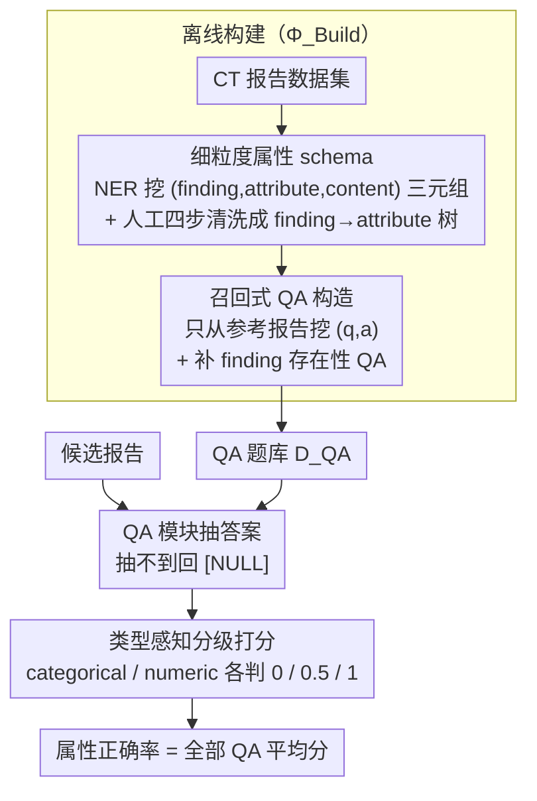

# CT-FineBench: A Diagnostic Fidelity Benchmark for Fine-Grained Evaluation of CT Report Generation

**会议**: ACL 2026  
**arXiv**: [2604.24001](https://arxiv.org/abs/2604.24001)  
**代码**: 暂未公布  
**领域**: 医学NLP
**关键词**: CT 报告生成、细粒度评测、QA-based metric、临床属性、CT-RATE、Merlin

## 一句话总结
作者把"CT 报告好不好"这个模糊问题，拆成"每个 finding 的每条细粒度属性是否对得上"的 QA 检查清单，构建出 44k 题的 CT-FineBench 基准，对临床错误的敏感度和与人类专家打分的相关性都显著超过 BLEU/BERTScore/RadGraph/RaTEScore/GREEN 等已有指标。

## 研究背景与动机
**领域现状**：放射学报告自动生成（特别是 3D CT 报告）的评测目前主要走三条路——基于词汇重叠的 BLEU/ROUGE、基于 embedding 的 BERTScore，以及更"医学感知"的实体级指标（CheXbert F1、RadGraph、RaTEScore）和 LLM-as-Judge（GREEN）。

**现有痛点**：第一类指标只看字面相似度，会给"文风像但临床完全错"的报告打高分；第二类只比对粗粒度实体（如"肺结节"是否提到），却忽略真正决定诊断的细粒度属性——位置、大小、形态、密度、边界；第三类 LLM 黑盒打分缺乏统一标准、可解释性差、在不同数据集上波动很大（GREEN 在 CT-RATE 上 35.8、在 Merlin 上跌到 1.3）。CT 报告动辄上千字、属性密集，一个"右肺 1.2cm 实性结节"被写成"左肺 5mm 磨玻璃结节"在传统指标下几乎察觉不到，但临床上是诊断灾难。

**核心矛盾**：评测需要"对临床错误敏感"且"对措辞变化鲁棒"，但现有指标要么对两者都不敏感，要么把两者搞反——BLEU/ROUGE 在改写报告（CT-RATE-pos）上掉到 28，反而在错改报告（CT-RATE-neg）上飙到 70，呈现完全相反的趋势。

**本文目标**：(1) 把评测从粗粒度 finding 层级下沉到细粒度 attribute 层级；(2) 把"整体打分"重新表述为"逐条 QA 验证"的事实核查问题，让评测可解释、可追溯到具体临床错误点。

**切入角度**：借鉴通用领域 QAFactEval 等 QA-based factual consistency 评测范式——与其让模型整体判断报告好坏，不如直接问"病灶在哪里？""结节直径多少 mm？"再核对答案。

**核心 idea**：把每篇参考报告离线解析成一份"finding × attribute"的 QA 清单，在线时让 QA 模型从候选报告里抽答案、再与金标答案做类型感知（categorical/numeric/null）的分级比对（0/0.5/1），最终得分就是属性正确率。

## 方法详解

### 整体框架
CT-FineBench 由一条三阶段流水线组成，前两段离线（$\Phi_{\text{Build}}$），最后一段在线（$\Phi_{\text{Eval}}$）：

1. **Attribute Definition（属性定义）**：对一份 CT 报告数据集做 NER 三元组挖掘 $(finding, attribute, content)$，再经人工 Remove/Split/Merge/Comment 四步清洗，沉淀出 finding→attribute 层级 schema（如 "lung nodule" → {Location, Shape, Density, Margin}）。
2. **QA Construction（QA 对构造）**：对每篇参考报告 $x$，遍历其阳性 finding 与 schema 中对应属性，用少样本提示让 LLM 生成 $(q_i, a_i)$ 对；属性在报告里没提到的 QA 直接丢弃；再补一组 finding 存在性 QA，覆盖粗细两级粒度。最终产出基准 $D_{\text{QA}} = \Phi_{\text{Build}}(\{x\}) = \{(q_i, a_i)\}$。
3. **Evaluation（在线评测）**：对候选报告 $\hat x$ 取出对应 $D_{\text{QA}}(x)$，QA 模块 $\hat a_i = \Phi_{\text{QA}}(q_i, \hat x)$ 抽答案（抽不到回特殊 token `[NULL]`），Compare 模块按属性类型打 0/0.5/1，最后求平均 $\text{Score}(x,\hat x) = \Phi_{\text{Eval}}(\hat x, D_{\text{QA}}(x))$。

整条流水线只在离线阶段消耗大量 LLM 与人工，在线评测可以用本地小模型跑（见消融），适合大规模反复评测。

### 关键设计

**1. Fine-grained Attribute Schema with Human-in-the-loop Curation：先把"该看哪些维度"显式建成一棵 finding→attribute 树**

评测要问到点子上，前提是先知道每类病灶该核查哪些属性。本文把这份 ontology 显式建成一棵 finding→attribute 树：先用 Qwen3-Max 在全量训练+测试集上抽 $(finding, attribute, content)$ 三元组，按 (finding, attribute) 聚合并丢掉频次低于阈值 50 的长尾，剩下的交给 4 名标注员按 Remove/Split/Merge/Comment 四步固化，标注过程允许借助 Gemini-2.5-Pro、GPT-5 查临床知识辅助决策。纯自动抽取必然混进"feature"这类泛词和同义冗余，纯人工又穷举不完——先 LLM 召回再人工归纳的混合流程，让 schema 既覆盖临床要点又互斥清晰。最终 CT-RATE 沉淀 94 个唯一属性、平均每个 finding 5.2 个属性，Merlin 沉淀 89 个属性、平均 3.0 个，这棵树就是整个基准"问什么"的依据，也是它能问到点子上的前提。

**2. Recall-oriented Sensitivity Construction：QA 只从参考报告里挖，并用 pos/neg 双向探针自证"在量什么"**

一个好指标得同时满足两件看似矛盾的事：对临床错误高度敏感、对纯措辞改写足够鲁棒。本文所有 QA 都只从参考报告里挖（recall-oriented），所以指标天然惩罚"漏说"，但也意味着它不直接惩罚未在参考报告内的幻觉。为了验证敏感性不是自说自话，作者用 LLM 程序化构造两类对照报告：neg 组（CT-RATE-neg / Merlin-neg）保留措辞、只在 location/size 等细粒度属性上注入最小修改的临床错误；pos 组（CT-RATE-pos / Merlin-pos）改写句式词汇、严格保留所有临床事实。理想指标应在 pos 上接近满分、在 neg 上显著掉分；CT-FineBench 在 CT-RATE 上 pos=74.5 / neg=39.1、在 Merlin 上 pos=86.9 / neg=45.6，是六个对比指标里唯一同时满足两个方向期望的——相比之下 BLEU-2 在 neg 上 70.0、pos 上反而只有 28.0，方向完全反了。这套双向探针把"敏感性"和"鲁棒性"解耦成两根可量化的轴，比单看和人工打分的相关系数更能暴露指标到底在度量什么。

**3. Type-aware Graded Scoring：按属性类型给"答对"分档，而不是 0/1 硬判**

CT 报告里"1.0 cm vs 1.1 cm"显然不该算错，"1 cm vs 5 cm"必须算错，但 ROUGE/BERTScore 既解析不了数值也宽容不了微差，单纯字符串 exact match 又把所有微差一律罚死。本文按属性类型给出差异化打分规则：Categorical/Location 类（如密度 = solid / ground-glass）走"同义词感知 exact match"——完全匹配得 1.0、部分正确或过度具体得 0.5、错误得 0；Numeric 类（size、density 值）先做单位标准化，再按相对误差 $\epsilon = |a - \hat a|/|a|$ 分档，$\epsilon < 10\%$ 得 1.0、$10\% \le \epsilon < 30\%$ 得 0.5、$\epsilon \ge 30\%$ 得 0；模型输出 `[NULL]` 视为漏诊（false negative）记 0 分，报告最终分就是所有 QA 的平均分。分档打分恰好把容忍区间卡在临床可接受的范围内，既不像字面指标那样对错误麻木，也不像硬匹配那样对无害微差苛刻。

### 损失函数 / 训练策略
本工作是基准而非训练方法，无显式损失函数。关键超参：NER 三元组聚合频次阈值 50；数值评分门槛 10% 与 30%；评测 LLM 默认 Qwen3-Max，并以 Qwen3-32B/8B 做轻量化替换；评测加速使用 vLLM；硬件单卡 A800。配套的 CT-FineData（439,665 QA / 44,302 报告）从训练集同管线产出，作者预留给未来用于训练时直接优化细粒度属性正确率。

## 实验关键数据

### 主实验
在 CT-RATE（chest，1564 报告）与 Merlin（abdomen，5082 报告）两套测试集上评测多个 CT 报告生成模型，并比对 6 种已有指标。下表节选 CT-RATE 上的关键结果（数值为各指标在该测试集上的输出，下半段是敏感性 probe）：

| 报告 | BLEU-2 | ROUGE-L | BERTScore | RadGraph | RaTEScore | GREEN | CT-FineBench |
|------|--------|---------|-----------|----------|-----------|-------|--------------|
| RadFM | 4.1 | 12.0 | 80.6 | 2.3 | 40.7 | 3.2 | 4.4 |
| Hulu-Med | 11.5 | 20.0 | 84.2 | 9.5 | 49.8 | 15.3 | 12.2 |
| CT-CHAT | 29.0 | 35.6 | 87.5 | 21.5 | 65.2 | 35.8 | 15.8 |
| CT-RATE-pos（改写、临床正确） | 28.0 | 34.3 | 89.5 | 22.2 | 77.3 | 56.1 | **74.5** |
| CT-RATE-neg（错改临床细节） | 70.0 | 75.3 | 95.0 | 42.9 | 76.2 | 19.2 | **39.1** |

可以看到：(1) CT-FineBench 在真实模型上的绝对分数比 BLEU/BERTScore 低很多，说明现有 CT 报告生成器在细粒度临床精度上仍很弱；(2) 只有 CT-FineBench 同时做到 pos 高 + neg 低（74.5 vs 39.1），其他指标要么 pos≈neg（BERTScore 89.5 vs 95.0、RaTEScore 77.3 vs 76.2，对错误麻木），要么方向倒置（BLEU-2 28.0 vs 70.0，反而给错改报告更高分）。Merlin 上结论一致：CT-FineBench pos=86.9 / neg=45.6。

### 消融实验
作者把在线 QA + Compare 模块从默认 Qwen3-Max 替换为更小的 Qwen3-32B / Qwen3-8B，验证基准的可迁移性：

| 配置 | CT-RATE Acc | CT-RATE Pearson τ | Merlin Acc | Merlin Pearson τ |
|------|-------------|--------------------|-------------|-------------------|
| Qwen3-Max（默认） | 15.8 | — | 22.4 | — |
| Qwen3-32B | 15.9 | 0.911 | 22.9 | 0.978 |
| Qwen3-8B | 15.0 | 0.863 | 24.6 | 0.953 |

替换为开源 32B 后，与 Max 评分的 Pearson 相关 >0.9，绝对分几乎不变；甚至 8B 在 Merlin 上略高。附录 C 给出速度：A800 单卡上 Qwen3-8B 评测 CT-RATE 0.42 reports/s、Merlin 1.85 reports/s，可大规模应用。

### 关键发现
- 与人类专家打分的相关性（CT-RATE/Merlin 各采样 100 篇，两位放射科专家 10 分制独立打分取均值）：CT-FineBench 在 CT-RATE 上 Pearson=0.622、Kendall=0.378、Spearman=0.490，全面超过次优的 RaTEScore（0.521/0.320/0.434）；在 Merlin 上虽然 Pearson 略低于 RadGraph，但 Kendall（0.306）与 Spearman（0.401）仍领先，且跨两个解剖学部位的稳定性最好。
- Inter-metric correlation 显示 CT-FineBench 与三族传统指标的相关都只是中等，说明它捕捉的是一类正交的"细粒度临床信号"，可与现有指标互补而非替代。
- 即使 SOTA 模型（CT-CHAT、Merlin）在 CT-FineBench 上也只有 15.8 / 22.4，远低于参考报告上界，揭示了"看似流畅但细节频频翻车"的现状，是该领域真正的瓶颈。
- 召回式构造导致评测对"幻觉/捏造未出现的 finding"不直接惩罚，作者明确提示需要与精度型指标组合使用。

## 亮点与洞察
- **把医学报告评测重写为 QA 事实核查**：这一步重构让评测既能精确定位"是哪条属性错了"，也具备天然可解释性——每个低分都对应具体的一条 (q, a, â) 三元组，可以直接做错误分析，比 LLM-as-judge 的整体打分更可审。
- **pos/neg 反事实探针的方法论**：用 LLM 程序化合成"事实不变但措辞变"和"措辞不变但事实错"两类对照报告，把传统的"和人打分比相关性"升级为"先验证指标在量什么、再验证它和人多像"，这套思路完全可以平移到摘要、QA、代码生成等领域的指标设计上。
- **轻量化可行性的工程意义**：8B/32B 与 Max 的相关 >0.9，意味着基准可以在不依赖 API 的前提下被任何实验室高频复用，这对一个评测基准能否真正成为社区标准至关重要。
- **CT-FineData 的隐性贡献**：同管线产出的 44 万训练 QA 是天然的"细粒度属性监督信号"，未来可用于直接 RL 优化属性命中率，把"评测"和"训练目标"对齐——这本身就是论文留给后续工作的一个明确钩子。

## 局限与展望
- 作者承认的局限：(1) 评测是 recall-oriented，无法惩罚未在金标报告中出现的幻觉，必须与精度型指标组合；(2) 配套的 CT-FineData 尚未被用来训练模型；(3) 属性 schema 仅覆盖源数据集已标注的 finding 集合，遇到未标注的新 finding 会失效。
- 自己发现的局限：分级打分的 10%/30% 阈值是启发式选定，不同临床场景（如肝结节 vs 微小肺结节）对相对误差的容忍度差异巨大，最好按 finding 类别可配置；另外 Compare 模块仍依赖 LLM，对极端低资源场景仍有不可忽略的推理成本；最后 pos/neg 探针本身由 LLM 生成，构造质量难以闭环验证（可能高估了基准的"理想性"）。
- 改进思路：(1) 引入与 schema 解耦的开放属性发现，使评测能扩展到任意新 finding；(2) 把 numeric 阈值替换成由临床指南给出的逐属性容忍度表；(3) 增加 precision 端 QA（如反向用候选报告里提到的属性反查金标），形成 P/R 双向闭环；(4) 把 CT-FineData 加入 GRPO/ORPO 训练，看能否直接让 CT-CHAT 之类模型从 15.8 跃升。

## 相关工作与启发
- **vs RadGraph / RaTEScore**：它们停在 entity 层级（finding + anatomy），最多再加 relation；CT-FineBench 把粒度下沉到 attribute 层级（size、density、margin）并显式分类型打分，因此对临床错误更敏感、与人类相关性更高。
- **vs GREEN / LLM-as-judge**：GREEN 让 LLM 整体打分，靠蒸馏得到一致性但跨数据集波动大（CT-RATE 35.8 vs Merlin 1.3）；CT-FineBench 把"判断"拆成"抽取 + 比对"两段，LLM 只负责对单题 QA 做局部判断，整体得分由结构化平均得到，鲁棒得多。
- **vs QAFactEval（通用领域 QA-based factual consistency）**：本质 idea 同源（QA 验证事实），但 CT-FineBench 额外引入医学领域的 finding→attribute schema、数值型分档比对、以及 pos/neg 对抗探针，证明 QA-based 评测在高专业度场景同样有效。
- **vs RadCliQ 等集成式指标**：RadCliQ 是把若干已有指标线性集成，仍受限于底层指标的盲区；CT-FineBench 提供的是一类正交的细粒度信号，更适合作为 ensemble 的新成员而非替代品。
- **启发**：QA-based + 类型感知打分这套范式对所有"长文本生成 + 强事实约束"任务都值得复用——法律、金融、运维报告评测都可以套同样的"领域属性 schema → 属性 QA → 类型感知比对"三步走。

## 评分
- 新颖性: ⭐⭐⭐⭐ 把 QA-based factual consistency 系统引入 CT 报告评测并配上属性 schema + 类型感知打分，是清晰但扎实的迁移创新。
- 实验充分度: ⭐⭐⭐⭐ 覆盖 chest/abdomen 两个 dataset、6 个对比指标、4 个生成模型 + 反事实 probe + 人类打分 + 评测 LLM 轻量化消融，已经相当完整。
- 写作质量: ⭐⭐⭐⭐ 结构清晰、公式与流程图配合到位；个别表格分块割裂，敏感性表格与主结果挤在一起略影响阅读。
- 价值: ⭐⭐⭐⭐⭐ 解决了 CT 报告生成评测长期"看似在评测、其实在赌字面"的痛点，并附带可训练化的 CT-FineData，对整个 medical report generation 社区有直接的工具价值。

<!-- RELATED:START -->

## 相关论文

- [\[ACL 2026\] MARCH: Multi-Agent Radiology Clinical Hierarchy for CT Report Generation](march_multi-agent_radiology_clinical_hierarchy_for_ct_report_generation.md)
- [\[ACL 2026\] CT-Flow: Orchestrating CT Interpretation Workflow with Model Context Protocol Servers](ct-flow_orchestrating_ct_interpretation_workflow_with_model_context_protocol_ser.md)
- [\[ACL 2026\] Region-Grounded Report Generation for 3D Medical Imaging: A Fine-Grained Dataset and Graph-Enhanced Framework](region-grounded_report_generation_for_3d_medical_imaging_a_fine-grained_dataset_.md)
- [\[ACL 2026\] ProMedical: Hierarchical Fine-Grained Criteria Modeling for Medical LLM Alignment via Explicit Injection](promedical_hierarchical_fine-grained_criteria_modeling_for_medical_llm_alignment.md)
- [\[ACL 2026\] Inflated Excellence or True Performance? Rethinking Medical Diagnostic Benchmarks with Dynamic Evaluation](inflated_excellence_or_true_performance_rethinking_medical_diagnostic_benchmarks.md)

<!-- RELATED:END -->
